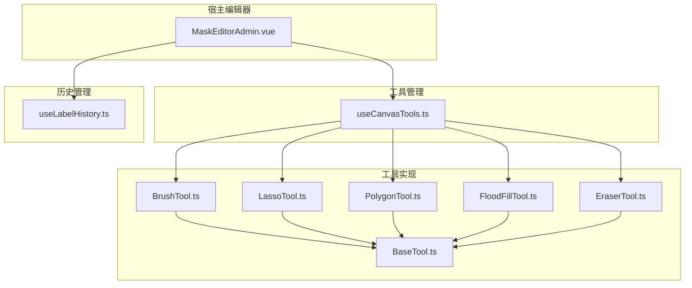
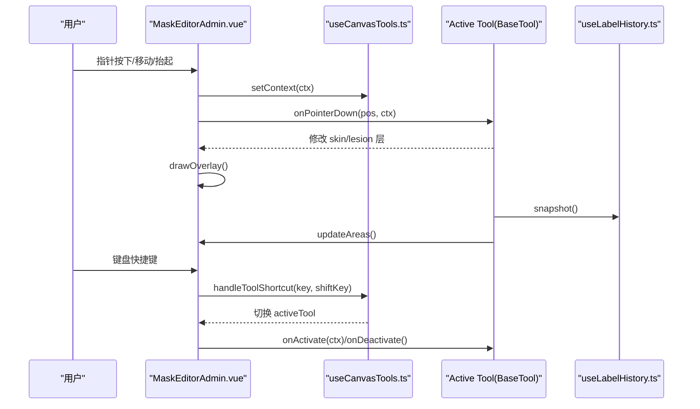
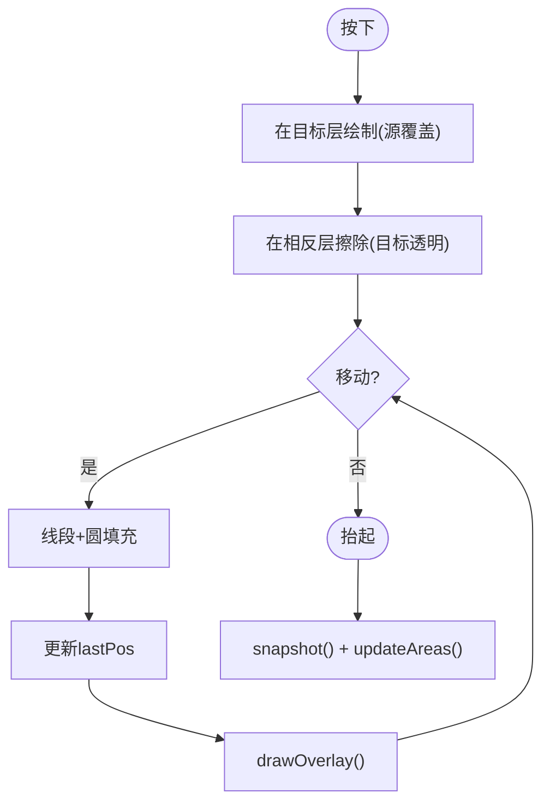
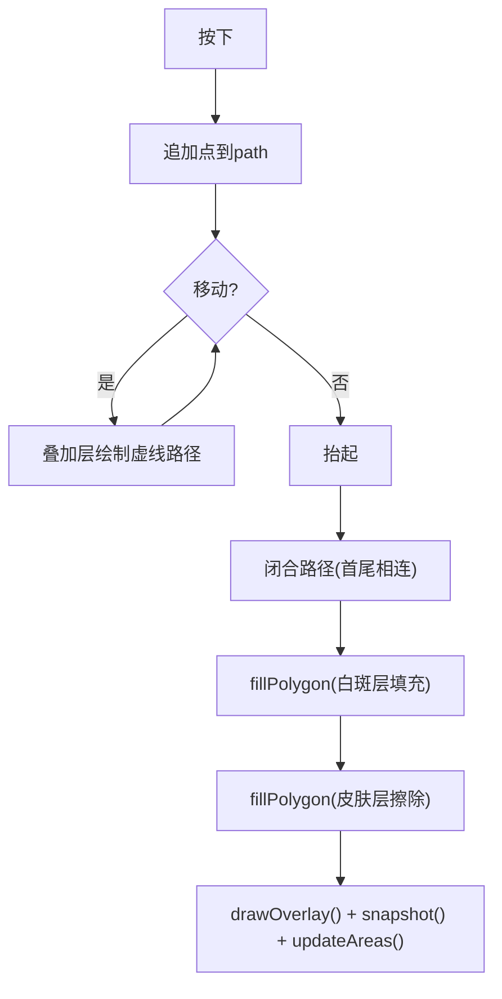
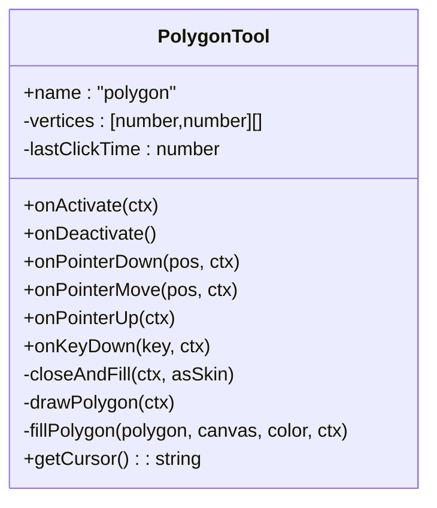
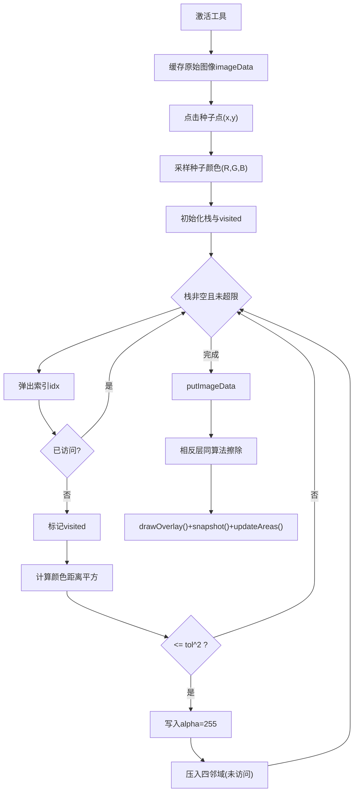
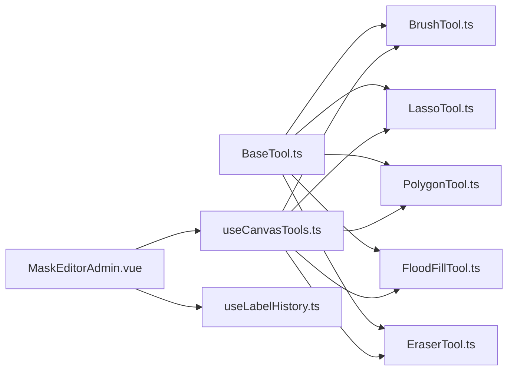

# 标注工具集

<cite>
**本文引用的文件**   
- [BaseTool.ts](file://web/admin/src/components/labeling/tools/BaseTool.ts)
- [BrushTool.ts](file://web/admin/src/components/labeling/tools/BrushTool.ts)
- [LassoTool.ts](file://web/admin/src/components/labeling/tools/LassoTool.ts)
- [PolygonTool.ts](file://web/admin/src/components/labeling/tools/PolygonTool.ts)
- [FloodFillTool.ts](file://web/admin/src/components/labeling/tools/FloodFillTool.ts)
- [EraserTool.ts](file://web/admin/src/components/labeling/tools/EraserTool.ts)
- [MaskEditorAdmin.vue](file://web/admin/src/components/labeling/MaskEditorAdmin.vue)
- [useCanvasTools.ts](file://web/admin/src/composables/useCanvasTools.ts)
- [useLabelHistory.ts](file://web/admin/src/composables/useLabelHistory.ts)
- [2026-06-11-image-labeling-overhaul.md](file://hermes_plan/2026-06-11-image-labeling-overhaul.md)
</cite>

## 目录
1. [简介](#简介)
2. [项目结构](#项目结构)
3. [核心组件](#核心组件)
4. [架构总览](#架构总览)
5. [详细组件分析](#详细组件分析)
6. [依赖关系分析](#依赖关系分析)
7. [性能考量](#性能考量)
8. [故障排查指南](#故障排查指南)
9. [结论](#结论)
10. [附录：自定义工具开发指南与协作模式](#附录自定义工具开发指南与协作模式)

## 简介
本技术文档聚焦 Subskin 图像标注系统的“标注工具集”，系统性阐述基于 Canvas 的绘图工具实现原理与交互逻辑，覆盖画笔（BrushTool）、套索（LassoTool）、多边形（PolygonTool）、填充（FloodFillTool）和橡皮擦（EraserTool）。文档从工具基类设计、事件处理机制、路径计算算法、蒙版生成技术入手，给出性能优化策略与扩展机制，并提供自定义工具开发与工具间协作的实践指南。

## 项目结构
标注工具集位于前端管理端模块中，采用“宿主编辑器 + 可插拔工具”的架构：
- 宿主编辑器：MaskEditorAdmin.vue 负责画布、坐标转换、叠加渲染、缩放平移、撤销重做、区域统计等。
- 工具管理器：useCanvasTools.ts 维护工具实例、切换、快捷键映射、上下文注入。
- 工具实现：tools 目录下各工具类实现统一接口 BaseTool，封装各自交互与算法。
- 历史管理：useLabelHistory.ts 提供基于 ImageData 快照的撤销/重做能力。

图表来源
- [MaskEditorAdmin.vue:1-120](file://web/admin/src/components/labeling/MaskEditorAdmin.vue#L1-L120)
- [useCanvasTools.ts:1-60](file://web/admin/src/composables/useCanvasTools.ts#L1-L60)
- [BaseTool.ts:1-72](file://web/admin/src/components/labeling/tools/BaseTool.ts#L1-L72)

章节来源
- [MaskEditorAdmin.vue:1-120](file://web/admin/src/components/labeling/MaskEditorAdmin.vue#L1-L120)
- [useCanvasTools.ts:1-60](file://web/admin/src/composables/useCanvasTools.ts#L1-L60)
- [BaseTool.ts:1-72](file://web/admin/src/components/labeling/tools/BaseTool.ts#L1-L72)

## 核心组件
- 工具基类与上下文
  - ToolContext 暴露皮肤层、白斑层、叠加层、自然尺寸、画笔大小、变换矩阵、坐标转换、绘制叠加、快照与面积更新等能力。
  - BaseTool 定义工具生命周期与事件回调：激活/失活、指针按下/移动/抬起、键盘事件、光标获取。
  - ALL_TOOLS 声明所有可用工具及其元数据（名称、标签、图标、快捷键、光标、可用性）。

- 工具管理器
  - useCanvasTools 维护工具实例字典、当前激活工具、工具上下文、快捷键切换、获取 FloodFill 实例以支持 Shift+点击等组合操作。

- 宿主编辑器
  - MaskEditorAdmin.vue 构建 ToolContext，转发指针事件到 activeTool，处理缩放/平移、全屏、撤销/重做、图层加载、区域百分比统计、确认导出等。

- 历史管理
  - useLabelHistory 使用固定长度环形缓冲区保存 skin/lesion 的 ImageData 快照，支持 undo/redo 并触发重绘与面积更新。

章节来源
- [BaseTool.ts:1-72](file://web/admin/src/components/labeling/tools/BaseTool.ts#L1-L72)
- [useCanvasTools.ts:1-127](file://web/admin/src/composables/useCanvasTools.ts#L1-L127)
- [MaskEditorAdmin.vue:1-200](file://web/admin/src/components/labeling/MaskEditorAdmin.vue#L1-L200)
- [useLabelHistory.ts:1-87](file://web/admin/src/composables/useLabelHistory.ts#L1-L87)

## 架构总览
整体采用“宿主-插件”解耦模式：
- 宿主仅负责输入分发、坐标转换、渲染合成、状态持久化（历史）与 UI 控制。
- 工具专注自身交互与算法，通过 ToolContext 访问画布与能力。
- 工具切换由管理器驱动，快捷键与数字键快速定位。

图表来源
- [MaskEditorAdmin.vue:180-220](file://web/admin/src/components/labeling/MaskEditorAdmin.vue#L180-L220)
- [useCanvasTools.ts:32-80](file://web/admin/src/composables/useCanvasTools.ts#L32-L80)
- [useLabelHistory.ts:24-45](file://web/admin/src/composables/useLabelHistory.ts#L24-L45)

## 详细组件分析

### 画笔工具（BrushTool）
- 交互逻辑
  - 按下开始绘制，移动时连续描边并填充圆形笔触；抬起结束并记录历史。
  - 皮肤画笔与白斑画笔互斥：在目标层绘制颜色的同时，在另一层用相同形状擦除，避免重复计数。
- 算法实现
  - 使用 CanvasRenderingContext2D 的 lineTo 与 arc 绘制平滑笔触，设置 round 线帽与连接。
  - 通过 globalCompositeOperation 切换 source-over 与 destination-out 实现绘制与擦除。
- 性能优化
  - 将 willReadFrequently 传入 getContext 提升频繁读取性能。
  - 仅在移动时增量绘制，减少全量重绘。
- 扩展机制
  - 通过 isSkin 属性决定目标层与颜色，便于派生更多画笔类型。

图表来源
- [BrushTool.ts:66-112](file://web/admin/src/components/labeling/tools/BrushTool.ts#L66-L112)

章节来源
- [BrushTool.ts:1-122](file://web/admin/src/components/labeling/tools/BrushTool.ts#L1-L122)

### 套索工具（LassoTool）
- 交互逻辑
  - 按住拖拽绘制自由路径，松开自动闭合；Shift+释放可切换填充为皮肤或白斑（由宿主根据修饰键调用）。
  - 绘制过程中在叠加层显示虚线预览路径。
- 算法实现
  - 使用扫描线填充算法（Scanline Fill）对多边形内部像素进行着色或擦除。
  - 构建边表（Edge Table），按 y 排序，逐行计算交点 x，成对填充区间。
- 性能优化
  - 直接操作 ImageData 的 RGBA 数组，避免多次 putImageData 开销。
  - 限制最小/最大 y 范围，减少无效行遍历。
- 扩展机制
  - fillPolygon 方法可复用至其他需要多边形填充的工具。

图表来源
- [LassoTool.ts:33-70](file://web/admin/src/components/labeling/tools/LassoTool.ts#L33-L70)
- [LassoTool.ts:99-166](file://web/admin/src/components/labeling/tools/LassoTool.ts#L99-L166)

章节来源
- [LassoTool.ts:1-180](file://web/admin/src/components/labeling/tools/LassoTool.ts#L1-L180)

### 多边形工具（PolygonTool）
- 交互逻辑
  - 单击放置顶点，双击或 Enter 闭合；Backspace 删除最后一个顶点；Esc 取消。
  - 绘制过程中在叠加层显示顶点与边，闭合后填充。
- 算法实现
  - 复用扫描线填充算法，对多边形内部像素进行着色或擦除。
- 性能优化
  - 增量绘制当前状态，避免全量重建。
- 扩展机制
  - closeAndFill 封装了闭合与填充流程，便于扩展不同填充策略。

图表来源
- [PolygonTool.ts:21-97](file://web/admin/src/components/labeling/tools/PolygonTool.ts#L21-L97)
- [PolygonTool.ts:129-190](file://web/admin/src/components/labeling/tools/PolygonTool.ts#L129-L190)

章节来源
- [PolygonTool.ts:1-196](file://web/admin/src/components/labeling/tools/PolygonTool.ts#L1-L196)

### 填充工具（FloodFillTool）
- 交互逻辑
  - 点击种子点，基于原始图像像素颜色距离进行连通区域填充；Shift+点击填充皮肤层。
  - 支持通过键盘按键调整容差（tolerance），默认 24，范围 2-128。
- 算法实现
  - 4-连通域迭代式泛洪填充，使用显式栈避免递归溢出。
  - 颜色距离阈值比较（平方和），达到阈值则加入填充。
  - 填充完成后同步在相反层执行擦除，保证皮肤/白斑互斥。
- 性能优化
  - 缓存原始图像 imageData，避免重复读取 DOM img。
  - 设置 MAX_ITERATIONS 防止超大图像导致卡顿。
  - 使用 Uint8Array visited 标记已访问像素，降低重复检查。
- 扩展机制
  - fillLesion/fillSkin 对外暴露便捷方法，宿主可通过 getFloodFillTool 调用。

图表来源
- [FloodFillTool.ts:28-92](file://web/admin/src/components/labeling/tools/FloodFillTool.ts#L28-L92)
- [FloodFillTool.ts:117-182](file://web/admin/src/components/labeling/tools/FloodFillTool.ts#L117-L182)
- [FloodFillTool.ts:184-240](file://web/admin/src/components/labeling/tools/FloodFillTool.ts#L184-L240)

章节来源
- [FloodFillTool.ts:1-265](file://web/admin/src/components/labeling/tools/FloodFillTool.ts#L1-L265)

### 橡皮擦工具（EraserTool）
- 交互逻辑
  - 在皮肤层与白斑层同时擦除，保持互斥一致性。
- 算法实现
  - 与画笔类似的 stroke/arc 绘制，但使用 destination-out 擦除。
- 性能优化
  - 增量绘制，仅在移动时更新。
- 扩展机制
  - 可派生不同擦除策略（如渐变擦除、按半径衰减）。

章节来源
- [EraserTool.ts:1-92](file://web/admin/src/components/labeling/tools/EraserTool.ts#L1-L92)

### 宿主编辑器与事件分发（MaskEditorAdmin.vue）
- 职责
  - 构建 ToolContext，包含三层画布、自然尺寸、画笔大小、变换、坐标转换、绘制叠加、快照与面积更新。
  - 转发指针事件到 activeTool，处理 Space 拖拽平移、滚轮缩放、全屏、撤销/重做、图层加载与合并。
  - 计算皮肤/白斑/联合区域百分比，并在 UI 展示。
- 关键点
  - clientToImage 将屏幕坐标转换为自然图像坐标，考虑 baseFitScale 与 transform。
  - drawOverlay 将 skin 与 lesion 按透明度合成到 overlay。
  - updateAreas 通过 getImageData 统计 alpha > 32 的像素比例。

章节来源
- [MaskEditorAdmin.vue:90-179](file://web/admin/src/components/labeling/MaskEditorAdmin.vue#L90-L179)
- [MaskEditorAdmin.vue:180-220](file://web/admin/src/components/labeling/MaskEditorAdmin.vue#L180-L220)
- [MaskEditorAdmin.vue:125-155](file://web/admin/src/components/labeling/MaskEditorAdmin.vue#L125-L155)

### 工具管理器（useCanvasTools.ts）
- 职责
  - 维护 toolInstances 字典，注册所有工具实例。
  - setTool 切换工具，触发 onDeactivate/onActivate。
  - setContext 注入 ToolContext，供工具访问画布与能力。
  - handleToolShortcut 支持字母键与数字键快捷切换。
  - getFloodFillTool 暴露 FloodFill 实例以便宿主处理 Shift+点击。

章节来源
- [useCanvasTools.ts:1-127](file://web/admin/src/composables/useCanvasTools.ts#L1-L127)

### 历史管理（useLabelHistory.ts）
- 职责
  - 使用固定长度环形缓冲区存储 skin/lesion 的 ImageData 快照。
  - snapshot 推入新状态并截断 redo 分支。
  - undo/redo 应用对应快照并触发重绘。
  - reset 清空历史。

章节来源
- [useLabelHistory.ts:1-87](file://web/admin/src/composables/useLabelHistory.ts#L1-L87)

## 依赖关系分析
- 工具与基类
  - 所有工具均实现 BaseTool 接口，确保宿主可统一调度。
- 宿主与工具管理器
  - MaskEditorAdmin.vue 通过 useCanvasTools 获取 activeTool 与上下文，解耦具体工具实现。
- 工具与历史
  - 工具在完成一次有效操作后调用 ctx.snapshot() 提交历史。
- 工具与宿主能力
  - 工具通过 ToolContext 调用 drawOverlay、updateAreas、clientToImage 等宿主能力。

图表来源
- [BaseTool.ts:1-72](file://web/admin/src/components/labeling/tools/BaseTool.ts#L1-L72)
- [useCanvasTools.ts:1-60](file://web/admin/src/composables/useCanvasTools.ts#L1-L60)
- [MaskEditorAdmin.vue:1-60](file://web/admin/src/components/labeling/MaskEditorAdmin.vue#L1-L60)

章节来源
- [BaseTool.ts:1-72](file://web/admin/src/components/labeling/tools/BaseTool.ts#L1-L72)
- [useCanvasTools.ts:1-60](file://web/admin/src/composables/useCanvasTools.ts#L1-L60)
- [MaskEditorAdmin.vue:1-60](file://web/admin/src/components/labeling/MaskEditorAdmin.vue#L1-L60)

## 性能考量
- Canvas 上下文优化
  - 使用 willReadFrequently 参数创建 Context，提升频繁读取像素的性能。
- 像素级操作
  - 直接操作 ImageData 的 RGBA 数组，减少中间对象分配与多次 putImageData 调用。
- 算法复杂度
  - 扫描线填充 O(N) 行扫描，N 为多边形边界点数；泛洪填充 O(P)，P 为连通区域像素数。
- 安全阀
  - FloodFill 设置 MAX_ITERATIONS 防止超大图像阻塞主线程。
- 增量绘制
  - 画笔与橡皮擦仅在移动时增量绘制，避免全量重绘。
- 内存与历史
  - 历史快照限制最大数量（HISTORY_MAX=50），避免内存膨胀。

[本节为通用性能指导，不直接分析具体文件]

## 故障排查指南
- 图片未加载
  - 现象：工具无法采样像素或坐标转换失败。
  - 排查：确认 naturalSize.width/height 非零；检查 onImgLoad 是否成功；查看 imageLoaded 状态。
- 填充无效果
  - 现象：点击后未填充或填充不完整。
  - 排查：检查 tolerance 设置；确认 imageData 缓存成功；查看 MAX_ITERATIONS 是否提前终止。
- 区域百分比异常
  - 现象：皮肤/白斑占比不符合预期。
  - 排查：确认互斥逻辑生效（皮肤与白斑在同一位置不会重叠）；检查 updateAreas 统计逻辑。
- 撤销/重做失效
  - 现象：undo/redo 无变化。
  - 排查：确认 snapshot 被调用；检查 historyIndex 与 HISTORY_MAX 限制；验证 applySnapshot 是否正确 putImageData。

章节来源
- [MaskEditorAdmin.vue:125-155](file://web/admin/src/components/labeling/MaskEditorAdmin.vue#L125-L155)
- [FloodFillTool.ts:117-182](file://web/admin/src/components/labeling/tools/FloodFillTool.ts#L117-L182)
- [useLabelHistory.ts:24-71](file://web/admin/src/composables/useLabelHistory.ts#L24-L71)

## 结论
Subskin 标注工具集通过清晰的基类契约与宿主-插件架构，实现了高内聚、低耦合的可扩展绘图系统。各工具专注于自身交互与算法，借助 ToolContext 与宿主能力协同工作。扫描线填充与泛洪填充等核心算法在保证精度的同时兼顾性能，配合增量绘制与历史快照机制，提供了流畅的标注体验。未来可扩展更多智能分割工具（如 GrabCut），并与主动学习流水线集成，进一步提升标注效率与质量。

[本节为总结性内容，不直接分析具体文件]

## 附录：自定义工具开发指南与协作模式

### 自定义工具开发步骤
- 实现 BaseTool 接口
  - 定义 name、onActivate、onDeactivate、onPointerDown/Move/Up、onKeyDown、getCursor。
  - 通过 ToolContext 访问 skinCanvas、lesionCanvas、overlayCanvas、naturalSize、brushSize、transform、clientToImage、drawOverlay、snapshot、updateAreas。
- 注册工具
  - 在 useCanvasTools.ts 的 toolInstances 中添加实例。
  - 在 ALL_TOOLS 中声明工具元数据（名称、标签、图标、快捷键、光标、可用性）。
- 宿主集成
  - 若需特殊修饰键行为（如 Shift+点击），可在 MaskEditorAdmin.vue 中通过 getFloodFillTool 调用工具方法。
- 测试建议
  - 单元测试：验证核心算法（如多边形填充、泛洪填充）的正确性与边界条件。
  - 集成测试：端到端流程（选择工具→绘制→撤销→导出）。

### 工具间协作模式
- 互斥填充
  - 在目标层绘制颜色的同时，在相反层擦除，确保皮肤与白斑不重叠。
- 共享算法
  - 多边形填充算法在 LassoTool 与 PolygonTool 中复用，可抽取为公共函数。
- 历史与统计
  - 每次有效操作后调用 snapshot 与 updateAreas，保证撤销一致性与区域统计准确。
- 快捷键与修饰键
  - 使用 handleToolShortcut 进行工具切换；结合宿主修饰键处理（如 Shift+点击填充皮肤）。

章节来源
- [BaseTool.ts:1-72](file://web/admin/src/components/labeling/tools/BaseTool.ts#L1-L72)
- [useCanvasTools.ts:1-127](file://web/admin/src/composables/useCanvasTools.ts#L1-L127)
- [MaskEditorAdmin.vue:180-220](file://web/admin/src/components/labeling/MaskEditorAdmin.vue#L180-L220)
- [2026-06-11-image-labeling-overhaul.md:1-120](file://hermes_plan/2026-06-11-image-labeling-overhaul.md#L1-L120)