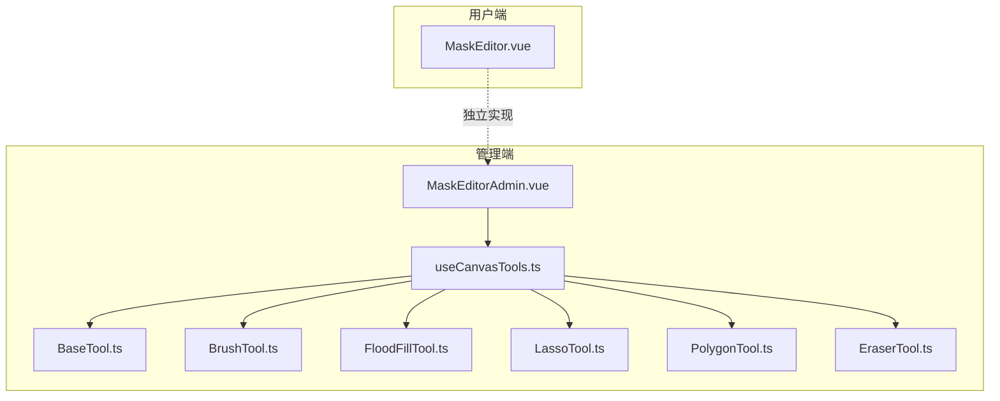
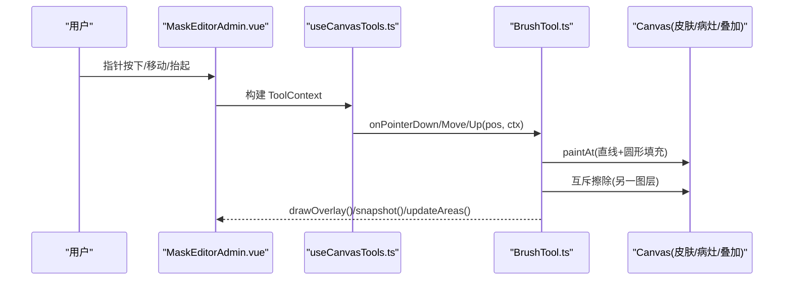
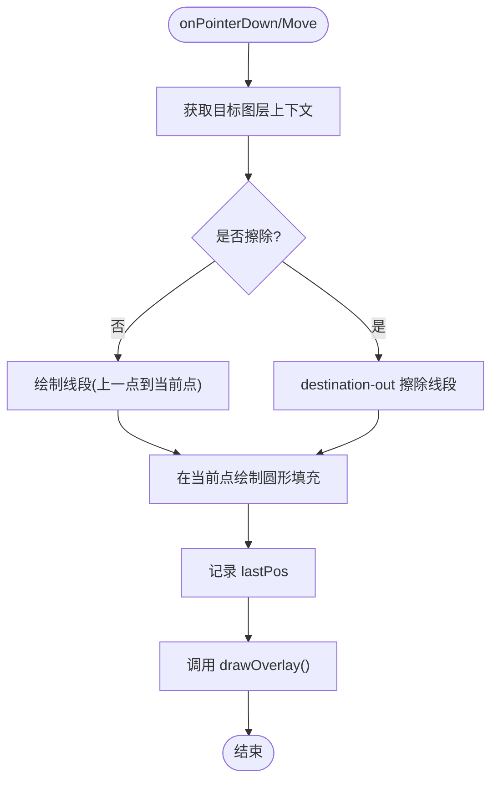
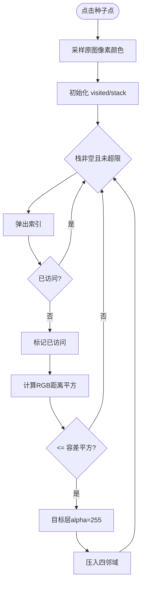
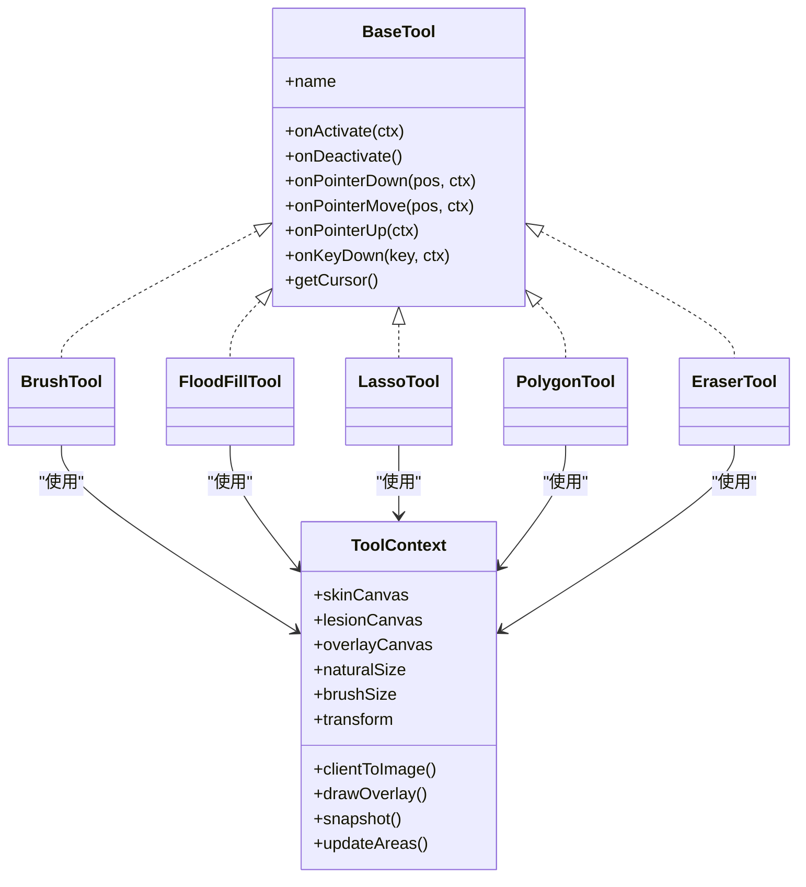

# 画笔工具

<cite>
**本文引用的文件**
- [web/admin/src/components/labeling/tools/BaseTool.ts](file://web/admin/src/components/labeling/tools/BaseTool.ts)
- [web/admin/src/components/labeling/tools/BrushTool.ts](file://web/admin/src/components/labeling/tools/BrushTool.ts)
- [web/admin/src/components/labeling/tools/FloodFillTool.ts](file://web/admin/src/components/labeling/tools/FloodFillTool.ts)
- [web/admin/src/components/labeling/tools/LassoTool.ts](file://web/admin/src/components/labeling/tools/LassoTool.ts)
- [web/admin/src/components/labeling/tools/PolygonTool.ts](file://web/admin/src/components/labeling/tools/PolygonTool.ts)
- [web/admin/src/components/labeling/tools/EraserTool.ts](file://web/admin/src/components/labeling/tools/EraserTool.ts)
- [web/admin/src/composables/useCanvasTools.ts](file://web/admin/src/composables/useCanvasTools.ts)
- [web/admin/src/components/labeling/MaskEditorAdmin.vue](file://web/admin/src/components/labeling/MaskEditorAdmin.vue)
- [web/app/src/components/tracker/MaskEditor.vue](file://web/app/src/components/tracker/MaskEditor.vue)
</cite>

## 目录
1. [简介](#简介)
2. [项目结构](#项目结构)
3. [核心组件](#核心组件)
4. [架构总览](#架构总览)
5. [详细组件分析](#详细组件分析)
6. [依赖关系分析](#依赖关系分析)
7. [性能考量](#性能考量)
8. [故障排查指南](#故障排查指南)
9. [结论](#结论)
10. [附录：配置与最佳实践](#附录：配置与最佳实践)

## 简介
本技术文档聚焦 Subskin 图像标注系统中的“画笔工具”，深入解析皮肤画笔（skin-brush）与白斑画笔（lesion-brush）的实现原理，涵盖 Canvas 绘图算法、笔触渲染优化、路径平滑处理、蒙版生成技术、大小调节、压力感应模拟、边缘检测与颜色混合模式。同时总结离屏渲染、增量绘制、内存管理等性能策略，并提供自定义配置选项与使用最佳实践。

## 项目结构
- 管理端（admin）提供可插拔的工具系统，基于 BaseTool 接口统一事件分发；MaskEditorAdmin.vue 作为宿主容器负责三层 Canvas（皮肤层、病灶层、叠加层）的绘制与交互。
- 用户端（app）的 MaskEditor.vue 实现了移动端友好的标注体验，包含工作分辨率裁剪、动画轮廓描边、历史快照等。

图表来源
- [web/admin/src/components/labeling/MaskEditorAdmin.vue:1-180](file://web/admin/src/components/labeling/MaskEditorAdmin.vue#L1-L180)
- [web/admin/src/composables/useCanvasTools.ts:1-127](file://web/admin/src/composables/useCanvasTools.ts#L1-L127)
- [web/admin/src/components/labeling/tools/BaseTool.ts:1-72](file://web/admin/src/components/labeling/tools/BaseTool.ts#L1-L72)

章节来源
- [web/admin/src/components/labeling/MaskEditorAdmin.vue:1-180](file://web/admin/src/components/labeling/MaskEditorAdmin.vue#L1-L180)
- [web/admin/src/composables/useCanvasTools.ts:1-127](file://web/admin/src/composables/useCanvasTools.ts#L1-L127)
- [web/admin/src/components/labeling/tools/BaseTool.ts:1-72](file://web/admin/src/components/labeling/tools/BaseTool.ts#L1-L72)

## 核心组件
- BaseTool 接口：定义工具生命周期与上下文（ToolContext），包括 skinCanvas、lesionCanvas、overlayCanvas、自然尺寸、画笔大小、变换矩阵、坐标转换、绘制叠加层、历史记录快照与区域统计更新。
- BrushTool：实现皮肤画笔与白斑画笔两类行为，支持互斥涂抹（在同位置涂皮肤会擦除病灶，反之亦然）。
- FloodFillTool：基于原图像素的颜色容差泛洪填充，支持 Shift+点击切换填充目标层。
- LassoTool / PolygonTool：自由套索与多边形选择，内部使用扫描线填充算法将选区写入病灶层并反向擦除皮肤层。
- EraserTool：同时在皮肤层与病灶层执行擦除。
- useCanvasTools：工具实例管理与快捷键切换，维护 activeTool 与 ToolContext。
- MaskEditorAdmin.vue：三层 Canvas 管理、指针事件派发、缩放平移、叠加层合成、面积统计、撤销重做。
- MaskEditor.vue（用户端）：工作分辨率上限裁剪、离屏缓冲、动画轮廓描边、增量绘制与内存优化。

章节来源
- [web/admin/src/components/labeling/tools/BaseTool.ts:1-72](file://web/admin/src/components/labeling/tools/BaseTool.ts#L1-L72)
- [web/admin/src/components/labeling/tools/BrushTool.ts:1-122](file://web/admin/src/components/labeling/tools/BrushTool.ts#L1-L122)
- [web/admin/src/components/labeling/tools/FloodFillTool.ts:1-265](file://web/admin/src/components/labeling/tools/FloodFillTool.ts#L1-L265)
- [web/admin/src/components/labeling/tools/LassoTool.ts:1-180](file://web/admin/src/components/labeling/tools/LassoTool.ts#L1-L180)
- [web/admin/src/components/labeling/tools/PolygonTool.ts:1-196](file://web/admin/src/components/labeling/tools/PolygonTool.ts#L1-L196)
- [web/admin/src/components/labeling/tools/EraserTool.ts:1-92](file://web/admin/src/components/labeling/tools/EraserTool.ts#L1-L92)
- [web/admin/src/composables/useCanvasTools.ts:1-127](file://web/admin/src/composables/useCanvasTools.ts#L1-L127)
- [web/admin/src/components/labeling/MaskEditorAdmin.vue:1-667](file://web/admin/src/components/labeling/MaskEditorAdmin.vue#L1-L667)
- [web/app/src/components/tracker/MaskEditor.vue:1-800](file://web/app/src/components/tracker/MaskEditor.vue#L1-L800)

## 架构总览
管理端采用“宿主 + 插件”架构：MaskEditorAdmin.vue 持有画布与状态，通过 useCanvasTools 将指针事件委派给当前激活的 BaseTool 实现。每个工具只关心自身逻辑，不直接耦合 UI。

图表来源
- [web/admin/src/components/labeling/MaskEditorAdmin.vue:181-220](file://web/admin/src/components/labeling/MaskEditorAdmin.vue#L181-L220)
- [web/admin/src/composables/useCanvasTools.ts:26-51](file://web/admin/src/composables/useCanvasTools.ts#L26-L51)
- [web/admin/src/components/labeling/tools/BrushTool.ts:66-112](file://web/admin/src/components/labeling/tools/BrushTool.ts#L66-L112)

## 详细组件分析

### 皮肤画笔与白斑画笔（BrushTool）
- 绘图算法：在目标图层上以 stroke 连接上一帧到当前帧的线段，再以 brushSize 为半径在当前点绘制圆形填充，形成连续笔触。
- 颜色与混合：使用 source-over 进行正常绘制；对相反图层使用 destination-out 进行擦除，避免重复计数。
- 互斥涂抹：皮肤画笔在病灶层擦除对应区域，白斑画笔在皮肤层擦除对应区域，确保同一像素不会同时属于两层。
- 平滑处理：lineCap/lineJoin 设为 round，配合线段+圆点填充，获得圆润笔触。
- 大小调节：由 ToolContext.brushSize 控制，UI 滑块范围 8-80，步长 2。

图表来源
- [web/admin/src/components/labeling/tools/BrushTool.ts:19-43](file://web/admin/src/components/labeling/tools/BrushTool.ts#L19-L43)
- [web/admin/src/components/labeling/tools/BrushTool.ts:66-112](file://web/admin/src/components/labeling/tools/BrushTool.ts#L66-L112)

章节来源
- [web/admin/src/components/labeling/tools/BrushTool.ts:1-122](file://web/admin/src/components/labeling/tools/BrushTool.ts#L1-L122)
- [web/admin/src/components/labeling/MaskEditorAdmin.vue:534-553](file://web/admin/src/components/labeling/MaskEditorAdmin.vue#L534-L553)

### 泛洪填充（FloodFillTool）
- 算法：从种子像素读取原图颜色，计算 RGB 距离平方与容差阈值比较，4连通栈式遍历，将匹配像素写入目标图层 alpha=255，并在相反图层执行相同逻辑的擦除。
- 安全阀：最大迭代次数限制，防止超大图像导致卡顿。
- 交互：Shift+点击切换填充目标层（皮肤或病灶）。

图表来源
- [web/admin/src/components/labeling/tools/FloodFillTool.ts:117-182](file://web/admin/src/components/labeling/tools/FloodFillTool.ts#L117-L182)
- [web/admin/src/components/labeling/tools/FloodFillTool.ts:184-240](file://web/admin/src/components/labeling/tools/FloodFillTool.ts#L184-L240)

章节来源
- [web/admin/src/components/labeling/tools/FloodFillTool.ts:1-265](file://web/admin/src/components/labeling/tools/FloodFillTool.ts#L1-L265)

### 套索与多边形选择（LassoTool / PolygonTool）
- 路径绘制：在叠加层绘制虚线路径，实时反馈。
- 填充算法：扫描线填充（Edge Table + Active Edge List），按行计算交点区间并写入像素。
- 互斥写入：选区写入病灶层，同时在皮肤层擦除对应区域。

章节来源
- [web/admin/src/components/labeling/tools/LassoTool.ts:1-180](file://web/admin/src/components/labeling/tools/LassoTool.ts#L1-L180)
- [web/admin/src/components/labeling/tools/PolygonTool.ts:1-196](file://web/admin/src/components/labeling/tools/PolygonTool.ts#L1-L196)

### 橡皮擦（EraserTool）
- 同时对皮肤层与病灶层执行 destination-out 擦除，保持两者一致性。

章节来源
- [web/admin/src/components/labeling/tools/EraserTool.ts:1-92](file://web/admin/src/components/labeling/tools/EraserTool.ts#L1-L92)

### 宿主容器（MaskEditorAdmin.vue）
- 三层 Canvas：隐藏的皮肤层与病灶层用于像素操作，叠加层用于合成显示。
- 坐标转换：clientToImage 将屏幕坐标映射到自然图像坐标，考虑 baseFitScale 与 transform。
- 叠加合成：drawOverlay 将皮肤层与病灶层按透明度叠加至 overlayCanvas。
- 面积统计：countAlpha/countUnionAlpha 统计像素占比，实时更新 UI。
- 历史快照：每次完成一笔后 snapshot，支持撤销/重做。

章节来源
- [web/admin/src/components/labeling/MaskEditorAdmin.vue:90-179](file://web/admin/src/components/labeling/MaskEditorAdmin.vue#L90-L179)
- [web/admin/src/components/labeling/MaskEditorAdmin.vue:125-155](file://web/admin/src/components/labeling/MaskEditorAdmin.vue#L125-L155)
- [web/admin/src/components/labeling/MaskEditorAdmin.vue:181-220](file://web/admin/src/components/labeling/MaskEditorAdmin.vue#L181-L220)

### 用户端优化（MaskEditor.vue）
- 工作分辨率裁剪：MAX_CANVAS_DIM=1024，降低大图的内存占用与像素操作成本。
- 离屏渲染与缓存：overlay 上下文缓存，避免频繁 getContext；轮廓描边预渲染到两个 offscreen canvas，动画仅 drawImage。
- 增量绘制：仅在需要时重建边缘缓存与轮廓缓冲，减少每帧开销。
- 动画节流： marching ants 控制在约 12fps，节省 CPU。
- 异步分步：图片加载后将耗时任务拆分为多个 requestAnimationFrame，避免阻塞主线程。

章节来源
- [web/app/src/components/tracker/MaskEditor.vue:58-128](file://web/app/src/components/tracker/MaskEditor.vue#L58-L128)
- [web/app/src/components/tracker/MaskEditor.vue:323-467](file://web/app/src/components/tracker/MaskEditor.vue#L323-L467)
- [web/app/src/components/tracker/MaskEditor.vue:523-565](file://web/app/src/components/tracker/MaskEditor.vue#L523-L565)
- [web/app/src/components/tracker/MaskEditor.vue:635-715](file://web/app/src/components/tracker/MaskEditor.vue#L635-L715)

## 依赖关系分析
- 工具与宿主解耦：BaseTool 定义契约，useCanvasTools 管理实例与生命周期，MaskEditorAdmin.vue 仅负责事件转发与状态。
- 工具间无直接耦合：各工具通过 ToolContext 访问共享资源（画布、尺寸、变换、回调），避免相互引用。
- 用户端与管理端差异：用户端侧重移动端性能与交互，管理端侧重功能完备性与扩展性。

图表来源
- [web/admin/src/components/labeling/tools/BaseTool.ts:9-72](file://web/admin/src/components/labeling/tools/BaseTool.ts#L9-L72)
- [web/admin/src/components/labeling/tools/BrushTool.ts:45-122](file://web/admin/src/components/labeling/tools/BrushTool.ts#L45-L122)
- [web/admin/src/components/labeling/tools/FloodFillTool.ts:22-265](file://web/admin/src/components/labeling/tools/FloodFillTool.ts#L22-L265)
- [web/admin/src/components/labeling/tools/LassoTool.ts:17-180](file://web/admin/src/components/labeling/tools/LassoTool.ts#L17-L180)
- [web/admin/src/components/labeling/tools/PolygonTool.ts:21-196](file://web/admin/src/components/labeling/tools/PolygonTool.ts#L21-L196)
- [web/admin/src/components/labeling/tools/EraserTool.ts:42-92](file://web/admin/src/components/labeling/tools/EraserTool.ts#L42-L92)

章节来源
- [web/admin/src/components/labeling/tools/BaseTool.ts:1-72](file://web/admin/src/components/labeling/tools/BaseTool.ts#L1-L72)
- [web/admin/src/composables/useCanvasTools.ts:1-127](file://web/admin/src/composables/useCanvasTools.ts#L1-L127)

## 性能考量
- 离屏渲染：皮肤层与病灶层置于不可见位置，仅叠加层参与显示，减少重绘开销。
- 增量绘制：仅在指针移动时绘制新增线段与圆点，避免整图重绘。
- 内存管理：
  - 用户端限制工作分辨率（MAX_CANVAS_DIM=1024），显著降低 ImageData 内存占用。
  - 历史快照使用 shallowRef，避免 Vue 深度代理带来的额外开销。
  - 泛洪填充设置最大迭代次数，防止极端情况卡死。
- 动画优化：marching ants 控制在 12fps，并使用预渲染缓冲，每帧仅 2-3 次 drawImage。
- 上下文缓存：overlay 上下文缓存，避免重复 getContext 调用。
- 异步分步：图片加载后将快照、叠加绘制、面积统计等拆分到不同帧，提升响应性。

章节来源
- [web/app/src/components/tracker/MaskEditor.vue:58-128](file://web/app/src/components/tracker/MaskEditor.vue#L58-L128)
- [web/app/src/components/tracker/MaskEditor.vue:323-467](file://web/app/src/components/tracker/MaskEditor.vue#L323-L467)
- [web/app/src/components/tracker/MaskEditor.vue:567-616](file://web/app/src/components/tracker/MaskEditor.vue#L567-L616)
- [web/admin/src/components/labeling/tools/FloodFillTool.ts:19-21](file://web/admin/src/components/labeling/tools/FloodFillTool.ts#L19-L21)

## 故障排查指南
- 画布为空或无法绘制：检查 imageLoaded 与 naturalSize 是否正确设置；确认 skinCanvas/lesionCanvas/overlayCanvas 尺寸一致。
- 面积统计异常：确认 countAlpha/countUnionAlpha 使用的阈值（alpha>32）与 canvas 尺寸一致；避免在 resize 后立即统计。
- 泛洪填充无效：确认已缓存原图 imageData；检查 tolerance 设置与种子点是否在有效范围内；关注 MAX_ITERATIONS 警告。
- 动画卡顿：确认 marching ants 帧率与 offscreen 缓冲是否重建；检查是否频繁触发 rebuildEdgeCaches。
- 内存溢出：检查是否加载了超大图像；启用工作分辨率裁剪；减少历史快照数量。

章节来源
- [web/admin/src/components/labeling/MaskEditorAdmin.vue:125-155](file://web/admin/src/components/labeling/MaskEditorAdmin.vue#L125-L155)
- [web/admin/src/components/labeling/tools/FloodFillTool.ts:176-182](file://web/admin/src/components/labeling/tools/FloodFillTool.ts#L176-L182)
- [web/app/src/components/tracker/MaskEditor.vue:384-467](file://web/app/src/components/tracker/MaskEditor.vue#L384-L467)

## 结论
Subskin 的画笔工具通过清晰的工具抽象与宿主解耦设计，实现了皮肤与白斑的双图层互斥标注，结合高效的 Canvas 算法与多项性能优化，满足复杂图像标注场景的需求。管理端强调可扩展性与功能完整性，用户端则针对移动端进行了内存与渲染优化。建议在实际使用中遵循本文的配置与最佳实践，以获得稳定流畅的标注体验。

## 附录：配置与最佳实践
- 画笔大小调节
  - 管理端：滑块范围 8-80，步长 2；通过 ToolContext.brushSize 传入工具。
  - 用户端：同样支持滑块调节，注意在大图上开启工作分辨率裁剪以降低开销。
- 压力感应模拟
  - 当前实现未接入硬件压力数据；可通过动态调整 brushSize 模拟压力效果（例如根据速度或时间衰减）。
- 边缘检测与轮廓描边
  - 用户端实现 marching ants 轮廓：提取边缘像素，预渲染到 offscreen 缓冲，动画循环中偏移绘制。
- 颜色混合模式
  - 正常绘制使用 source-over；擦除使用 destination-out；叠加层使用透明度混合。
- 自定义配置
  - 工具可用性：通过 ALL_TOOLS.available 控制（如 GrabCut 默认不可用）。
  - 快捷键：数字键快速切换工具；Shift+点击用于泛洪填充的目标层切换。
  - 容差参数：FloodFillTool.tolerance 可通过键盘或 UI 调整。
- 使用最佳实践
  - 先粗后细：先用较大笔刷快速覆盖区域，再缩小笔刷精细修正。
  - 善用互斥：皮肤与白斑在同一位置自动互斥，避免手动擦除。
  - 合理使用撤销：每笔完成后自动快照，必要时使用撤销/重做。
  - 大图标注：优先使用用户端版本，利用工作分辨率裁剪与动画节流。
  - 性能监控：关注控制台警告（如泛洪填充达到最大迭代），必要时调整容差或分段标注。

章节来源
- [web/admin/src/components/labeling/MaskEditorAdmin.vue:534-553](file://web/admin/src/components/labeling/MaskEditorAdmin.vue#L534-L553)
- [web/admin/src/components/labeling/tools/BaseTool.ts:44-52](file://web/admin/src/components/labeling/tools/BaseTool.ts#L44-L52)
- [web/admin/src/components/labeling/tools/FloodFillTool.ts:24-25](file://web/admin/src/components/labeling/tools/FloodFillTool.ts#L24-L25)
- [web/app/src/components/tracker/MaskEditor.vue:58-65](file://web/app/src/components/tracker/MaskEditor.vue#L58-L65)