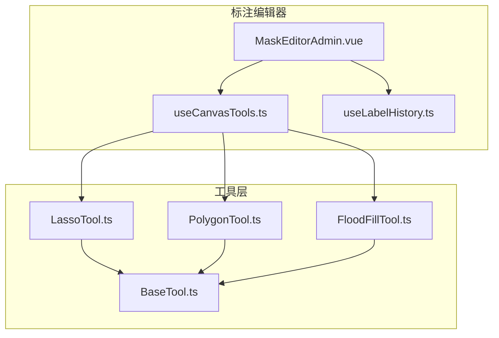
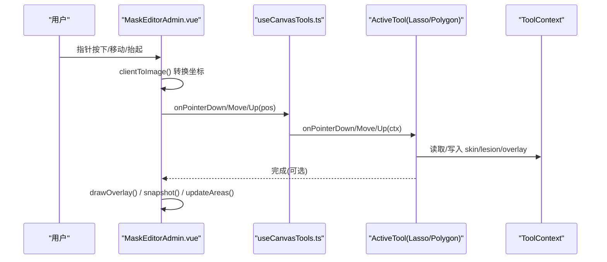
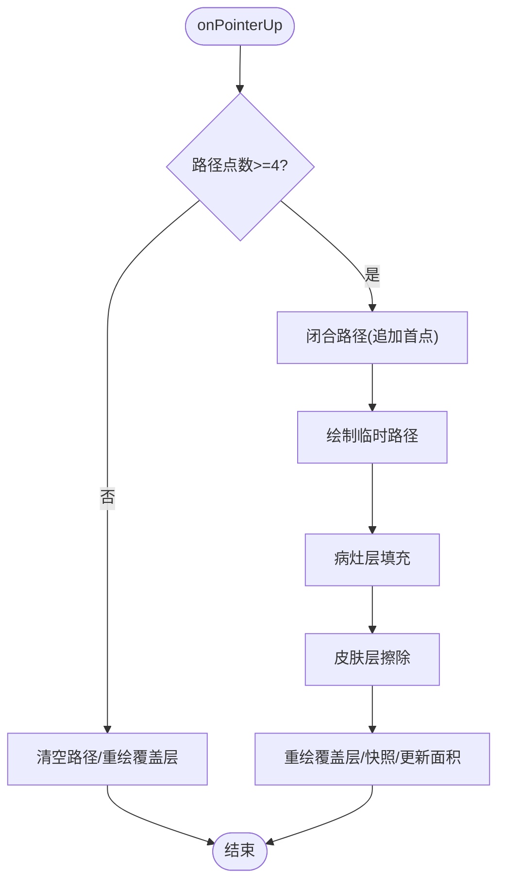
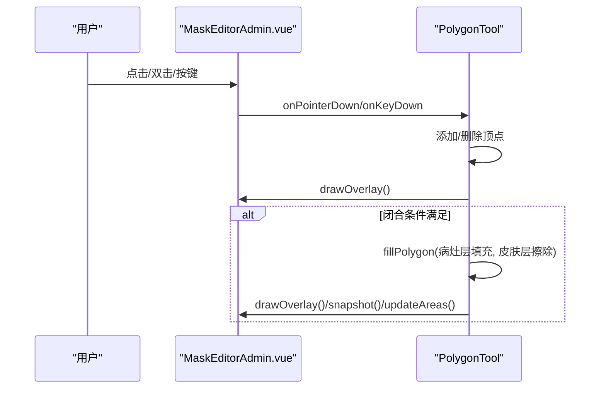
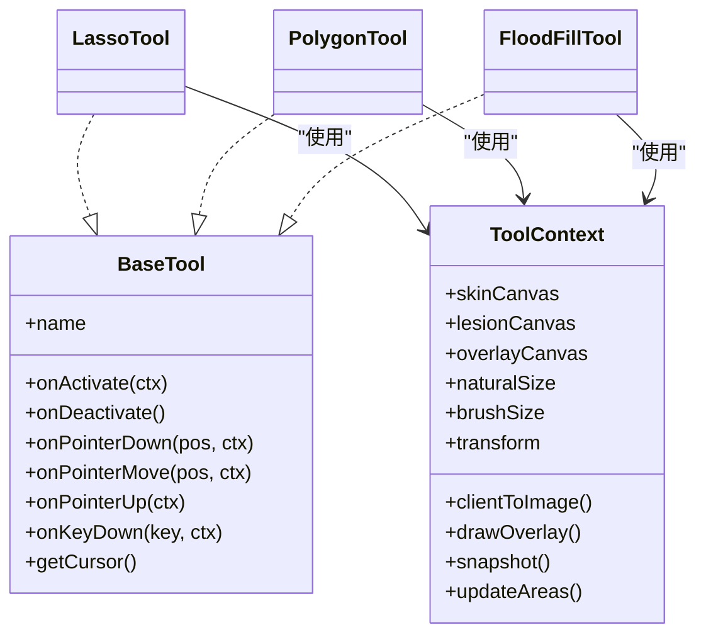

# 选择工具

<cite>
**本文引用的文件**
- [LassoTool.ts](file://web/admin/src/components/labeling/tools/LassoTool.ts)
- [PolygonTool.ts](file://web/admin/src/components/labeling/tools/PolygonTool.ts)
- [BaseTool.ts](file://web/admin/src/components/labeling/tools/BaseTool.ts)
- [useCanvasTools.ts](file://web/admin/src/composables/useCanvasTools.ts)
- [MaskEditorAdmin.vue](file://web/admin/src/components/labeling/MaskEditorAdmin.vue)
- [FloodFillTool.ts](file://web/admin/src/components/labeling/tools/FloodFillTool.ts)
- [useLabelHistory.ts](file://web/admin/src/composables/useLabelHistory.ts)
</cite>

## 目录
1. [简介](#简介)
2. [项目结构](#项目结构)
3. [核心组件](#核心组件)
4. [架构总览](#架构总览)
5. [详细组件分析](#详细组件分析)
6. [依赖关系分析](#依赖关系分析)
7. [性能考量](#性能考量)
8. [故障排查指南](#故障排查指南)
9. [结论](#结论)
10. [附录](#附录)

## 简介
本技术文档聚焦 Subskin 图像标注系统中的“选择工具”，深入解析套索工具（LassoTool）与多边形工具（PolygonTool）的算法实现与交互逻辑。内容涵盖自由曲线绘制、多边形顶点管理、扫描线区域填充、鼠标交互、路径预览、精确选择机制、几何计算、边界检测思路、蒙版转换技术，以及精度控制与批量操作能力。文档同时提供架构图、时序图与流程图，帮助读者从整体到细节全面理解系统。

## 项目结构
选择工具位于前端管理端标注模块中，围绕三层协作：
- 工具接口与定义：BaseTool.ts 定义了统一的工具接口与上下文对象 ToolContext，所有工具均实现该接口。
- 具体工具实现：LassoTool.ts、PolygonTool.ts 分别实现套索与多边形选择；FloodFillTool.ts 提供智能填充作为对比参考。
- 宿主与编排：MaskEditorAdmin.vue 负责画布、图层、坐标变换、事件分发与渲染合成；useCanvasTools.ts 管理工具实例、切换与快捷键；useLabelHistory.ts 提供撤销/重做历史。

图表来源
- [MaskEditorAdmin.vue:1-120](file://web/admin/src/components/labeling/MaskEditorAdmin.vue#L1-L120)
- [useCanvasTools.ts:16-51](file://web/admin/src/composables/useCanvasTools.ts#L16-L51)
- [BaseTool.ts:9-72](file://web/admin/src/components/labeling/tools/BaseTool.ts#L9-L72)
- [LassoTool.ts:17-70](file://web/admin/src/components/labeling/tools/LassoTool.ts#L17-L70)
- [PolygonTool.ts:21-97](file://web/admin/src/components/labeling/tools/PolygonTool.ts#L21-L97)
- [FloodFillTool.ts:22-92](file://web/admin/src/components/labeling/tools/FloodFillTool.ts#L22-L92)

章节来源
- [MaskEditorAdmin.vue:1-180](file://web/admin/src/components/labeling/MaskEditorAdmin.vue#L1-L180)
- [useCanvasTools.ts:1-127](file://web/admin/src/composables/useCanvasTools.ts#L1-L127)
- [BaseTool.ts:1-72](file://web/admin/src/components/labeling/tools/BaseTool.ts#L1-L72)

## 核心组件
- BaseTool 接口与上下文
  - ToolContext 暴露皮肤/病灶/覆盖层三个 Canvas、自然尺寸、画笔大小、平移缩放变换、坐标转换、覆写绘制、快照与面积更新等能力。
  - BaseTool 统一了激活/停用、指针事件、键盘事件与光标获取方法，确保工具可插拔。
- 工具管理器 useCanvasTools
  - 维护工具实例映射、当前活动工具、可用工具列表；提供 setTool/setContext、快捷键切换、事件转发与光标查询。
- 标注编辑器 MaskEditorAdmin.vue
  - 管理三张 Canvas（皮肤层、病灶层、叠加层），实现坐标换算 clientToImage、叠加绘制 drawOverlay、面积统计 updateAreas、撤销/重做 snapshot、全屏/缩放/拖拽等。
- 历史记录 useLabelHistory
  - 环形缓冲区保存 skin/lesion 的 ImageData 快照，支持 undo/redo。

章节来源
- [BaseTool.ts:9-72](file://web/admin/src/components/labeling/tools/BaseTool.ts#L9-L72)
- [useCanvasTools.ts:16-127](file://web/admin/src/composables/useCanvasTools.ts#L16-L127)
- [MaskEditorAdmin.vue:90-180](file://web/admin/src/components/labeling/MaskEditorAdmin.vue#L90-L180)
- [useLabelHistory.ts:17-87](file://web/admin/src/composables/useLabelHistory.ts#L17-L87)

## 架构总览
选择工具的工作流由宿主组件驱动：用户事件在 MaskEditorAdmin.vue 中捕获并转换为自然坐标后，交由当前 activeTool 处理；工具内部通过 ToolContext 访问底层 Canvas 进行绘制与填充；完成后触发覆写绘制、历史快照与面积更新。

图表来源
- [MaskEditorAdmin.vue:181-220](file://web/admin/src/components/labeling/MaskEditorAdmin.vue#L181-L220)
- [useCanvasTools.ts:87-105](file://web/admin/src/composables/useCanvasTools.ts#L87-L105)
- [LassoTool.ts:33-70](file://web/admin/src/components/labeling/tools/LassoTool.ts#L33-L70)
- [PolygonTool.ts:34-97](file://web/admin/src/components/labeling/tools/PolygonTool.ts#L34-L97)

## 详细组件分析

### 套索工具（LassoTool）
- 交互流程
  - 按下开始绘制，移动时累积路径点并在覆盖层实时绘制虚线预览；抬起时自动闭合路径并执行填充。
  - 最小点数阈值保证有效选区；Esc 可取消绘制。
- 路径绘制与预览
  - 在 overlayCanvas 上以虚线绘制临时路径，不污染真实图层；每次移动都先恢复基础覆盖再绘制路径，避免重绘开销。
- 区域填充算法（扫描线填充）
  - 构建边表（Edge Table），按 yMin 排序；对每一扫描行计算活跃边 x 交点，成对区间内设置像素透明度以实现填充。
  - 支持“擦除”模式（将 alpha 置零）用于从另一图层移除重叠区域。
- 结果落盘
  - 向病灶层填充颜色，同时在皮肤层对应区域擦除；随后刷新覆盖层、记录历史快照、更新面积统计。

图表来源
- [LassoTool.ts:45-70](file://web/admin/src/components/labeling/tools/LassoTool.ts#L45-L70)
- [LassoTool.ts:72-93](file://web/admin/src/components/labeling/tools/LassoTool.ts#L72-L93)
- [LassoTool.ts:99-166](file://web/admin/src/components/labeling/tools/LassoTool.ts#L99-L166)

章节来源
- [LassoTool.ts:17-180](file://web/admin/src/components/labeling/tools/LassoTool.ts#L17-L180)

### 多边形工具（PolygonTool）
- 交互流程
  - 点击放置顶点；双击或 Enter 闭合多边形并填充；Backspace 删除最后一个顶点；Esc 清空顶点。
  - 支持至少 3 个顶点才能闭合。
- 顶点管理与预览
  - 维护顶点数组；每次变更重绘覆盖层，显示边线与顶点圆点；移动时也可重绘以跟随光标（简化实现）。
- 区域填充算法
  - 复用与 LassoTool 相同的扫描线填充算法，保证一致性与可维护性。
- 结果落盘
  - 同 LassoTool：病灶层填充 + 皮肤层擦除，然后刷新覆盖层、快照、更新面积。

图表来源
- [PolygonTool.ts:34-97](file://web/admin/src/components/labeling/tools/PolygonTool.ts#L34-L97)
- [PolygonTool.ts:99-127](file://web/admin/src/components/labeling/tools/PolygonTool.ts#L99-L127)
- [PolygonTool.ts:129-190](file://web/admin/src/components/labeling/tools/PolygonTool.ts#L129-L190)

章节来源
- [PolygonTool.ts:21-196](file://web/admin/src/components/labeling/tools/PolygonTool.ts#L21-L196)

### 智能填充（FloodFillTool）对比参考
- 算法要点
  - 基于原始图像的像素采样，使用 4-连通域泛洪填充，带容差阈值控制；支持填充病灶/皮肤两种模式，并在对立图层擦除重叠区域。
  - 内置最大迭代次数保护，防止超大区域导致卡顿。
- 与选择工具的协同
  - 在 MaskEditorAdmin.vue 中，Shift+点击可调用填充为皮肤；选择工具与填充工具共享同一 ToolContext，便于统一渲染与历史管理。

章节来源
- [FloodFillTool.ts:22-265](file://web/admin/src/components/labeling/tools/FloodFillTool.ts#L22-L265)
- [MaskEditorAdmin.vue:181-204](file://web/admin/src/components/labeling/MaskEditorAdmin.vue#L181-L204)

### 宿主与上下文（MaskEditorAdmin.vue 与 ToolContext）
- 坐标转换
  - clientToImage 考虑 baseFitScale 与 transform（缩放/平移），将屏幕坐标映射回自然图像坐标，供工具精确操作。
- 覆盖层合成
  - drawOverlay 将皮肤层与病灶层按透明度叠加至 overlayCanvas，工具可在其上绘制临时路径或顶点。
- 面积统计
  - updateAreas 统计皮肤/病灶/区域的像素占比，辅助评估白斑占比。
- 历史快照
  - snapshot 调用 useLabelHistory 保存当前两层像素状态，支持撤销/重做。

章节来源
- [MaskEditorAdmin.vue:90-180](file://web/admin/src/components/labeling/MaskEditorAdmin.vue#L90-L180)
- [useLabelHistory.ts:17-87](file://web/admin/src/composables/useLabelHistory.ts#L17-L87)

## 依赖关系分析
- 工具与宿主解耦：工具仅依赖 BaseTool 接口与 ToolContext 提供的能力，不直接耦合 UI 细节。
- 工具管理器集中编排：useCanvasTools 统一管理工具生命周期与事件转发，降低宿主复杂度。
- 历史与渲染分离：MaskEditorAdmin 负责渲染与事件，历史记录由独立 composable 管理，职责清晰。

图表来源
- [BaseTool.ts:9-72](file://web/admin/src/components/labeling/tools/BaseTool.ts#L9-L72)
- [LassoTool.ts:17-70](file://web/admin/src/components/labeling/tools/LassoTool.ts#L17-L70)
- [PolygonTool.ts:21-97](file://web/admin/src/components/labeling/tools/PolygonTool.ts#L21-L97)
- [FloodFillTool.ts:22-92](file://web/admin/src/components/labeling/tools/FloodFillTool.ts#L22-L92)

章节来源
- [useCanvasTools.ts:16-51](file://web/admin/src/composables/useCanvasTools.ts#L16-L51)
- [BaseTool.ts:9-72](file://web/admin/src/components/labeling/tools/BaseTool.ts#L9-L72)

## 性能考量
- 扫描线填充复杂度
  - 时间复杂度近似 O(N+E)，N 为像素数，E 为边数；实际受多边形复杂度影响较小，主要瓶颈在像素遍历。
  - 通过 willReadFrequently 优化 getImageData 性能，减少重复测量开销。
- 预览绘制优化
  - 仅在 overlayCanvas 绘制临时路径，避免频繁修改真实图层；每次移动先恢复基础覆盖再绘制路径，减少重绘范围。
- 防抖与阈值
  - 套索工具要求最少点数才闭合，避免误触；多边形工具限制最少 3 个顶点。
- 内存与历史
  - 历史记录采用 ImageData 快照，上限 50 条，避免无限增长；大图像下注意内存占用。
- 泛洪填充保护
  - FloodFillTool 设置最大迭代次数，防止极端情况卡死。

[本节为通用性能讨论，不直接分析具体代码片段]

## 故障排查指南
- 无法闭合或无效果
  - 检查套索路径点数是否达到阈值；多边形顶点数是否≥3。
  - 确认坐标转换 clientToImage 返回有效值（图像尺寸与缩放/平移正确）。
- 填充异常或溢出
  - 调整 FloodFillTool 的容差参数；检查图像加载是否成功，imageData 是否为空。
- 历史撤销无效
  - 确认 snapshot 在每次修改后调用；检查 useLabelHistory 的索引与缓存长度。
- 覆盖层不更新
  - 确认 drawOverlay 在填充/擦除后被调用；检查 overlayCanvas 尺寸与 naturalSize 一致。

章节来源
- [LassoTool.ts:45-70](file://web/admin/src/components/labeling/tools/LassoTool.ts#L45-L70)
- [PolygonTool.ts:61-97](file://web/admin/src/components/labeling/tools/PolygonTool.ts#L61-L97)
- [FloodFillTool.ts:117-182](file://web/admin/src/components/labeling/tools/FloodFillTool.ts#L117-L182)
- [useLabelHistory.ts:24-71](file://web/admin/src/composables/useLabelHistory.ts#L24-L71)
- [MaskEditorAdmin.vue:111-155](file://web/admin/src/components/labeling/MaskEditorAdmin.vue#L111-L155)

## 结论
选择工具通过清晰的接口设计与分层架构，实现了高效的自由曲线与多边形选择能力。扫描线填充算法保证了区域填充的正确性与性能；宿主组件提供了稳定的坐标转换、渲染合成与历史管理。未来可在以下方面进一步优化：
- 路径捕捉优化：引入最近点吸附与距离阈值，提升复杂边缘选择的易用性。
- 贝塞尔曲线拟合：对套索路径进行平滑拟合，减少锯齿并改善视觉体验。
- 批量操作：支持多选合并、布尔运算（并集/交集/差集）、批量导出掩膜。
- 精度控制：增加顶点编辑、路径微调、容差可视化与更细粒度的撤销粒度。

[本节为总结性内容，不直接分析具体代码片段]

## 附录

### 算法与实现要点速览
- 自由曲线绘制
  - 套索工具在移动时累积路径点，实时在覆盖层绘制虚线预览，释放时闭合路径。
- 多边形顶点管理
  - 多边形工具维护顶点数组，支持增删、闭合与预览；双击/Enter 闭合，Backspace 删除，Esc 取消。
- 扫描线区域填充
  - 构建边表、排序、逐行计算活跃边交点，成对区间填充像素透明度；支持擦除模式。
- 鼠标交互与坐标转换
  - 宿主组件负责 clientToImage 转换，考虑缩放与平移；工具接收自然坐标进行操作。
- 蒙版转换与面积统计
  - 通过皮肤/病灶两层 Canvas 的 Alpha 通道统计区域占比，支持导出 DataURL 与叠加图像。

章节来源
- [LassoTool.ts:33-93](file://web/admin/src/components/labeling/tools/LassoTool.ts#L33-L93)
- [PolygonTool.ts:34-127](file://web/admin/src/components/labeling/tools/PolygonTool.ts#L34-L127)
- [LassoTool.ts:99-166](file://web/admin/src/components/labeling/tools/LassoTool.ts#L99-L166)
- [PolygonTool.ts:129-190](file://web/admin/src/components/labeling/tools/PolygonTool.ts#L129-L190)
- [MaskEditorAdmin.vue:90-155](file://web/admin/src/components/labeling/MaskEditorAdmin.vue#L90-L155)