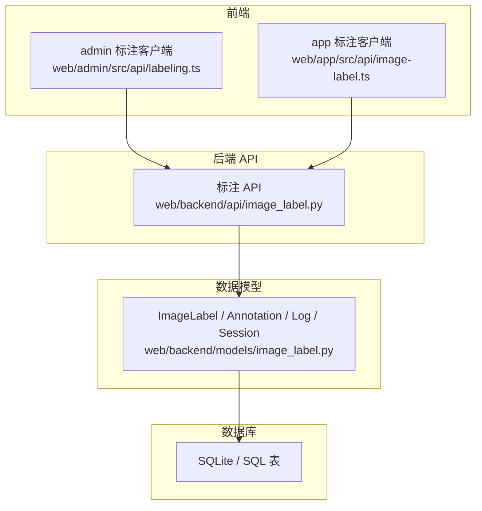
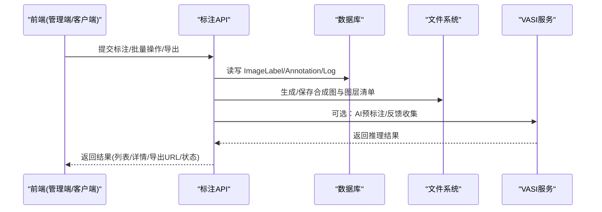
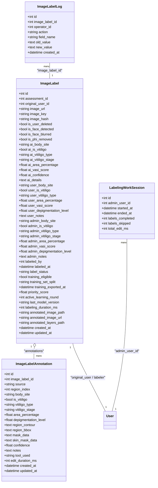
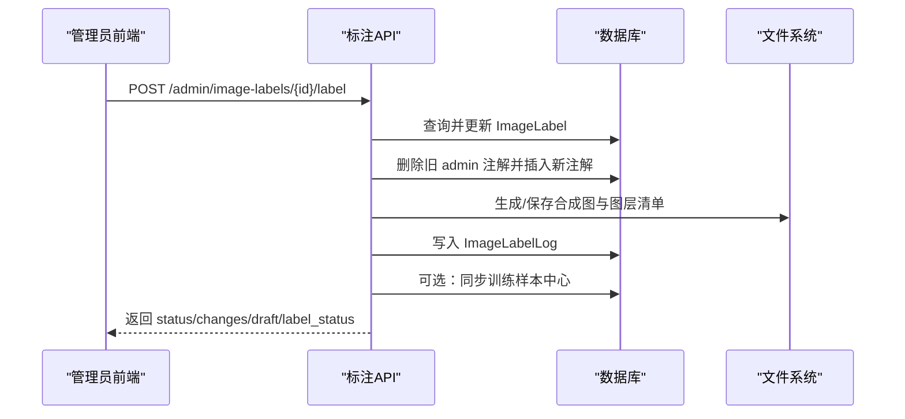
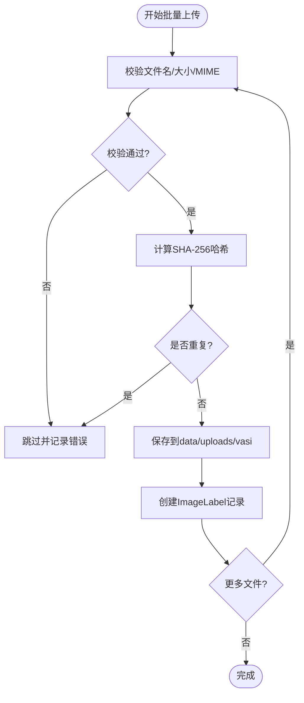
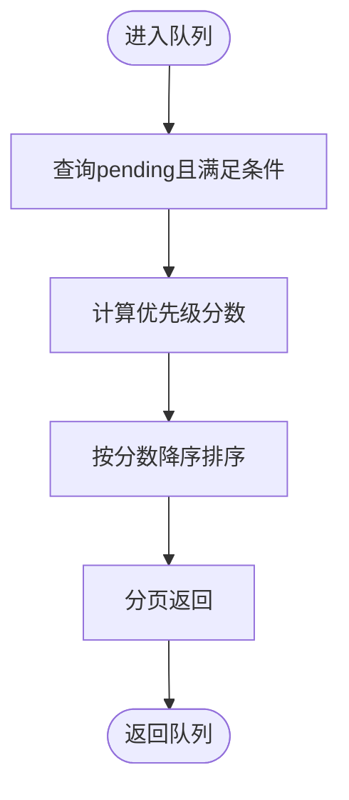
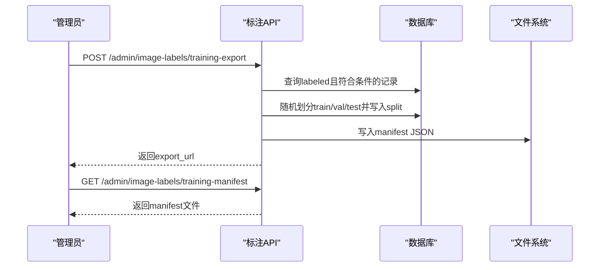
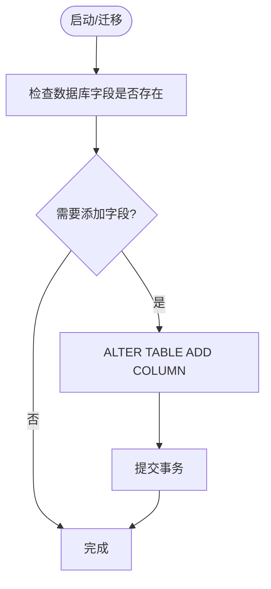
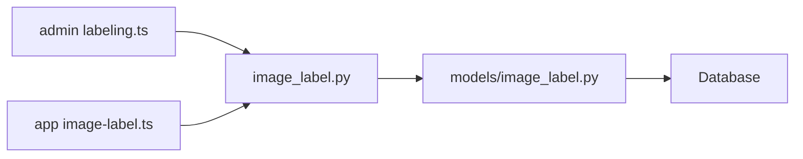

# 标注数据管理

<cite>
**本文引用的文件**
- [web/backend/models/image_label.py](file://web/backend/models/image_label.py)
- [web/backend/api/image_label.py](file://web/backend/api/image_label.py)
- [web/admin/src/api/labeling.ts](file://web/admin/src/api/labeling.ts)
- [web/app/src/api/image-label.ts](file://web/app/src/api/image-label.ts)
- [web/backend/database/migration_add_annotated_image_fields.py](file://web/backend/database/migration_add_annotated_image_fields.py)
- [scripts/vasi_data_flywheel.py](file://scripts/vasi_data_flywheel.py)
</cite>

## 目录
1. [简介](#简介)
2. [项目结构](#项目结构)
3. [核心组件](#核心组件)
4. [架构总览](#架构总览)
5. [详细组件分析](#详细组件分析)
6. [依赖关系分析](#依赖关系分析)
7. [性能考虑](#性能考虑)
8. [故障排查指南](#故障排查指南)
9. [结论](#结论)
10. [附录](#附录)

## 简介
本技术文档聚焦 Subskin 图像标注系统的数据管理模块，围绕“标注数据的存储结构、API 接口设计、数据流转机制”展开，覆盖以下关键主题：
- ImageLabel 模型定义与标注记录关系映射
- 批量标注处理、数据同步机制与质量检查流程
- 训练数据导出格式、版本控制策略与数据迁移方案
- 数据备份恢复、性能优化与错误处理最佳实践

该模块支持三级标注来源（AI 自动识别 → 用户手动校准 → 管理员审核标注），并保留隐私脱敏、审计追溯、主动学习队列与训练集导出能力。

## 项目结构
数据管理模块主要由后端模型、API 层、前端调用封装以及数据库迁移脚本组成：
- 模型层：定义图片标注主表、标注明细表、操作日志表与工作会话表
- API 层：提供列表查询、详情获取、管理员提交标注、批量状态更新、训练数据导出、历史审计等接口
- 前端：管理端与客户端分别通过 TypeScript 封装调用后端接口
- 迁移脚本：为已有数据库安全添加缺失字段

图表来源
- [web/backend/api/image_label.py:270-370](file://web/backend/api/image_label.py#L270-L370)
- [web/backend/models/image_label.py:68-169](file://web/backend/models/image_label.py#L68-L169)

章节来源
- [web/backend/models/image_label.py:68-169](file://web/backend/models/image_label.py#L68-L169)
- [web/backend/api/image_label.py:270-370](file://web/backend/api/image_label.py#L270-L370)

## 核心组件
- 数据模型
  - ImageLabel：图片标注主记录，包含 AI/用户/管理员三级标注字段、隐私标记、训练集划分、标注产物路径等
  - ImageLabelAnnotation：单图多处白斑的细粒度标注，支持轮廓、边界框、掩码数据、工具使用与耗时统计
  - ImageLabelLog：不可变操作日志，记录所有标注变更，用于审计追溯
  - LabelingWorkSession：管理员打标工作会话，追踪效率与生产力
- API 接口
  - 列表与筛选：支持按状态、部位、是否适合训练、用户删除标记等维度分页查询
  - 详情与注解：返回三级标注数据与细粒度注解
  - 管理员提交标注：支持草稿模式、最终提交、保存合成图与图层清单
  - 批量操作：批量跳过/拒绝、批量上传、从评估记录同步
  - 训练数据导出：生成 manifest 并返回下载链接
  - 历史与队列：查看变更记录、主动学习优先级队列
- 前端封装
  - 管理端与客户端均提供类型化方法，统一调用后端标注相关接口

章节来源
- [web/backend/models/image_label.py:68-169](file://web/backend/models/image_label.py#L68-L169)
- [web/backend/api/image_label.py:270-370](file://web/backend/api/image_label.py#L270-L370)
- [web/admin/src/api/labeling.ts:55-99](file://web/admin/src/api/labeling.ts#L55-L99)
- [web/app/src/api/image-label.ts:116-211](file://web/app/src/api/image-label.ts#L116-L211)

## 架构总览
数据流从前端发起请求到后端 API，经 ORM 写入或读取模型，持久化至数据库；同时可触发文件处理（如合成标注图）与外部服务（如 VASI 推理）。

图表来源
- [web/backend/api/image_label.py:592-756](file://web/backend/api/image_label.py#L592-L756)
- [web/backend/api/image_label.py:1138-1257](file://web/backend/api/image_label.py#L1138-L1257)
- [web/backend/api/image_label.py:1448-1544](file://web/backend/api/image_label.py#L1448-L1544)

## 详细组件分析

### 数据模型与关系映射
- ImageLabel
  - 关联：VASIAssessment、User（上传者、标注员）
  - 关键字段：image_url/key/hash、隐私标记、三级标注字段、训练集标记、标注产物路径、时间戳
  - 索引：status、assessment_id、original_user_id、created_at
- ImageLabelAnnotation
  - 关联：ImageLabel（一对多）
  - 关键字段：source（ai/user/admin）、region_index、轮廓/边界框/掩码数据、置信度、工具与耗时
- ImageLabelLog
  - 记录：action、field_name、old/new_value、operator_id、时间戳
- LabelingWorkSession
  - 记录：admin_user_id、开始/结束时间、完成/跳过数量、总编辑耗时

图表来源
- [web/backend/models/image_label.py:68-169](file://web/backend/models/image_label.py#L68-L169)
- [web/backend/models/image_label.py:171-223](file://web/backend/models/image_label.py#L171-L223)
- [web/backend/models/image_label.py:225-272](file://web/backend/models/image_label.py#L225-L272)

章节来源
- [web/backend/models/image_label.py:68-169](file://web/backend/models/image_label.py#L68-L169)
- [web/backend/models/image_label.py:171-223](file://web/backend/models/image_label.py#L171-L223)
- [web/backend/models/image_label.py:225-272](file://web/backend/models/image_label.py#L225-L272)

### API 设计与数据流转
- 列表与统计
  - GET /admin/image-labels：支持 limit/offset、label_status、is_vitiligo、body_site、training_eligible、is_user_deleted 等筛选
  - GET /admin/image-labels/stats：统计总数、待标注、已标注、跳过、拒绝、可训练数、用户删除数
- 详情与注解
  - GET /admin/image-labels/{id}：返回三级标注与注解列表
  - GET /admin/image-labels/{id}/annotations：仅返回人工（admin）注解
  - GET /admin/image-labels/{id}/user-annotations：返回用户与AI注解及评估摘要
- 管理员提交标注
  - POST /admin/image-labels/{id}/label：支持草稿模式、最终提交、保存合成图与图层清单、训练集标记
  - 内部逻辑：更新字段、写日志、删除旧 admin 注解并重建、生成/保存合成图、同步训练样本中心
- 批量操作
  - POST /admin/image-labels/batch-status：批量设置 skipped/rejected 与 training_eligible
  - POST /admin/image-labels/upload：批量上传图片，去重（SHA-256）、校验格式与大小、创建 ImageLabel
  - POST /admin/image-labels/sync-assessments：从现有 VASI 评估记录同步创建标注记录，并迁移用户/AI 图层
- 训练数据导出
  - POST /admin/image-labels/training-export：按比例划分 train/val/test，生成 manifest JSON，返回下载 URL
  - GET /admin/image-labels/training-manifest：下载 manifest 文件
  - GET /admin/image-labels/export：导出 JSON/CSV 格式的标注元数据
- 历史与队列
  - GET /admin/image-labels/{id}/history：审计变更记录
  - GET /admin/image-labels/queue：主动学习优先级队列（低置信度优先）
- 工作会话
  - POST /admin/labeling/sessions：开始会话
  - PUT /admin/labeling/sessions/{id}：结束会话

图表来源
- [web/backend/api/image_label.py:592-756](file://web/backend/api/image_label.py#L592-L756)
- [web/backend/api/image_label.py:1138-1257](file://web/backend/api/image_label.py#L1138-L1257)

章节来源
- [web/backend/api/image_label.py:270-370](file://web/backend/api/image_label.py#L270-L370)
- [web/backend/api/image_label.py:592-756](file://web/backend/api/image_label.py#L592-L756)
- [web/backend/api/image_label.py:857-999](file://web/backend/api/image_label.py#L857-L999)
- [web/backend/api/image_label.py:1001-1136](file://web/backend/api/image_label.py#L1001-L1136)
- [web/backend/api/image_label.py:1138-1257](file://web/backend/api/image_label.py#L1138-L1257)
- [web/backend/api/image_label.py:1282-1346](file://web/backend/api/image_label.py#L1282-L1346)
- [web/backend/api/image_label.py:1871-1900](file://web/backend/api/image_label.py#L1871-L1900)
- [web/backend/api/image_label.py:2013-2059](file://web/backend/api/image_label.py#L2013-L2059)
- [web/backend/api/image_label.py:2062-2103](file://web/backend/api/image_label.py#L2062-L2103)

### 批量标注处理与数据同步
- 批量上传
  - 校验文件名、空文件、大小限制（20MB）、MIME 类型（JPG/PNG/WebP）
  - 计算 SHA-256 去重，落盘后创建 ImageLabel 记录
- 从评估记录同步
  - 将 VASIAssessment 中的图片与标注数据导入 ImageLabel，并迁移用户/AI 图层作为预填充数据
- 批量状态更新
  - 支持批量设置 skipped/rejected 与 training_eligible，并记录日志

图表来源
- [web/backend/api/image_label.py:889-999](file://web/backend/api/image_label.py#L889-L999)

章节来源
- [web/backend/api/image_label.py:889-999](file://web/backend/api/image_label.py#L889-L999)
- [web/backend/api/image_label.py:1001-1136](file://web/backend/api/image_label.py#L1001-L1136)
- [web/backend/api/image_label.py:857-879](file://web/backend/api/image_label.py#L857-L879)

### 质量检查与主动学习
- 质量检查
  - 列表筛选支持 is_user_deleted、training_eligible 等维度
  - 批量状态更新支持 skipped/rejected，便于剔除低质量样本
- 主动学习队列
  - 基于 AI 置信度与创建时间计算优先级，低置信度优先处理
  - 支持最小置信度阈值过滤

图表来源
- [web/backend/api/image_label.py:2013-2059](file://web/backend/api/image_label.py#L2013-L2059)

章节来源
- [web/backend/api/image_label.py:2013-2059](file://web/backend/api/image_label.py#L2013-L2059)

### 训练数据导出与版本控制
- 导出格式
  - manifest JSON：包含每条记录的 image_url、image_hash、标注产物路径、split、标签、contours、mask_count 等
  - CSV/JSON 元数据导出：支持按状态筛选
- 版本控制
  - 每次导出生成带时间戳的 manifest 文件，便于回溯
  - 训练集划分标记写入 ImageLabel.training_set_split，并记录最近导出时间
- 下载
  - 提供受保护的 manifest 下载接口，仅允许指定目录下的文件

图表来源
- [web/backend/api/image_label.py:1138-1257](file://web/backend/api/image_label.py#L1138-L1257)
- [web/backend/api/image_label.py:1260-1279](file://web/backend/api/image_label.py#L1260-L1279)

章节来源
- [web/backend/api/image_label.py:1138-1257](file://web/backend/api/image_label.py#L1138-L1257)
- [web/backend/api/image_label.py:1260-1279](file://web/backend/api/image_label.py#L1260-L1279)
- [web/backend/api/image_label.py:1282-1346](file://web/backend/api/image_label.py#L1282-L1346)

### 数据迁移与字段扩展
- 迁移脚本
  - 为已有数据库安全添加缺失字段（如 annotated_image_path/url/layers_path、skin_mask_data 等）
  - 兼容 SQLite PRAGMA 检查，避免重复添加
- 应用内自检
  - ensure_image_label_columns 在启动时检测并补齐字段

图表来源
- [web/backend/database/migration_add_annotated_image_fields.py:39-66](file://web/backend/database/migration_add_annotated_image_fields.py#L39-L66)
- [web/backend/models/image_label.py:274-325](file://web/backend/models/image_label.py#L274-L325)

章节来源
- [web/backend/database/migration_add_annotated_image_fields.py:39-66](file://web/backend/database/migration_add_annotated_image_fields.py#L39-L66)
- [web/backend/models/image_label.py:274-325](file://web/backend/models/image_label.py#L274-L325)

### 数据备份恢复
- 配置备份示例
  - LLM 配置模块提供备份/恢复接口，演示了以 JSON 形式导出/导入配置并加密敏感字段
- 建议实践
  - 对标注数据与 manifest 定期备份
  - 使用只读副本进行报表与导出，降低写入压力

章节来源
- [web/backend/api/llm_config_admin.py:231-311](file://web/backend/api/llm_config_admin.py#L231-L311)

## 依赖关系分析
- 模型依赖
  - ImageLabel 依赖 VASIAssessment、User
  - ImageLabelAnnotation 依赖 ImageLabel
  - ImageLabelLog 依赖 User
  - LabelingWorkSession 依赖 User
- API 依赖
  - 认证：get_current_admin_user
  - 数据库：get_db
  - 外部服务：VASI 推理、文件服务
- 前端依赖
  - 管理端与客户端通过 TypeScript 封装调用后端接口

图表来源
- [web/admin/src/api/labeling.ts:55-99](file://web/admin/src/api/labeling.ts#L55-L99)
- [web/app/src/api/image-label.ts:116-211](file://web/app/src/api/image-label.ts#L116-L211)
- [web/backend/api/image_label.py:27-37](file://web/backend/api/image_label.py#L27-L37)
- [web/backend/models/image_label.py:68-169](file://web/backend/models/image_label.py#L68-L169)

章节来源
- [web/admin/src/api/labeling.ts:55-99](file://web/admin/src/api/labeling.ts#L55-L99)
- [web/app/src/api/image-label.ts:116-211](file://web/app/src/api/image-label.ts#L116-L211)
- [web/backend/api/image_label.py:27-37](file://web/backend/api/image_label.py#L27-L37)
- [web/backend/models/image_label.py:68-169](file://web/backend/models/image_label.py#L68-L169)

## 性能考虑
- 数据库索引
  - 针对 label_status、assessment_id、original_user_id、created_at 建立索引，提升查询效率
- 分页与筛选
  - 列表接口支持 limit/offset 与多维度筛选，避免全量查询
- 文件处理
  - 合成图生成采用流式读取与缓存控制，减少内存占用
- 异步与超时保护
  - 外部 URL 访问设置超时，失败时返回友好占位图
- 主动学习队列
  - 基于置信度与年龄动态排序，提高标注效率

章节来源
- [web/backend/models/image_label.py:75-81](file://web/backend/models/image_label.py#L75-L81)
- [web/backend/api/image_label.py:270-329](file://web/backend/api/image_label.py#L270-L329)
- [web/backend/api/image_label.py:1547-1673](file://web/backend/api/image_label.py#L1547-L1673)
- [web/backend/api/image_label.py:2013-2059](file://web/backend/api/image_label.py#L2013-L2059)

## 故障排查指南
- 常见问题
  - 图片加载失败：检查 image_url 解析逻辑与外部 URL 可达性
  - 合成图生成失败：确认 mask_data/skin_mask_data 存在且有效
  - 批量上传失败：检查 MIME 类型、文件大小、重复哈希
- 日志与审计
  - 使用 ImageLabelLog 查看变更记录，定位问题
  - 关注警告日志（如 Pillow 未安装、外部 URL 不可达）
- 恢复与回滚
  - 使用 manifest 与导出文件恢复训练数据
  - 迁移脚本可安全追加字段，避免破坏现有数据

章节来源
- [web/backend/api/image_label.py:592-756](file://web/backend/api/image_label.py#L592-L756)
- [web/backend/api/image_label.py:889-999](file://web/backend/api/image_label.py#L889-L999)
- [web/backend/api/image_label.py:1871-1900](file://web/backend/api/image_label.py#L1871-L1900)
- [web/backend/database/migration_add_annotated_image_fields.py:39-66](file://web/backend/database/migration_add_annotated_image_fields.py#L39-L66)

## 结论
本模块通过清晰的模型设计、完善的 API 接口与健壮的数据流转机制，实现了高效的图像标注管理。其特性包括：
- 三级标注来源与细粒度注解，支持复杂场景
- 批量处理与数据同步，提升工作效率
- 训练数据导出与版本控制，支撑模型迭代
- 主动学习队列与质量检查，持续优化标注质量
- 审计日志与迁移脚本，保障数据安全与可追溯性

建议在生产环境中结合备份恢复策略、性能监控与错误告警，进一步提升系统的稳定性与可用性。

## 附录
- 参考实现与脚本
  - 训练数据集导出脚本：scripts/vasi_data_flywheel.py
  - 迁移脚本：web/backend/database/migration_add_annotated_image_fields.py

章节来源
- [scripts/vasi_data_flywheel.py:109-153](file://scripts/vasi_data_flywheel.py#L109-L153)
- [web/backend/database/migration_add_annotated_image_fields.py:39-66](file://web/backend/database/migration_add_annotated_image_fields.py#L39-L66)