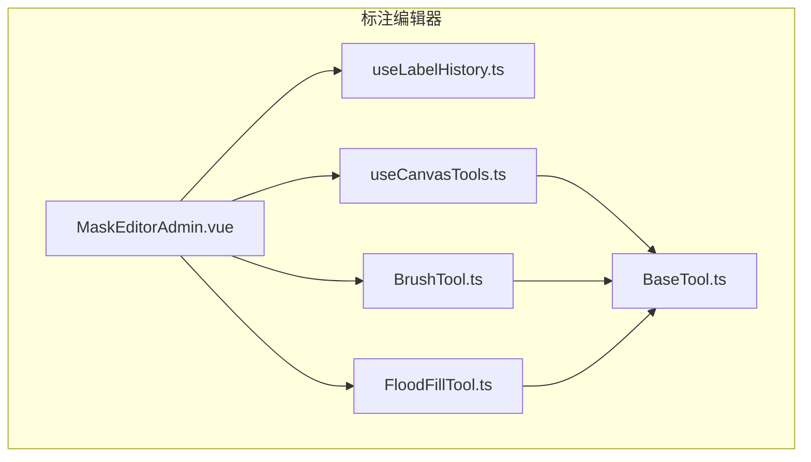
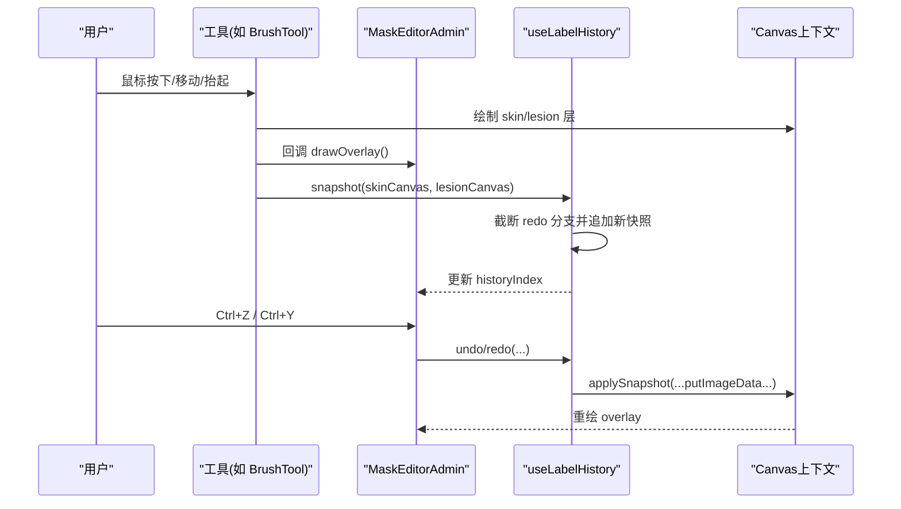
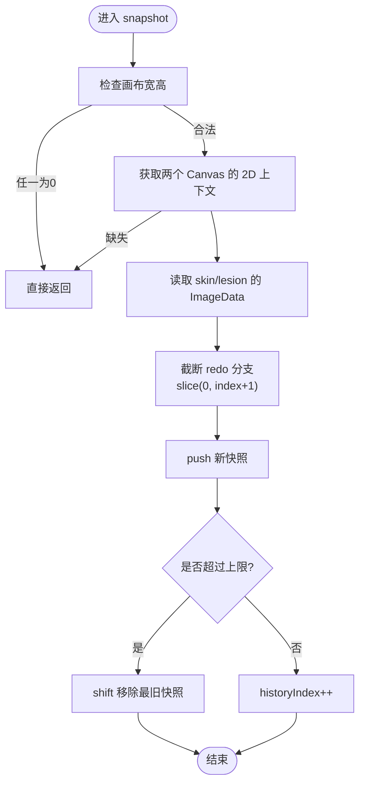
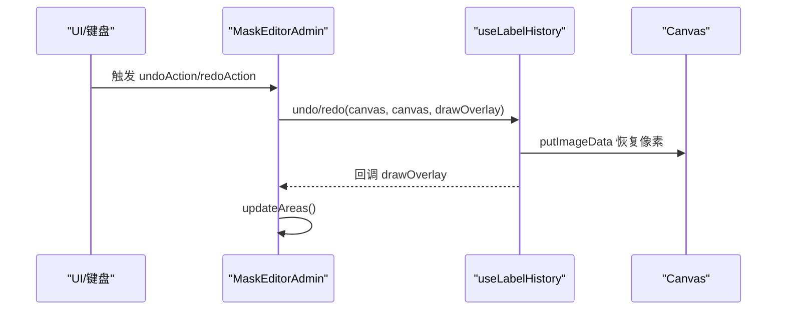
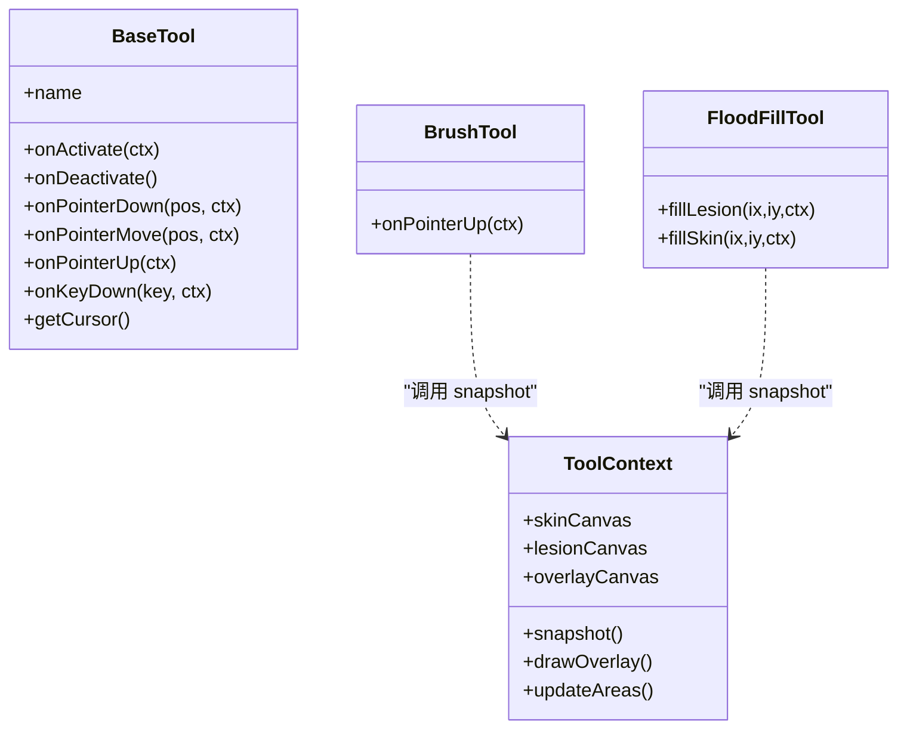
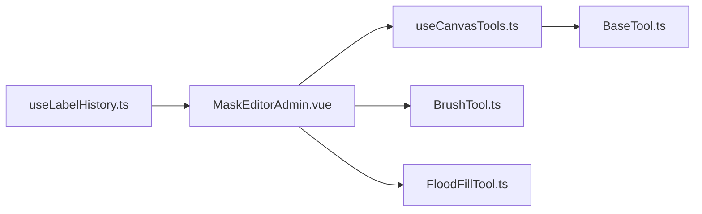

# 标注历史管理

<cite>
**本文引用的文件**   
- [useLabelHistory.ts](file://web/admin/src/composables/useLabelHistory.ts)
- [MaskEditorAdmin.vue](file://web/admin/src/components/labeling/MaskEditorAdmin.vue)
- [BaseTool.ts](file://web/admin/src/components/labeling/tools/BaseTool.ts)
- [BrushTool.ts](file://web/admin/src/components/labeling/tools/BrushTool.ts)
- [FloodFillTool.ts](file://web/admin/src/components/labeling/tools/FloodFillTool.ts)
- [useCanvasTools.ts](file://web/admin/src/composables/useCanvasTools.ts)
</cite>

## 目录
1. [简介](#简介)
2. [项目结构](#项目结构)
3. [核心组件](#核心组件)
4. [架构总览](#架构总览)
5. [详细组件分析](#详细组件分析)
6. [依赖关系分析](#依赖关系分析)
7. [性能考量](#性能考量)
8. [故障排查指南](#故障排查指南)
9. [结论](#结论)
10. [附录](#附录)

## 简介
本技术文档围绕 useLabelHistory 组合函数，系统性阐述其在图像标注编辑器中的撤销/重做能力实现。内容涵盖：
- 标注历史的存储结构与时间线管理机制
- 操作栈管理与状态快照技术
- 内存优化策略与大文件处理方案
- 历史记录同步、版本控制与冲突解决机制
- 历史数据导出、批量操作支持与性能监控方法

该能力通过环状缓冲区维护皮肤层与病灶层的 ImageData 快照，结合 Vue 响应式状态提供可计算的撤销/重做可用性，并在工具交互的关键节点进行快照与回滚。

## 项目结构
与 useLabelHistory 相关的代码主要位于前端 admin 应用内：
- 组合函数：web/admin/src/composables/useLabelHistory.ts
- 使用方（宿主）：web/admin/src/components/labeling/MaskEditorAdmin.vue
- 工具接口与上下文：web/admin/src/components/labeling/tools/BaseTool.ts
- 具体工具实现：web/admin/src/components/labeling/tools/BrushTool.ts、FloodFillTool.ts
- 工具生命周期管理：web/admin/src/composables/useCanvasTools.ts

图表来源
- [MaskEditorAdmin.vue:1-120](file://web/admin/src/components/labeling/MaskEditorAdmin.vue#L1-L120)
- [useLabelHistory.ts:1-87](file://web/admin/src/composables/useLabelHistory.ts#L1-L87)
- [BaseTool.ts:1-72](file://web/admin/src/components/labeling/tools/BaseTool.ts#L1-L72)
- [BrushTool.ts:1-122](file://web/admin/src/components/labeling/tools/BrushTool.ts#L1-L122)
- [FloodFillTool.ts:1-200](file://web/admin/src/components/labeling/tools/FloodFillTool.ts#L1-L200)
- [useCanvasTools.ts:1-127](file://web/admin/src/composables/useCanvasTools.ts#L1-L127)

章节来源
- [MaskEditorAdmin.vue:1-200](file://web/admin/src/components/labeling/MaskEditorAdmin.vue#L1-L200)
- [useLabelHistory.ts:1-87](file://web/admin/src/composables/useLabelHistory.ts#L1-L87)

## 核心组件
- useLabelHistory：提供撤销/重做的核心能力，内部维护一个 HistorySnapshot[] 数组与当前索引 historyIndex，支持 snapshot、undo、redo、reset 等方法，并暴露 canUndo/canRedo 计算属性。
- MaskEditorAdmin：作为宿主组件，负责将两个 Canvas（skin、lesion）与 overlay 合成显示，并在工具交互结束时调用 snapshot；同时绑定键盘快捷键触发 undo/redo。
- BaseTool/具体工具：在 onPointerUp 等关键时机调用 ctx.snapshot()，确保每次有效绘制后生成新快照。
- useCanvasTools：管理工具切换与上下文注入，使工具能访问到 snapshot、drawOverlay、updateAreas 等能力。

章节来源
- [useLabelHistory.ts:1-87](file://web/admin/src/composables/useLabelHistory.ts#L1-L87)
- [MaskEditorAdmin.vue:150-210](file://web/admin/src/components/labeling/MaskEditorAdmin.vue#L150-L210)
- [BaseTool.ts:1-72](file://web/admin/src/components/labeling/tools/BaseTool.ts#L1-L72)
- [BrushTool.ts:100-122](file://web/admin/src/components/labeling/tools/BrushTool.ts#L100-L122)
- [FloodFillTool.ts:80-115](file://web/admin/src/components/labeling/tools/FloodFillTool.ts#L80-L115)
- [useCanvasTools.ts:1-127](file://web/admin/src/composables/useCanvasTools.ts#L1-L127)

## 架构总览
useLabelHistory 以“环状缓冲 + 索引指针”的方式管理时间线。每次有效操作都会产生一次快照（皮肤层与病灶层的 ImageData），当超过最大容量时丢弃最旧快照，保证内存稳定。撤销/重做通过移动 historyIndex 并应用对应快照完成。

图表来源
- [MaskEditorAdmin.vue:290-310](file://web/admin/src/components/labeling/MaskEditorAdmin.vue#L290-L310)
- [useLabelHistory.ts:24-71](file://web/admin/src/composables/useLabelHistory.ts#L24-L71)
- [BrushTool.ts:106-112](file://web/admin/src/components/labeling/tools/BrushTool.ts#L106-L112)

## 详细组件分析

### useLabelHistory 组合函数
- 数据结构
  - HistorySnapshot：包含 skin 与 lesion 两个 ImageData 对象，表示某一时刻的图层像素状态。
  - history：HistorySnapshot[] 数组，按时间顺序保存快照。
  - historyIndex：当前时间线指针，指向最新可用快照。
- 算法要点
  - 新增快照：先截断 historyIndex 之后的历史（实现分支覆盖），再 push 新快照；若超出上限则 shift 掉最旧项，保持环形缓冲。
  - 撤销：historyIndex-- 后应用对应快照。
  - 重做：historyIndex++ 后应用对应快照。
  - 应用快照：通过 putImageData 将 ImageData 写回两个 Canvas，并触发 overlay 重绘。
- 复杂度
  - 新增快照：O(1) 均摊（shift 可能 O(n)，但受限于固定上限）。
  - 撤销/重做：O(1)。
  - 空间：O(N * W * H * 4) 字节，N 为最大历史长度，W/H 为画布尺寸。
- 边界与健壮性
  - 画布尺寸为 0 时跳过快照。
  - 获取不到 2D 上下文时直接返回，避免崩溃。
  - reset 清空历史并重置指针。

图表来源
- [useLabelHistory.ts:24-45](file://web/admin/src/composables/useLabelHistory.ts#L24-L45)

章节来源
- [useLabelHistory.ts:1-87](file://web/admin/src/composables/useLabelHistory.ts#L1-L87)

### MaskEditorAdmin 宿主集成
- 职责
  - 维护 skinCanvas、lesionCanvas、overlayCanvas 三块画布。
  - 提供 drawOverlay 将两层合成显示。
  - 在工具交互结束后调用 snapshot，并在撤销/重做后重新绘制 overlay 与面积统计。
  - 监听键盘事件，绑定 Ctrl+Z/Ctrl+Y 触发撤销/重做。
- 关键点
  - 图片加载完成后 reset 历史并创建初始快照，确保后续操作基于干净起点。
  - 清除图层后同样需要 snapshot，以保持时间线一致性。

图表来源
- [MaskEditorAdmin.vue:296-304](file://web/admin/src/components/labeling/MaskEditorAdmin.vue#L296-L304)
- [useLabelHistory.ts:47-57](file://web/admin/src/composables/useLabelHistory.ts#L47-L57)

章节来源
- [MaskEditorAdmin.vue:150-210](file://web/admin/src/components/labeling/MaskEditorAdmin.vue#L150-L210)
- [MaskEditorAdmin.vue:325-352](file://web/admin/src/components/labeling/MaskEditorAdmin.vue#L325-L352)

### 工具系统与快照时机
- BaseTool 定义了 ToolContext，其中包含 snapshot、drawOverlay、updateAreas 等能力，供具体工具调用。
- BrushTool 在 onPointerUp 中调用 ctx.snapshot()，确保一笔绘制完成后记录历史。
- FloodFillTool 在填充完成后调用 ctx.snapshot()，保证区域填充结果可撤销。

图表来源
- [BaseTool.ts:9-31](file://web/admin/src/components/labeling/tools/BaseTool.ts#L9-L31)
- [BrushTool.ts:106-112](file://web/admin/src/components/labeling/tools/BrushTool.ts#L106-L112)
- [FloodFillTool.ts:94-115](file://web/admin/src/components/labeling/tools/FloodFillTool.ts#L94-L115)

章节来源
- [BaseTool.ts:1-72](file://web/admin/src/components/labeling/tools/BaseTool.ts#L1-L72)
- [BrushTool.ts:1-122](file://web/admin/src/components/labeling/tools/BrushTool.ts#L1-L122)
- [FloodFillTool.ts:1-200](file://web/admin/src/components/labeling/tools/FloodFillTool.ts#L1-L200)

## 依赖关系分析
- useLabelHistory 被 MaskEditorAdmin 直接消费，用于撤销/重做。
- MaskEditorAdmin 通过 ToolContext 向工具暴露 snapshot 能力，工具在合适时机调用。
- useCanvasTools 管理工具实例与上下文注入，确保工具能访问到宿主提供的能力。

图表来源
- [useLabelHistory.ts:1-87](file://web/admin/src/composables/useLabelHistory.ts#L1-L87)
- [MaskEditorAdmin.vue:1-120](file://web/admin/src/components/labeling/MaskEditorAdmin.vue#L1-L120)
- [useCanvasTools.ts:1-127](file://web/admin/src/composables/useCanvasTools.ts#L1-L127)

章节来源
- [useCanvasTools.ts:1-127](file://web/admin/src/composables/useCanvasTools.ts#L1-L127)
- [MaskEditorAdmin.vue:1-120](file://web/admin/src/components/labeling/MaskEditorAdmin.vue#L1-L120)

## 性能考量
- 内存占用
  - 每个快照包含两个 ImageData，大小约为 2 × W × H × 4 字节。建议限制 HISTORY_MAX（当前为 50）并结合画布尺寸评估内存峰值。
  - 大分辨率图像下，频繁快照可能导致内存抖动。可考虑按需采样或降低分辨率后再快照。
- I/O 与渲染
  - getImageData/putImageData 属于 CPU 密集操作，应避免在高频事件中调用。当前在工具结束（onPointerUp）或填充完成后调用，较为合理。
  - overlay 合成需重绘，建议在批量操作后统一重绘。
- 算法安全阀
  - FloodFillTool 内置 MAX_ITERATIONS 防止无限遍历，对超大图像起到保护。
- 优化建议
  - 增量快照：仅记录差异区域（diff），减少 ImageData 拷贝。
  - 分层压缩：对 ImageData 进行轻量压缩（如 RLE 或位图压缩）以降低内存。
  - 异步快照：将快照写入 Web Worker，避免阻塞主线程。
  - 懒加载历史：仅在用户触发撤销/重读时才解码/重建像素。

[本节为通用性能讨论，不直接分析具体文件]

## 故障排查指南
- 无法撤销/重做
  - 检查 canUndo/canRedo 计算属性是否为真。
  - 确认 snapshot 是否在工具交互结束时被调用。
  - 确认画布尺寸不为 0，且能获取到 2D 上下文。
- 撤销后画面异常
  - 确认 applySnapshot 成功执行 putImageData，并触发了 drawOverlay。
  - 检查 overlay 的透明度设置是否正确。
- 内存溢出或卡顿
  - 降低 HISTORY_MAX 或减小画布尺寸。
  - 检查是否存在高频快照调用（例如每帧都快照）。
  - 关注 FloodFillTool 的迭代次数上限是否被触发。

章节来源
- [useLabelHistory.ts:24-71](file://web/admin/src/composables/useLabelHistory.ts#L24-L71)
- [MaskEditorAdmin.vue:296-310](file://web/admin/src/components/labeling/MaskEditorAdmin.vue#L296-L310)
- [FloodFillTool.ts:170-182](file://web/admin/src/components/labeling/tools/FloodFillTool.ts#L170-L182)

## 结论
useLabelHistory 以简洁高效的环状缓冲实现了稳定的撤销/重做能力，配合宿主组件与工具系统形成完整的标注历史管线。其设计兼顾了易用性与性能，但在大图像场景下仍需进一步优化（如差异快照、压缩、异步化）。建议在生产环境中加入历史导出与监控能力，以便回溯与诊断。

[本节为总结性内容，不直接分析具体文件]

## 附录

### 存储结构与时间线
- 存储结构
  - HistorySnapshot：{ skin: ImageData, lesion: ImageData }
  - history：HistorySnapshot[]
  - historyIndex：number
- 时间线规则
  - 新操作会截断 redo 分支，确保线性时间线。
  - 超过上限时丢弃最旧快照，维持固定内存占用。

章节来源
- [useLabelHistory.ts:10-18](file://web/admin/src/composables/useLabelHistory.ts#L10-L18)
- [useLabelHistory.ts:36-44](file://web/admin/src/composables/useLabelHistory.ts#L36-L44)

### 操作栈管理与状态快照
- 操作栈
  - 使用数组模拟栈，historyIndex 作为栈顶指针。
- 快照时机
  - 工具笔触结束（BrushTool.onPointerUp）
  - 填充完成（FloodFillTool.fillLesion/fillSkin）
  - 宿主初始化与清理图层后

章节来源
- [BrushTool.ts:106-112](file://web/admin/src/components/labeling/tools/BrushTool.ts#L106-L112)
- [FloodFillTool.ts:94-115](file://web/admin/src/components/labeling/tools/FloodFillTool.ts#L94-L115)
- [MaskEditorAdmin.vue:325-352](file://web/admin/src/components/labeling/MaskEditorAdmin.vue#L325-L352)

### 内存优化策略与大文件处理
- 限制 HISTORY_MAX
- 按需采样与降采样
- 差异快照与压缩
- 异步化与分片处理

[本节为通用优化建议，不直接分析具体文件]

### 历史记录同步、版本控制与冲突解决
- 同步
  - 当前为纯前端实现，未涉及后端同步。如需多端一致，可在本地历史基础上增加序列化与远端合并。
- 版本控制
  - 可为每个快照附加版本号/时间戳，便于对比与合并。
- 冲突解决
  - 采用“最后写入优先”或“基于差异的三方合并”，需结合业务语义选择。

[本节为概念性说明，不直接分析具体文件]

### 历史数据导出与批量操作
- 导出
  - 可将 history 序列化为 JSON（含 base64 的 ImageData），或导出为 PNG 序列。
- 批量操作
  - 在批量编辑后统一快照，减少历史膨胀。
  - 提供“合并最近 N 步”功能，压缩历史。

[本节为通用指导，不直接分析具体文件]

### 性能监控方法
- 指标
  - 快照耗时、内存峰值、撤销/重做延迟。
- 采集
  - 使用 Performance API 或自定义埋点记录关键路径耗时。
- 告警
  - 当单次快照耗时超过阈值或内存增长过快时发出告警。

[本节为通用指导，不直接分析具体文件]