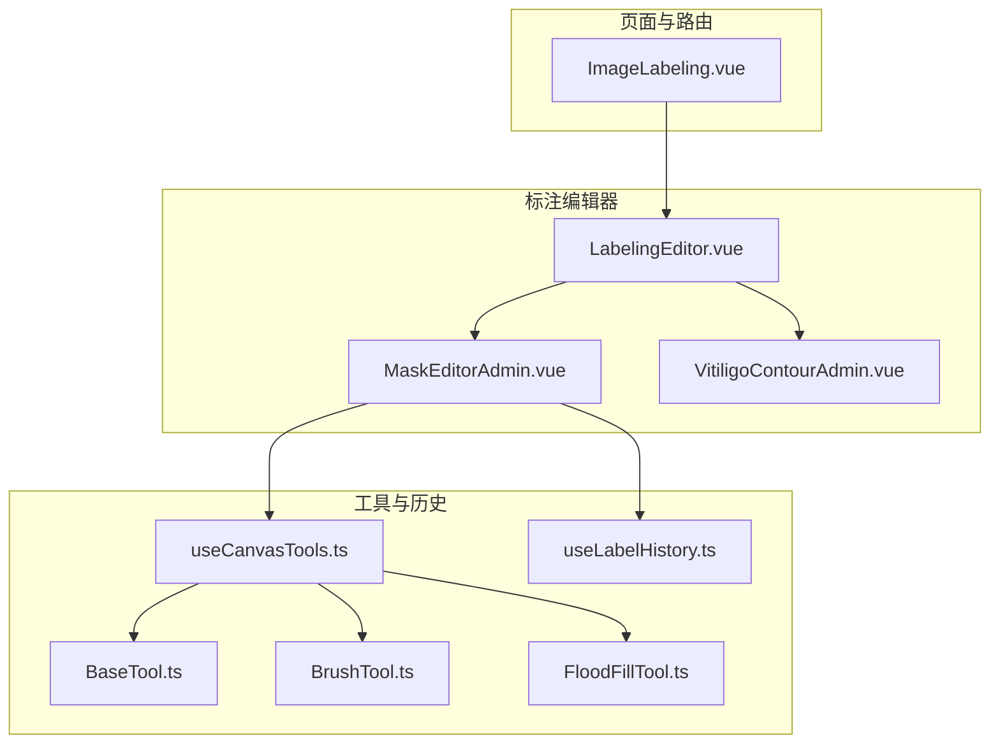
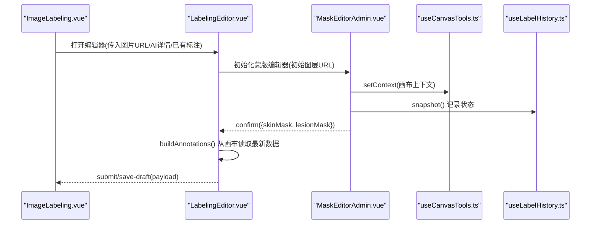
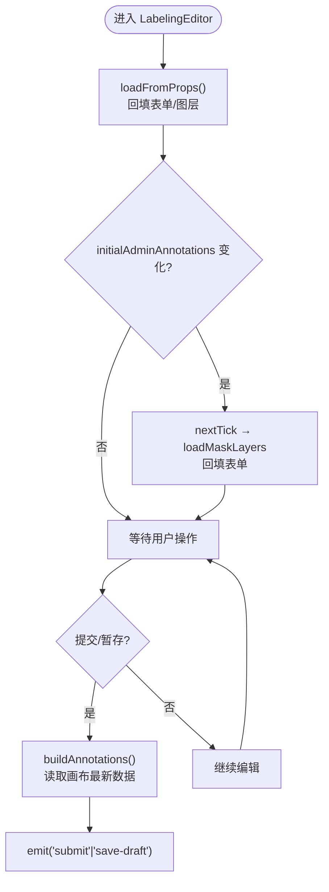
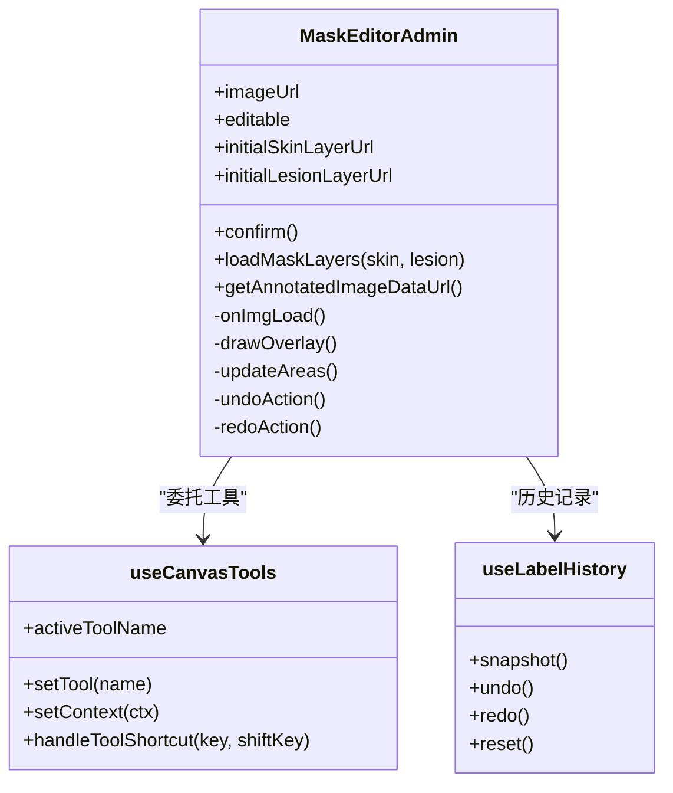
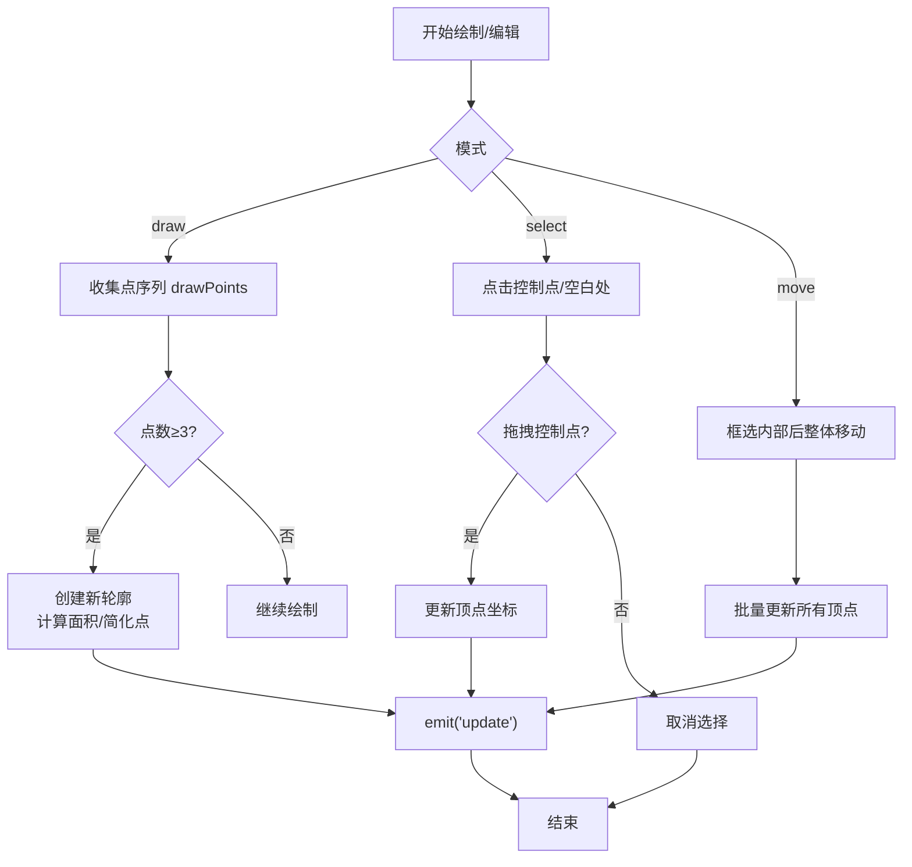
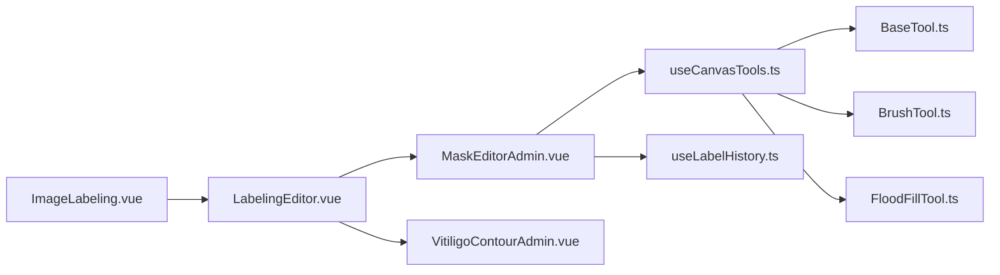

# 标注编辑器

<cite>
**本文引用的文件**
- [LabelingEditor.vue](file://web/admin/src/components/labeling/LabelingEditor.vue)
- [MaskEditorAdmin.vue](file://web/admin/src/components/labeling/MaskEditorAdmin.vue)
- [VitiligoContourAdmin.vue](file://web/admin/src/components/labeling/VitiligoContourAdmin.vue)
- [useCanvasTools.ts](file://web/admin/src/composables/useCanvasTools.ts)
- [useLabelHistory.ts](file://web/admin/src/composables/useLabelHistory.ts)
- [BaseTool.ts](file://web/admin/src/components/labeling/tools/BaseTool.ts)
- [BrushTool.ts](file://web/admin/src/components/labeling/tools/BrushTool.ts)
- [FloodFillTool.ts](file://web/admin/src/components/labeling/tools/FloodFillTool.ts)
- [ImageLabeling.vue](file://web/admin/src/views/ImageLabeling.vue)
</cite>

## 目录
1. [简介](#简介)
2. [项目结构](#项目结构)
3. [核心组件](#核心组件)
4. [架构总览](#架构总览)
5. [详细组件分析](#详细组件分析)
6. [依赖关系分析](#依赖关系分析)
7. [性能考量](#性能考量)
8. [故障排查指南](#故障排查指南)
9. [结论](#结论)
10. [附录](#附录)

## 简介
本技术文档围绕 Subskin 管理后台的图像标注编辑器，系统性阐述 LabelingEditor 主组件的架构设计、状态管理与数据流；深入解析 MaskEditorAdmin 蒙版编辑器的实现原理、图层管理机制与实时预览；解释 VitiligoContourAdmin 白癜风轮廓编辑器的算法实现与交互设计。同时覆盖画布工具集成、标注历史（撤销/重做）、配置选项、扩展点与调试技巧，帮助读者快速理解并高效使用或二次开发该标注系统。

## 项目结构
标注编辑器位于 admin 前端工程内，采用 Vue 3 + TypeScript 构建，核心由“主编排组件 + 画布编辑器 + 轮廓编辑器 + 工具集 + 历史管理”组成：
- 主编排：LabelingEditor.vue 负责表单、AI 预标注入口、提交/暂存、数据组装与子组件协调。
- 画布编辑器：MaskEditorAdmin.vue 提供多图层（皮肤层/白斑层）绘制、叠加预览、缩放平移、面积统计与确认导出。
- 轮廓编辑器：VitiligoContourAdmin.vue 基于 SVG 实现多边形轮廓绘制、控制点编辑、区域移动、面积计算与可视化。
- 工具集：BaseTool.ts 定义统一接口；BrushTool.ts、FloodFillTool.ts 等实现具体工具；useCanvasTools.ts 管理工具生命周期与快捷键。
- 历史管理：useLabelHistory.ts 提供基于 ImageData 快照的撤销/重做能力。
- 页面入口：ImageLabeling.vue 作为列表页与弹窗容器，负责加载数据、调用后端 API、触发 AI 预标注与提交。

图表来源
- [LabelingEditor.vue:1-719](file://web/admin/src/components/labeling/LabelingEditor.vue#L1-L719)
- [MaskEditorAdmin.vue:1-667](file://web/admin/src/components/labeling/MaskEditorAdmin.vue#L1-L667)
- [VitiligoContourAdmin.vue:1-749](file://web/admin/src/components/labeling/VitiligoContourAdmin.vue#L1-L749)
- [useCanvasTools.ts:1-127](file://web/admin/src/composables/useCanvasTools.ts#L1-L127)
- [useLabelHistory.ts:1-87](file://web/admin/src/composables/useLabelHistory.ts#L1-L87)
- [BaseTool.ts:1-72](file://web/admin/src/components/labeling/tools/BaseTool.ts#L1-L72)
- [BrushTool.ts:1-122](file://web/admin/src/components/labeling/tools/BrushTool.ts#L1-L122)
- [FloodFillTool.ts:1-265](file://web/admin/src/components/labeling/tools/FloodFillTool.ts#L1-L265)
- [ImageLabeling.vue:1-800](file://web/admin/src/views/ImageLabeling.vue#L1-L800)

章节来源
- [LabelingEditor.vue:1-719](file://web/admin/src/components/labeling/LabelingEditor.vue#L1-L719)
- [MaskEditorAdmin.vue:1-667](file://web/admin/src/components/labeling/MaskEditorAdmin.vue#L1-L667)
- [VitiligoContourAdmin.vue:1-749](file://web/admin/src/components/labeling/VitiligoContourAdmin.vue#L1-L749)
- [useCanvasTools.ts:1-127](file://web/admin/src/composables/useCanvasTools.ts#L1-L127)
- [useLabelHistory.ts:1-87](file://web/admin/src/composables/useLabelHistory.ts#L1-L87)
- [ImageLabeling.vue:1-800](file://web/admin/src/views/ImageLabeling.vue#L1-L800)

## 核心组件
- LabelingEditor：编排表单、AI 预标注、提交/暂存、数据组装；监听 initialAdminAnnotations 变化以恢复图层；暴露 applyAiMask 供父组件注入 AI 结果。
- MaskEditorAdmin：三层画布（皮肤层、白斑层、叠加层），支持画笔/橡皮擦/智能填充/套索/多边形工具；提供缩放平移、全屏、面积统计、撤销/重做、确认导出 PNG 数据 URL。
- VitiligoContourAdmin：SVG 叠加在图片上，支持选择/绘制/移动模式；控制点拖拽、增删点、整体移动；内置射线法判点、多边形面积计算、点简化；颜色区分 AI/人工标注。
- useCanvasTools：集中管理工具实例、激活/停用、键盘快捷键映射、指针事件转发。
- useLabelHistory：环形缓冲区保存 skin/lesion 的 ImageData 快照，支持 undo/redo/reset。

章节来源
- [LabelingEditor.vue:1-719](file://web/admin/src/components/labeling/LabelingEditor.vue#L1-L719)
- [MaskEditorAdmin.vue:1-667](file://web/admin/src/components/labeling/MaskEditorAdmin.vue#L1-L667)
- [VitiligoContourAdmin.vue:1-749](file://web/admin/src/components/labeling/VitiligoContourAdmin.vue#L1-L749)
- [useCanvasTools.ts:1-127](file://web/admin/src/composables/useCanvasTools.ts#L1-L127)
- [useLabelHistory.ts:1-87](file://web/admin/src/composables/useLabelHistory.ts#L1-L87)

## 架构总览
标注编辑器采用“编排-渲染-工具-历史”的分层架构：
- 编排层（LabelingEditor）：维护表单状态、AI 预标注流程、提交载荷构造、与父组件通信。
- 渲染层（MaskEditorAdmin/VitiligoContourAdmin）：分别处理像素级蒙版与矢量轮廓的绘制与交互。
- 工具层（useCanvasTools + BaseTool 及实现）：抽象工具接口，统一事件分发与快捷键。
- 历史层（useLabelHistory）：对画布像素进行快照，支撑撤销/重做。

图表来源
- [ImageLabeling.vue:464-608](file://web/admin/src/views/ImageLabeling.vue#L464-L608)
- [LabelingEditor.vue:288-368](file://web/admin/src/components/labeling/LabelingEditor.vue#L288-L368)
- [MaskEditorAdmin.vue:419-445](file://web/admin/src/components/labeling/MaskEditorAdmin.vue#L419-L445)
- [useCanvasTools.ts:26-51](file://web/admin/src/composables/useCanvasTools.ts#L26-L51)
- [useLabelHistory.ts:24-45](file://web/admin/src/composables/useLabelHistory.ts#L24-L45)

## 详细组件分析

### LabelingEditor 主组件
- 职责
  - 管理表单字段（部位、是否白癜风、分型、阶段、面积、VASI、脱色程度、备注、训练集标记）。
  - 监听 initialAdminAnnotations 变化，动态恢复皮肤层/白斑层到 MaskEditorAdmin。
  - 提供 AI 一键预标注入口，接收后端返回的像素蒙版并注入到画布。
  - 提交时从画布直接读取最新数据，构造 AdminAnnotationItem[] 与合成图，发出 submit/save-draft 事件。
  - 全局快捷键：Ctrl/Cmd+Z 撤销、Ctrl/Cmd+Y 重做、Esc 取消。
- 关键数据流
  - 初始化：loadFromProps → 设置 maskDataUrl/skinMaskDataUrl → nextTick 调用 loadMaskLayers。
  - 变更：watch(initialAdminAnnotations) → 重新加载图层并回填表单。
  - 提交：buildAnnotations → getLesionDataUrl/getSkinDataUrl → 生成 annotated_image → emit。
- 错误与边界
  - 无有效蒙版时仍返回至少一条 annotation，确保元数据持久化。
  - 异步 initialAdminAnnotations 通过 watch 保证时序正确。

图表来源
- [LabelingEditor.vue:145-261](file://web/admin/src/components/labeling/LabelingEditor.vue#L145-L261)
- [LabelingEditor.vue:288-368](file://web/admin/src/components/labeling/LabelingEditor.vue#L288-L368)
- [LabelingEditor.vue:392-438](file://web/admin/src/components/labeling/LabelingEditor.vue#L392-L438)

章节来源
- [LabelingEditor.vue:1-719](file://web/admin/src/components/labeling/LabelingEditor.vue#L1-L719)

### MaskEditorAdmin 蒙版编辑器
- 职责
  - 三层画布：skinCanvas（皮肤层）、lesionCanvas（白斑层）、overlayCanvas（叠加预览）。
  - 工具系统：通过 useCanvasTools 切换皮肤/白斑画笔、橡皮擦、智能填充、套索、多边形。
  - 交互：滚轮缩放、空格拖拽平移、全屏、适应窗口、实际大小。
  - 面积统计：实时计算皮肤/白斑/区域占比。
  - 历史：snapshot/undo/redo 基于 ImageData 快照。
  - 导出：confirm 返回 skinMaskDataUrl/lesionMaskDataUrl；getAnnotatedImageDataUrl 生成合成图。
- 关键实现
  - 坐标转换：clientToImage 将屏幕坐标转为自然图像坐标，考虑 baseFitScale 与 transform。
  - 叠加绘制：drawOverlay 按透明度合并两层。
  - 面积计算：countAlpha/countUnionAlpha 遍历像素 alpha 通道统计。
  - 图层加载：loadLayerFromDataUrl 异步加载 PNG data URL 到对应 canvas。
  - 外部注入：loadMaskLayers 支持运行时加载/替换图层。
- 快捷键
  - 工具切换：数字键 1-6、B/L/G/S/P/E。
  - 视图：R 适应、F 全屏、空格拖拽。
  - 撤销/重做：Ctrl/Cmd+Z/Y。

图表来源
- [MaskEditorAdmin.vue:1-667](file://web/admin/src/components/labeling/MaskEditorAdmin.vue#L1-L667)
- [useCanvasTools.ts:1-127](file://web/admin/src/composables/useCanvasTools.ts#L1-L127)
- [useLabelHistory.ts:1-87](file://web/admin/src/composables/useLabelHistory.ts#L1-L87)

章节来源
- [MaskEditorAdmin.vue:1-667](file://web/admin/src/components/labeling/MaskEditorAdmin.vue#L1-L667)

### VitiligoContourAdmin 白癜风轮廓编辑器
- 职责
  - 基于 SVG 在图片上绘制与管理多边形轮廓（支持 AI 预标注与人工绘制）。
  - 三种模式：select（选择/拖拽控制点）、draw（手绘新区域）、move（整体移动）。
  - 几何算法：射线法判断点是否在多边形内；多边形面积计算；点简化减少冗余点。
  - 视觉：AI 标注用冷色半透明，人工标注用饱和色；选中高亮发光效果。
  - 交互：滚轮缩放、空格拖拽平移、R 适应、0 实际大小、F 全屏。
- 关键实现
  - 坐标转换：toPixel/toNorm 在归一化坐标与原图像素间转换。
  - 绘制完成：finishInteraction 当 drawPoints≥3 时创建新轮廓，自动计算 area_percent。
  - 控制点编辑：addPoint/removePoint 插入/删除顶点；selectedPointIdx 跟踪当前点。
  - 移动：dragOrigins 记录原始顶点，拖动时整体偏移。
- 输出
  - update 事件回传本地 contours（包含 label、polygon、area_percent、source）。
  - confirm 事件用于最终确认。

图表来源
- [VitiligoContourAdmin.vue:321-476](file://web/admin/src/components/labeling/VitiligoContourAdmin.vue#L321-L476)

章节来源
- [VitiligoContourAdmin.vue:1-749](file://web/admin/src/components/labeling/VitiligoContourAdmin.vue#L1-L749)

### 画布工具集成与扩展点
- 工具接口：BaseTool 定义了 onActivate/onDeactivate、onPointerDown/Move/Up、onKeyDown、getCursor 等统一方法。
- 工具注册：useCanvasTools 中维护 toolInstances，支持新增工具类并注册到 ALL_TOOLS。
- 快捷键：handleToolShortcut 支持单字母键与数字键快速切换；Shift+点击在 FloodFill 中用于填充皮肤。
- 扩展建议
  - 新增工具：实现 BaseTool 接口，注册到 toolInstances，并在 ALL_TOOLS 声明可用性与快捷键。
  - 工具上下文：通过 ToolContext 访问 skin/lesion/overlay canvas、naturalSize、brushSize、transform、clientToImage、drawOverlay、snapshot、updateAreas。
  - 性能：避免频繁 getImageData/putImageData；仅在必要时 snapshot。

章节来源
- [BaseTool.ts:1-72](file://web/admin/src/components/labeling/tools/BaseTool.ts#L1-L72)
- [useCanvasTools.ts:1-127](file://web/admin/src/composables/useCanvasTools.ts#L1-L127)
- [BrushTool.ts:1-122](file://web/admin/src/components/labeling/tools/BrushTool.ts#L1-L122)
- [FloodFillTool.ts:1-265](file://web/admin/src/components/labeling/tools/FloodFillTool.ts#L1-L265)

### 标注历史管理（撤销/重做）
- 机制：每次操作后 snapshot 保存 skin/lesion 的 ImageData；撤销/重做通过索引移动并 putImageData 恢复。
- 限制：最大历史长度 HISTORY_MAX=50，超出则丢弃最旧快照；内存占用与图片尺寸相关。
- 使用：MaskEditorAdmin 在 clearLayer、工具结束、加载图层后调用 snapshot；undo/redo 回调 drawOverlay 与 updateAreas。

章节来源
- [useLabelHistory.ts:1-87](file://web/admin/src/composables/useLabelHistory.ts#L1-L87)
- [MaskEditorAdmin.vue:295-313](file://web/admin/src/components/labeling/MaskEditorAdmin.vue#L295-L313)

### 页面集成与数据流（ImageLabeling.vue）
- 列表与弹窗：展示待标注/已标注列表，点击打开全屏编辑器。
- 数据加载：先加载管理员标注与详情，再尝试加载用户/AI 预填充数据，最后显示编辑器，避免时序问题。
- AI 预标注：调用 /ai-pretrain，成功后通过 editorRef.applyAiMask 注入像素蒙版。
- 提交/暂存：构造 payload（含 annotations 与 annotated_image），发送 /label 接口；暂存带 draft_mode=true。
- 错误处理：网络/鉴权/服务异常均有提示与降级。

章节来源
- [ImageLabeling.vue:464-756](file://web/admin/src/views/ImageLabeling.vue#L464-L756)

## 依赖关系分析
- 组件耦合
  - LabelingEditor 强依赖 MaskEditorAdmin（ref 调用 loadMaskLayers、get*DataUrl）。
  - MaskEditorAdmin 依赖 useCanvasTools 与 useLabelHistory，工具之间松耦合（通过 BaseTool 接口）。
  - VitiligoContourAdmin 独立于画布工具，仅依赖 DOM 与几何算法。
- 外部依赖
  - 后端 API：/image-labels/*、/ai-pretrain、/user-annotations 等。
  - UI 库：Naive UI（列表页）、RemixIcon（图标）。
- 潜在循环依赖
  - 当前未见循环引用；工具通过 composable 解耦。

图表来源
- [ImageLabeling.vue:1-800](file://web/admin/src/views/ImageLabeling.vue#L1-L800)
- [LabelingEditor.vue:1-719](file://web/admin/src/components/labeling/LabelingEditor.vue#L1-L719)
- [MaskEditorAdmin.vue:1-667](file://web/admin/src/components/labeling/MaskEditorAdmin.vue#L1-L667)
- [VitiligoContourAdmin.vue:1-749](file://web/admin/src/components/labeling/VitiligoContourAdmin.vue#L1-L749)
- [useCanvasTools.ts:1-127](file://web/admin/src/composables/useCanvasTools.ts#L1-L127)
- [useLabelHistory.ts:1-87](file://web/admin/src/composables/useLabelHistory.ts#L1-L87)
- [BaseTool.ts:1-72](file://web/admin/src/components/labeling/tools/BaseTool.ts#L1-L72)
- [BrushTool.ts:1-122](file://web/admin/src/components/labeling/tools/BrushTool.ts#L1-L122)
- [FloodFillTool.ts:1-265](file://web/admin/src/components/labeling/tools/FloodFillTool.ts#L1-L265)

## 性能考量
- 画布像素操作
  - 智能填充使用迭代栈与 visited 数组，设置 MAX_ITERATIONS 防止大图像卡死。
  - 面积统计遍历像素 alpha 通道，建议在低分辨率或按需计算。
- 历史快照
  - ImageData 快照占用内存较大，限制 HISTORY_MAX=50；大图标注时注意内存峰值。
- 渲染优化
  - 使用 willReadFrequently 获取 CanvasRenderingContext2D，提升频繁读取性能。
  - 叠加绘制仅在必要时调用 drawOverlay，减少重绘。
- 网络与存储
  - 提交前检查 mask_data 大小，超过阈值给出警告；合成图作为额外 annotation 保存，注意体积。
- 交互体验
  - 缩放/平移基于 CSS transform，避免重排；ResizeObserver 监听容器变化，及时适配。

[本节为通用性能讨论，不直接分析具体文件]

## 故障排查指南
- 图片加载失败
  - 现象：MaskEditorAdmin 显示错误状态。
  - 处理：重试加载；检查网络与代理；查看 onImgError 分支。
- 图层未恢复
  - 现象：initialAdminAnnotations 变化后图层未显示。
  - 处理：确认 watch 触发；nextTick 后调用 loadMaskLayers；检查 data URL 有效性。
- 智能填充无效
  - 现象：点击无填充或填充不完整。
  - 处理：调整容差；确认 imageData 缓存成功；检查 MAX_ITERATIONS。
- 撤销/重做失效
  - 现象：按钮不可用或无效果。
  - 处理：确认 snapshot 被调用；检查 canUndo/canRedo；验证 ImageData 尺寸。
- 提交失败
  - 现象：后端报错或无响应。
  - 处理：检查 payload 结构；确认 mask_data 非空字符串；查看网络状态码与消息提示。

章节来源
- [MaskEditorAdmin.vue:325-357](file://web/admin/src/components/labeling/MaskEditorAdmin.vue#L325-L357)
- [FloodFillTool.ts:38-92](file://web/admin/src/components/labeling/tools/FloodFillTool.ts#L38-L92)
- [useLabelHistory.ts:24-57](file://web/admin/src/composables/useLabelHistory.ts#L24-L57)
- [ImageLabeling.vue:652-756](file://web/admin/src/views/ImageLabeling.vue#L652-L756)

## 结论
Subskin 标注编辑器通过清晰的组件分层与工具抽象，实现了高效的像素级蒙版编辑与矢量轮廓编辑，结合 AI 预标注与人工修订，形成完整的数据采集闭环。其撤销/重做、实时预览、缩放平移、面积统计等功能提升了标注效率与准确性。未来可进一步引入更强大的分割工具（如 GrabCut）、压缩策略与离线缓存，以应对更大规模与更高性能的标注需求。

[本节为总结性内容，不直接分析具体文件]

## 附录

### 编辑器配置选项
- 画布工具
  - 画笔尺寸：滑块调节 brushSize。
  - 智能填充容差：activeToolName === 'flood-fill' 时显示，范围 2-64。
  - 图层透明度：layerOpacity 控制叠加可见度。
- 视图控制
  - 缩放：滚轮、按钮、R 适应、0 实际大小、F 全屏。
  - 平移：空格+拖拽。
- 历史
  - 最大历史步数：HISTORY_MAX=50。
- 提交/暂存
  - 标注元数据：body_site、is_vitiligo、vitiligo_type、vitiligo_stage、area_percentage、vasi_score、depigmentation_level、notes、training_eligible。
  - 附加数据：annotations（含 mask_data/skin_mask_data）、annotated_image。

章节来源
- [MaskEditorAdmin.vue:23-37](file://web/admin/src/components/labeling/MaskEditorAdmin.vue#L23-L37)
- [MaskEditorAdmin.vue:242-293](file://web/admin/src/components/labeling/MaskEditorAdmin.vue#L242-L293)
- [useLabelHistory.ts:15-19](file://web/admin/src/composables/useLabelHistory.ts#L15-L19)
- [LabelingEditor.vue:77-115](file://web/admin/src/components/labeling/LabelingEditor.vue#L77-L115)
- [LabelingEditor.vue:336-368](file://web/admin/src/components/labeling/LabelingEditor.vue#L336-L368)

### 自定义扩展点
- 新增工具
  - 实现 BaseTool 接口，注册到 useCanvasTools 的 toolInstances 与 ALL_TOOLS。
  - 在 MaskEditorAdmin 中通过 setTool 切换；如需快捷键，在 handleToolShortcut 中添加映射。
- 扩展历史策略
  - 修改 HISTORY_MAX 或实现差异化快照策略（如仅关键帧快照）。
- 扩展视图
  - 在 MaskEditorAdmin/VitiligoContourAdmin 中添加自定义控件与事件处理。

章节来源
- [BaseTool.ts:34-52](file://web/admin/src/components/labeling/tools/BaseTool.ts#L34-L52)
- [useCanvasTools.ts:16-24](file://web/admin/src/composables/useCanvasTools.ts#L16-L24)
- [useCanvasTools.ts:53-79](file://web/admin/src/composables/useCanvasTools.ts#L53-L79)

### 调试技巧
- 控制台日志
  - LabelingEditor：buildAnnotations、loadFromProps、watch(initialAdminAnnotations)。
  - MaskEditorAdmin：onImgLoad、loadMaskLayers、FloodFill 填充统计。
  - ImageLabeling：openEditor 数据加载、handleAiPretrain、handleSaveDraft/handleEditorSubmit。
- 断点位置
  - 工具事件：onPointerDown/Move/Up。
  - 历史：snapshot/undo/redo。
  - 网络：request.post/get 前后。
- 常见问题定位
  - 图层不显示：检查 data URL 长度与 loadLayerFromDataUrl 执行。
  - 面积异常：确认 countAlpha/countUnionAlpha 像素遍历逻辑。
  - 提交失败：检查 payload 结构与后端校验。

章节来源
- [LabelingEditor.vue:193-261](file://web/admin/src/components/labeling/LabelingEditor.vue#L193-L261)
- [LabelingEditor.vue:288-368](file://web/admin/src/components/labeling/LabelingEditor.vue#L288-L368)
- [MaskEditorAdmin.vue:315-351](file://web/admin/src/components/labeling/MaskEditorAdmin.vue#L315-L351)
- [FloodFillTool.ts:117-182](file://web/admin/src/components/labeling/tools/FloodFillTool.ts#L117-L182)
- [ImageLabeling.vue:610-756](file://web/admin/src/views/ImageLabeling.vue#L610-L756)