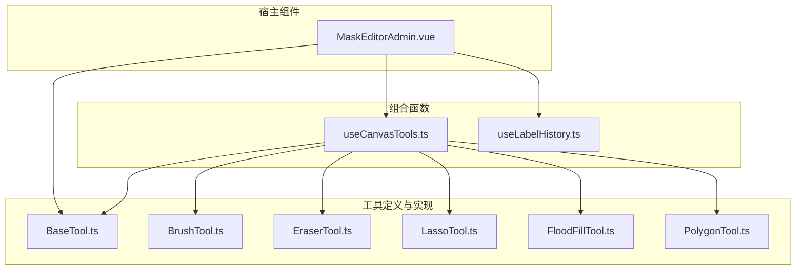
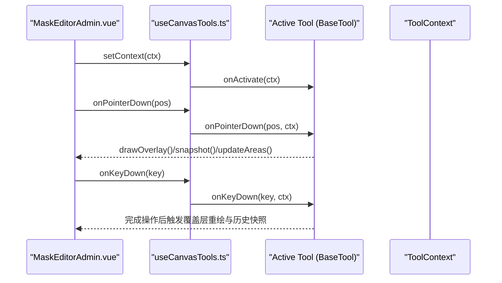
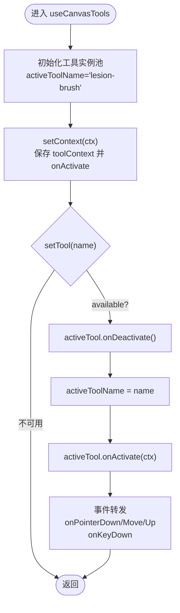
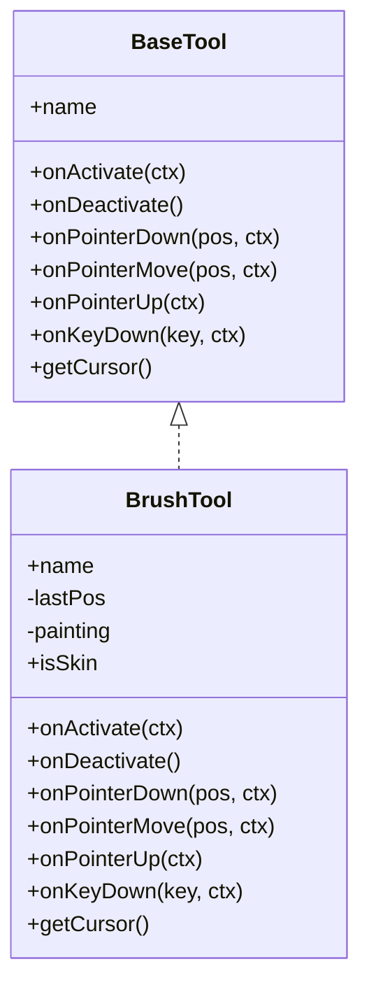
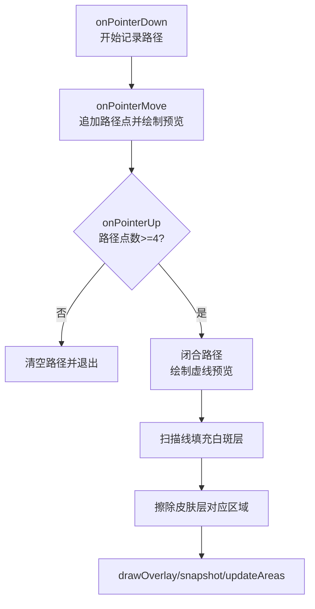
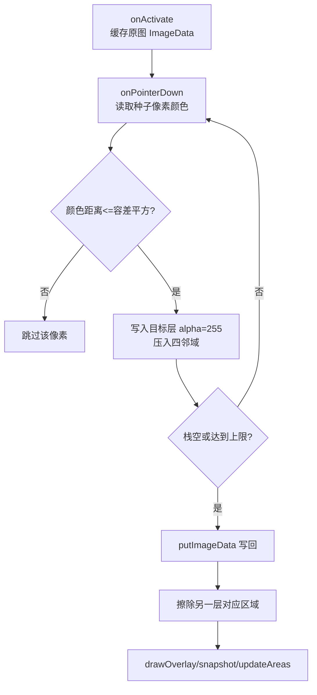
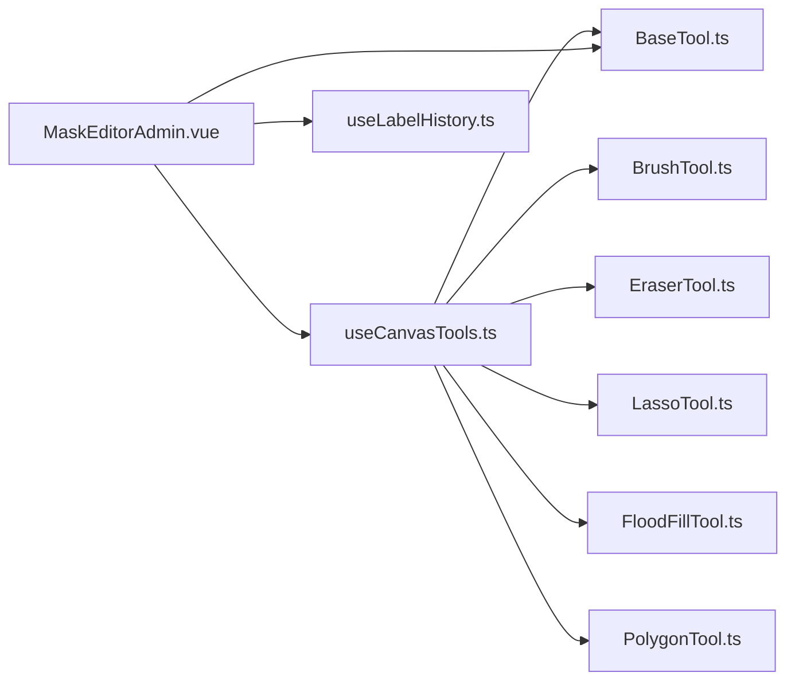

# 画布工具组合函数

<cite>
**本文引用的文件**   
- [useCanvasTools.ts](file://web/admin/src/composables/useCanvasTools.ts)
- [BaseTool.ts](file://web/admin/src/components/labeling/tools/BaseTool.ts)
- [BrushTool.ts](file://web/admin/src/components/labeling/tools/BrushTool.ts)
- [EraserTool.ts](file://web/admin/src/components/labeling/tools/EraserTool.ts)
- [LassoTool.ts](file://web/admin/src/components/labeling/tools/LassoTool.ts)
- [FloodFillTool.ts](file://web/admin/src/components/labeling/tools/FloodFillTool.ts)
- [PolygonTool.ts](file://web/admin/src/components/labeling/tools/PolygonTool.ts)
- [MaskEditorAdmin.vue](file://web/admin/src/components/labeling/MaskEditorAdmin.vue)
- [useLabelHistory.ts](file://web/admin/src/composables/useLabelHistory.ts)
</cite>

## 目录
1. [简介](#简介)
2. [项目结构](#项目结构)
3. [核心组件](#核心组件)
4. [架构总览](#架构总览)
5. [详细组件分析](#详细组件分析)
6. [依赖关系分析](#依赖关系分析)
7. [性能考量](#性能考量)
8. [故障排查指南](#故障排查指南)
9. [结论](#结论)
10. [附录：自定义工具开发指南与调试技巧](#附录自定义工具开发指南与调试技巧)

## 简介
本技术文档围绕 useCanvasTools 组合函数及其配套的 Canvas 工具集，系统性阐述其设计模式、工具注册机制、事件管理与状态流转；深入解析画笔、橡皮擦、选区（套索/多边形）与填充工具的算法实现；并给出工具状态管理、参数配置、性能优化与跨浏览器兼容性处理建议。同时提供自定义工具开发指南、工具链集成方法与调试技巧，帮助开发者快速扩展与维护标注能力。

## 项目结构
该功能位于 web/admin 子应用中，采用“组合函数 + 工具类 + 宿主组件”的分层组织方式：
- 组合函数 useCanvasTools：负责工具实例生命周期、激活/切换、快捷键映射与事件转发。
- 工具基类与定义 BaseTool：统一工具接口、上下文契约与工具元数据。
- 具体工具 BrushTool、EraserTool、LassoTool、PolygonTool、FloodFillTool：各自封装交互与绘制逻辑。
- 宿主组件 MaskEditorAdmin.vue：维护三图层（皮肤层、白斑层、叠加层）、坐标转换、缩放平移、撤销重做、区域面积统计等。
- 历史记录 useLabelHistory：基于 ImageData 的环形缓冲区，支持撤销/重做。

图表来源
- [MaskEditorAdmin.vue:1-120](file://web/admin/src/components/labeling/MaskEditorAdmin.vue#L1-L120)
- [useCanvasTools.ts:1-127](file://web/admin/src/composables/useCanvasTools.ts#L1-L127)
- [BaseTool.ts:1-72](file://web/admin/src/components/labeling/tools/BaseTool.ts#L1-L72)

章节来源
- [MaskEditorAdmin.vue:1-120](file://web/admin/src/components/labeling/MaskEditorAdmin.vue#L1-L120)
- [useCanvasTools.ts:1-127](file://web/admin/src/composables/useCanvasTools.ts#L1-L127)
- [BaseTool.ts:1-72](file://web/admin/src/components/labeling/tools/BaseTool.ts#L1-L72)

## 核心组件
- useCanvasTools：集中管理 activeToolName、activeTool、toolContext、可用工具列表；提供 setTool、setContext、handleToolShortcut、getFloodFillTool 以及指针/键盘事件转发方法。
- BaseTool：定义 ToolContext（三层 Canvas、自然尺寸、画笔大小、变换矩阵、坐标转换、绘制覆盖层、快照、面积更新）、ToolDef（名称、标签、图标、快捷键、光标、可用性）与 BaseTool 接口（激活/停用、指针/键盘事件、光标）。
- 工具实现：
  - BrushTool：圆形画笔，皮肤/白斑互斥涂抹，支持拖拽连续绘制。
  - EraserTool：同时在皮肤与白斑层擦除。
  - LassoTool：自由手绘闭合选区，自动填充白斑并擦除皮肤层。
  - PolygonTool：点击放置顶点，双击或 Enter 闭合填充，Backspace 删除顶点，Esc 取消。
  - FloodFillTool：基于原图像素的 4 连通泛洪填充，支持容差调节。
- MaskEditorAdmin.vue：构建 ToolContext、事件分发、坐标转换、缩放平移、全屏、撤销重做、区域面积统计、图层加载与导出。
- useLabelHistory：以 ImageData 为快照的环形历史栈，支持 undo/redo。

章节来源
- [useCanvasTools.ts:1-127](file://web/admin/src/composables/useCanvasTools.ts#L1-L127)
- [BaseTool.ts:1-72](file://web/admin/src/components/labeling/tools/BaseTool.ts#L1-L72)
- [BrushTool.ts:1-122](file://web/admin/src/components/labeling/tools/BrushTool.ts#L1-L122)
- [EraserTool.ts:1-92](file://web/admin/src/components/labeling/tools/EraserTool.ts#L1-L92)
- [LassoTool.ts:1-180](file://web/admin/src/components/labeling/tools/LassoTool.ts#L1-L180)
- [FloodFillTool.ts:1-265](file://web/admin/src/components/labeling/tools/FloodFillTool.ts#L1-L265)
- [PolygonTool.ts:1-196](file://web/admin/src/components/labeling/tools/PolygonTool.ts#L1-L196)
- [MaskEditorAdmin.vue:1-200](file://web/admin/src/components/labeling/MaskEditorAdmin.vue#L1-L200)
- [useLabelHistory.ts:1-87](file://web/admin/src/composables/useLabelHistory.ts#L1-L87)

## 架构总览
系统采用“宿主-组合函数-工具”的解耦架构：
- 宿主组件负责 UI、Canvas 资源、坐标系统与全局事件；通过 ToolContext 暴露给工具。
- 组合函数维护工具实例池与当前激活工具，屏蔽宿主对具体工具实现的感知。
- 工具仅关注自身交互与绘制，通过 ToolContext 访问 Canvas 与辅助方法。

图表来源
- [MaskEditorAdmin.vue:180-220](file://web/admin/src/components/labeling/MaskEditorAdmin.vue#L180-L220)
- [useCanvasTools.ts:26-127](file://web/admin/src/composables/useCanvasTools.ts#L26-L127)
- [BaseTool.ts:54-72](file://web/admin/src/components/labeling/tools/BaseTool.ts#L54-L72)

## 详细组件分析

### 工具注册与事件管理系统（useCanvasTools）
- 工具实例池：在模块级创建所有工具实例，避免重复构造开销。
- 激活/停用：切换工具时先调用 onDeactivate，再设置 activeToolName，最后 onActivate(newCtx)。
- 快捷键：支持字母键与数字键快速切换；Shift+L/B 快捷别名用于皮肤/白斑画笔。
- 事件转发：onPointerDown/Move/Up、onKeyDown 均委托给当前 activeTool。
- 特殊工具访问：getFloodFillTool 暴露泛洪工具实例，供宿主进行 Shift+Click 填充皮肤。

图表来源
- [useCanvasTools.ts:16-85](file://web/admin/src/composables/useCanvasTools.ts#L16-L85)
- [useCanvasTools.ts:86-127](file://web/admin/src/composables/useCanvasTools.ts#L86-L127)

章节来源
- [useCanvasTools.ts:1-127](file://web/admin/src/composables/useCanvasTools.ts#L1-L127)

### 画笔工具（BrushTool）
- 颜色与互斥：皮肤色与白斑色互斥，绘制目标层的同时反向擦除另一层，防止重叠计数。
- 绘制策略：使用 lineTo 连接轨迹点，并在终点绘制圆形笔触；lineCap/lineJoin 圆角平滑。
- 状态管理：painting 标记是否处于拖拽绘制中；lastPos 记录上一帧位置。
- 生命周期：onActivate/onDeactivate 重置状态；onPointerUp 提交历史快照并更新面积。

图表来源
- [BaseTool.ts:54-72](file://web/admin/src/components/labeling/tools/BaseTool.ts#L54-L72)
- [BrushTool.ts:45-122](file://web/admin/src/components/labeling/tools/BrushTool.ts#L45-L122)

章节来源
- [BrushTool.ts:1-122](file://web/admin/src/components/labeling/tools/BrushTool.ts#L1-L122)

### 橡皮擦工具（EraserTool）
- 双向擦除：在同一操作中同时擦除皮肤层与白斑层，确保一致性。
- 绘制策略：同画笔，但使用 destination-out 混合模式透明化像素。
- 状态与生命周期：与画笔一致，释放时提交历史快照并更新面积。

章节来源
- [EraserTool.ts:1-92](file://web/admin/src/components/labeling/tools/EraserTool.ts#L1-L92)

### 套索选择工具（LassoTool）
- 交互流程：按住拖拽记录路径，松开自动闭合；绘制过程中在叠加层显示虚线预览。
- 填充算法：扫描线填充（Scanline Fill），构建边表并按行计算交点区间，批量写入 alpha。
- 互斥填充：填充白斑层的同时擦除皮肤层对应区域。
- 键盘支持：Escape 取消绘制。

图表来源
- [LassoTool.ts:33-70](file://web/admin/src/components/labeling/tools/LassoTool.ts#L33-L70)
- [LassoTool.ts:99-166](file://web/admin/src/components/labeling/tools/LassoTool.ts#L99-L166)

章节来源
- [LassoTool.ts:1-180](file://web/admin/src/components/labeling/tools/LassoTool.ts#L1-L180)

### 多边形选择工具（PolygonTool）
- 顶点管理：点击添加顶点，双击或 Enter 闭合；Backspace 删除最后一个顶点；Esc 清空。
- 预览绘制：实时绘制边线与顶点圆点，便于确认形状。
- 填充算法：复用扫描线填充，闭合后填充白斑层并擦除皮肤层。

章节来源
- [PolygonTool.ts:1-196](file://web/admin/src/components/labeling/tools/PolygonTool.ts#L1-L196)

### 智能填充工具（FloodFillTool）
- 原图采样：激活时从 DOM img 元素拷贝到临时 Canvas，缓存 ImageData 用于颜色采样。
- 4 连通泛洪：基于种子像素颜色距离阈值（tolerance）进行迭代式泛洪，使用显式栈避免递归溢出。
- 互斥填充：填充白斑层的同时擦除皮肤层；Shift+Click 可填充皮肤层（由宿主控制）。
- 容差调节：键盘 [ ] 调整容差，UI 滑块也可动态修改。
- 安全阀：最大迭代次数限制，防止超大图像导致卡顿。

图表来源
- [FloodFillTool.ts:28-65](file://web/admin/src/components/labeling/tools/FloodFillTool.ts#L28-L65)
- [FloodFillTool.ts:117-182](file://web/admin/src/components/labeling/tools/FloodFillTool.ts#L117-L182)
- [FloodFillTool.ts:184-240](file://web/admin/src/components/labeling/tools/FloodFillTool.ts#L184-L240)

章节来源
- [FloodFillTool.ts:1-265](file://web/admin/src/components/labeling/tools/FloodFillTool.ts#L1-L265)

### 宿主组件（MaskEditorAdmin.vue）
- ToolContext 构建：封装 skinCanvas、lesionCanvas、overlayCanvas、naturalSize、brushSize、transform、clientToImage、drawOverlay、snapshot、updateAreas。
- 坐标转换：clientToImage 将屏幕坐标转换为自然图像坐标，考虑 baseFitScale 与 transform。
- 覆盖层合成：按透明度叠加皮肤层与白斑层至 overlayCanvas。
- 面积统计：分别统计皮肤、白斑及并集区域的像素占比。
- 撤销/重做：通过 useLabelHistory 对 ImageData 快照进行环形缓冲管理。
- 事件分发：指针事件与键盘事件统一转发到 activeTool。
- 缩放平移：鼠标滚轮缩放、空格拖拽平移、R 适应窗口、F 全屏。

章节来源
- [MaskEditorAdmin.vue:1-200](file://web/admin/src/components/labeling/MaskEditorAdmin.vue#L1-L200)
- [MaskEditorAdmin.vue:200-400](file://web/admin/src/components/labeling/MaskEditorAdmin.vue#L200-L400)
- [MaskEditorAdmin.vue:400-667](file://web/admin/src/components/labeling/MaskEditorAdmin.vue#L400-L667)
- [useLabelHistory.ts:1-87](file://web/admin/src/composables/useLabelHistory.ts#L1-L87)

## 依赖关系分析
- 组合函数依赖工具定义与实现，但不耦合具体宿主；宿主通过 ToolContext 与工具通信。
- 工具之间无直接依赖，均通过 ToolContext 访问 Canvas 与辅助方法。
- 宿主依赖 useLabelHistory 提供撤销/重做能力。
- 工具元数据 ALL_TOOLS 集中管理，便于 UI 渲染与快捷键映射。

图表来源
- [useCanvasTools.ts:1-25](file://web/admin/src/composables/useCanvasTools.ts#L1-L25)
- [BaseTool.ts:44-52](file://web/admin/src/components/labeling/tools/BaseTool.ts#L44-L52)
- [MaskEditorAdmin.vue:1-25](file://web/admin/src/components/labeling/MaskEditorAdmin.vue#L1-L25)

章节来源
- [useCanvasTools.ts:1-25](file://web/admin/src/composables/useCanvasTools.ts#L1-L25)
- [BaseTool.ts:44-52](file://web/admin/src/components/labeling/tools/BaseTool.ts#L44-L52)
- [MaskEditorAdmin.vue:1-25](file://web/admin/src/components/labeling/MaskEditorAdmin.vue#L1-L25)

## 性能考量
- Canvas 上下文优化：使用 willReadFrequently 选项减少频繁读像素的性能损耗。
- 绘制批量化：
  - 画笔/橡皮擦使用 lineTo 连接轨迹，减少多次 beginPath/stroke 开销。
  - 泛洪填充使用显式栈与 Uint8Array visited，避免递归与重复访问。
  - 扫描线填充一次性 putImageData，降低逐像素操作开销。
- 内存与历史：
  - 历史快照使用 ImageData，限制最大长度（如 50）避免内存膨胀。
  - 泛洪填充设置最大迭代次数，防止超大图像卡死。
- 渲染频率：
  - 仅在必要时机调用 drawOverlay/snapshot/updateAreas，避免每帧重绘。
  - 缩放/平移使用 CSS transform，减少 Canvas 重绘。
- 跨浏览器兼容：
  - PointerEvent 与 setPointerCapture 提升移动端体验。
  - 使用 toDataURL('image/png') 导出 PNG，注意某些环境下的同源限制。

[本节为通用性能指导，不直接分析具体文件]

## 故障排查指南
- 图片未加载或尺寸异常：
  - 检查 naturalSize 是否为 0，确保 onImgLoad 正确设置宽高并初始化 Canvas。
  - 参考：[MaskEditorAdmin.vue:326-352](file://web/admin/src/components/labeling/MaskEditorAdmin.vue#L326-L352)
- 坐标转换失败：
  - clientToImage 需要有效的 rect 与 totalScale，确保 baseFitScale 与 transform 已初始化。
  - 参考：[MaskEditorAdmin.vue:91-104](file://web/admin/src/components/labeling/MaskEditorAdmin.vue#L91-L104)
- 工具未响应事件：
  - 确认 toolContext 已设置且 activeTool 非空；检查 setContext 调用时机。
  - 参考：[useCanvasTools.ts:48-51](file://web/admin/src/composables/useCanvasTools.ts#L48-L51)
- 泛洪填充无效：
  - 检查 imageCache 是否成功缓存原图 ImageData；确认 tolerance 合理。
  - 参考：[FloodFillTool.ts:38-65](file://web/admin/src/components/labeling/tools/FloodFillTool.ts#L38-L65)
- 撤销/重做无效：
  - 确认 snapshot 被调用且历史栈未越界；检查 applySnapshot 是否正确写回 ImageData。
  - 参考：[useLabelHistory.ts:24-71](file://web/admin/src/composables/useLabelHistory.ts#L24-L71)

章节来源
- [MaskEditorAdmin.vue:91-104](file://web/admin/src/components/labeling/MaskEditorAdmin.vue#L91-L104)
- [MaskEditorAdmin.vue:326-352](file://web/admin/src/components/labeling/MaskEditorAdmin.vue#L326-L352)
- [useCanvasTools.ts:48-51](file://web/admin/src/composables/useCanvasTools.ts#L48-L51)
- [FloodFillTool.ts:38-65](file://web/admin/src/components/labeling/tools/FloodFillTool.ts#L38-L65)
- [useLabelHistory.ts:24-71](file://web/admin/src/composables/useLabelHistory.ts#L24-L71)

## 结论
useCanvasTools 与配套工具集实现了高内聚、低耦合的 Canvas 标注框架。通过统一的 ToolContext 与 BaseTool 接口，宿主组件与工具实现完全解耦；事件管理与状态切换清晰可控；多种工具算法兼顾易用性与性能。结合 useLabelHistory 的撤销/重做能力，整体满足复杂标注场景的需求。

[本节为总结性内容，不直接分析具体文件]

## 附录：自定义工具开发指南与调试技巧

### 自定义工具开发步骤
- 新建工具类实现 BaseTool 接口：
  - 实现 name、onActivate、onDeactivate、onPointerDown/Move/Up、onKeyDown、getCursor。
  - 通过 ToolContext 访问 skinCanvas、lesionCanvas、overlayCanvas、naturalSize、brushSize、transform、clientToImage、drawOverlay、snapshot、updateAreas。
  - 参考：[BaseTool.ts:54-72](file://web/admin/src/components/labeling/tools/BaseTool.ts#L54-L72)
- 注册新工具：
  - 在 useCanvasTools 的工具实例池中新增实例映射。
  - 在 ALL_TOOLS 中添加元数据（名称、标签、图标、快捷键、光标、可用性）。
  - 参考：[useCanvasTools.ts:16-24](file://web/admin/src/composables/useCanvasTools.ts#L16-L24)、[BaseTool.ts:44-52](file://web/admin/src/components/labeling/tools/BaseTool.ts#L44-L52)
- 宿主集成：
  - 无需额外改动，事件会自动转发到 activeTool。
  - 如需特殊交互（如 Shift+Click），可通过 getFloodFillTool 暴露实例进行宿主侧控制。
  - 参考：[useCanvasTools.ts:81-85](file://web/admin/src/composables/useCanvasTools.ts#L81-L85)

### 参数配置与状态管理
- 工具内部状态：
  - 使用私有字段（如 painting、path、vertices、tolerance）管理交互状态。
  - 在 onActivate/onDeactivate 中初始化/清理状态。
- 用户可调参数：
  - 画笔大小由宿主 brushSize 提供；泛洪容差由工具内部 tolerance 管理，并通过 UI 滑块或键盘调整。
  - 参考：[FloodFillTool.ts:24-24](file://web/admin/src/components/labeling/tools/FloodFillTool.ts#L24-L24)、[MaskEditorAdmin.vue:27-36](file://web/admin/src/components/labeling/MaskEditorAdmin.vue#L27-L36)

### 性能优化建议
- 减少不必要的 Canvas 读写：
  - 仅在关键节点调用 drawOverlay/snapshot/updateAreas。
  - 使用 willReadFrequently 优化上下文。
- 算法优化：
  - 泛洪填充使用显式栈与 visited 数组，避免重复访问。
  - 扫描线填充批量写入像素，减少 putImageData 次数。
- 内存管理：
  - 限制历史快照数量，及时释放不再使用的 ImageData。
  - 大图像处理时增加安全阈值（如 MAX_ITERATIONS）。

### 跨浏览器兼容性处理
- PointerEvent：
  - 使用 setPointerCapture/releasePointerCapture 提升移动端手势体验。
  - 参考：[MaskEditorAdmin.vue:182-220](file://web/admin/src/components/labeling/MaskEditorAdmin.vue#L182-L220)
- 导出与读取：
  - toDataURL('image/png') 在部分环境下可能受限，需捕获异常并提供降级方案。
  - 参考：[MaskEditorAdmin.vue:434-437](file://web/admin/src/components/labeling/MaskEditorAdmin.vue#L434-L437)

### 调试技巧
- 控制台日志：
  - 在关键路径打印日志（如泛洪填充迭代次数、容差变化）。
  - 参考：[FloodFillTool.ts:181-182](file://web/admin/src/components/labeling/tools/FloodFillTool.ts#L181-L182)
- 可视化预览：
  - 在叠加层绘制临时路径/顶点，便于观察交互过程。
  - 参考：[LassoTool.ts:72-93](file://web/admin/src/components/labeling/tools/LassoTool.ts#L72-L93)、[PolygonTool.ts:99-127](file://web/admin/src/components/labeling/tools/PolygonTool.ts#L99-L127)
- 单元测试与边界测试：
  - 针对大图像、极端坐标、空 Canvas 等边界条件进行测试。
  - 验证撤销/重做历史栈的正确性与内存占用。

章节来源
- [BaseTool.ts:54-72](file://web/admin/src/components/labeling/tools/BaseTool.ts#L54-L72)
- [useCanvasTools.ts:16-24](file://web/admin/src/composables/useCanvasTools.ts#L16-L24)
- [BaseTool.ts:44-52](file://web/admin/src/components/labeling/tools/BaseTool.ts#L44-L52)
- [useCanvasTools.ts:81-85](file://web/admin/src/composables/useCanvasTools.ts#L81-L85)
- [FloodFillTool.ts:24-24](file://web/admin/src/components/labeling/tools/FloodFillTool.ts#L24-L24)
- [MaskEditorAdmin.vue:27-36](file://web/admin/src/components/labeling/MaskEditorAdmin.vue#L27-L36)
- [MaskEditorAdmin.vue:182-220](file://web/admin/src/components/labeling/MaskEditorAdmin.vue#L182-L220)
- [MaskEditorAdmin.vue:434-437](file://web/admin/src/components/labeling/MaskEditorAdmin.vue#L434-L437)
- [FloodFillTool.ts:181-182](file://web/admin/src/components/labeling/tools/FloodFillTool.ts#L181-L182)
- [LassoTool.ts:72-93](file://web/admin/src/components/labeling/tools/LassoTool.ts#L72-L93)
- [PolygonTool.ts:99-127](file://web/admin/src/components/labeling/tools/PolygonTool.ts#L99-L127)