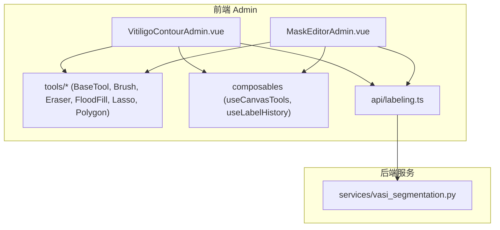
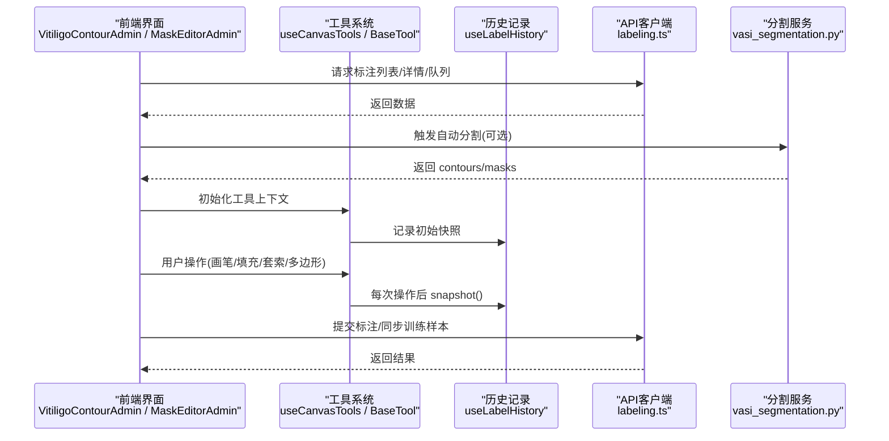
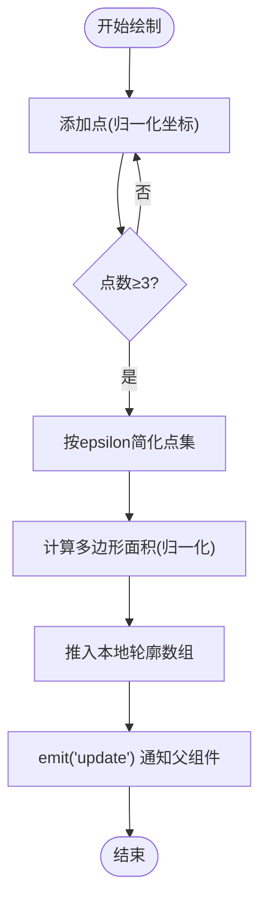
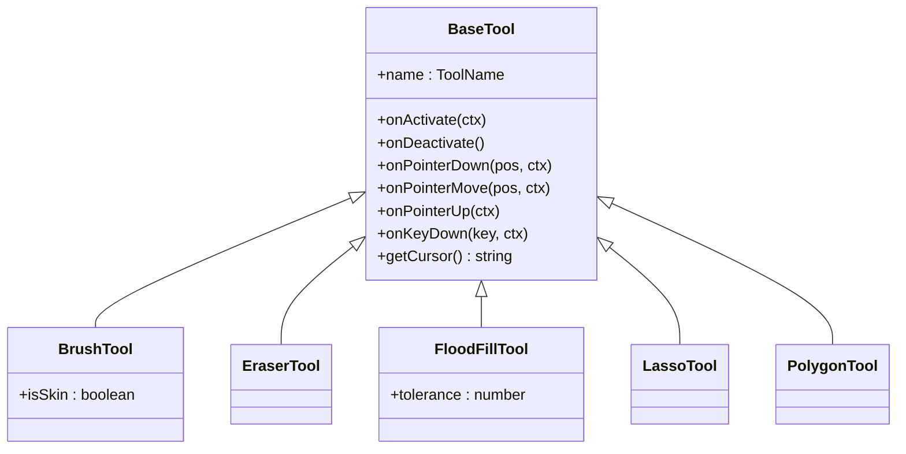
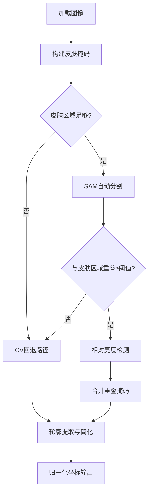
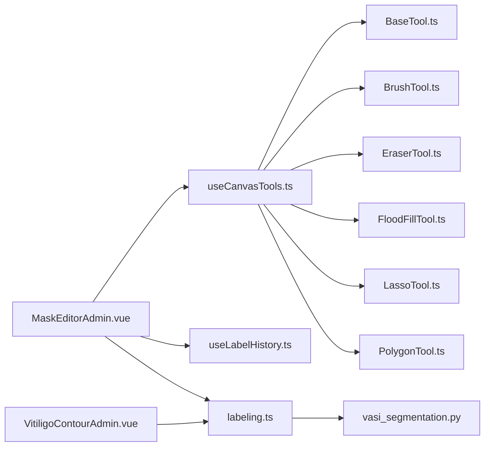

# 白癜风轮廓编辑器

<cite>
**本文引用的文件**   
- [VitiligoContourAdmin.vue](file://web/admin/src/components/labeling/VitiligoContourAdmin.vue)
- [MaskEditorAdmin.vue](file://web/admin/src/components/labeling/MaskEditorAdmin.vue)
- [BaseTool.ts](file://web/admin/src/components/labeling/tools/BaseTool.ts)
- [useCanvasTools.ts](file://web/admin/src/composables/useCanvasTools.ts)
- [PolygonTool.ts](file://web/admin/src/components/labeling/tools/PolygonTool.ts)
- [LassoTool.ts](file://web/admin/src/components/labeling/tools/LassoTool.ts)
- [BrushTool.ts](file://web/admin/src/components/labeling/tools/BrushTool.ts)
- [FloodFillTool.ts](file://web/admin/src/components/labeling/tools/FloodFillTool.ts)
- [EraserTool.ts](file://web/admin/src/components/labeling/tools/EraserTool.ts)
- [useLabelHistory.ts](file://web/admin/src/composables/useLabelHistory.ts)
- [labeling.ts](file://web/admin/src/api/labeling.ts)
- [vasi_segmentation.py](file://web/backend/services/vasi_segmentation.py)
</cite>

## 目录
1. [简介](#简介)
2. [项目结构](#项目结构)
3. [核心组件](#核心组件)
4. [架构总览](#架构总览)
5. [详细组件分析](#详细组件分析)
6. [依赖关系分析](#依赖关系分析)
7. [性能考量](#性能考量)
8. [故障排查指南](#故障排查指南)
9. [结论](#结论)
10. [附录](#附录)

## 简介
本技术文档围绕 VitiligoContourAdmin（白癜风轮廓编辑器）展开，系统阐述前端轮廓编辑与标注能力、后端自动分割算法及前后端数据交互。重点覆盖：
- 轮廓检测与边缘识别：基于 SAM 的自动分割与皮肤区域约束、多阶段过滤与轮廓提取。
- 交互式轮廓编辑：SVG 多边形绘制、控制点拖拽、整体平移、缩放与全屏。
- 工具体系：画笔、橡皮擦、智能填充、套索、多边形选择等可插拔工具。
- 数据格式与坐标系统：归一化坐标 (0-1)、像素坐标转换、面积计算与百分比统计。
- 实时反馈与撤销重做：历史快照、状态回滚、叠加层渲染。
- 质量评估与批量处理：API 接口、训练样本同步、工作会话管理。
- 性能调优：采样简化、迭代上限、内存与渲染优化建议。

## 项目结构
本项目采用前后端分离架构：
- 前端 admin 应用（Vue 3 + TypeScript）提供标注与编辑界面，包含轮廓编辑器与掩码编辑器。
- 后端服务（Python）提供图像分割、轮廓提取、数据导出与训练样本同步等能力。

**图表来源** 
- [VitiligoContourAdmin.vue](file://web/admin/src/components/labeling/VitiligoContourAdmin.vue)
- [MaskEditorAdmin.vue](file://web/admin/src/components/labeling/MaskEditorAdmin.vue)
- [BaseTool.ts](file://web/admin/src/components/labeling/tools/BaseTool.ts)
- [useCanvasTools.ts](file://web/admin/src/composables/useCanvasTools.ts)
- [useLabelHistory.ts](file://web/admin/src/composables/useLabelHistory.ts)
- [labeling.ts](file://web/admin/src/api/labeling.ts)
- [vasi_segmentation.py](file://web/backend/services/vasi_segmentation.py)

**章节来源**
- [VitiligoContourAdmin.vue](file://web/admin/src/components/labeling/VitiligoContourAdmin.vue)
- [MaskEditorAdmin.vue](file://web/admin/src/components/labeling/MaskEditorAdmin.vue)
- [labeling.ts](file://web/admin/src/api/labeling.ts)
- [vasi_segmentation.py](file://web/backend/services/vasi_segmentation.py)

## 核心组件
- 轮廓编辑器（SVG）：支持手绘闭合路径、控制点编辑、整体移动、缩放平移、全屏查看、面积统计与动画描边。
- 掩码编辑器（Canvas）：多图层（皮肤/白斑）叠加、多种工具（画笔、橡皮擦、智能填充、套索、多边形）、撤销重做、区域面积统计。
- 工具系统：统一 BaseTool 接口，通过 useCanvasTools 管理激活工具、上下文与快捷键切换。
- 历史记录：基于环缓冲的 ImageData 快照，支持撤销/重做与重置。
- API 客户端：封装标注列表、详情、队列、训练面板与会话管理等接口。

**章节来源**
- [VitiligoContourAdmin.vue](file://web/admin/src/components/labeling/VitiligoContourAdmin.vue)
- [MaskEditorAdmin.vue](file://web/admin/src/components/labeling/MaskEditorAdmin.vue)
- [BaseTool.ts](file://web/admin/src/components/labeling/tools/BaseTool.ts)
- [useCanvasTools.ts](file://web/admin/src/composables/useCanvasTools.ts)
- [useLabelHistory.ts](file://web/admin/src/composables/useLabelHistory.ts)
- [labeling.ts](file://web/admin/src/api/labeling.ts)

## 架构总览
前端以“视图-工具-历史”三层组织，后端以“分割服务-数据校验-导出”为主线。关键流程如下：
- 自动分割：后端调用 SAM/nnUNet/VLM 引导策略生成 mask，转换为归一化多边形并返回给前端。
- 人工编辑：前端 SVG/Canvas 工具对轮廓或掩码进行精细化调整，实时更新面积与可视化。
- 提交与同步：前端通过 labeling.ts 调用后端接口，完成标注提交、队列管理与训练样本同步。

**图表来源** 
- [VitiligoContourAdmin.vue](file://web/admin/src/components/labeling/VitiligoContourAdmin.vue)
- [MaskEditorAdmin.vue](file://web/admin/src/components/labeling/MaskEditorAdmin.vue)
- [useCanvasTools.ts](file://web/admin/src/composables/useCanvasTools.ts)
- [useLabelHistory.ts](file://web/admin/src/composables/useLabelHistory.ts)
- [labeling.ts](file://web/admin/src/api/labeling.ts)
- [vasi_segmentation.py](file://web/backend/services/vasi_segmentation.py)

## 详细组件分析

### 轮廓编辑器（SVG）
- 功能要点
  - 坐标系统：内部使用归一化坐标 (0-1)，提供 toPixel/toNorm 转换；显示尺寸由 baseFitScale 与 transform.scale 共同决定。
  - 绘制模式：select/draw/move 三种模式；draw 模式下点击添加点，至少 3 点闭合；move 模式整体平移轮廓。
  - 平滑与简化：绘制完成后按 epsilon 阈值简化点集，减少冗余顶点。
  - 面积计算：多边形面积公式计算 area_percent，并在右侧面板实时汇总。
  - 交互体验：滚轮缩放（锚点为光标位置）、空格+拖拽平移、R 适应窗口、0 实际大小、F 全屏。
  - 视觉反馈：AI 预标注用蓝色半透明，管理员标注用饱和色；选中时加发光滤镜与虚线动画。

**图表来源** 
- [VitiligoContourAdmin.vue](file://web/admin/src/components/labeling/VitiligoContourAdmin.vue)

**章节来源**
- [VitiligoContourAdmin.vue](file://web/admin/src/components/labeling/VitiligoContourAdmin.vue)

### 掩码编辑器（Canvas）与工具系统
- 工具定义与生命周期
  - BaseTool 定义统一接口：onActivate/onDeactivate、onPointerDown/Move/Up、onKeyDown、getCursor。
  - ALL_TOOLS 声明可用工具与快捷键映射；useCanvasTools 负责工具实例管理、上下文注入与快捷键切换。
- 具体工具实现
  - BrushTool：皮肤/白斑画笔，互斥涂抹（在目标层涂色同时在对立层擦除），支持可变笔刷大小。
  - EraserTool：同时擦除皮肤与白斑层。
  - FloodFillTool：基于原图像素颜色的 4-连通域填充，支持容差调节（键盘/滑块）。
  - LassoTool：自由手绘闭合选区，扫描线填充，释放后自动闭合。
  - PolygonTool：点击放置顶点，双击/Enter 闭合，Backspace 删除顶点，Shift+Enter 作为皮肤填充。
- 历史与统计
  - useLabelHistory 维护环缓冲快照（ImageData），支持 undo/redo/reset。
  - 面积统计：分别统计皮肤层、白斑层与联合区域的像素占比，实时显示。

**图表来源** 
- [BaseTool.ts](file://web/admin/src/components/labeling/tools/BaseTool.ts)
- [BrushTool.ts](file://web/admin/src/components/labeling/tools/BrushTool.ts)
- [EraserTool.ts](file://web/admin/src/components/labeling/tools/EraserTool.ts)
- [FloodFillTool.ts](file://web/admin/src/components/labeling/tools/FloodFillTool.ts)
- [LassoTool.ts](file://web/admin/src/components/labeling/tools/LassoTool.ts)
- [PolygonTool.ts](file://web/admin/src/components/labeling/tools/PolygonTool.ts)

**章节来源**
- [MaskEditorAdmin.vue](file://web/admin/src/components/labeling/MaskEditorAdmin.vue)
- [BaseTool.ts](file://web/admin/src/components/labeling/tools/BaseTool.ts)
- [useCanvasTools.ts](file://web/admin/src/composables/useCanvasTools.ts)
- [BrushTool.ts](file://web/admin/src/components/labeling/tools/BrushTool.ts)
- [EraserTool.ts](file://web/admin/src/components/labeling/tools/EraserTool.ts)
- [FloodFillTool.ts](file://web/admin/src/components/labeling/tools/FloodFillTool.ts)
- [LassoTool.ts](file://web/admin/src/components/labeling/tools/LassoTool.ts)
- [PolygonTool.ts](file://web/admin/src/components/labeling/tools/PolygonTool.ts)
- [useLabelHistory.ts](file://web/admin/src/composables/useLabelHistory.ts)

### 坐标系统与精度控制
- 坐标转换
  - 归一化坐标 (0-1) ↔ 像素坐标：toPixel/toNorm 保证在不同缩放下的一致性。
  - 显示尺寸：baseFitScale 用于自适应容器，transform.scale 用于用户缩放。
- 精度控制
  - 轮廓简化：simplifyPoints 使用距离阈值 epsilon 降低顶点密度。
  - 填充迭代上限：FloodFillTool 设置 MAX_ITERATIONS 防止超大图像卡死。
  - 多边形填充：扫描线算法确保复杂形状的正确填充。

**章节来源**
- [VitiligoContourAdmin.vue](file://web/admin/src/components/labeling/VitiligoContourAdmin.vue)
- [FloodFillTool.ts](file://web/admin/src/components/labeling/tools/FloodFillTool.ts)
- [LassoTool.ts](file://web/admin/src/components/labeling/tools/LassoTool.ts)
- [PolygonTool.ts](file://web/admin/src/components/labeling/tools/PolygonTool.ts)

### 撤销重做机制
- 快照策略：每次有效操作后调用 snapshot() 保存 skin/lesion 层的 ImageData。
- 环缓冲：HISTORY_MAX=50，超出则丢弃最早快照；支持 canUndo/canRedo 状态。
- 应用快照：undo/redo 时 putImageData 恢复图层并重绘 overlay。

**章节来源**
- [useLabelHistory.ts](file://web/admin/src/composables/useLabelHistory.ts)
- [MaskEditorAdmin.vue](file://web/admin/src/components/labeling/MaskEditorAdmin.vue)

### 轮廓数据格式与坐标系统
- 数据结构
  - AdminContourRegion：{ label, polygon: [[x,y],...], area_percent?, source? }
  - 归一化坐标范围 0-1，便于跨分辨率一致性与后端处理。
- 坐标系统
  - 前端：naturalSize 存储原始像素尺寸，所有交互坐标经 clientToImage 或 getPointerPos 转换。
  - 后端：_mask_to_polygon 输出归一化多边形，必要时均匀采样至 max_points。

**章节来源**
- [VitiligoContourAdmin.vue](file://web/admin/src/components/labeling/VitiligoContourAdmin.vue)
- [vasi_segmentation.py](file://web/backend/services/vasi_segmentation.py)

### 实时反馈与可视化
- SVG 轮廓：虚线描边、选中发光滤镜、标签文本定位。
- Canvas 叠加：skin/lesion 双层透明度混合，overlay 实时合成。
- 统计面板：各区域面积百分比与合计值，随操作实时更新。

**章节来源**
- [VitiligoContourAdmin.vue](file://web/admin/src/components/labeling/VitiligoContourAdmin.vue)
- [MaskEditorAdmin.vue](file://web/admin/src/components/labeling/MaskEditorAdmin.vue)

### 后端自动分割算法
- 主流程
  - 皮肤前景检测：HSV+YCrCb 双色彩空间构建 skin_mask。
  - 相对亮度检测：在皮肤区域内以 skin_median_L + 12 阈值识别白斑。
  - SAM 自动分割：快速/精确两种模式，结合皮肤区域重叠率过滤。
  - 轮廓提取：形态学闭运算平滑锯齿，approxPolyDP 简化，归一化输出。
- 回退策略
  - SAM 不可用时回退到 CV 路径；nnU-Net 远程服务作为补充。
  - VLM 引导模式：使用 box/point prompts 提升边界精度。

**图表来源** 
- [vasi_segmentation.py](file://web/backend/services/vasi_segmentation.py)

**章节来源**
- [vasi_segmentation.py](file://web/backend/services/vasi_segmentation.py)

### API 接口与批量处理
- 标注管理
  - fetchLabelList/fetchLabelDetail/fetchLabelAnnotations：获取列表、详情与标注数据。
  - submitLabel：提交标注结果。
- 队列与训练
  - fetchQueue：获取待处理队列。
  - fetchTrainingDashboard/syncTrainingSamples：训练面板与样本同步。
- 工作会话
  - startWorkSession/endWorkSession：管理工作会话生命周期。

**章节来源**
- [labeling.ts](file://web/admin/src/api/labeling.ts)

## 依赖关系分析
- 前端模块耦合
  - MaskEditorAdmin 依赖 useCanvasTools 与 useLabelHistory，工具类通过 BaseTool 接口解耦。
  - VitiligoContourAdmin 独立于工具系统，专注 SVG 轮廓编辑。
- 前后端契约
  - labeling.ts 定义 API 类型与调用方法，后端 vasi_segmentation.py 返回标准化 contours 与统计数据。
- 外部依赖
  - SAM/nnUNet/VLM 作为可选增强，失败时回退到 CV 路径。

**图表来源** 
- [MaskEditorAdmin.vue](file://web/admin/src/components/labeling/MaskEditorAdmin.vue)
- [useCanvasTools.ts](file://web/admin/src/composables/useCanvasTools.ts)
- [useLabelHistory.ts](file://web/admin/src/composables/useLabelHistory.ts)
- [BaseTool.ts](file://web/admin/src/components/labeling/tools/BaseTool.ts)
- [BrushTool.ts](file://web/admin/src/components/labeling/tools/BrushTool.ts)
- [EraserTool.ts](file://web/admin/src/components/labeling/tools/EraserTool.ts)
- [FloodFillTool.ts](file://web/admin/src/components/labeling/tools/FloodFillTool.ts)
- [LassoTool.ts](file://web/admin/src/components/labeling/tools/LassoTool.ts)
- [PolygonTool.ts](file://web/admin/src/components/labeling/tools/PolygonTool.ts)
- [VitiligoContourAdmin.vue](file://web/admin/src/components/labeling/VitiligoContourAdmin.vue)
- [labeling.ts](file://web/admin/src/api/labeling.ts)
- [vasi_segmentation.py](file://web/backend/services/vasi_segmentation.py)

**章节来源**
- [MaskEditorAdmin.vue](file://web/admin/src/components/labeling/MaskEditorAdmin.vue)
- [useCanvasTools.ts](file://web/admin/src/composables/useCanvasTools.ts)
- [useLabelHistory.ts](file://web/admin/src/composables/useLabelHistory.ts)
- [labeling.ts](file://web/admin/src/api/labeling.ts)
- [vasi_segmentation.py](file://web/backend/services/vasi_segmentation.py)

## 性能考量
- 渲染优化
  - SVG 仅绘制必要元素，选中态启用滤镜；Canvas 使用 offscreen 图层避免频繁重绘。
  - ResizeObserver 监听容器变化，按需更新布局与叠加层。
- 算法优化
  - 轮廓简化：epsilon 控制顶点数量，max_points 限制最大顶点数。
  - 填充迭代上限：MAX_ITERATIONS 防止大图像卡顿。
  - SAM 模式选择：quick/precise 平衡速度与精度。
- 内存管理
  - 历史快照环缓冲限制 HISTORY_MAX，避免内存泄漏。
  - 及时释放工具上下文与事件监听器。

[本节为通用指导，不直接分析具体文件]

## 故障排查指南
- 图片加载失败
  - 检查 imgRef 与 naturalSize，确认 onImgLoad 是否触发；重试加载逻辑已内置。
- 填充无效或截断
  - 调整 FloodFillTool.tolerance；检查 MAX_ITERATIONS 日志警告。
- 轮廓不准确
  - 使用多边形/套索工具手动修正；检查 simplifyPoints 的 epsilon 参数。
- 撤销重做失效
  - 确认 snapshot() 在每次操作后调用；检查 historyIndex 与 canUndo/canRedo 状态。
- 后端分割失败
  - 检查 SAM/nnUNet 可用性；查看 fallback 路径日志；确认皮肤区域比例阈值。

**章节来源**
- [MaskEditorAdmin.vue](file://web/admin/src/components/labeling/MaskEditorAdmin.vue)
- [FloodFillTool.ts](file://web/admin/src/components/labeling/tools/FloodFillTool.ts)
- [useLabelHistory.ts](file://web/admin/src/composables/useLabelHistory.ts)
- [vasi_segmentation.py](file://web/backend/services/vasi_segmentation.py)

## 结论
VitiligoContourAdmin 提供了完整的白癜风轮廓编辑与标注能力，结合后端 SAM/nnUNet/VLM 分割算法，形成“自动初筛+人工精修”的高效工作流。其模块化工具系统、清晰的坐标与数据格式、完善的撤销重做与实时反馈机制，为医疗标注场景提供了稳定可靠的解决方案。后续可进一步优化性能与精度，扩展更多智能辅助工具。

[本节为总结性内容，不直接分析具体文件]

## 附录
- 快捷键参考
  - 工具切换：B/L/G/S/P/E（对应皮肤/白斑/填充/套索/多边形/橡皮擦）
  - 导航：空格+拖拽平移、R 适应窗口、0 实际大小、F 全屏
  - 撤销/重做：Ctrl+Z / Ctrl+Y
- 数据字段说明
  - contour.polygon：归一化坐标点列
  - area_percent：占皮肤区域百分比
  - source：ai 或 admin 标注来源

[本节为补充信息，不直接分析具体文件]