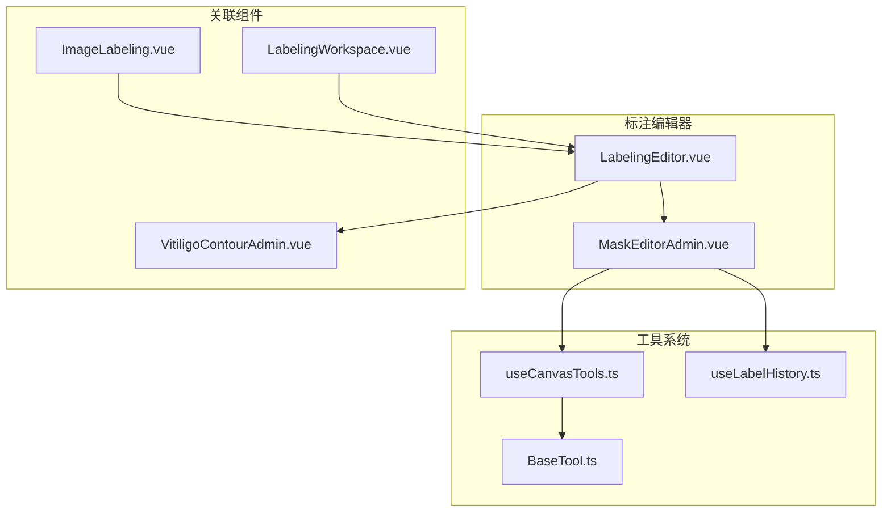
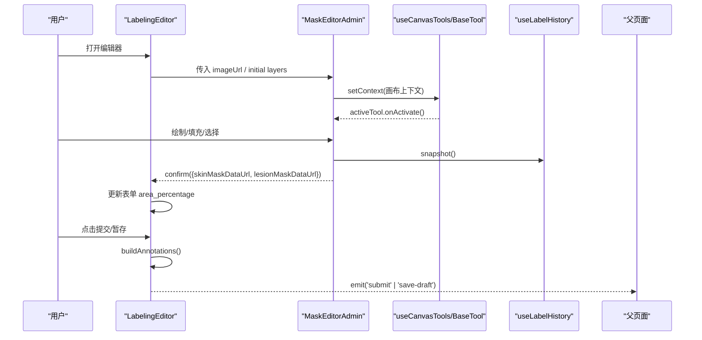
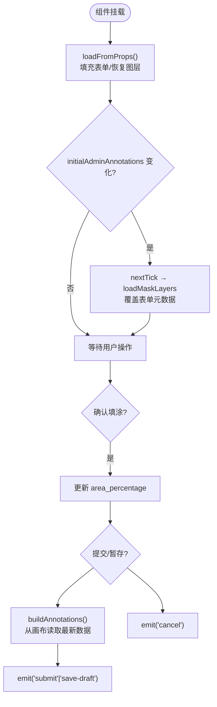
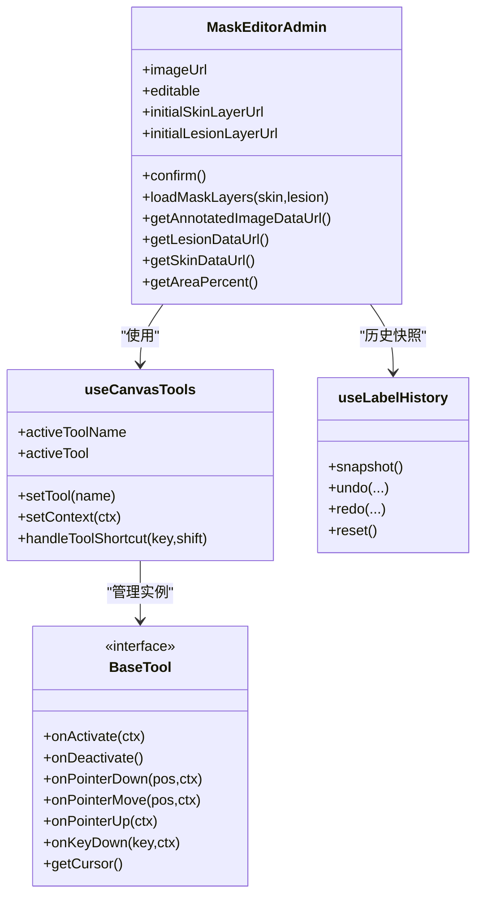
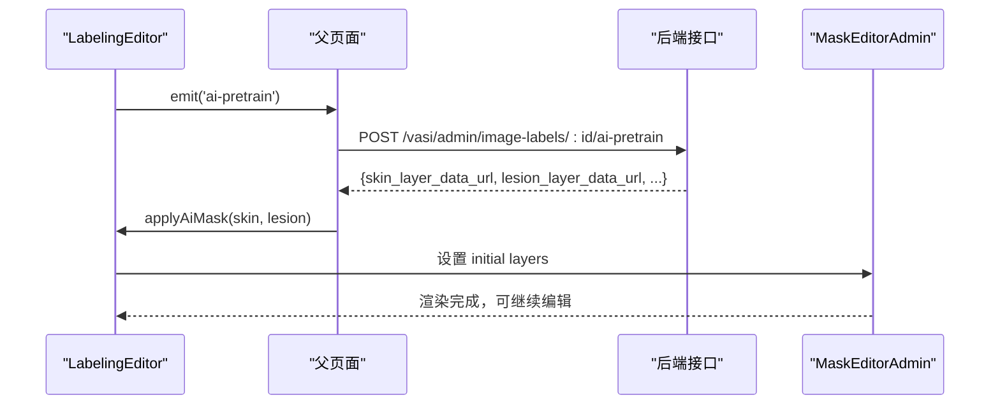
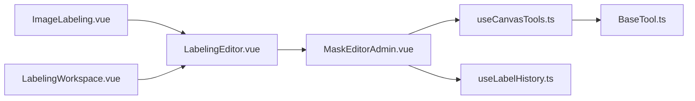

# 编辑器核心组件

<cite>
**本文引用的文件**
- [LabelingEditor.vue](file://web/admin/src/components/labeling/LabelingEditor.vue)
- [MaskEditorAdmin.vue](file://web/admin/src/components/labeling/MaskEditorAdmin.vue)
- [useCanvasTools.ts](file://web/admin/src/composables/useCanvasTools.ts)
- [BaseTool.ts](file://web/admin/src/components/labeling/tools/BaseTool.ts)
- [useLabelHistory.ts](file://web/admin/src/composables/useLabelHistory.ts)
- [VitiligoContourAdmin.vue](file://web/admin/src/components/labeling/VitiligoContourAdmin.vue)
- [ImageLabeling.vue](file://web/admin/src/views/ImageLabeling.vue)
- [LabelingWorkspace.vue](file://web/admin/src/views/LabelingWorkspace.vue)
</cite>

## 目录
1. [简介](#简介)
2. [项目结构](#项目结构)
3. [核心组件](#核心组件)
4. [架构总览](#架构总览)
5. [详细组件分析](#详细组件分析)
6. [依赖关系分析](#依赖关系分析)
7. [性能考量](#性能考量)
8. [故障排查指南](#故障排查指南)
9. [结论](#结论)
10. [附录](#附录)

## 简介
本技术文档围绕 LabelingEditor 主组件，系统性阐述其架构设计、状态管理、数据流与事件机制，并深入解析 AdminAnnotationItem 与 LabelingEditorSubmit 接口定义、表单验证逻辑、AI 预标注集成方式、键盘快捷键处理、生命周期管理、props 传递机制、错误处理策略以及扩展点与性能优化建议。目标是帮助开发者快速理解并高效扩展该标注编辑器。

## 项目结构
LabelingEditor 位于 admin 前端工程，作为图像标注的核心编辑入口，负责：
- 承载像素填涂画布（MaskEditorAdmin）
- 维护表单状态（身体部位、是否白癜风、分型、阶段、面积、VASI、脱色程度、备注、训练资格等）
- 构建并提交标注数据（AdminAnnotationItem[]）
- 触发 AI 一键预标注流程
- 提供撤销/重做、清空、暂存、提交等交互

图表来源
- [LabelingEditor.vue:1-719](file://web/admin/src/components/labeling/LabelingEditor.vue#L1-L719)
- [MaskEditorAdmin.vue:1-667](file://web/admin/src/components/labeling/MaskEditorAdmin.vue#L1-L667)
- [useCanvasTools.ts:1-127](file://web/admin/src/composables/useCanvasTools.ts#L1-L127)
- [BaseTool.ts:1-72](file://web/admin/src/components/labeling/tools/BaseTool.ts#L1-L72)
- [useLabelHistory.ts:40-86](file://web/admin/src/composables/useLabelHistory.ts#L40-L86)
- [VitiligoContourAdmin.vue:1-664](file://web/admin/src/components/labeling/VitiligoContourAdmin.vue#L1-L664)
- [ImageLabeling.vue:591-627](file://web/admin/src/views/ImageLabeling.vue#L591-L627)
- [LabelingWorkspace.vue:141-290](file://web/admin/src/views/LabelingWorkspace.vue#L141-L290)

章节来源
- [LabelingEditor.vue:1-719](file://web/admin/src/components/labeling/LabelingEditor.vue#L1-L719)
- [MaskEditorAdmin.vue:1-667](file://web/admin/src/components/labeling/MaskEditorAdmin.vue#L1-L667)

## 核心组件
- LabelingEditor.vue：编排层，负责 props/emit、表单状态、AI 预标注触发、提交/暂存、键盘快捷键、图层加载与回显。
- MaskEditorAdmin.vue：画布渲染与工具宿主，封装多工具切换、撤销/重做、缩放平移、区域面积统计、蒙版合成图导出。
- useCanvasTools.ts：工具管理器，维护当前工具实例、上下文注入、快捷键分发。
- BaseTool.ts：工具抽象与注册表，定义 ToolContext、ToolName、ToolDef、BaseTool 接口。
- useLabelHistory.ts：基于快照的撤销/重做历史栈。
- VitiligoContourAdmin.vue：轮廓编辑组件，用于 AI 或人工轮廓绘制与展示。
- ImageLabeling.vue / LabelingWorkspace.vue：页面级容器，负责数据加载、AI 预标注调用、将结果注入 LabelingEditor。

章节来源
- [LabelingEditor.vue:1-719](file://web/admin/src/components/labeling/LabelingEditor.vue#L1-L719)
- [MaskEditorAdmin.vue:1-667](file://web/admin/src/components/labeling/MaskEditorAdmin.vue#L1-L667)
- [useCanvasTools.ts:1-127](file://web/admin/src/composables/useCanvasTools.ts#L1-L127)
- [BaseTool.ts:1-72](file://web/admin/src/components/labeling/tools/BaseTool.ts#L1-L72)
- [useLabelHistory.ts:40-86](file://web/admin/src/composables/useLabelHistory.ts#L40-L86)
- [VitiligoContourAdmin.vue:1-664](file://web/admin/src/components/labeling/VitiligoContourAdmin.vue#L1-L664)
- [ImageLabeling.vue:591-627](file://web/admin/src/views/ImageLabeling.vue#L591-L627)
- [LabelingWorkspace.vue:141-290](file://web/admin/src/views/LabelingWorkspace.vue#L141-L290)

## 架构总览
LabelingEditor 采用“编排 + 子组件”的分层架构：
- 编排层（LabelingEditor）：集中管理表单与业务状态，协调 AI 预标注与画布操作，统一事件发射。
- 画布层（MaskEditorAdmin）：专注像素级绘制、工具调度、历史快照、面积计算与合成图生成。
- 工具层（useCanvasTools + BaseTool）：以插件化方式组织画笔、橡皮擦、智能填充、套索、多边形等工具。
- 历史层（useLabelHistory）：通过快照实现撤销/重做，避免复杂状态回溯。
- 页面层（ImageLabeling/LabelingWorkspace）：负责数据获取、AI 推理调用、结果回填与最终提交。

图表来源
- [LabelingEditor.vue:134-143](file://web/admin/src/components/labeling/LabelingEditor.vue#L134-L143)
- [LabelingEditor.vue:288-368](file://web/admin/src/components/labeling/LabelingEditor.vue#L288-L368)
- [MaskEditorAdmin.vue:157-162](file://web/admin/src/components/labeling/MaskEditorAdmin.vue#L157-L162)
- [MaskEditorAdmin.vue:419-432](file://web/admin/src/components/labeling/MaskEditorAdmin.vue#L419-L432)
- [useCanvasTools.ts:26-51](file://web/admin/src/composables/useCanvasTools.ts#L26-L51)
- [useLabelHistory.ts:40-86](file://web/admin/src/composables/useLabelHistory.ts#L40-L86)

## 详细组件分析

### LabelingEditor 组件
职责
- 定义类型：AdminAnnotationItem、LabelingEditorSubmit
- 接收 props：图片地址、初始标注、初始表单、AI 评估详情、AI 预标注开关、上次暂存合成图 URL
- 管理本地表单状态与选项
- 监听 initialAdminAnnotations 变化，恢复图层与表单
- 暴露 applyAiMask 供父组件注入 AI 预标注结果
- 构建标注数组并触发 submit/save-draft 事件
- 全局键盘快捷键：Ctrl/Cmd+Z 撤销、Ctrl/Cmd+Y 或 Ctrl/Cmd+Shift+Z 重做、Esc 取消

关键数据流
- 初始化：onMounted → loadFromProps → 根据 initialForm/existingAiDetails 填充表单；若存在 initialAdminAnnotations，则读取 mask_data/skin_mask_data 并通过 nextTick 调用 MaskEditorAdmin.loadMaskLayers 恢复图层
- 变更：handleMaskConfirm 更新皮肤/病灶蒙版与面积百分比
- 提交：handleSubmit/buildAnnotations 从画布直接读取最新数据，构造 LabelingEditorSubmit 并 emit
- AI 预标注：triggerAiPretrain 发出 ai-pretrain 事件，由父组件调用后端接口后将结果通过 applyAiMask 注入

表单验证
- 最小校验：is_vitiligo 必须非空（computed formValid），否则提交按钮禁用

错误处理
- 构建标注时若无有效蒙版，记录警告日志，仍返回包含元数据的标注项，避免元数据丢失
- 捕获 getAnnotatedImageDataUrl 异常并降级为 null

生命周期
- onMounted：加载 props、绑定全局 keydown
- onUnmounted：解绑 keydown

扩展点
- 可新增 initialForm/existingAiDetails 字段映射
- 可通过 defineExpose 暴露更多方法给父组件
- 可在 handleMaskConfirm 中接入自定义面积计算或质检规则

图表来源
- [LabelingEditor.vue:145-261](file://web/admin/src/components/labeling/LabelingEditor.vue#L145-L261)
- [LabelingEditor.vue:288-368](file://web/admin/src/components/labeling/LabelingEditor.vue#L288-L368)
- [LabelingEditor.vue:370-446](file://web/admin/src/components/labeling/LabelingEditor.vue#L370-L446)

章节来源
- [LabelingEditor.vue:1-719](file://web/admin/src/components/labeling/LabelingEditor.vue#L1-L719)

### MaskEditorAdmin 组件
职责
- 多画布分层：皮肤层、病灶层、叠加层
- 工具系统宿主：使用 useCanvasTools 管理活跃工具，委托指针/键盘事件
- 撤销/重做：通过 useLabelHistory 对画布像素快照进行历史管理
- 缩放/平移/全屏：支持滚轮缩放、空格拖拽、R 适应窗口、F 全屏
- 面积统计：按像素透明度统计皮肤/病灶/区域占比
- 蒙版加载：loadMaskLayers 异步加载 DataURL 到画布
- 合成图导出：getAnnotatedImageDataUrl 将原图与两层蒙版叠加导出 PNG DataURL

工具与快捷键
- 工具：皮肤画笔、白斑画笔、橡皮擦、智能填充、套索、多边形
- 快捷键：数字键 1-6 切换工具；B/L/G/S/P/E 快捷切换；Ctrl/Cmd+Z/Y 撤销/重做；Space 拖拽；R 适应；F 全屏

图表来源
- [MaskEditorAdmin.vue:1-667](file://web/admin/src/components/labeling/MaskEditorAdmin.vue#L1-L667)
- [useCanvasTools.ts:1-127](file://web/admin/src/composables/useCanvasTools.ts#L1-L127)
- [BaseTool.ts:1-72](file://web/admin/src/components/labeling/tools/BaseTool.ts#L1-L72)
- [useLabelHistory.ts:40-86](file://web/admin/src/composables/useLabelHistory.ts#L40-L86)

章节来源
- [MaskEditorAdmin.vue:1-667](file://web/admin/src/components/labeling/MaskEditorAdmin.vue#L1-L667)
- [useCanvasTools.ts:1-127](file://web/admin/src/composables/useCanvasTools.ts#L1-L127)
- [BaseTool.ts:1-72](file://web/admin/src/components/labeling/tools/BaseTool.ts#L1-L72)
- [useLabelHistory.ts:40-86](file://web/admin/src/composables/useLabelHistory.ts#L40-L86)

### 类型与接口

#### AdminAnnotationItem
- source: 标注来源（ai/admin）
- region_index: 区域索引
- body_site: 身体部位
- is_vitiligo: 是否白癜风
- vitiligo_type: 分型
- vitiligo_stage: 阶段
- area_percentage: 面积百分比
- depigmentation_level: 脱色程度
- region_contour: 轮廓（JSON 字符串）
- region_bbox: 边界框（JSON 字符串）
- mask_data: 病灶蒙版 PNG DataURL
- skin_mask_data: 皮肤蒙版 PNG DataURL
- confidence: 置信度
- notes: 备注

章节来源
- [LabelingEditor.vue:6-21](file://web/admin/src/components/labeling/LabelingEditor.vue#L6-L21)

#### LabelingEditorSubmit
- body_site/is_vitiligo/vitiligo_type/vitiligo_stage/area_percentage/vasi_score/depigmentation_level/notes/training_eligible
- annotations: AdminAnnotationItem[]
- annotated_image: 原始照片 + 画笔涂层叠加的合成图 DataURL

章节来源
- [LabelingEditor.vue:23-35](file://web/admin/src/components/labeling/LabelingEditor.vue#L23-L35)

### 表单验证逻辑
- 最小必填：is_vitiligo 不能为空，否则提交按钮禁用
- 面积自动同步：当画布有区域时，优先使用画布计算的 area_percentage
- 元数据优先级：管理员已保存的标注字段会覆盖 AI 预估值，避免空值冲掉已有数据

章节来源
- [LabelingEditor.vue:117-121](file://web/admin/src/components/labeling/LabelingEditor.vue#L117-L121)
- [LabelingEditor.vue:193-205](file://web/admin/src/components/labeling/LabelingEditor.vue#L193-L205)
- [LabelingEditor.vue:336-368](file://web/admin/src/components/labeling/LabelingEditor.vue#L336-L368)

### AI 预标注集成
- 触发：LabelingEditor.triggerAiPretrain 发出 ai-pretrain 事件
- 父组件：在 ImageLabeling.vue/LabelingWorkspace.vue 中监听事件，调用后端 /vasi/admin/image-labels/:id/ai-pretrain
- 结果注入：将 skin_layer_data_url 与 lesion_layer_data_url 通过 LabelingEditor.applyAiMask 注入画布
- 体验：显示“AI 推理中…”，完成后隐藏并允许继续编辑

图表来源
- [LabelingEditor.vue:263-286](file://web/admin/src/components/labeling/LabelingEditor.vue#L263-L286)
- [ImageLabeling.vue:591-627](file://web/admin/src/views/ImageLabeling.vue#L591-L627)
- [LabelingWorkspace.vue:141-156](file://web/admin/src/views/LabelingWorkspace.vue#L141-L156)

章节来源
- [LabelingEditor.vue:263-286](file://web/admin/src/components/labeling/LabelingEditor.vue#L263-L286)
- [ImageLabeling.vue:591-627](file://web/admin/src/views/ImageLabeling.vue#L591-L627)
- [LabelingWorkspace.vue:141-156](file://web/admin/src/views/LabelingWorkspace.vue#L141-L156)

### 键盘快捷键处理
- 全局快捷键（LabelingEditor）：
  - Ctrl/Cmd+Z：撤销
  - Ctrl/Cmd+Y 或 Ctrl/Cmd+Shift+Z：重做
  - Esc：取消
- 画布快捷键（MaskEditorAdmin）：
  - 数字键 1-6：切换工具
  - B/L/G/S/P/E：快捷工具切换
  - Space：拖拽画布
  - R：适应窗口
  - F：全屏
  - Ctrl/Cmd+Z/Y：撤销/重做

注意：输入框内按键不触发全局快捷键，避免干扰文本编辑。

章节来源
- [LabelingEditor.vue:370-386](file://web/admin/src/components/labeling/LabelingEditor.vue#L370-L386)
- [MaskEditorAdmin.vue:358-377](file://web/admin/src/components/labeling/MaskEditorAdmin.vue#L358-L377)
- [useCanvasTools.ts:53-79](file://web/admin/src/composables/useCanvasTools.ts#L53-L79)

### 生命周期管理与 Props 传递
- 生命周期：
  - onMounted：加载 props、绑定全局 keydown
  - onUnmounted：解绑 keydown
- Props 传递：
  - imageUrl：图片源
  - imageHash：可选标识
  - initialAdminAnnotations：初始标注（含蒙版与元数据）
  - initialAiContours：AI 轮廓（AdminContourRegion）
  - initialForm：初始表单数据
  - existingAiDetails：已有 AI 评估信息
  - aiPretrainAvailable：是否启用 AI 预标注
  - annotatedImageUrl：上次暂存的合成图预览

章节来源
- [LabelingEditor.vue:37-64](file://web/admin/src/components/labeling/LabelingEditor.vue#L37-L64)
- [LabelingEditor.vue:209-211](file://web/admin/src/components/labeling/LabelingEditor.vue#L209-L211)
- [LabelingEditor.vue:440-446](file://web/admin/src/components/labeling/LabelingEditor.vue#L440-L446)

### 事件发射模式
- submit：提交完整标注数据（LabelingEditorSubmit）
- save-draft：暂存标注数据（LabelingEditorSubmit）
- cancel：取消编辑
- ai-pretrain：请求执行 AI 预标注

章节来源
- [LabelingEditor.vue:59-64](file://web/admin/src/components/labeling/LabelingEditor.vue#L59-L64)
- [LabelingEditor.vue:336-368](file://web/admin/src/components/labeling/LabelingEditor.vue#L336-L368)
- [LabelingEditor.vue:392-438](file://web/admin/src/components/labeling/LabelingEditor.vue#L392-L438)

### 错误处理策略
- 无蒙版提交：记录警告但仍返回带元数据的标注项，确保元数据持久化
- 合成图捕获失败：try/catch 捕获异常并降级为 null
- 图片加载失败：MaskEditorAdmin 提供重试按钮与错误态提示
- 网络错误：父页面在 AI 预标注失败时显示错误消息

章节来源
- [LabelingEditor.vue:314-316](file://web/admin/src/components/labeling/LabelingEditor.vue#L314-L316)
- [LabelingEditor.vue:412-421](file://web/admin/src/components/labeling/LabelingEditor.vue#L412-L421)
- [MaskEditorAdmin.vue:325-354](file://web/admin/src/components/labeling/MaskEditorAdmin.vue#L325-L354)
- [ImageLabeling.vue:610-627](file://web/admin/src/views/ImageLabeling.vue#L610-L627)

## 依赖关系分析
- LabelingEditor 依赖 MaskEditorAdmin 进行画布操作
- MaskEditorAdmin 依赖 useCanvasTools 管理工具，依赖 useLabelHistory 管理历史
- 工具系统通过 BaseTool 抽象与注册表统一管理
- 页面级组件负责数据加载与 AI 预标注调用，并将结果注入 LabelingEditor

图表来源
- [LabelingEditor.vue:1-719](file://web/admin/src/components/labeling/LabelingEditor.vue#L1-L719)
- [MaskEditorAdmin.vue:1-667](file://web/admin/src/components/labeling/MaskEditorAdmin.vue#L1-L667)
- [useCanvasTools.ts:1-127](file://web/admin/src/composables/useCanvasTools.ts#L1-L127)
- [BaseTool.ts:1-72](file://web/admin/src/components/labeling/tools/BaseTool.ts#L1-L72)
- [useLabelHistory.ts:40-86](file://web/admin/src/composables/useLabelHistory.ts#L40-L86)
- [ImageLabeling.vue:591-627](file://web/admin/src/views/ImageLabeling.vue#L591-L627)
- [LabelingWorkspace.vue:141-290](file://web/admin/src/views/LabelingWorkspace.vue#L141-L290)

章节来源
- [LabelingEditor.vue:1-719](file://web/admin/src/components/labeling/LabelingEditor.vue#L1-L719)
- [MaskEditorAdmin.vue:1-667](file://web/admin/src/components/labeling/MaskEditorAdmin.vue#L1-L667)
- [useCanvasTools.ts:1-127](file://web/admin/src/composables/useCanvasTools.ts#L1-L127)
- [BaseTool.ts:1-72](file://web/admin/src/components/labeling/tools/BaseTool.ts#L1-L72)
- [useLabelHistory.ts:40-86](file://web/admin/src/composables/useLabelHistory.ts#L40-L86)
- [ImageLabeling.vue:591-627](file://web/admin/src/views/ImageLabeling.vue#L591-L627)
- [LabelingWorkspace.vue:141-290](file://web/admin/src/views/LabelingWorkspace.vue#L141-L290)

## 性能考量
- 画布像素统计：countAlpha/countUnionAlpha 遍历像素，建议在大数据量下考虑降采样或增量更新
- 合成图导出：getAnnotatedImageDataUrl 创建新 canvas 并绘制多层，频繁调用可能影响性能，建议节流或仅在提交/暂存时调用
- 历史快照：useLabelHistory 存储 ImageData，注意内存占用，合理限制 HISTORY_MAX
- 图片加载：onImgLoad 并行加载多个蒙版 DataURL，避免阻塞；失败时提供重试
- 工具切换：setTool 先 onDeactivate 再 onActivate，减少状态冲突

[本节为通用性能讨论，不直接分析具体文件]

## 故障排查指南
- 问题：提交后元数据丢失
  - 原因：未绘制蒙版导致 annotations 为空
  - 解决：buildAnnotations 始终返回至少一个标注项，确保元数据持久化
- 问题：AI 预标注结果未显示
  - 原因：initialAdminAnnotations 异步加载时机晚于组件挂载
  - 解决：watch initialAdminAnnotations，使用 nextTick 调用 loadMaskLayers
- 问题：快捷键无效
  - 原因：焦点在输入框内
  - 解决：检测 target 是否为 input/textarea/contenteditable，跳过全局快捷键
- 问题：图片加载失败
  - 现象：显示错误态与重试按钮
  - 解决：检查 imageUrl 有效性，必要时重试加载

章节来源
- [LabelingEditor.vue:314-316](file://web/admin/src/components/labeling/LabelingEditor.vue#L314-L316)
- [LabelingEditor.vue:213-261](file://web/admin/src/components/labeling/LabelingEditor.vue#L213-L261)
- [LabelingEditor.vue:370-386](file://web/admin/src/components/labeling/LabelingEditor.vue#L370-L386)
- [MaskEditorAdmin.vue:325-354](file://web/admin/src/components/labeling/MaskEditorAdmin.vue#L325-L354)

## 结论
LabelingEditor 作为标注编辑器的编排核心，通过清晰的 props/emit 契约、稳健的状态管理与健壮的错误处理，实现了高效的图像标注工作流。结合 MaskEditorAdmin 的工具系统与历史管理，以及页面层的 AI 预标注集成，形成了可扩展、高性能且用户体验友好的标注平台。未来可在此基础上进一步扩展工具集、增强校验规则与优化大图渲染性能。

[本节为总结性内容，不直接分析具体文件]

## 附录

### 配置选项与扩展点
- 配置项
  - imageUrl：图片源
  - aiPretrainAvailable：是否启用 AI 预标注
  - annotatedImageUrl：上次暂存合成图预览
  - initialForm/existingAiDetails：初始表单与 AI 评估信息
- 扩展点
  - 新增工具：在 BaseTool.ALL_TOOLS 注册，并在 useCanvasTools 中实例化
  - 新增表单字段：在 LabelingEditorSubmit 与 AdminAnnotationItem 中扩展，并在 loadFromProps 中映射
  - 自定义面积算法：在 MaskEditorAdmin.updateAreas 中替换像素统计逻辑

章节来源
- [BaseTool.ts:44-52](file://web/admin/src/components/labeling/tools/BaseTool.ts#L44-L52)
- [useCanvasTools.ts:16-24](file://web/admin/src/composables/useCanvasTools.ts#L16-L24)
- [LabelingEditor.vue:37-64](file://web/admin/src/components/labeling/LabelingEditor.vue#L37-L64)
- [LabelingEditor.vue:145-205](file://web/admin/src/components/labeling/LabelingEditor.vue#L145-L205)