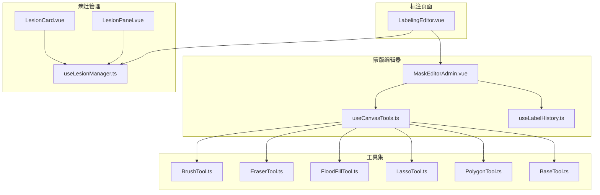
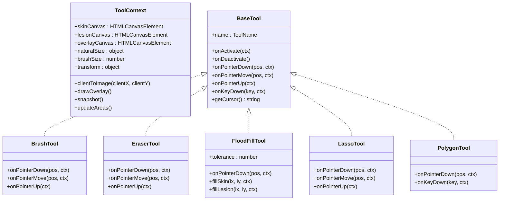
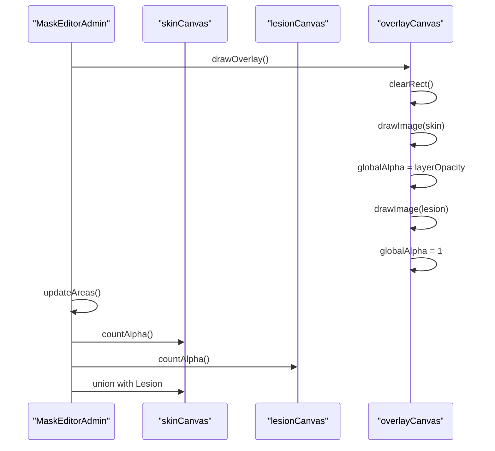
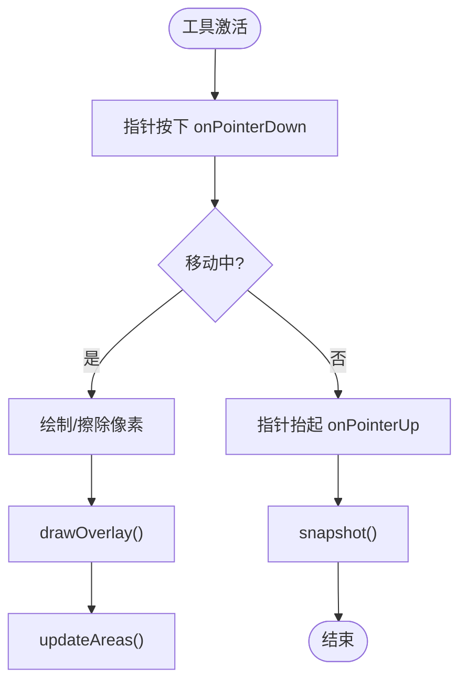
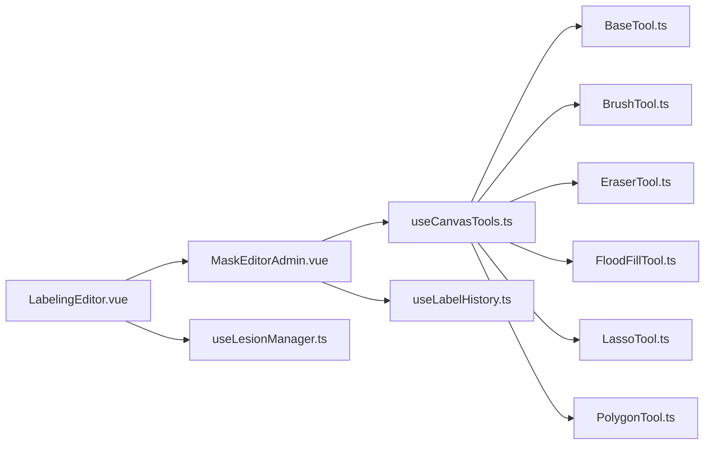

# 蒙版编辑器

<cite>
**本文引用的文件**   
- [MaskEditorAdmin.vue](file://web/admin/src/components/labeling/MaskEditorAdmin.vue)
- [BaseTool.ts](file://web/admin/src/components/labeling/tools/BaseTool.ts)
- [useCanvasTools.ts](file://web/admin/src/composables/useCanvasTools.ts)
- [useLabelHistory.ts](file://web/admin/src/composables/useLabelHistory.ts)
- [BrushTool.ts](file://web/admin/src/components/labeling/tools/BrushTool.ts)
- [EraserTool.ts](file://web/admin/src/components/labeling/tools/EraserTool.ts)
- [FloodFillTool.ts](file://web/admin/src/components/labeling/tools/FloodFillTool.ts)
- [LassoTool.ts](file://web/admin/src/components/labeling/tools/LassoTool.ts)
- [PolygonTool.ts](file://web/admin/src/components/labeling/tools/PolygonTool.ts)
- [LabelingEditor.vue](file://web/admin/src/components/labeling/LabelingEditor.vue)
- [useLesionManager.ts](file://web/admin/src/composables/useLesionManager.ts)
- [LesionPanel.vue](file://web/admin/src/components/labeling/LesionPanel.vue)
- [LesionCard.vue](file://web/admin/src/components/labeling/LesionCard.vue)
</cite>

## 目录
1. [简介](#简介)
2. [项目结构](#项目结构)
3. [核心组件](#核心组件)
4. [架构总览](#架构总览)
5. [详细组件分析](#详细组件分析)
6. [依赖关系分析](#依赖关系分析)
7. [性能考量](#性能考量)
8. [故障排查指南](#故障排查指南)
9. [结论](#结论)
10. [附录](#附录)

## 简介
本技术文档面向 MaskEditorAdmin 蒙版编辑器，系统性阐述其 Canvas 画布操作、图层管理机制与实时预览能力；深入解析皮肤蒙版与病灶蒙版的叠加渲染算法、像素级编辑工具与交互响应机制；并覆盖蒙版数据序列化、面积计算算法、图像合成技术与性能优化策略。同时提供蒙版格式规范、导出选项与调试方法，帮助开发者快速理解与扩展该编辑器。

## 项目结构
MaskEditorAdmin 位于管理端前端工程 web/admin 下，采用 Vue 3 + TypeScript 实现，围绕“宿主组件 + 工具插件 + 状态管理”的架构组织：
- 宿主组件：MaskEditorAdmin.vue 负责画布生命周期、事件分发、图层合成与统计展示。
- 工具系统：BaseTool.ts 定义统一接口，具体工具（画笔、橡皮擦、智能填充、套索、多边形）各自实现交互逻辑。
- 工具编排：useCanvasTools.ts 维护当前激活工具、快捷键切换与上下文注入。
- 历史回退：useLabelHistory.ts 提供基于 ImageData 的撤销/重做环形缓冲。
- 标注编排：LabelingEditor.vue 作为页面级容器，整合表单、AI 预标注与蒙版编辑器，完成提交与暂存。
- 多病灶管理：useLesionManager.ts、LesionPanel.vue、LesionCard.vue 支持多图层的病灶列表管理与切换。

图表来源
- [MaskEditorAdmin.vue:1-667](file://web/admin/src/components/labeling/MaskEditorAdmin.vue#L1-L667)
- [BaseTool.ts:1-72](file://web/admin/src/components/labeling/tools/BaseTool.ts#L1-L72)
- [useCanvasTools.ts:1-127](file://web/admin/src/composables/useCanvasTools.ts#L1-L127)
- [useLabelHistory.ts:1-87](file://web/admin/src/composables/useLabelHistory.ts#L1-L87)
- [BrushTool.ts:1-122](file://web/admin/src/components/labeling/tools/BrushTool.ts#L1-L122)
- [EraserTool.ts:1-92](file://web/admin/src/components/labeling/tools/EraserTool.ts#L1-L92)
- [FloodFillTool.ts:1-265](file://web/admin/src/components/labeling/tools/FloodFillTool.ts#L1-L265)
- [LassoTool.ts:1-180](file://web/admin/src/components/labeling/tools/LassoTool.ts#L1-L180)
- [PolygonTool.ts:1-196](file://web/admin/src/components/labeling/tools/PolygonTool.ts#L1-L196)
- [LabelingEditor.vue:1-719](file://web/admin/src/components/labeling/LabelingEditor.vue#L1-L719)
- [useLesionManager.ts:1-149](file://web/admin/src/composables/useLesionManager.ts#L1-L149)
- [LesionPanel.vue:1-74](file://web/admin/src/components/labeling/LesionPanel.vue#L1-L74)
- [LesionCard.vue:1-158](file://web/admin/src/components/labeling/LesionCard.vue#L1-L158)

章节来源
- [MaskEditorAdmin.vue:1-667](file://web/admin/src/components/labeling/MaskEditorAdmin.vue#L1-L667)
- [LabelingEditor.vue:1-719](file://web/admin/src/components/labeling/LabelingEditor.vue#L1-L719)

## 核心组件
- MaskEditorAdmin.vue：宿主组件，管理三张画布（皮肤层、病灶层、叠加层），处理指针事件、缩放平移、全屏、键盘快捷键、区域面积统计、蒙版导出与合成图生成。
- BaseTool.ts：工具抽象接口 ToolContext、工具定义 ToolDef、工具名枚举 ToolName，以及所有工具的元信息（图标、快捷键、可用性）。
- useCanvasTools.ts：工具实例注册、激活/停用生命周期、快捷键映射、上下文注入与工具间切换。
- useLabelHistory.ts：基于 ImageData 的快照环形缓冲，支持撤销/重做与重置。
- 工具实现：
  - BrushTool.ts：皮肤/病灶画笔，自动互斥涂抹，避免重复计数。
  - EraserTool.ts：橡皮擦，同步擦除两层。
  - FloodFillTool.ts：基于原图像素容差的连通域填充，支持 Shift+点击填充皮肤。
  - LassoTool.ts：自由绘制闭合选区，扫描线填充。
  - PolygonTool.ts：顶点放置与闭合，扫描线填充。
- LabelingEditor.vue：页面级编排，承载表单、AI 预标注回调、蒙版加载与提交。
- useLesionManager.ts / LesionPanel.vue / LesionCard.vue：多病灶数据模型与 UI 管理。

章节来源
- [MaskEditorAdmin.vue:1-667](file://web/admin/src/components/labeling/MaskEditorAdmin.vue#L1-L667)
- [BaseTool.ts:1-72](file://web/admin/src/components/labeling/tools/BaseTool.ts#L1-L72)
- [useCanvasTools.ts:1-127](file://web/admin/src/composables/useCanvasTools.ts#L1-L127)
- [useLabelHistory.ts:1-87](file://web/admin/src/composables/useLabelHistory.ts#L1-L87)
- [BrushTool.ts:1-122](file://web/admin/src/components/labeling/tools/BrushTool.ts#L1-L122)
- [EraserTool.ts:1-92](file://web/admin/src/components/labeling/tools/EraserTool.ts#L1-L92)
- [FloodFillTool.ts:1-265](file://web/admin/src/components/labeling/tools/FloodFillTool.ts#L1-L265)
- [LassoTool.ts:1-180](file://web/admin/src/components/labeling/tools/LassoTool.ts#L1-L180)
- [PolygonTool.ts:1-196](file://web/admin/src/components/labeling/tools/PolygonTool.ts#L1-L196)
- [LabelingEditor.vue:1-719](file://web/admin/src/components/labeling/LabelingEditor.vue#L1-L719)
- [useLesionManager.ts:1-149](file://web/admin/src/composables/useLesionManager.ts#L1-L149)
- [LesionPanel.vue:1-74](file://web/admin/src/components/labeling/LesionPanel.vue#L1-L74)
- [LesionCard.vue:1-158](file://web/admin/src/components/labeling/LesionCard.vue#L1-L158)

## 架构总览
MaskEditorAdmin 以“宿主-工具-上下文”模式运行：
- 宿主持有三张画布与图片元素，负责坐标转换、事件转发、图层合成与统计更新。
- 工具通过 ToolContext 访问画布、尺寸、画笔大小、变换矩阵、坐标转换、覆写绘制与快照等能力。
- 工具切换由 useCanvasTools 管理，键盘快捷键直接驱动 setTool。
- 历史回退由 useLabelHistory 维护，每次有效绘制后调用 snapshot。

图表来源
- [BaseTool.ts:1-72](file://web/admin/src/components/labeling/tools/BaseTool.ts#L1-L72)
- [BrushTool.ts:1-122](file://web/admin/src/components/labeling/tools/BrushTool.ts#L1-L122)
- [EraserTool.ts:1-92](file://web/admin/src/components/labeling/tools/EraserTool.ts#L1-L92)
- [FloodFillTool.ts:1-265](file://web/admin/src/components/labeling/tools/FloodFillTool.ts#L1-L265)
- [LassoTool.ts:1-180](file://web/admin/src/components/labeling/tools/LassoTool.ts#L1-L180)
- [PolygonTool.ts:1-196](file://web/admin/src/components/labeling/tools/PolygonTool.ts#L1-L196)

章节来源
- [MaskEditorAdmin.vue:1-667](file://web/admin/src/components/labeling/MaskEditorAdmin.vue#L1-L667)
- [useCanvasTools.ts:1-127](file://web/admin/src/composables/useCanvasTools.ts#L1-L127)

## 详细组件分析

### 画布与图层管理
- 三层画布：
  - skinCanvas：皮肤区域蒙版（蓝色半透明）。
  - lesionCanvas：白斑区域蒙版（粉色半透明）。
  - overlayCanvas：实时合成层，按透明度混合 skin 与 lesion。
- 坐标转换：clientToImage 将屏幕坐标转换为自然像素坐标，考虑 baseFitScale 与 transform（缩放/平移）。
- 图层合成：drawOverlay 先绘制 skin，再以 layerOpacity 叠加 lesion，确保视觉一致性与可调节透明度。
- 区域统计：countAlpha 对 alpha > 阈值像素计数，union 统计两层的并集，得到评估区域、白斑占比等指标。
- 蒙版导出：canvas.toDataURL('image/png') 输出 PNG Data URL，供上层持久化或提交。

图表来源
- [MaskEditorAdmin.vue:111-155](file://web/admin/src/components/labeling/MaskEditorAdmin.vue#L111-L155)

章节来源
- [MaskEditorAdmin.vue:90-155](file://web/admin/src/components/labeling/MaskEditorAdmin.vue#L90-L155)

### 像素级编辑工具与交互响应
- 画笔（皮肤/白斑）：
  - onPointerDown/onPointerMove/onPointerUp 实现连续绘制。
  - 互斥涂抹：在目标层绘制同时在对立层擦除，避免重叠导致面积重复计算。
- 橡皮擦：
  - 同步擦除两层，使用 destination-out 组合模式清空 alpha。
- 智能填充（Flood Fill）：
  - 基于原图像素采样，四连通域遍历，颜色距离容差控制。
  - Shift+点击填充皮肤，默认点击填充白斑；支持键盘调整容差。
- 套索选择：
  - 自由路径绘制，释放后自动闭合，扫描线填充白斑，并在皮肤层擦除对应区域。
- 多边形选择：
  - 点击放置顶点，双击或 Enter 闭合，Backspace 删除顶点，Esc 取消。
  - 扫描线填充算法与套索一致。

图表来源
- [BrushTool.ts:66-112](file://web/admin/src/components/labeling/tools/BrushTool.ts#L66-L112)
- [EraserTool.ts:55-82](file://web/admin/src/components/labeling/tools/EraserTool.ts#L55-L82)
- [FloodFillTool.ts:67-115](file://web/admin/src/components/labeling/tools/FloodFillTool.ts#L67-L115)
- [LassoTool.ts:33-70](file://web/admin/src/components/labeling/tools/LassoTool.ts#L33-L70)
- [PolygonTool.ts:34-97](file://web/admin/src/components/labeling/tools/PolygonTool.ts#L34-L97)

章节来源
- [BrushTool.ts:1-122](file://web/admin/src/components/labeling/tools/BrushTool.ts#L1-L122)
- [EraserTool.ts:1-92](file://web/admin/src/components/labeling/tools/EraserTool.ts#L1-L92)
- [FloodFillTool.ts:1-265](file://web/admin/src/components/labeling/tools/FloodFillTool.ts#L1-L265)
- [LassoTool.ts:1-180](file://web/admin/src/components/labeling/tools/LassoTool.ts#L1-L180)
- [PolygonTool.ts:1-196](file://web/admin/src/components/labeling/tools/PolygonTool.ts#L1-L196)

### 实时预览与面积计算
- 实时预览：overlayCanvas 每帧重绘 skin 与 lesion，layerOpacity 可调，保证编辑过程所见即所得。
- 面积计算：
  - 皮肤区域百分比：skinCanvas 非零 alpha 像素占比。
  - 白斑区域百分比：lesionCanvas 非零 alpha 像素占比。
  - 评估区域百分比：两层的并集像素占比。
  - 白斑占比：白斑区域占评估区域的百分比。

章节来源
- [MaskEditorAdmin.vue:125-155](file://web/admin/src/components/labeling/MaskEditorAdmin.vue#L125-L155)

### 蒙版数据序列化与导出
- 导出格式：PNG Data URL（base64 编码），包含 alpha 通道，便于无损传输与还原。
- 导出入口：
  - getLesionDataUrl / getSkinDataUrl：分别导出病灶与皮肤蒙版。
  - getAnnotatedImageDataUrl：原始图像 + 两层蒙版合成图（带透明度烘焙）。
- 加载恢复：loadLayerFromDataUrl 将 Data URL 解码为 Image 并绘制到对应 canvas，支持初始蒙版回显。

章节来源
- [MaskEditorAdmin.vue:419-445](file://web/admin/src/components/labeling/MaskEditorAdmin.vue#L419-L445)
- [MaskEditorAdmin.vue:484-499](file://web/admin/src/components/labeling/MaskEditorAdmin.vue#L484-L499)
- [MaskEditorAdmin.vue:316-323](file://web/admin/src/components/labeling/MaskEditorAdmin.vue#L316-L323)

### 图像合成技术
- 叠加顺序：先绘制皮肤层，再按透明度叠加病灶层，最终合成至 overlayCanvas。
- 合成图生成：创建临时 canvas，依次绘制原图、皮肤层（透明度约 0.4）、病灶层（透明度约 0.55），输出 PNG。
- 用途：用于暂存结果预览、提交时附带标注合成图，便于审核与回溯。

章节来源
- [MaskEditorAdmin.vue:111-123](file://web/admin/src/components/labeling/MaskEditorAdmin.vue#L111-L123)
- [MaskEditorAdmin.vue:484-499](file://web/admin/src/components/labeling/MaskEditorAdmin.vue#L484-L499)

### 历史回退与撤销/重做
- 快照机制：每次有效绘制后调用 snapshot，保存 skin 与 lesion 的 ImageData。
- 环形缓冲：最多保留固定数量快照，超出则丢弃最早记录。
- 撤销/重做：根据索引应用快照，并重绘 overlay 与更新面积。

章节来源
- [useLabelHistory.ts:17-87](file://web/admin/src/composables/useLabelHistory.ts#L17-L87)
- [MaskEditorAdmin.vue:296-304](file://web/admin/src/components/labeling/MaskEditorAdmin.vue#L296-L304)

### 多病灶管理与数据模型
- 数据模型：每个病灶包含 regionIndex、标签、皮肤/病灶蒙版 Data URL、部位、分型、阶段、面积、脱色程度、备注与 active 标志。
- 管理器：支持添加、删除、切换病灶，更新活跃病灶的蒙版数据。
- UI 面板：右侧面板展示病灶列表与快捷表单，选中后高亮显示。

章节来源
- [useLesionManager.ts:17-149](file://web/admin/src/composables/useLesionManager.ts#L17-L149)
- [LesionPanel.vue:1-74](file://web/admin/src/components/labeling/LesionPanel.vue#L1-L74)
- [LesionCard.vue:1-158](file://web/admin/src/components/labeling/LesionCard.vue#L1-L158)

### 工具系统与快捷键
- 工具注册：useCanvasTools 集中管理工具实例，setTool 触发 onDeactivate/onActivate 生命周期。
- 快捷键：数字键 1-6 快速切换工具；字母键（B/L/G/S/P/E/C）映射到工具；Shift 修饰符用于特殊行为（如 Shift+点击填充皮肤）。
- 上下文注入：setContext 将 ToolContext 注入当前工具，使其具备画布访问与绘制能力。

章节来源
- [useCanvasTools.ts:26-86](file://web/admin/src/composables/useCanvasTools.ts#L26-L86)
- [BaseTool.ts:44-52](file://web/admin/src/components/labeling/tools/BaseTool.ts#L44-L52)

## 依赖关系分析
- 组件耦合：
  - MaskEditorAdmin 依赖 useCanvasTools 与 useLabelHistory，解耦工具与历史逻辑。
  - 工具之间无直接耦合，仅通过 ToolContext 共享画布与能力。
- 外部依赖：
  - HTMLCanvas API（getContext、getImageData、putImageData、toDataURL）。
  - DOM 事件（pointer/wheel/fullscreenchange）。
- 潜在循环依赖：无，工具与宿主通过接口与上下文通信，单向依赖。

图表来源
- [MaskEditorAdmin.vue:1-667](file://web/admin/src/components/labeling/MaskEditorAdmin.vue#L1-L667)
- [useCanvasTools.ts:1-127](file://web/admin/src/composables/useCanvasTools.ts#L1-L127)
- [useLabelHistory.ts:1-87](file://web/admin/src/composables/useLabelHistory.ts#L1-L87)
- [BaseTool.ts:1-72](file://web/admin/src/components/labeling/tools/BaseTool.ts#L1-L72)
- [LabelingEditor.vue:1-719](file://web/admin/src/components/labeling/LabelingEditor.vue#L1-L719)
- [useLesionManager.ts:1-149](file://web/admin/src/composables/useLesionManager.ts#L1-L149)

章节来源
- [MaskEditorAdmin.vue:1-667](file://web/admin/src/components/labeling/MaskEditorAdmin.vue#L1-L667)
- [useCanvasTools.ts:1-127](file://web/admin/src/composables/useCanvasTools.ts#L1-L127)

## 性能考量
- 像素读取优化：
  - getContext 使用 willReadFrequently: true，减少频繁 getImageData 的性能损耗。
  - 面积统计仅在必要时触发，避免每帧全量计算。
- 填充算法保护：
  - FloodFill 设置最大迭代次数，防止超大图像导致卡顿。
- 合成频率控制：
  - drawOverlay 仅在必要操作后调用，减少重绘开销。
- 内存管理：
  - 历史快照限制长度，避免内存膨胀。
  - 工具 deactivate 时清理缓存（如 FloodFill 的原图缓存）。

[本节为通用指导，不直接分析具体文件]

## 故障排查指南
- 图片加载失败：
  - 检查 imageUrl 是否有效，重试按钮会重置 imgKey 重新加载。
  - 错误状态会显示提示与重试入口。
- 蒙版未回显：
  - 确认 initialSkinLayerUrl / initialLesionLayerUrl 是否为有效 PNG Data URL。
  - 使用 loadMaskLayers 显式加载，确保在 nextTick 后执行。
- 面积统计异常：
  - 检查 canvas 尺寸是否正确初始化，确保 naturalSize 非零。
  - 查看 countAlpha 阈值（alpha > 32）是否符合预期。
- 填充过大区域被截断：
  - 检查 FloodFill 的最大迭代次数，适当调大或优化输入图像分辨率。
- 快捷键无效：
  - 确认焦点不在输入框内，handleToolShortcut 会跳过输入场景。
  - 检查工具 availability 配置。

章节来源
- [MaskEditorAdmin.vue:326-354](file://web/admin/src/components/labeling/MaskEditorAdmin.vue#L326-L354)
- [MaskEditorAdmin.vue:419-432](file://web/admin/src/components/labeling/MaskEditorAdmin.vue#L419-L432)
- [FloodFillTool.ts:176-182](file://web/admin/src/components/labeling/tools/FloodFillTool.ts#L176-L182)
- [MaskEditorAdmin.vue:358-377](file://web/admin/src/components/labeling/MaskEditorAdmin.vue#L358-L377)

## 结论
MaskEditorAdmin 通过清晰的宿主-工具-上下文架构，实现了高效的蒙版编辑体验。其像素级工具、实时预览、面积统计与历史回退共同构成了完整的标注工作流。结合 PNG Data URL 的序列化与合成图导出，既满足前端交互需求，也便于后端存储与展示。建议在大规模图像场景下进一步优化像素统计与填充算法，以提升整体性能。

[本节为总结性内容，不直接分析具体文件]

## 附录

### 蒙版格式规范
- 数据类型：PNG Data URL（base64），包含 alpha 通道。
- 字段命名：
  - mask_data：病灶蒙版（白斑）。
  - skin_mask_data：皮肤蒙版（评估区域）。
- 语义约定：
  - alpha > 0 表示蒙版区域，alpha 值越大越不透明。
  - 两层互斥：同一像素不应同时属于皮肤与病灶（由工具保证）。

章节来源
- [LabelingEditor.vue:6-21](file://web/admin/src/components/labeling/LabelingEditor.vue#L6-L21)
- [useLesionManager.ts:17-30](file://web/admin/src/composables/useLesionManager.ts#L17-L30)

### 导出选项
- 导出类型：
  - 病灶蒙版 PNG Data URL。
  - 皮肤蒙版 PNG Data URL。
  - 标注合成图（原图 + 两层蒙版）PNG Data URL。
- 导出入口：
  - getLesionDataUrl / getSkinDataUrl / getAnnotatedImageDataUrl。

章节来源
- [MaskEditorAdmin.vue:484-499](file://web/admin/src/components/labeling/MaskEditorAdmin.vue#L484-L499)
- [MaskEditorAdmin.vue:501-507](file://web/admin/src/components/labeling/MaskEditorAdmin.vue#L501-L507)

### 调试方法
- 控制台日志：
  - FloodFill 打印填充像素数与容差。
  - LabelingEditor 打印构建 annotations 时的蒙版长度与有效性。
- 可视化调试：
  - 打开“上次暂存”预览，对比蒙版效果。
  - 使用浏览器开发者工具检查 canvas 像素数据（getImageData）。
- 快捷键调试：
  - 使用数字键快速切换工具，验证工具行为。
  - 使用 Shift+点击验证填充皮肤功能。

章节来源
- [FloodFillTool.ts:181-182](file://web/admin/src/components/labeling/tools/FloodFillTool.ts#L181-L182)
- [LabelingEditor.vue:301-316](file://web/admin/src/components/labeling/LabelingEditor.vue#L301-L316)
- [LabelingEditor.vue:412-421](file://web/admin/src/components/labeling/LabelingEditor.vue#L412-L421)