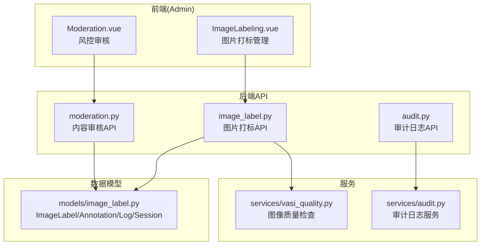
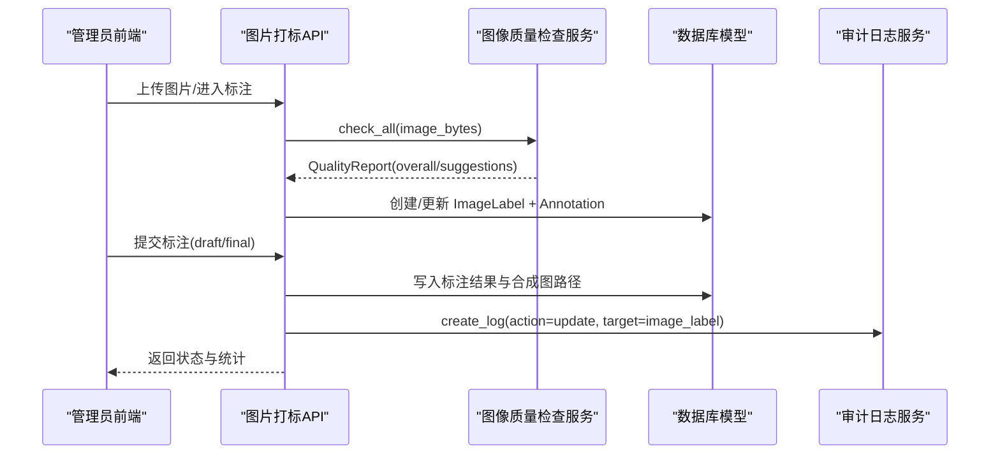
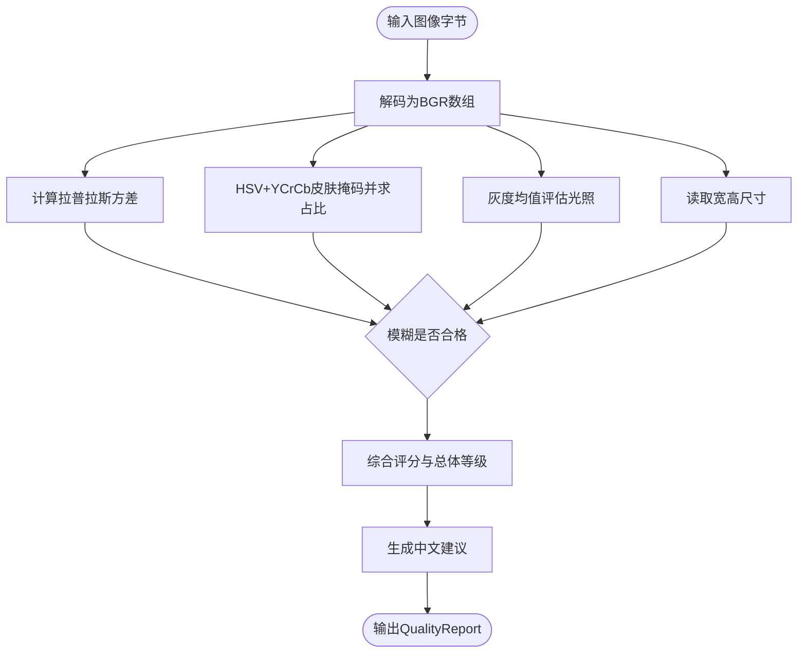
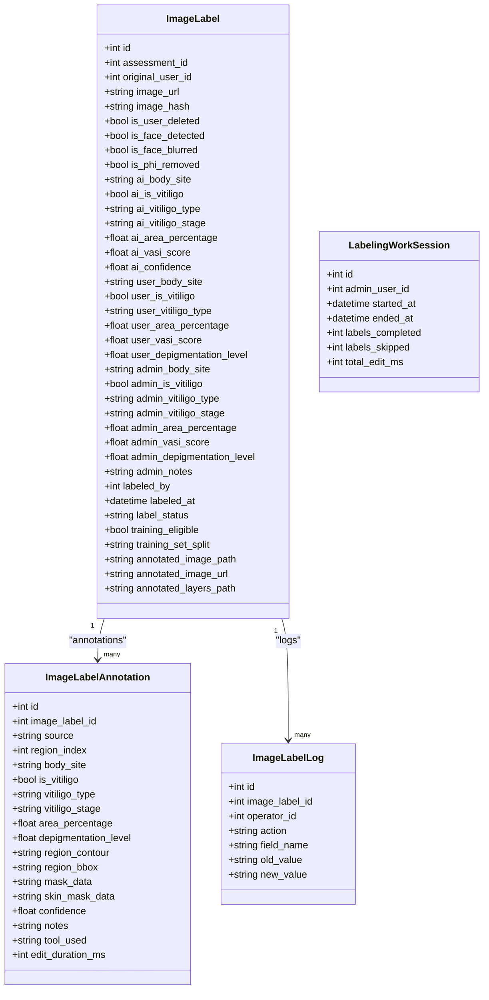
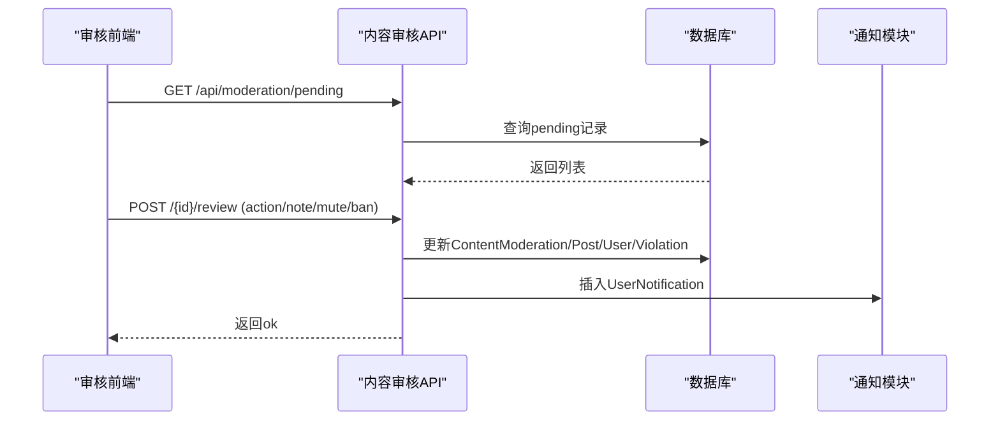
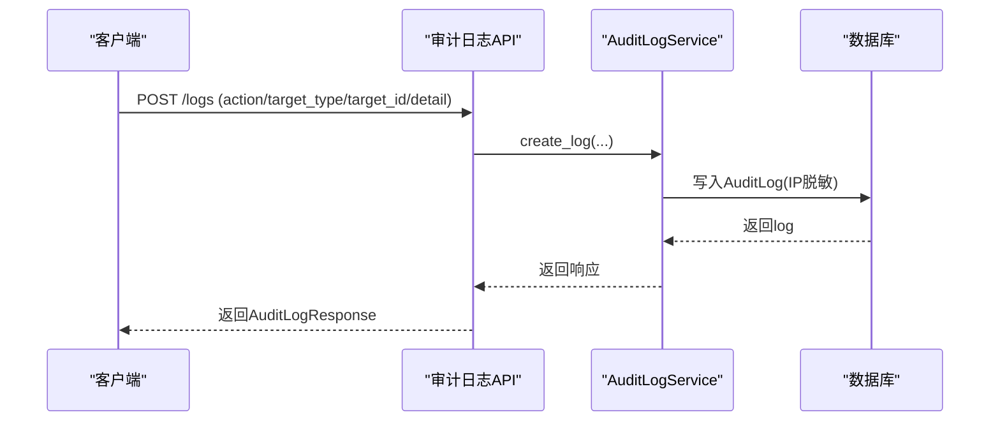
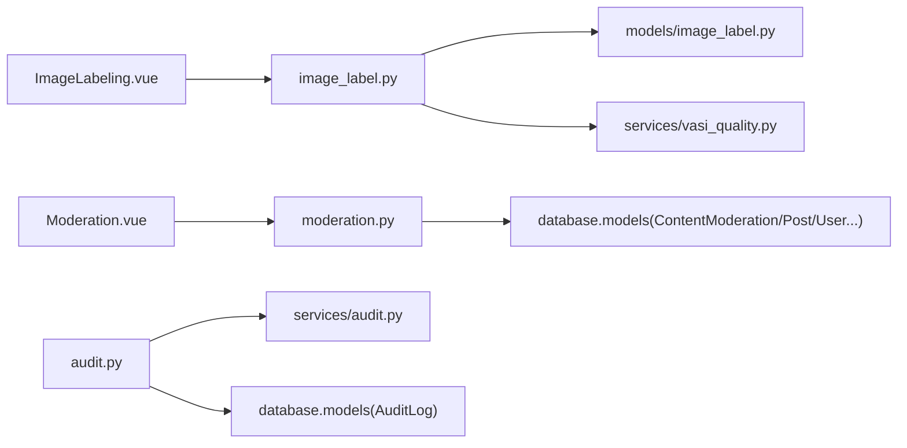

# 质量控制与审核

<cite>
**本文引用的文件**   
- [web/backend/api/image_label.py](file://web/backend/api/image_label.py)
- [web/backend/models/image_label.py](file://web/backend/models/image_label.py)
- [web/backend/services/vasi_quality.py](file://web/backend/services/vasi_quality.py)
- [web/admin/src/views/ImageLabeling.vue](file://web/admin/src/views/ImageLabeling.vue)
- [web/backend/api/moderation.py](file://web/backend/api/moderation.py)
- [web/admin/src/views/Moderation.vue](file://web/admin/src/views/Moderation.vue)
- [web/backend/api/audit.py](file://web/backend/api/audit.py)
- [web/backend/services/audit.py](file://web/backend/services/audit.py)
</cite>

## 目录
1. [引言](#引言)
2. [项目结构](#项目结构)
3. [核心组件](#核心组件)
4. [架构总览](#架构总览)
5. [详细组件分析](#详细组件分析)
6. [依赖关系分析](#依赖关系分析)
7. [性能考量](#性能考量)
8. [故障排查指南](#故障排查指南)
9. [结论](#结论)
10. [附录](#附录)

## 引言
本技术文档围绕 Subskin 图像标注系统的质量控制与审核能力展开，覆盖以下关键主题：
- 标注质量检查算法（模糊度、皮肤存在性、光照、分辨率）
- AI 预标注质量评估与一致性校验
- 异常检测与自动处理策略
- 人工复核工作流（任务分配、进度跟踪、统计指标）
- 审核标准制定、培训指导与持续改进策略
- 准确率统计与性能监控方案

## 项目结构
与质量控制和审核相关的前后端代码分布如下：
- 后端 API：图片打标管理、内容审核、审计日志
- 数据模型：图片标注主表、细粒度标注、操作日志、工作会话
- 质量服务：基于 OpenCV/Numpy 的图像质量检测
- 前端界面：管理员图片打标工作台、风控审核页面

**图表来源** 
- [web/admin/src/views/ImageLabeling.vue:1-800](file://web/admin/src/views/ImageLabeling.vue#L1-L800)
- [web/admin/src/views/Moderation.vue:1-700](file://web/admin/src/views/Moderation.vue#L1-L700)
- [web/backend/api/image_label.py:1-800](file://web/backend/api/image_label.py#L1-L800)
- [web/backend/api/moderation.py:1-418](file://web/backend/api/moderation.py#L1-L418)
- [web/backend/api/audit.py:1-124](file://web/backend/api/audit.py#L1-L124)
- [web/backend/models/image_label.py:1-325](file://web/backend/models/image_label.py#L1-L325)
- [web/backend/services/vasi_quality.py:1-285](file://web/backend/services/vasi_quality.py#L1-L285)
- [web/backend/services/audit.py:1-136](file://web/backend/services/audit.py#L1-L136)

**章节来源**
- [web/backend/api/image_label.py:270-328](file://web/backend/api/image_label.py#L270-L328)
- [web/backend/models/image_label.py:68-169](file://web/backend/models/image_label.py#L68-L169)
- [web/backend/services/vasi_quality.py:81-285](file://web/backend/services/vasi_quality.py#L81-L285)
- [web/admin/src/views/ImageLabeling.vue:268-800](file://web/admin/src/views/ImageLabeling.vue#L268-L800)
- [web/backend/api/moderation.py:108-229](file://web/backend/api/moderation.py#L108-L229)
- [web/admin/src/views/Moderation.vue:520-631](file://web/admin/src/views/Moderation.vue#L520-L631)
- [web/backend/api/audit.py:33-124](file://web/backend/api/audit.py#L33-L124)
- [web/backend/services/audit.py:11-136](file://web/backend/services/audit.py#L11-L136)

## 核心组件
- 图片打标管理 API：提供列表查询、详情获取、管理员标注提交、批量状态更新、训练导出等能力。支持草稿模式与合成图生成。
- 图像质量检查服务：对上传图像进行模糊度、皮肤存在性、光照、分辨率检测，输出结构化报告与建议。
- 内容审核 API：待审队列、历史查询、用户违规档案、通知与禁言/封号操作。
- 审计日志 API：记录操作轨迹、撤销机制、按目标追踪审计线索。
- 数据模型：ImageLabel（主表）、ImageLabelAnnotation（细粒度标注）、ImageLabelLog（变更日志）、LabelingWorkSession（效率追踪）。

**章节来源**
- [web/backend/api/image_label.py:270-757](file://web/backend/api/image_label.py#L270-L757)
- [web/backend/models/image_label.py:68-251](file://web/backend/models/image_label.py#L68-L251)
- [web/backend/services/vasi_quality.py:81-285](file://web/backend/services/vasi_quality.py#L81-L285)
- [web/backend/api/moderation.py:108-324](file://web/backend/api/moderation.py#L108-L324)
- [web/backend/api/audit.py:33-124](file://web/backend/api/audit.py#L33-L124)

## 架构总览
整体流程涵盖“上传→质量检查→AI预标注→人工复核→归档与导出”的闭环。

**图表来源** 
- [web/backend/api/image_label.py:592-757](file://web/backend/api/image_label.py#L592-L757)
- [web/backend/services/vasi_quality.py:188-271](file://web/backend/services/vasi_quality.py#L188-L271)
- [web/backend/models/image_label.py:68-169](file://web/backend/models/image_label.py#L68-L169)
- [web/backend/api/audit.py:33-52](file://web/backend/api/audit.py#L33-L52)
- [web/backend/services/audit.py:15-39](file://web/backend/services/audit.py#L15-L39)

## 详细组件分析

### 图像质量检查（VasiQualityChecker）
- 功能要点：
  - 模糊度检测：拉普拉斯方差阈值判定
  - 皮肤存在性：HSV+YCrCb双空间匹配，计算皮肤像素占比
  - 光照评估：灰度均值判断过暗/过曝
  - 分辨率检查：最小宽高阈值
  - 综合评级：good/acceptable/poor，并生成中文建议
- 复杂度与可用性：
  - 依赖 OpenCV/Numpy；不可用时降级为“可接受”并提示更新
  - 单次检查时间复杂度近似 O(W×H)，受图像尺寸影响

**图表来源** 
- [web/backend/services/vasi_quality.py:98-186](file://web/backend/services/vasi_quality.py#L98-L186)
- [web/backend/services/vasi_quality.py:188-271](file://web/backend/services/vasi_quality.py#L188-L271)

**章节来源**
- [web/backend/services/vasi_quality.py:81-285](file://web/backend/services/vasi_quality.py#L81-L285)

### 图片打标管理（Admin Labeling）
- 能力概览：
  - 列表筛选：label_status、is_vitiligo、body_site、training_eligible、is_user_deleted
  - 详情获取：三级标注（AI/user/admin）与合成图路径
  - 管理员标注：支持字段级增量更新、草稿模式、细粒度标注保存
  - 合成图生成：优先使用前端提供的 data URL，否则服务端基于 mask_data 合成
  - 训练同步：将管理员标注同步至样本中心，用于主动学习与模型迭代
- 数据结构：
  - ImageLabel：主表，包含 AI/user/admin 三套标注字段、隐私标记、训练就绪标记、标注产物路径
  - ImageLabelAnnotation：细粒度标注，支持多区域、mask_data/skin_mask_data、工具与耗时追踪
  - ImageLabelLog：不可变操作日志，保障审计追溯
  - LabelingWorkSession：管理员工作效率统计

**图表来源** 
- [web/backend/models/image_label.py:68-251](file://web/backend/models/image_label.py#L68-L251)

**章节来源**
- [web/backend/api/image_label.py:270-757](file://web/backend/api/image_label.py#L270-L757)
- [web/backend/models/image_label.py:68-251](file://web/backend/models/image_label.py#L68-L251)

### 内容审核（Moderation）
- 能力概览：
  - 待审队列：按风险等级过滤、分页、作者与帖子信息聚合
  - 复核操作：通过/拒绝/升级，支持禁言时长与封号
  - 用户违规档案：统计高/中/低风险数量、最近操作日志
  - 通知系统：审核结果通知、禁言/封号通知
- 工作流要点：
  - 审核动作触发状态流转与用户状态更新
  - 违规日志持久化，便于审计与回溯

**图表来源** 
- [web/backend/api/moderation.py:108-229](file://web/backend/api/moderation.py#L108-L229)
- [web/admin/src/views/Moderation.vue:520-631](file://web/admin/src/views/Moderation.vue#L520-L631)

**章节来源**
- [web/backend/api/moderation.py:108-324](file://web/backend/api/moderation.py#L108-L324)
- [web/admin/src/views/Moderation.vue:1-700](file://web/admin/src/views/Moderation.vue#L1-L700)

### 审计日志（Audit）
- 能力概览：
  - 创建审计日志：记录操作人、目标类型/ID、范围、详情、IP脱敏
  - 查询与撤销：支持按用户/目标查询，可撤销且防越权
  - 目标审计线索：非管理员仅可见自身操作，防止枚举他人审计轨迹
- 设计要点：
  - IP 地址脱敏存储
  - 撤销机制需确认，避免误操作

**图表来源** 
- [web/backend/api/audit.py:33-52](file://web/backend/api/audit.py#L33-L52)
- [web/backend/services/audit.py:15-39](file://web/backend/services/audit.py#L15-L39)

**章节来源**
- [web/backend/api/audit.py:33-124](file://web/backend/api/audit.py#L33-L124)
- [web/backend/services/audit.py:11-136](file://web/backend/services/audit.py#L11-L136)

## 依赖关系分析
- 前端依赖：
  - ImageLabeling.vue 调用图片打标 API，加载详情、用户/AI预填充数据、提交标注与草稿
  - Moderation.vue 调用内容审核 API，展示待审队列与历史，执行复核动作
- 后端依赖：
  - image_label.py 依赖 models/image_label.py 与 services/vasi_quality.py
  - moderation.py 依赖 database models（ContentModeration、Post、UserViolation、UserNotification）
  - audit.py 依赖 services/audit.py 与 database models（AuditLog）

**图表来源** 
- [web/admin/src/views/ImageLabeling.vue:268-800](file://web/admin/src/views/ImageLabeling.vue#L268-L800)
- [web/admin/src/views/Moderation.vue:520-631](file://web/admin/src/views/Moderation.vue#L520-L631)
- [web/backend/api/image_label.py:270-757](file://web/backend/api/image_label.py#L270-L757)
- [web/backend/api/moderation.py:108-324](file://web/backend/api/moderation.py#L108-L324)
- [web/backend/api/audit.py:33-124](file://web/backend/api/audit.py#L33-L124)

**章节来源**
- [web/backend/api/image_label.py:270-757](file://web/backend/api/image_label.py#L270-L757)
- [web/backend/api/moderation.py:108-324](file://web/backend/api/moderation.py#L108-L324)
- [web/backend/api/audit.py:33-124](file://web/backend/api/audit.py#L33-L124)

## 性能考量
- 图像质量检查：
  - 使用 OpenCV/Numpy 进行像素级运算，注意大图的内存与CPU开销
  - 在不可用环境下优雅降级，避免阻塞主流程
- 标注合成图生成：
  - 优先使用前端提供的 data URL 直接保存，减少服务端解码与合成成本
  - 若回退到服务端合成，注意 PNG 层数与尺寸对 I/O 的影响
- 数据库查询：
  - 列表接口采用分页与索引优化（如 label_status、assessment_id、created_at）
  - 详情接口使用 joinedload 减少 N+1 查询
- 并发与稳定性：
  - 标注提交与合成图生成失败应非阻塞记录日志，不影响主事务
  - 网络请求与外部资源访问设置超时与重试策略

[本节为通用指导，不直接分析具体文件]

## 故障排查指南
- 图像质量检查不可用：
  - 现象：check_all 返回 acceptable 并提示更新
  - 排查：确认 opencv-python-headless 与 numpy 已安装；检查图像解码异常
- 标注合成图未生成：
  - 现象：annotated_image_path/url 为空
  - 排查：确认前端 data URL 格式正确；检查服务端 Pillow 可用性与路径权限
- 审核操作失败：
  - 现象：403/404/400 错误
  - 排查：确认管理员权限、记录存在、参数合法；查看 UserNotification 是否成功插入
- 审计日志无法撤销：
  - 现象：ValueError 提示不可撤销或已撤销
  - 排查：确认 revokeable 标志与 revoked_at 状态；核对用户权限

**章节来源**
- [web/backend/services/vasi_quality.py:188-271](file://web/backend/services/vasi_quality.py#L188-L271)
- [web/backend/api/image_label.py:692-757](file://web/backend/api/image_label.py#L692-L757)
- [web/backend/api/moderation.py:144-229](file://web/backend/api/moderation.py#L144-L229)
- [web/backend/services/audit.py:41-53](file://web/backend/services/audit.py#L41-L53)

## 结论
Subskin 图像标注系统的质量控制与审核体系以“自动化质量检查 + AI 预标注 + 人工复核”为核心，结合完善的审计与通知机制，形成闭环的数据治理流程。通过结构化模型、可配置的工作流与清晰的指标统计，系统能够持续提升标注准确率与审核效率，并为后续模型训练与主动学习提供高质量数据基础。

[本节为总结性内容，不直接分析具体文件]

## 附录
- 质量控制指标建议：
  - 图像质量：blur_ok、skin_ok、lighting_ok、size_ok
  - 标注一致性：AI vs 用户 vs 管理员差异度量（面积占比、分型、阶段）
  - 审核通过率：approved/rejected/penalized 比例
  - 效率指标：平均标注耗时、每会话完成量、跳过率
- 准确率统计与监控：
  - 定期抽样比对 AI/user/admin 标注差异，计算 IoU/面积误差
  - 建立看板展示 pending/labeled/training_ready 趋势
  - 监控质量检查服务可用性、合成图生成成功率、审核响应时延
- 审核标准与培训：
  - 明确白癜风分型与阶段定义、面积估算规范
  - 制定标注工具使用规范与常见错误示例
  - 定期复盘争议案例，统一标注口径

[本节为通用指导，不直接分析具体文件]