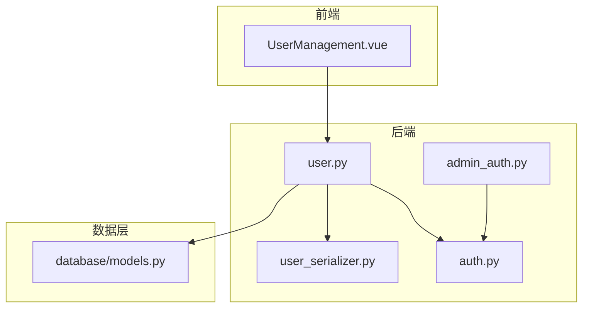
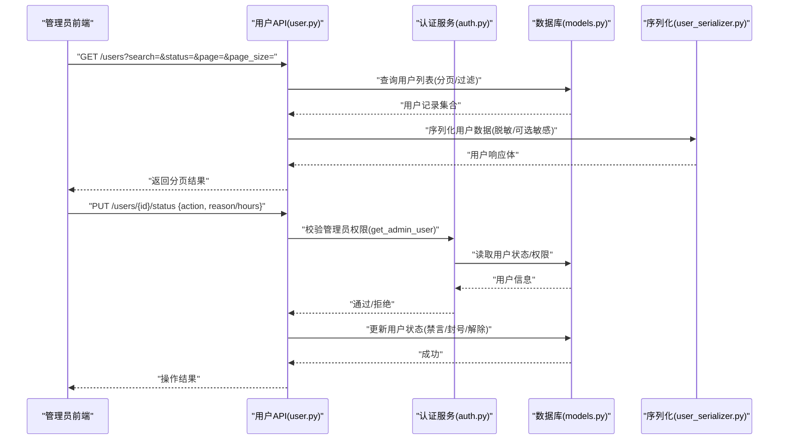
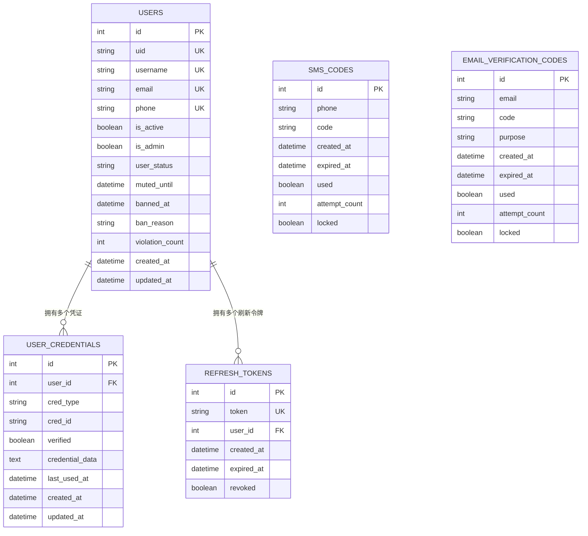
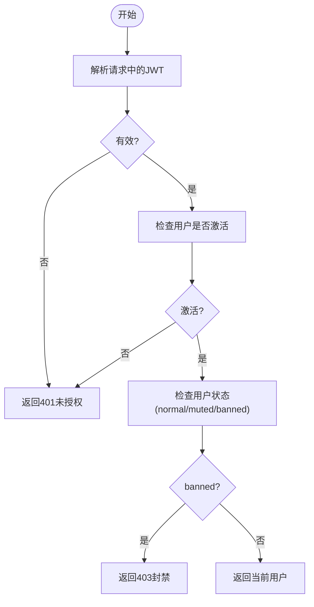
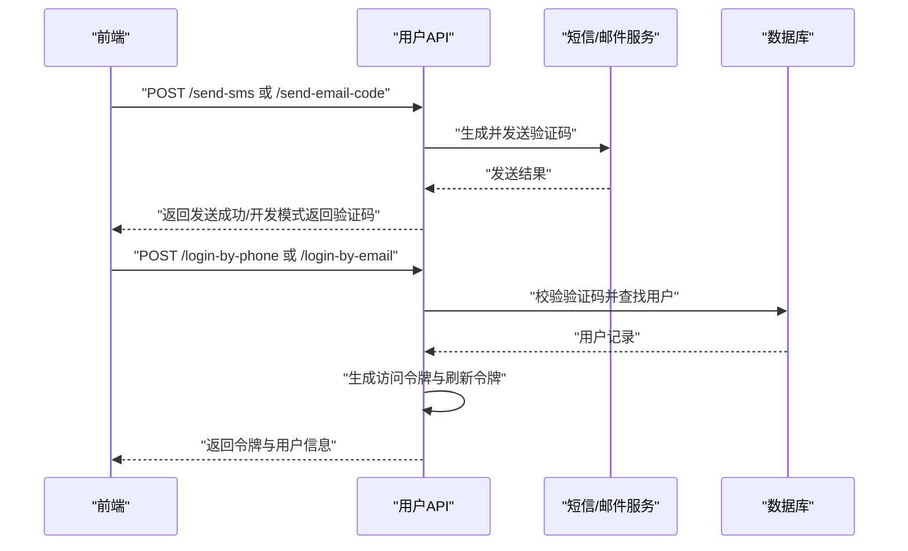
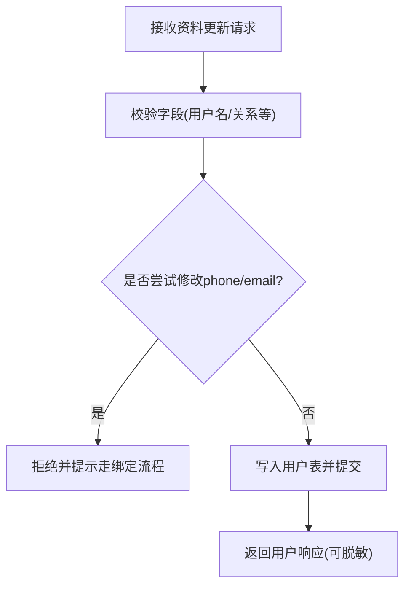
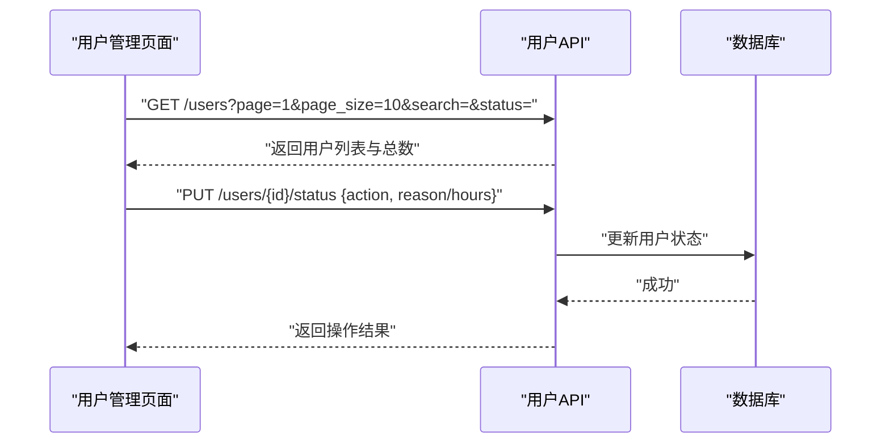
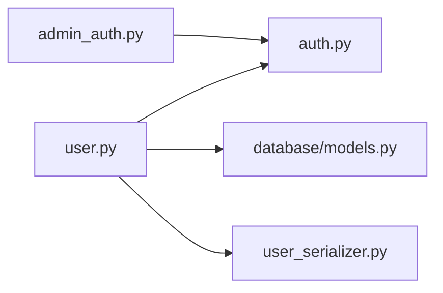

# 用户管理

<cite>
**本文引用的文件**
- [web/backend/api/user.py](file://web/backend/api/user.py)
- [web/backend/models/user.py](file://web/backend/models/user.py)
- [web/backend/services/auth.py](file://web/backend/services/auth.py)
- [web/backend/services/admin_auth.py](file://web/backend/services/admin_auth.py)
- [web/backend/database/models.py](file://web/backend/database/models.py)
- [web/backend/services/user_serializer.py](file://web/backend/services/user_serializer.py)
- [web/admin/src/views/UserManagement.vue](file://web/admin/src/views/UserManagement.vue)
- [tests/backend/api/test_user.py](file://tests/backend/api/test_user.py)
</cite>

## 目录
1. [简介](#简介)
2. [项目结构](#项目结构)
3. [核心组件](#核心组件)
4. [架构总览](#架构总览)
5. [详细组件分析](#详细组件分析)
6. [依赖关系分析](#依赖关系分析)
7. [性能考虑](#性能考虑)
8. [故障排查指南](#故障排查指南)
9. [结论](#结论)
10. [附录：API 参考与前端使用示例](#附录api-参考与前端使用示例)

## 简介
本技术文档围绕 Subskin 的用户管理功能，系统梳理并说明以下能力：
- 用户 CRUD 操作界面（管理员端）
- 批量导入/导出（现状评估与建议）
- 用户状态管理与权限分配
- 数据模型、密码加密存储、登录日志与账户安全设置
- 搜索过滤、分页加载、表单验证与错误处理
- 用户相关 API 接口与前端组件使用示例

## 项目结构
用户管理涉及后端 API、认证服务、数据库模型、序列化器以及管理员前端页面。整体组织如下：
- 后端 API：用户注册、登录、资料更新、凭证绑定、头像上传等
- 认证与安全：JWT 访问令牌与刷新令牌、密码哈希、封禁/禁言控制
- 数据模型：用户表、凭证表、验证码表、刷新令牌表
- 序列化：统一将数据库对象转为 API 响应，支持敏感字段脱敏
- 前端：管理员用户管理页面，提供搜索、分页、状态变更等操作

图表来源
- [web/admin/src/views/UserManagement.vue:1-120](file://web/admin/src/views/UserManagement.vue#L1-L120)
- [web/backend/api/user.py:217-239](file://web/backend/api/user.py#L217-L239)
- [web/backend/services/auth.py:153-220](file://web/backend/services/auth.py#L153-L220)
- [web/backend/services/user_serializer.py:11-54](file://web/backend/services/user_serializer.py#L11-L54)
- [web/backend/database/models.py:88-180](file://web/backend/database/models.py#L88-L180)

章节来源
- [web/backend/api/user.py:217-239](file://web/backend/api/user.py#L217-L239)
- [web/backend/services/auth.py:153-220](file://web/backend/services/auth.py#L153-L220)
- [web/backend/database/models.py:88-180](file://web/backend/database/models.py#L88-L180)
- [web/backend/services/user_serializer.py:11-54](file://web/backend/services/user_serializer.py#L11-L54)
- [web/admin/src/views/UserManagement.vue:1-120](file://web/admin/src/views/UserManagement.vue#L1-L120)

## 核心组件
- 用户 API 路由：提供登录、注册、资料更新、凭证绑定、头像上传、验证码发送等能力
- 认证服务：JWT 生成与校验、刷新令牌管理、密码哈希与校验、当前用户解析、封禁拦截
- 管理员鉴权：仅允许已授予 is_admin 的用户访问管理接口，环境白名单仅作二次校验提示
- 数据模型：用户、凭证、验证码、刷新令牌等 ORM 定义
- 序列化器：统一输出用户信息，支持私密字段脱敏与敏感字段直出
- 前端用户管理：搜索、分页、详情弹窗、状态变更（禁言/解封/封号/解除封号）

章节来源
- [web/backend/api/user.py:217-800](file://web/backend/api/user.py#L217-L800)
- [web/backend/services/auth.py:35-220](file://web/backend/services/auth.py#L35-L220)
- [web/backend/services/admin_auth.py:22-56](file://web/backend/services/admin_auth.py#L22-L56)
- [web/backend/database/models.py:30-180](file://web/backend/database/models.py#L30-L180)
- [web/backend/services/user_serializer.py:11-54](file://web/backend/services/user_serializer.py#L11-L54)
- [web/admin/src/views/UserManagement.vue:171-540](file://web/admin/src/views/UserManagement.vue#L171-L540)

## 架构总览
下图展示了从管理员前端到后端 API、认证服务、数据库模型的调用链路，以及关键的数据流转。

图表来源
- [web/admin/src/views/UserManagement.vue:400-540](file://web/admin/src/views/UserManagement.vue#L400-L540)
- [web/backend/api/user.py:217-239](file://web/backend/api/user.py#L217-L239)
- [web/backend/services/auth.py:153-220](file://web/backend/services/auth.py#L153-L220)
- [web/backend/database/models.py:88-180](file://web/backend/database/models.py#L88-L180)
- [web/backend/services/user_serializer.py:11-54](file://web/backend/services/user_serializer.py#L11-L54)

## 详细组件分析

### 用户数据模型与关系
- 用户表 users：包含基础信息、隐私开关、状态字段（normal/muted/banned）、违规计数、时间戳等
- 凭证表 user_credentials：多对一关联用户，支持 phone/email/password/wechat/alipay 等多种登录方式
- 验证码表 sms_codes/email_verification_codes：用于短信/邮箱验证码的创建、校验与过期管理
- 刷新令牌表 refresh_tokens：持久化刷新令牌，支持撤销与清理

图表来源
- [web/backend/database/models.py:30-180](file://web/backend/database/models.py#L30-L180)

章节来源
- [web/backend/database/models.py:30-180](file://web/backend/database/models.py#L30-L180)

### 认证与授权流程
- 密码哈希与校验：使用 bcrypt 进行密码哈希与验证
- JWT 访问令牌：短生命周期，支持管理员长时令牌
- 刷新令牌：持久化至数据库，支持撤销与批量撤销
- 当前用户解析：从请求头提取并校验 JWT，封禁用户直接拒绝
- 管理员鉴权：要求 is_admin 为真；环境变量白名单仅作为二次提示

图表来源
- [web/backend/services/auth.py:153-220](file://web/backend/services/auth.py#L153-L220)
- [web/backend/services/admin_auth.py:34-56](file://web/backend/services/admin_auth.py#L34-L56)

章节来源
- [web/backend/services/auth.py:35-220](file://web/backend/services/auth.py#L35-L220)
- [web/backend/services/admin_auth.py:22-56](file://web/backend/services/admin_auth.py#L22-L56)

### 用户注册与登录（含验证码）
- 用户名/邮箱/手机号登录：支持多种凭据类型
- 手机/邮箱验证码登录与注册：验证码校验通过后创建或登录用户
- 密码重置：通过绑定的手机号或邮箱验证码重置密码，并撤销该用户所有刷新令牌
- IP 维度验证码限速：防止滥用

图表来源
- [web/backend/api/user.py:454-481](file://web/backend/api/user.py#L454-L481)
- [web/backend/api/user.py:526-601](file://web/backend/api/user.py#L526-L601)
- [web/backend/api/user.py:604-661](file://web/backend/api/user.py#L604-L661)
- [web/backend/api/user.py:776-800](file://web/backend/api/user.py#L776-L800)

章节来源
- [web/backend/api/user.py:454-481](file://web/backend/api/user.py#L454-L481)
- [web/backend/api/user.py:526-601](file://web/backend/api/user.py#L526-L601)
- [web/backend/api/user.py:604-661](file://web/backend/api/user.py#L604-L661)
- [web/backend/api/user.py:776-800](file://web/backend/api/user.py#L776-L800)

### 用户资料更新与头像上传
- 资料更新：用户名唯一性校验、昵称长度限制、关系字段白名单校验
- 头像上传：图片类型与大小校验、保存路径规则、异步内容审核
- 敏感字段保护：手机号/邮箱修改必须走绑定流程，禁止通过通用资料接口直接更改

图表来源
- [web/backend/api/user.py:261-318](file://web/backend/api/user.py#L261-L318)

章节来源
- [web/backend/api/user.py:261-318](file://web/backend/api/user.py#L261-L318)

### 凭证绑定与解绑
- 绑定手机号/邮箱：需验证码校验，成功后同步历史字段
- 解绑凭证：防止解绑最后一个登录方式
- 列出凭证：返回用户已绑定的凭证列表

章节来源
- [web/backend/api/user.py:698-761](file://web/backend/api/user.py#L698-L761)

### 管理员用户管理界面
- 搜索与筛选：按用户名/邮箱/手机号模糊搜索，按状态筛选
- 分页加载：支持页码与每页条数切换
- 详情弹窗：展示用户基本信息、状态、违规次数、时间戳等
- 状态管理：禁言/解禁、封号/解封，带原因输入与确认

图表来源
- [web/admin/src/views/UserManagement.vue:400-540](file://web/admin/src/views/UserManagement.vue#L400-L540)

章节来源
- [web/admin/src/views/UserManagement.vue:171-540](file://web/admin/src/views/UserManagement.vue#L171-L540)

### 用户状态管理与权限分配
- 状态字段：normal/muted/banned，支持禁言截止时间与封号原因
- 权限分配：管理员权限通过 is_admin 标识与环境白名单二次提示；不建议运行时自动提升
- 封禁拦截：非正常状态用户在需要认证的接口被拒绝

章节来源
- [web/backend/database/models.py:88-137](file://web/backend/database/models.py#L88-L137)
- [web/backend/services/admin_auth.py:22-56](file://web/backend/services/admin_auth.py#L22-L56)
- [web/backend/services/auth.py:198-220](file://web/backend/services/auth.py#L198-L220)

### 密码加密存储与账户安全设置
- 密码哈希：bcrypt 方案，避免明文存储
- 刷新令牌：支持撤销与批量撤销，重置密码时强制重新认证
- 验证码限速：IP 维度限制，降低滥用风险
- 敏感字段脱敏：序列化器根据上下文决定是否返回原始或脱敏数据

章节来源
- [web/backend/services/auth.py:35-41](file://web/backend/services/auth.py#L35-L41)
- [web/backend/api/user.py:419-452](file://web/backend/api/user.py#L419-L452)
- [web/backend/services/user_serializer.py:11-54](file://web/backend/services/user_serializer.py#L11-L54)

### 搜索过滤、分页加载、表单验证与错误处理
- 搜索过滤：前端传递 search 与 status 参数，后端聚合查询
- 分页加载：前端维护 page/page_size/itemCount，后端返回 total/items
- 表单验证：Pydantic 模型校验手机号格式、邮箱格式、长度限制等
- 错误处理：HTTP 异常统一返回 detail 消息，前端捕获并提示

章节来源
- [web/admin/src/views/UserManagement.vue:400-540](file://web/admin/src/views/UserManagement.vue#L400-L540)
- [web/backend/models/user.py:20-89](file://web/backend/models/user.py#L20-L89)
- [tests/backend/api/test_user.py:40-75](file://tests/backend/api/test_user.py#L40-L75)

## 依赖关系分析
- 模块耦合：
  - user.py 依赖 auth.py 进行认证与令牌管理
  - user.py 依赖 database/models.py 进行数据存取
  - user.py 依赖 user_serializer.py 进行响应序列化
  - admin_auth.py 依赖 auth.py 获取当前用户并进行管理员校验
- 外部依赖：
  - JWT 库用于令牌编解码
  - passlib 用于密码哈希
  - FastAPI 路由与依赖注入
  - SQLAlchemy ORM 与数据库会话

图表来源
- [web/backend/api/user.py:217-239](file://web/backend/api/user.py#L217-L239)
- [web/backend/services/auth.py:153-220](file://web/backend/services/auth.py#L153-L220)
- [web/backend/database/models.py:88-180](file://web/backend/database/models.py#L88-L180)
- [web/backend/services/user_serializer.py:11-54](file://web/backend/services/user_serializer.py#L11-L54)
- [web/backend/services/admin_auth.py:34-56](file://web/backend/services/admin_auth.py#L34-L56)

章节来源
- [web/backend/api/user.py:217-239](file://web/backend/api/user.py#L217-L239)
- [web/backend/services/auth.py:153-220](file://web/backend/services/auth.py#L153-L220)
- [web/backend/database/models.py:88-180](file://web/backend/database/models.py#L88-L180)
- [web/backend/services/user_serializer.py:11-54](file://web/backend/services/user_serializer.py#L11-L54)
- [web/backend/services/admin_auth.py:34-56](file://web/backend/services/admin_auth.py#L34-L56)

## 性能考虑
- 验证码发送频率限制：按 IP 维度限制，防止分布式刷验证码
- 刷新令牌清理：定期清理过期或已撤销的刷新令牌，避免数据库膨胀
- 头像上传：限制文件大小与类型，减少无效请求与存储压力
- 序列化优化：按需返回敏感字段，减少不必要的数据传输

[本节为通用指导，不直接分析具体文件]

## 故障排查指南
- 登录失败：检查用户名/密码是否正确，或是否设置了密码；若未设置密码需使用验证码登录
- 验证码发送失败：检查短信/邮件服务配置与网络连通性；开发模式下会返回验证码便于调试
- 封禁/禁言操作失败：确认管理员权限与目标用户状态是否符合预期
- 刷新令牌失效：重置密码后会撤销该用户的所有刷新令牌，需重新登录

章节来源
- [web/backend/api/user.py:548-579](file://web/backend/api/user.py#L548-L579)
- [web/backend/api/user.py:664-695](file://web/backend/api/user.py#L664-L695)
- [web/backend/api/user.py:776-800](file://web/backend/api/user.py#L776-L800)
- [tests/backend/api/test_user.py:40-75](file://tests/backend/api/test_user.py#L40-L75)

## 结论
Subskin 的用户管理功能在认证、权限、状态管理与数据安全方面具备完善实现。管理员前端提供了直观的搜索、分页与状态管理能力。建议后续补充批量导入/导出能力以进一步提升运营效率。

[本节为总结，不直接分析具体文件]

## 附录：API 参考与前端使用示例

### 用户相关 API 概览
- 登录与注册
  - POST /api/user/login：用户名/邮箱/手机号 + 密码登录
  - POST /api/user/register：用户名 + 邮箱 + 密码注册
  - POST /api/user/register-by-phone：手机号 + 验证码注册
  - POST /api/user/register-by-email：邮箱 + 验证码注册
- 验证码
  - POST /api/user/send-sms：发送短信验证码（含 IP 限速）
  - POST /api/user/send-email-code：发送邮件验证码（含 IP 限速）
- 资料与凭证
  - GET /api/user/me：获取当前用户信息
  - PUT /api/user/me：更新个人资料（禁止直接改 phone/email）
  - POST /api/user/me/avatar：上传头像（类型与大小校验）
  - POST /api/user/bind-phone：绑定手机号（需验证码）
  - POST /api/user/bind-email：绑定邮箱（需验证码）
  - DELETE /api/user/credentials/{credential_id}：解绑凭证
  - GET /api/user/credentials：列出凭证
- 密码管理
  - POST /api/user/set-password：设置密码
  - POST /api/user/reset-password：通过验证码重置密码（撤销刷新令牌）

章节来源
- [web/backend/api/user.py:217-800](file://web/backend/api/user.py#L217-L800)

### 管理员用户管理前端使用示例
- 搜索与分页
  - 在搜索框输入用户名/邮箱/手机号，点击“搜索”或回车触发查询
  - 使用状态下拉选择器筛选 active/muted/banned
  - 分页控件支持切换页码与每页条数
- 查看详情
  - 点击“查看详情”打开详情弹窗，查看用户基本信息与状态
- 状态管理
  - 禁言：选择时长与原因后提交
  - 解禁：对处于禁言状态的用户执行解禁
  - 封号：填写原因后提交封号
  - 解封：对处于封号状态的用户执行解封

章节来源
- [web/admin/src/views/UserManagement.vue:171-540](file://web/admin/src/views/UserManagement.vue#L171-L540)

### 批量导入/导出（现状与建议）
- 现状：在当前代码中未发现专门的用户批量导入/导出 API 或前端入口
- 建议：
  - 后端新增批量导入接口，支持 CSV/Excel 解析与校验
  - 后端新增批量导出接口，支持按筛选条件导出用户列表
  - 前端增加导入/导出按钮与进度反馈

[本节为概念性建议，不直接分析具体文件]