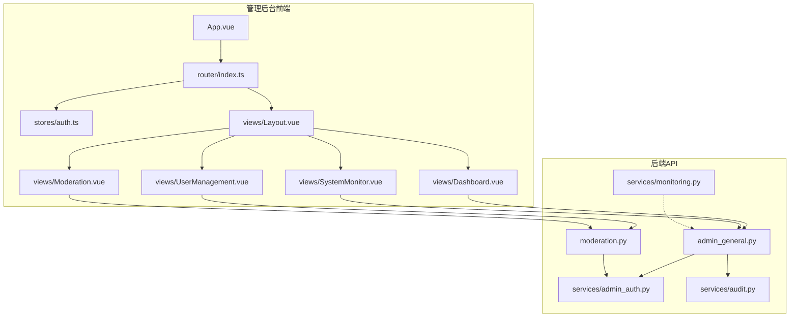
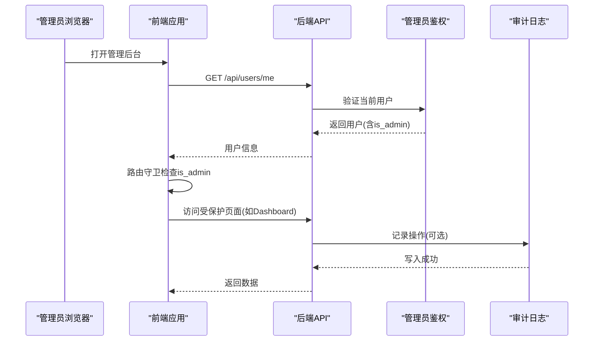
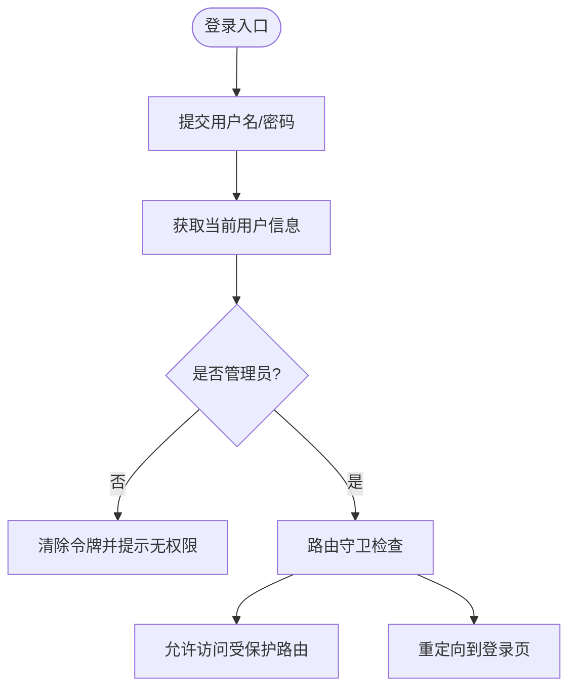
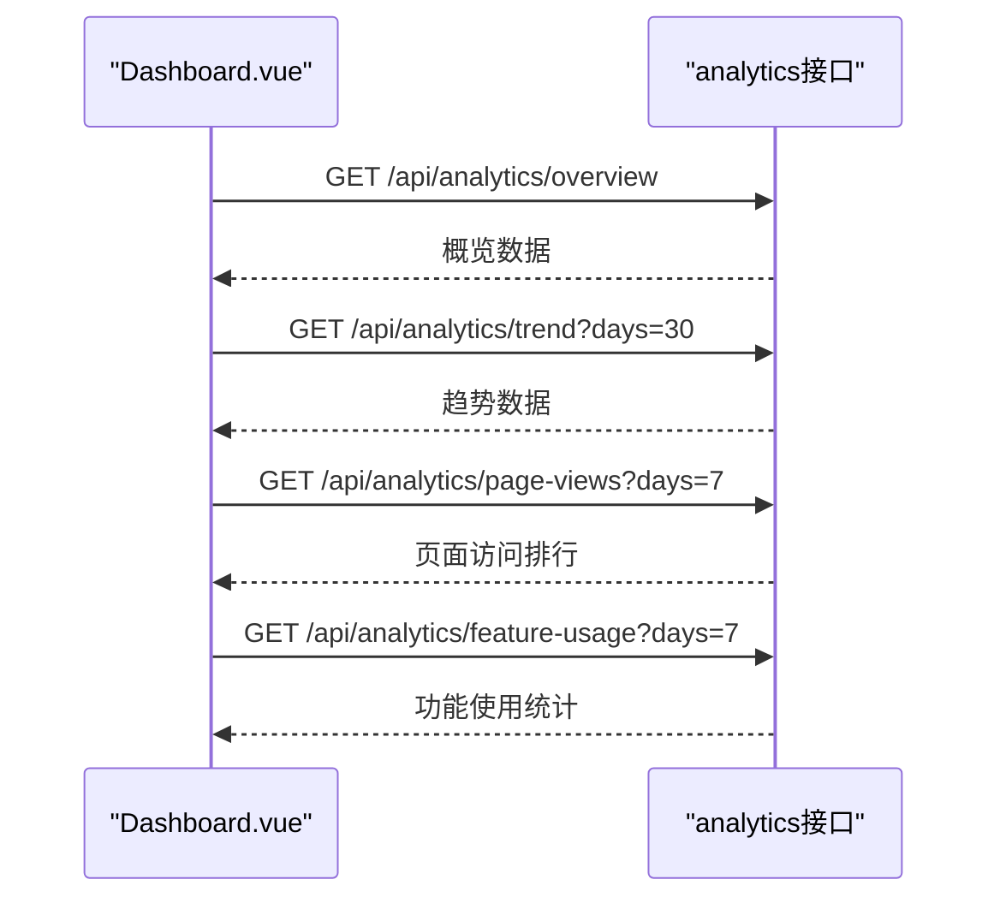
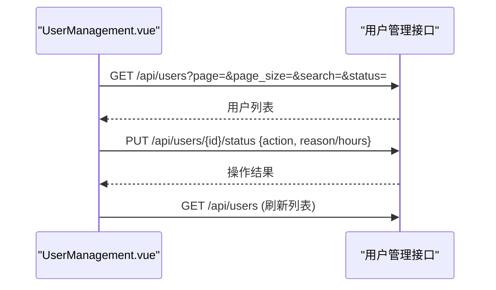
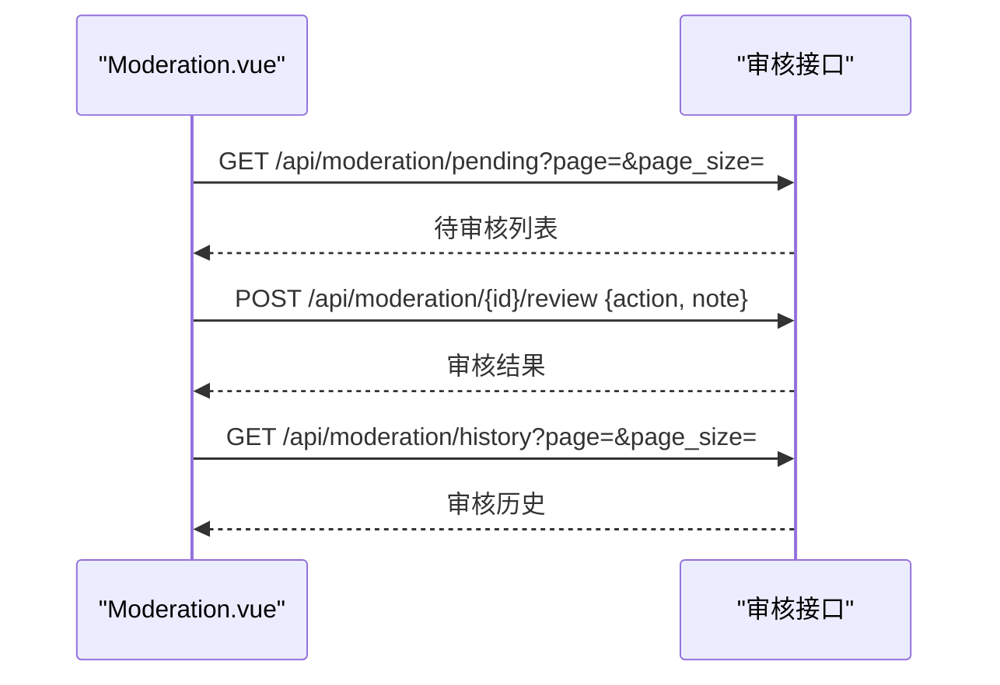
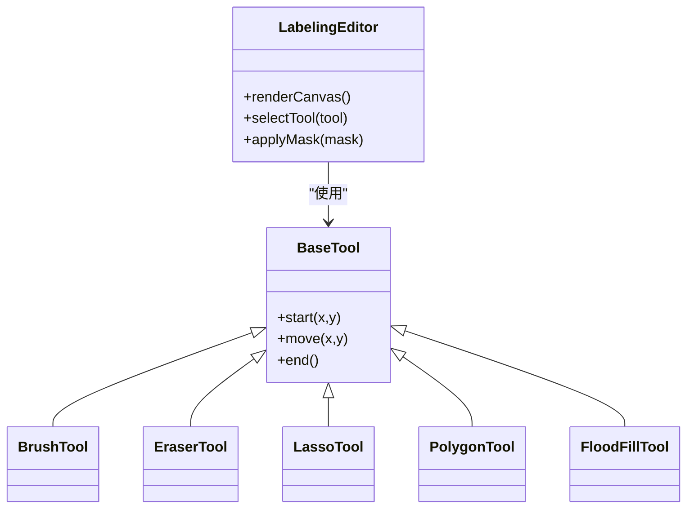
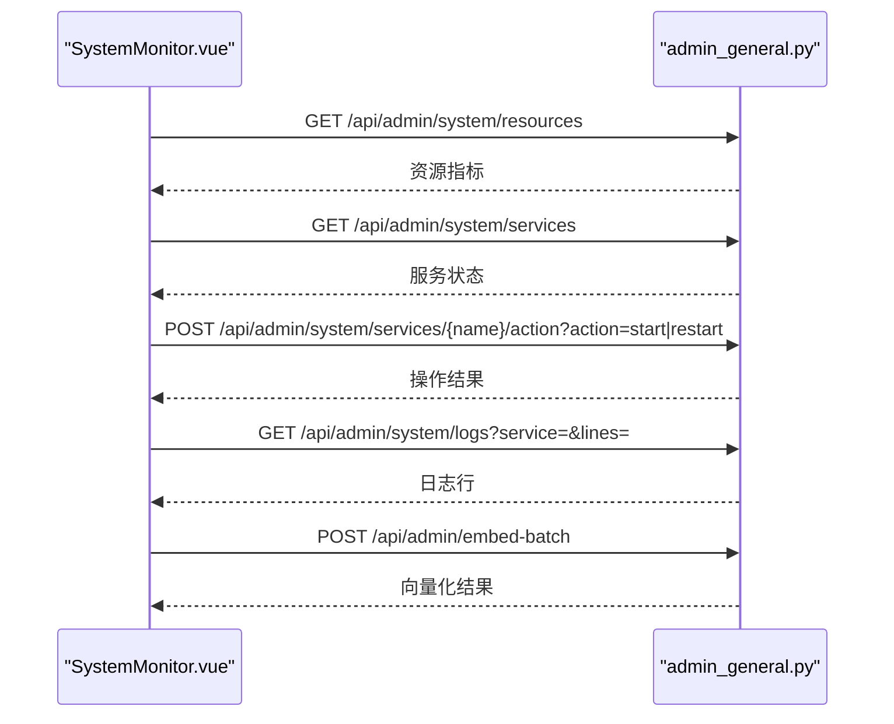
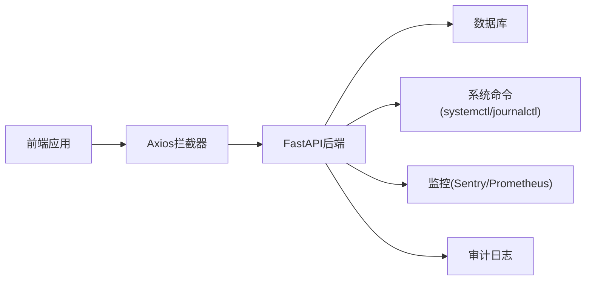

# 管理后台

<cite>
**本文引用的文件**
- [web/admin/src/main.ts](file://web/admin/src/main.ts)
- [web/admin/src/App.vue](file://web/admin/src/App.vue)
- [web/admin/src/router/index.ts](file://web/admin/src/router/index.ts)
- [web/admin/src/stores/auth.ts](file://web/admin/src/stores/auth.ts)
- [web/admin/src/api/request.ts](file://web/admin/src/api/request.ts)
- [web/admin/src/views/Layout.vue](file://web/admin/src/views/Layout.vue)
- [web/admin/src/views/Dashboard.vue](file://web/admin/src/views/Dashboard.vue)
- [web/admin/src/views/UserManagement.vue](file://web/admin/src/views/UserManagement.vue)
- [web/admin/src/views/Moderation.vue](file://web/admin/src/views/Moderation.vue)
- [web/admin/src/views/SystemMonitor.vue](file://web/admin/src/views/SystemMonitor.vue)
- [web/backend/api/admin_general.py](file://web/backend/api/admin_general.py)
- [web/backend/services/admin_auth.py](file://web/backend/services/admin_auth.py)
- [web/backend/services/audit.py](file://web/backend/services/audit.py)
- [web/backend/models/audit.py](file://web/backend/models/audit.py)
- [web/backend/api/moderation.py](file://web/backend/api/moderation.py)
- [web/backend/services/monitoring.py](file://web/backend/services/monitoring.py)
</cite>

## 目录
1. [简介](#简介)
2. [项目结构](#项目结构)
3. [核心组件](#核心组件)
4. [架构总览](#架构总览)
5. [详细组件分析](#详细组件分析)
6. [依赖关系分析](#依赖关系分析)
7. [性能与可观测性](#性能与可观测性)
8. [故障排查指南](#故障排查指南)
9. [结论](#结论)
10. [附录：管理API参考](#附录：管理api参考)

## 简介
本技术文档面向Subskin管理后台，覆盖Vue 3前端应用、权限控制、仪表盘、系统监控面板、用户管理、内容审核、图像标注工作区与批量处理能力。文档同时说明管理员权限模型、操作审计日志、系统配置管理与性能监控指标，并提供关键的前端组件实现要点与后端部署配置要点。

## 项目结构
管理后台由前后端两部分组成：
- 前端：基于Vue 3 + Vite + Pinia + Naive UI的SPA，提供登录、路由守卫、布局导航、仪表盘、用户管理、内容审核、系统监控等页面。
- 后端：FastAPI服务，提供管理员鉴权、内容生成、系统资源与服务状态查询、日志查看、知识库向量化触发等接口；内置审计日志与监控中间件。

图表来源
- [web/admin/src/App.vue:1-23](file://web/admin/src/App.vue#L1-L23)
- [web/admin/src/router/index.ts:1-84](file://web/admin/src/router/index.ts#L1-L84)
- [web/admin/src/stores/auth.ts:1-59](file://web/admin/src/stores/auth.ts#L1-L59)
- [web/admin/src/views/Layout.vue:1-385](file://web/admin/src/views/Layout.vue#L1-L385)
- [web/admin/src/views/Dashboard.vue:1-426](file://web/admin/src/views/Dashboard.vue#L1-L426)
- [web/admin/src/views/UserManagement.vue:1-578](file://web/admin/src/views/UserManagement.vue#L1-L578)
- [web/admin/src/views/Moderation.vue:1-700](file://web/admin/src/views/Moderation.vue#L1-L700)
- [web/admin/src/views/SystemMonitor.vue:1-634](file://web/admin/src/views/SystemMonitor.vue#L1-L634)
- [web/backend/api/admin_general.py:1-228](file://web/backend/api/admin_general.py#L1-L228)
- [web/backend/api/moderation.py:1-418](file://web/backend/api/moderation.py#L1-L418)
- [web/backend/services/admin_auth.py:1-56](file://web/backend/services/admin_auth.py#L1-L56)
- [web/backend/services/audit.py:1-136](file://web/backend/services/audit.py#L1-L136)
- [web/backend/services/monitoring.py:1-260](file://web/backend/services/monitoring.py#L1-L260)

章节来源
- [web/admin/src/main.ts:1-14](file://web/admin/src/main.ts#L1-L14)
- [web/admin/src/App.vue:1-23](file://web/admin/src/App.vue#L1-L23)
- [web/admin/src/router/index.ts:1-84](file://web/admin/src/router/index.ts#L1-L84)

## 核心组件
- 认证与会话
  - 前端通过Pinia store维护token与用户信息，登录成功后调用用户接口校验is_admin并持久化token。
  - Axios拦截器自动注入Authorization头，401时清理本地token。
- 路由与权限
  - 全局前置守卫强制非管理员访问受保护路由时重定向到登录页；已登录管理员访问登录页则重定向至首页。
- 布局与导航
  - 桌面侧边栏+移动端抽屉/底部导航，菜单项映射到各功能模块路由。
- 仪表盘
  - 展示DAU、总用户数、帖子数、VASI评估次数等统计卡片，趋势图使用ECharts渲染，支持7/14/30天切换。
- 用户管理
  - 列表分页、搜索、状态筛选；详情弹窗显示用户信息与违规记录；支持禁言/解封、封号/解封等操作。
- 内容审核
  - 待审核队列与复核历史双标签页；支持快速通过/拒绝/处罚与详情复核弹窗；展示AI风险等级、置信度与建议。
- 系统监控
  - CPU/内存/磁盘使用率、SQLite数据库大小、服务状态（subskin-backend/scheduler/nginx）、日志查看、手动触发知识库向量化。

章节来源
- [web/admin/src/stores/auth.ts:1-59](file://web/admin/src/stores/auth.ts#L1-L59)
- [web/admin/src/api/request.ts:1-32](file://web/admin/src/api/request.ts#L1-L32)
- [web/admin/src/router/index.ts:70-81](file://web/admin/src/router/index.ts#L70-L81)
- [web/admin/src/views/Layout.vue:113-153](file://web/admin/src/views/Layout.vue#L113-L153)
- [web/admin/src/views/Dashboard.vue:108-181](file://web/admin/src/views/Dashboard.vue#L108-L181)
- [web/admin/src/views/UserManagement.vue:171-398](file://web/admin/src/views/UserManagement.vue#L171-L398)
- [web/admin/src/views/Moderation.vue:220-434](file://web/admin/src/views/Moderation.vue#L220-L434)
- [web/admin/src/views/SystemMonitor.vue:213-363](file://web/admin/src/views/SystemMonitor.vue#L213-L363)

## 架构总览
管理后台采用前后端分离架构：
- 前端SPA负责页面渲染、交互与数据请求。
- 后端FastAPI提供RESTful API，统一鉴权、业务处理、审计与监控。
- 管理员权限通过后端依赖注入校验，前端在路由与登录流程中二次校验。

图表来源
- [web/admin/src/router/index.ts:70-81](file://web/admin/src/router/index.ts#L70-L81)
- [web/admin/src/stores/auth.ts:18-36](file://web/admin/src/stores/auth.ts#L18-L36)
- [web/backend/services/admin_auth.py:34-56](file://web/backend/services/admin_auth.py#L34-L56)
- [web/backend/services/audit.py:94-136](file://web/backend/services/audit.py#L94-L136)

## 详细组件分析

### 认证与权限控制
- 前端登录流程
  - 提交用户名密码，获取access_token并存储到localStorage。
  - 拉取当前用户信息，若is_admin为假则登出并提示无管理员权限。
- 路由守卫
  - 非公开路由且未登录或非管理员时重定向到/login。
  - 已登录管理员访问/login时重定向到根路径。
- 后端管理员鉴权
  - 通过get_admin_user依赖注入校验is_admin或环境白名单（仅作为二次门控）。
  - 对敏感操作进行审计记录。

图表来源
- [web/admin/src/stores/auth.ts:18-36](file://web/admin/src/stores/auth.ts#L18-L36)
- [web/admin/src/router/index.ts:70-81](file://web/admin/src/router/index.ts#L70-L81)
- [web/backend/services/admin_auth.py:34-56](file://web/backend/services/admin_auth.py#L34-L56)

章节来源
- [web/admin/src/stores/auth.ts:1-59](file://web/admin/src/stores/auth.ts#L1-L59)
- [web/admin/src/api/request.ts:1-32](file://web/admin/src/api/request.ts#L1-L32)
- [web/admin/src/router/index.ts:1-84](file://web/admin/src/router/index.ts#L1-L84)
- [web/backend/services/admin_auth.py:1-56](file://web/backend/services/admin_auth.py#L1-L56)

### 仪表盘
- 数据概览
  - 顶部卡片展示今日活跃用户、总用户数、总帖子数、VASI评估次数。
- 趋势图
  - 支持7/14/30天切换，ECharts渲染UV/PV/新增用户曲线。
- 页面访问排行与功能使用统计
  - 表格展示近7天页面访问量与UV，以及功能使用PV/UV。

图表来源
- [web/admin/src/views/Dashboard.vue:301-361](file://web/admin/src/views/Dashboard.vue#L301-L361)

章节来源
- [web/admin/src/views/Dashboard.vue:1-426](file://web/admin/src/views/Dashboard.vue#L1-L426)

### 用户管理
- 列表与筛选
  - 支持按用户名/邮箱/手机号搜索，按状态筛选（正常/禁言/封号），分页加载。
- 用户详情
  - 弹窗展示用户基本信息、状态、违规次数、注册时间、禁言/封号时间等。
- 处置操作
  - 禁言/解除禁言：设置muted_until与状态，记录违规日志。
  - 封号/解封：设置banned_at/ban_reason与状态，记录违规日志。

图表来源
- [web/admin/src/views/UserManagement.vue:400-536](file://web/admin/src/views/UserManagement.vue#L400-L536)
- [web/backend/api/moderation.py:264-324](file://web/backend/api/moderation.py#L264-L324)

章节来源
- [web/admin/src/views/UserManagement.vue:1-578](file://web/admin/src/views/UserManagement.vue#L1-L578)
- [web/backend/api/moderation.py:232-324](file://web/backend/api/moderation.py#L232-L324)

### 内容审核工具
- 待审核队列
  - 展示高风险内容、AI建议、置信度与自动动作，支持快速通过/拒绝/处罚。
- 复核历史
  - 展示已处理记录，包括复核人、时间与备注。
- 复核弹窗
  - 展示内容快照、AI分析结果与复核表单，提交后更新状态并通知用户。

图表来源
- [web/admin/src/views/Moderation.vue:519-622](file://web/admin/src/views/Moderation.vue#L519-L622)
- [web/backend/api/moderation.py:108-229](file://web/backend/api/moderation.py#L108-L229)

章节来源
- [web/admin/src/views/Moderation.vue:1-700](file://web/admin/src/views/Moderation.vue#L1-L700)
- [web/backend/api/moderation.py:1-418](file://web/backend/api/moderation.py#L1-L418)

### 图像标注界面与批量处理
- 标注工作区
  - 提供画布工具（画笔、橡皮擦、套索、多边形、泛洪填充）与病灶管理、快捷键面板。
  - 支持标注历史撤销/重做、轮廓编辑与导出。
- 批量能力
  - 后端提供批量向量化接口，管理员可手动触发对embedding为空文档的增量向量化。

图表来源
- [web/admin/src/components/labeling/tools/BaseTool.ts](file://web/admin/src/components/labeling/tools/BaseTool.ts)
- [web/admin/src/components/labeling/tools/BrushTool.ts](file://web/admin/src/components/labeling/tools/BrushTool.ts)
- [web/admin/src/components/labeling/tools/EraserTool.ts](file://web/admin/src/components/labeling/tools/EraserTool.ts)
- [web/admin/src/components/labeling/tools/LassoTool.ts](file://web/admin/src/components/labeling/tools/LassoTool.ts)
- [web/admin/src/components/labeling/tools/PolygonTool.ts](file://web/admin/src/components/labeling/tools/PolygonTool.ts)
- [web/admin/src/components/labeling/tools/FloodFillTool.ts](file://web/admin/src/components/labeling/tools/FloodFillTool.ts)
- [web/admin/src/composables/useCanvasTools.ts](file://web/admin/src/composables/useCanvasTools.ts)
- [web/admin/src/composables/useLabelHistory.ts](file://web/admin/src/composables/useLabelHistory.ts)
- [web/admin/src/composables/useLesionManager.ts](file://web/admin/src/composables/useLesionManager.ts)

章节来源
- [web/admin/src/components/labeling/LabelingEditor.vue](file://web/admin/src/components/labeling/LabelingEditor.vue)
- [web/admin/src/components/labeling/MaskEditorAdmin.vue](file://web/admin/src/components/labeling/MaskEditorAdmin.vue)
- [web/admin/src/components/labeling/VitiligoContourAdmin.vue](file://web/admin/src/components/labeling/VitiligoContourAdmin.vue)
- [web/backend/api/admin_general.py:219-228](file://web/backend/api/admin_general.py#L219-L228)

### 系统监控面板
- 资源监控
  - CPU使用率、内存使用量/总量、磁盘使用量/总量、SQLite数据库大小。
- 服务状态
  - 查询subskin-backend、subskin-scheduler、nginx服务状态，支持启动/重启（停止操作被限制以避免站点不可恢复）。
- 日志查看
  - 支持选择后端服务或应用日志文件，分页读取最近N行。
- 知识库向量化
  - 手动触发对embedding为空文档的批量向量化任务。

图表来源
- [web/admin/src/views/SystemMonitor.vue:457-539](file://web/admin/src/views/SystemMonitor.vue#L457-L539)
- [web/backend/api/admin_general.py:79-228](file://web/backend/api/admin_general.py#L79-L228)

章节来源
- [web/admin/src/views/SystemMonitor.vue:1-634](file://web/admin/src/views/SystemMonitor.vue#L1-L634)
- [web/backend/api/admin_general.py:1-228](file://web/backend/api/admin_general.py#L1-L228)

## 依赖关系分析
- 前端依赖
  - Vue 3、Pinia、Naive UI、ECharts、Axios、RemixIcon。
- 后端依赖
  - FastAPI、SQLAlchemy、psutil、systemctl（服务控制）、journalctl/tail（日志读取）、Sentry/Prometheus（可选监控）。
- 组件耦合
  - 前端通过统一的axios实例发起请求，携带Bearer Token。
  - 后端通过依赖注入获取管理员用户，并对敏感操作记录审计日志。
  - 监控中间件收集HTTP请求指标与健康检查。

图表来源
- [web/admin/src/api/request.ts:1-32](file://web/admin/src/api/request.ts#L1-L32)
- [web/backend/api/admin_general.py:79-228](file://web/backend/api/admin_general.py#L79-L228)
- [web/backend/services/monitoring.py:96-203](file://web/backend/services/monitoring.py#L96-L203)
- [web/backend/services/audit.py:1-136](file://web/backend/services/audit.py#L1-L136)

章节来源
- [web/admin/package.json:1-30](file://web/admin/package.json#L1-L30)
- [web/backend/services/monitoring.py:1-260](file://web/backend/services/monitoring.py#L1-L260)

## 性能与可观测性
- 前端性能
  - 图表按需初始化与销毁，避免内存泄漏。
  - 移动端适配与懒加载路由减少首屏压力。
- 后端性能
  - 系统资源查询使用psutil，服务状态与控制通过systemctl执行，注意超时与错误处理。
  - 日志读取限制行数，避免大文件拖慢响应。
- 可观测性
  - Sentry集成用于异常追踪，过滤敏感字段。
  - Prometheus中间件收集HTTP请求计数、耗时与并发数，暴露/metrics端点。
  - 健康检查端点检测数据库连接与磁盘空间。

章节来源
- [web/backend/services/monitoring.py:28-91](file://web/backend/services/monitoring.py#L28-L91)
- [web/backend/services/monitoring.py:96-203](file://web/backend/services/monitoring.py#L96-L203)
- [web/backend/services/monitoring.py:208-241](file://web/backend/services/monitoring.py#L208-L241)

## 故障排查指南
- 登录失败或无管理员权限
  - 检查前端是否成功获取access_token与用户信息，确认is_admin为真。
  - 后端依赖注入校验失败会返回403，需确保用户已通过管理员授权流程。
- 路由守卫跳转异常
  - 确认路由meta标记与守卫逻辑一致，非管理员访问受保护路由会被重定向。
- 系统服务操作失败
  - 检查systemctl权限与超时，确认服务名称与操作类型合法。
  - 审计日志记录操作者，便于追溯。
- 日志查看为空
  - 确认选择的日志源存在且可读，调整lines参数。
- 向量化任务失败
  - 检查后端任务执行状态与错误信息，重试或排查依赖服务。

章节来源
- [web/admin/src/stores/auth.ts:18-36](file://web/admin/src/stores/auth.ts#L18-L36)
- [web/admin/src/router/index.ts:70-81](file://web/admin/src/router/index.ts#L70-L81)
- [web/backend/api/admin_general.py:135-189](file://web/backend/api/admin_general.py#L135-L189)
- [web/backend/api/admin_general.py:192-216](file://web/backend/api/admin_general.py#L192-L216)
- [web/backend/api/admin_general.py:219-228](file://web/backend/api/admin_general.py#L219-L228)

## 结论
Subskin管理后台以Vue 3构建现代化管理界面，结合FastAPI提供稳健的后端能力。权限控制严格，审计日志完善，系统监控与内容审核功能齐全。通过模块化设计与清晰的API边界，便于扩展与维护。建议在生产环境启用Sentry与Prometheus，强化异常追踪与性能监控。

## 附录：管理API参考
- 管理员综合
  - GET /api/admin/content/briefings：列出简报文件
  - POST /api/admin/content/generate-briefing：触发简报生成
  - GET /api/admin/system/resources：系统资源指标
  - GET /api/admin/system/services：服务状态
  - POST /api/admin/system/services/{service_name}/action?action=start|restart：服务控制
  - GET /api/admin/system/logs?service=&lines=：日志查看
  - POST /api/admin/embed-batch：触发知识库向量化
- 内容审核
  - GET /api/moderation/pending?page=&page_size=：待审核列表
  - POST /api/moderation/{id}/review：提交复核结果
  - GET /api/moderation/history?page=&page_size=：审核历史
  - GET /api/moderation/user/{user_id}：用户审核档案
  - POST /api/moderation/user/{user_id}/action?action=mute|unmute|ban|unban：用户处置
- 用户认证
  - POST /api/user/login：用户名密码登录
  - GET /api/user/me：当前用户信息

章节来源
- [web/backend/api/admin_general.py:25-228](file://web/backend/api/admin_general.py#L25-L228)
- [web/backend/api/moderation.py:108-418](file://web/backend/api/moderation.py#L108-L418)
- [web/backend/api/user.py:217-239](file://web/backend/api/user.py#L217-L239)