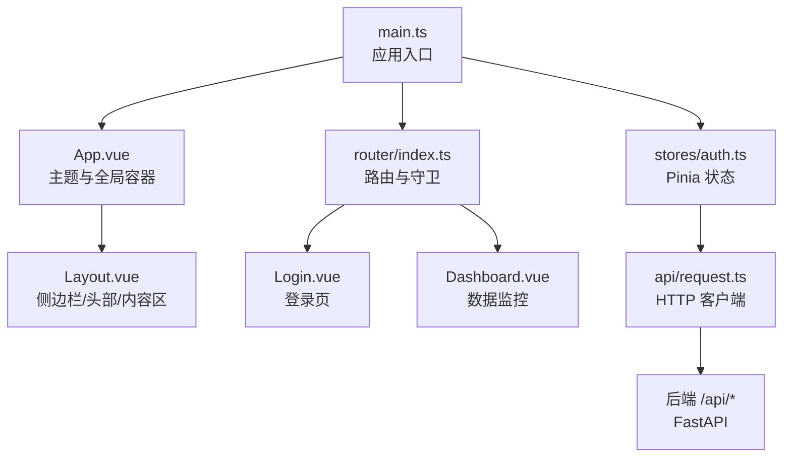
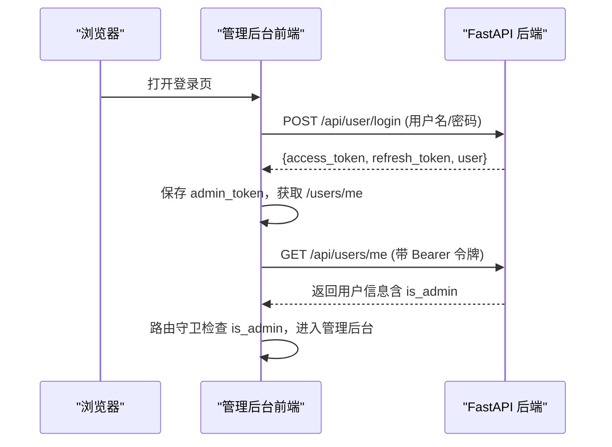
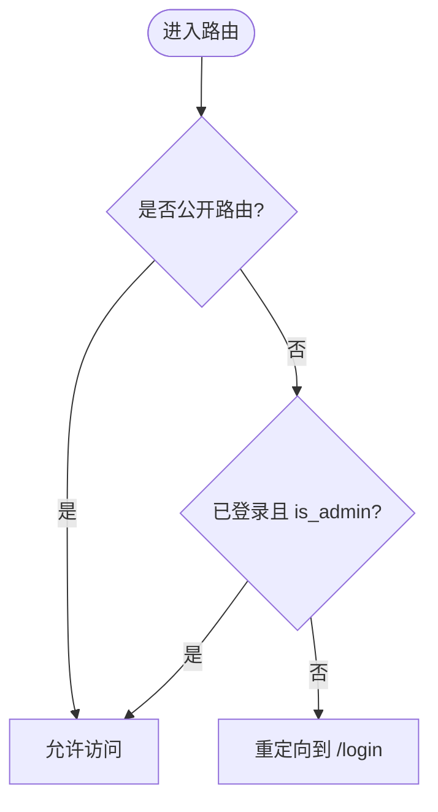
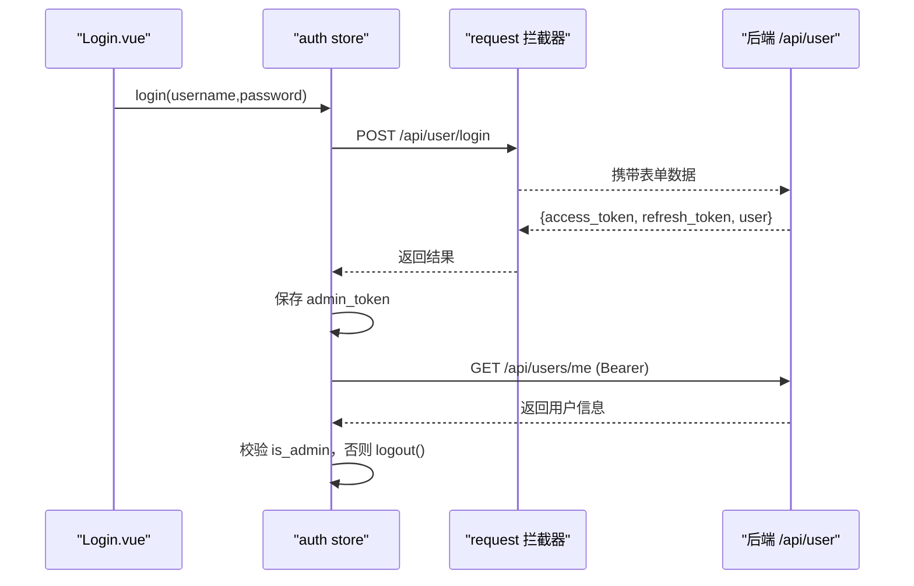
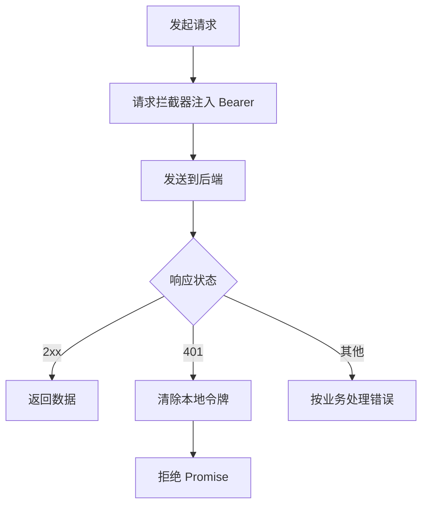
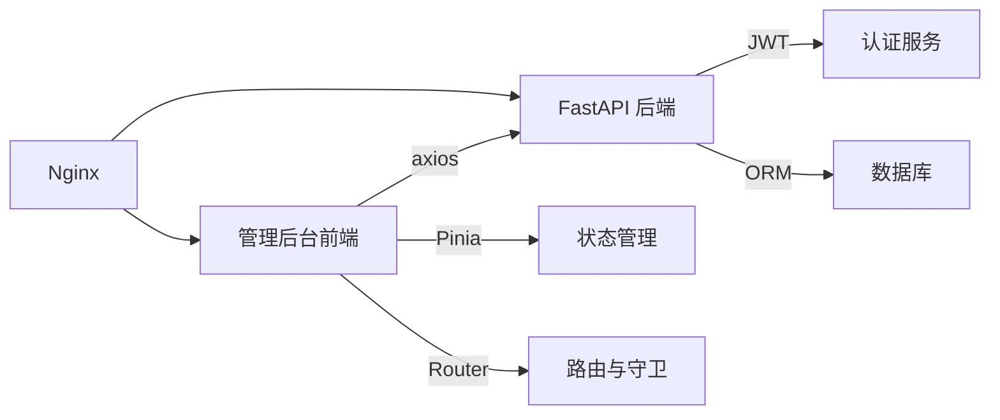

# 管理后台架构

<cite>
**本文引用的文件**
- [web/admin/package.json](file://web/admin/package.json)
- [web/admin/src/main.ts](file://web/admin/src/main.ts)
- [web/admin/src/router/index.ts](file://web/admin/src/router/index.ts)
- [web/admin/vite.config.ts](file://web/admin/vite.config.ts)
- [web/admin/tsconfig.json](file://web/admin/tsconfig.json)
- [web/admin/src/stores/auth.ts](file://web/admin/src/stores/auth.ts)
- [web/admin/src/api/request.ts](file://web/admin/src/api/request.ts)
- [web/admin/src/views/Layout.vue](file://web/admin/src/views/Layout.vue)
- [web/admin/src/views/Login.vue](file://web/admin/src/views/Login.vue)
- [web/admin/src/App.vue](file://web/admin/src/App.vue)
- [web/admin/src/api/labeling.ts](file://web/admin/src/api/labeling.ts)
- [web/backend/services/auth.py](file://web/backend/services/auth.py)
- [web/backend/services/admin_auth.py](file://web/backend/services/admin_auth.py)
- [web/backend/api/user.py](file://web/backend/api/user.py)
- [web/deploy/nginx-subskin.cnf](file://web/deploy/nginx-subskin.cnf)
</cite>

## 目录
1. [简介](#简介)
2. [项目结构](#项目结构)
3. [核心组件](#核心组件)
4. [架构总览](#架构总览)
5. [详细组件分析](#详细组件分析)
6. [依赖关系分析](#依赖关系分析)
7. [性能考虑](#性能考虑)
8. [故障排查指南](#故障排查指南)
9. [结论](#结论)
10. [附录](#附录)

## 简介
本技术文档面向 Subskin 管理后台（Vue 3 + TypeScript）的架构与实现，覆盖路由配置、状态管理、权限控制机制、组件组织模式；详细说明管理员认证流程、JWT 令牌管理与角色权限模型；解释前端与后端 API 的通信方式、错误处理策略与性能优化方案；并提供开发环境搭建、构建配置与生产部署指南。

## 项目结构
管理后台位于 web/admin 子工程，采用 Vite + Vue 3 + TypeScript + Pinia + Naive UI 的技术栈。入口 main.ts 初始化应用、注册 Pinia、路由与 UI 组件库；router/index.ts 定义路由与全局守卫；stores/auth.ts 集中管理登录态与用户信息；api/request.ts 封装 axios 实例并统一拦截器；views 下包含布局、登录页与功能页面；vite.config.ts 配置别名、代理与构建输出；tsconfig.json 提供 TS 编译选项与路径映射。

图表来源
- [web/admin/src/main.ts:1-14](file://web/admin/src/main.ts#L1-L14)
- [web/admin/src/App.vue:1-23](file://web/admin/src/App.vue#L1-L23)
- [web/admin/src/router/index.ts:1-84](file://web/admin/src/router/index.ts#L1-L84)
- [web/admin/src/stores/auth.ts:1-59](file://web/admin/src/stores/auth.ts#L1-L59)
- [web/admin/src/views/Layout.vue:1-385](file://web/admin/src/views/Layout.vue#L1-L385)
- [web/admin/src/views/Login.vue:1-156](file://web/admin/src/views/Login.vue#L1-L156)

章节来源
- [web/admin/package.json:1-30](file://web/admin/package.json#L1-L30)
- [web/admin/src/main.ts:1-14](file://web/admin/src/main.ts#L1-L14)
- [web/admin/vite.config.ts:1-27](file://web/admin/vite.config.ts#L1-L27)
- [web/admin/tsconfig.json:1-25](file://web/admin/tsconfig.json#L1-L25)

## 核心组件
- 应用启动与插件装配：main.ts 创建 Vue 应用，挂载 Pinia、Router、Naive UI，并引入样式与图标字体。
- 路由与守卫：router/index.ts 使用 Hash 历史模式，定义公开与受保护路由，并在 beforeEach 中基于 authStore 的登录态与 is_admin 进行访问控制。
- 状态管理：stores/auth.ts 通过 Pinia 维护 token、用户信息与登录态，封装 login/fetchUser/logout，并在登录成功后校验 is_admin。
- HTTP 客户端：api/request.ts 基于 axios 创建实例，设置 baseURL、超时时间，请求拦截器注入 Authorization 头，响应拦截器处理 401 清理本地令牌。
- 布局与导航：views/Layout.vue 提供桌面端侧边栏与移动端抽屉/底部导航，集成用户下拉菜单与退出登录。
- 登录页：views/Login.vue 使用 Naive UI 表单与校验，调用 authStore.login，失败时提示错误信息。
- 主题与全局容器：App.vue 配置 Naive UI 深色主题与主色调覆盖。

章节来源
- [web/admin/src/main.ts:1-14](file://web/admin/src/main.ts#L1-L14)
- [web/admin/src/router/index.ts:1-84](file://web/admin/src/router/index.ts#L1-L84)
- [web/admin/src/stores/auth.ts:1-59](file://web/admin/src/stores/auth.ts#L1-L59)
- [web/admin/src/api/request.ts:1-32](file://web/admin/src/api/request.ts#L1-L32)
- [web/admin/src/views/Layout.vue:1-385](file://web/admin/src/views/Layout.vue#L1-L385)
- [web/admin/src/views/Login.vue:1-156](file://web/admin/src/views/Login.vue#L1-L156)
- [web/admin/src/App.vue:1-23](file://web/admin/src/App.vue#L1-L23)

## 架构总览
管理后台采用前后端分离架构：前端 SPA 通过 Nginx 静态托管，API 请求经反向代理转发至 FastAPI 后端。认证流程基于 JWT，前端在登录后将 access_token 持久化到 localStorage，并在后续请求中通过 Authorization 头携带。后端对管理员接口使用额外权限校验，确保仅 is_admin 用户可访问。

图表来源
- [web/admin/src/stores/auth.ts:18-47](file://web/admin/src/stores/auth.ts#L18-L47)
- [web/admin/src/api/request.ts:8-29](file://web/admin/src/api/request.ts#L8-L29)
- [web/backend/api/user.py:217-239](file://web/backend/api/user.py#L217-L239)
- [web/backend/services/auth.py:43-56](file://web/backend/services/auth.py#L43-L56)

## 详细组件分析

### 路由与权限控制
- 路由定义：根路由重定向到 dashboard，子路由包括 Dashboard、UserManagement、Moderation、ContentGen、LLMConfig、ImageLabeling、TrainingDashboard、SystemMonitor。
- 全局守卫：beforeEach 中读取 authStore 的 isLoggedIn 与 user.is_admin，非管理员或未登录一律重定向到 /login；已登录的管理员访问 /login 则重定向到首页。
- 元信息：/login 标记为 public，image-labeling/:id 标记为 fullscreen。

图表来源
- [web/admin/src/router/index.ts:6-81](file://web/admin/src/router/index.ts#L6-L81)

章节来源
- [web/admin/src/router/index.ts:1-84](file://web/admin/src/router/index.ts#L1-L84)

### 状态管理与认证流程
- 登录：提交表单后调用 authStore.login，向后端发起 /user/login，保存 access_token 到 localStorage，并调用 /users/me 获取用户信息；若用户非管理员则立即登出并抛出错误。
- 用户信息：fetchUser 调用 /users/me，失败时自动登出。
- 登出：清空 token 与用户信息，移除本地存储，跳转回登录页。
- 权限模型：后端服务层提供 get_current_user 解析 JWT，admin_auth.get_admin_user 强制要求 is_admin 或通过 ADMIN_PHONES 白名单二次校验（但不会自动提升权限）。

图表来源
- [web/admin/src/views/Login.vue:78-99](file://web/admin/src/views/Login.vue#L78-L99)
- [web/admin/src/stores/auth.ts:18-55](file://web/admin/src/stores/auth.ts#L18-L55)
- [web/admin/src/api/request.ts:8-29](file://web/admin/src/api/request.ts#L8-L29)
- [web/backend/api/user.py:217-239](file://web/backend/api/user.py#L217-L239)
- [web/backend/services/admin_auth.py:34-55](file://web/backend/services/admin_auth.py#L34-L55)

章节来源
- [web/admin/src/stores/auth.ts:1-59](file://web/admin/src/stores/auth.ts#L1-L59)
- [web/backend/services/auth.py:153-220](file://web/backend/services/auth.py#L153-L220)
- [web/backend/services/admin_auth.py:1-56](file://web/backend/services/admin_auth.py#L1-L56)

### HTTP 客户端与错误处理
- 基础配置：baseURL 为 /api，超时设置为 120 秒以支持 AI 相关长耗时任务。
- 请求拦截器：从 localStorage 读取 admin_token 并注入 Authorization 头。
- 响应拦截器：当收到 401 时清除本地令牌，不自动跳转，等待下次操作触发重新登录。
- 业务 API：labeling.ts 封装了图片标注相关的列表、统计、详情、标注提交、队列、训练面板等接口调用。

图表来源
- [web/admin/src/api/request.ts:1-32](file://web/admin/src/api/request.ts#L1-L32)
- [web/admin/src/api/labeling.ts:55-100](file://web/admin/src/api/labeling.ts#L55-L100)

章节来源
- [web/admin/src/api/request.ts:1-32](file://web/admin/src/api/request.ts#L1-L32)
- [web/admin/src/api/labeling.ts:1-100](file://web/admin/src/api/labeling.ts#L1-L100)

### 布局与导航组件
- Layout.vue 提供响应式布局：桌面端侧边栏菜单，移动端抽屉与底部导航；顶部显示用户头像与用户名，下拉菜单支持退出登录。
- 菜单项映射到路由名称，点击后通过 router.push 导航。
- 移动端检测与事件监听用于切换布局与交互。

章节来源
- [web/admin/src/views/Layout.vue:1-385](file://web/admin/src/views/Layout.vue#L1-L385)

### 登录页面
- Login.vue 使用 Naive UI 表单与规则校验，支持回车提交；调用 authStore.login，成功则提示并跳转到首页，失败则展示后端返回的错误信息。

章节来源
- [web/admin/src/views/Login.vue:1-156](file://web/admin/src/views/Login.vue#L1-L156)

### 主题与全局容器
- App.vue 使用 Naive UI 的 ConfigProvider 配置深色主题与主色覆盖，提供消息与对话框全局容器。

章节来源
- [web/admin/src/App.vue:1-23](file://web/admin/src/App.vue#L1-L23)

## 依赖关系分析
- 前端依赖：Vue 3、Vue Router、Pinia、Naive UI、ECharts、Axios、Tailwind CSS、TypeScript、Vite。
- 后端依赖：FastAPI、PyJWT、Passlib、SQLAlchemy、Alembic。
- 部署依赖：Nginx 作为静态资源服务器与反向代理。

图表来源
- [web/admin/package.json:11-28](file://web/admin/package.json#L11-L28)
- [web/backend/services/auth.py:1-33](file://web/backend/services/auth.py#L1-L33)
- [web/deploy/nginx-subskin.cnf:1-39](file://web/deploy/nginx-subskin.cnf#L1-L39)

章节来源
- [web/admin/package.json:1-30](file://web/admin/package.json#L1-L30)
- [web/backend/services/auth.py:1-33](file://web/backend/services/auth.py#L1-L33)
- [web/deploy/nginx-subskin.cnf:1-39](file://web/deploy/nginx-subskin.cnf#L1-L39)

## 性能考虑
- 前端构建与缓存：
  - 使用 Vite 插件与 Tailwind CSS，按需加载与 Tree Shaking。
  - 构建输出目录指向 Nginx 静态站点目录，启用静态资源长期缓存。
  - Service Worker 与工作箱脚本禁用缓存以确保更新及时。
- 网络与超时：
  - Axios 超时设置为 120 秒，适配 AI 预处理等长耗时任务。
  - Nginx 代理读超时设置为 300 秒，避免中间件过早断开长连接。
- 路由懒加载：
  - 路由组件采用动态 import，减少首屏体积。
- 状态与渲染：
  - 使用 Pinia 管理状态，避免不必要的重渲染。
  - 图表使用 ECharts 并仅在需要时初始化与更新。

章节来源
- [web/admin/vite.config.ts:13-25](file://web/admin/vite.config.ts#L13-L25)
- [web/admin/src/router/index.ts:6-66](file://web/admin/src/router/index.ts#L6-L66)
- [web/admin/src/api/request.ts:3-6](file://web/admin/src/api/request.ts#L3-L6)
- [web/deploy/nginx-subskin.cnf:17-37](file://web/deploy/nginx-subskin.cnf#L17-L37)

## 故障排查指南
- 401 未授权：
  - 前端响应拦截器会清除本地令牌；检查后端 JWT 验证逻辑与 SECRET_KEY 配置是否正确。
  - 确认请求头 Authorization 是否携带正确的 Bearer 令牌。
- 管理员权限不足：
  - 后端 admin_auth.get_admin_user 会拒绝非 is_admin 用户；请通过 create_admin.py 或迁移脚本授予管理员权限。
  - 环境变量 ADMIN_PHONES 仅作为只读白名单，不会自动提升权限。
- 登录失败：
  - 检查后端 /api/user/login 返回的错误信息；确认用户名/手机号/邮箱与密码匹配。
- 长耗时任务超时：
  - 调整 Axios 超时与 Nginx 代理读超时；必要时拆分任务或使用异步队列。

章节来源
- [web/admin/src/api/request.ts:19-29](file://web/admin/src/api/request.ts#L19-L29)
- [web/backend/services/admin_auth.py:34-55](file://web/backend/services/admin_auth.py#L34-L55)
- [web/backend/api/user.py:217-239](file://web/backend/api/user.py#L217-L239)

## 结论
Subskin 管理后台采用清晰的前后端分离架构，基于 Vue 3 + TypeScript + Pinia + Naive UI 构建，配合 FastAPI 后端与 JWT 认证，实现了严格的管理员权限控制与安全的令牌管理。通过 Nginx 的反向代理与缓存策略，保障了生产环境的性能与稳定性。建议在后续迭代中继续完善错误上报、日志审计与监控告警，以提升系统的可观测性与可维护性。

## 附录

### 开发环境搭建
- 安装依赖：进入 web/admin 目录执行包管理器安装依赖。
- 启动开发服务器：运行 Vite 开发命令，端口默认 5174，并通过代理将 /api 转发到后端 8000 端口。
- 类型检查：构建前执行 vue-tsc 进行类型检查。

章节来源
- [web/admin/package.json:6-9](file://web/admin/package.json#L6-L9)
- [web/admin/vite.config.ts:17-25](file://web/admin/vite.config.ts#L17-L25)

### 构建配置
- 别名配置：@ 指向 src 目录，便于模块导入。
- 构建输出：输出到 /usr/share/nginx/html/subskin-admin，并清空旧目录。
- 插件：启用 Vue 与 Tailwind CSS 插件。

章节来源
- [web/admin/vite.config.ts:1-16](file://web/admin/vite.config.ts#L1-L16)
- [web/admin/tsconfig.json:18-20](file://web/admin/tsconfig.json#L18-L20)

### 生产部署指南
- 静态资源：Nginx 将根路径指向文档站点，管理后台静态文件由构建产物提供。
- 反向代理：/api 请求代理到后端 8000 端口，设置必要的请求头与超时。
- 缓存策略：静态资源长期缓存，Service Worker 与工作箱脚本禁用缓存。

章节来源
- [web/deploy/nginx-subskin.cnf:5-37](file://web/deploy/nginx-subskin.cnf#L5-L37)