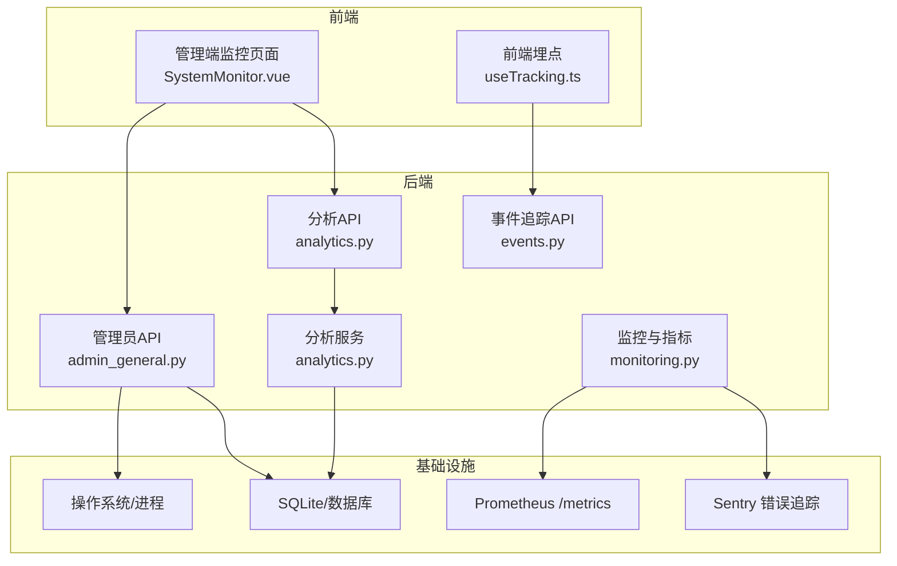
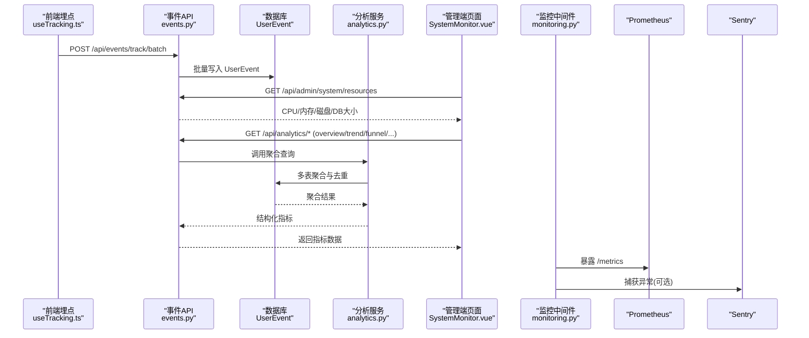
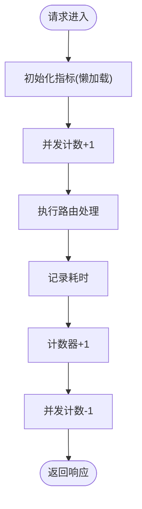
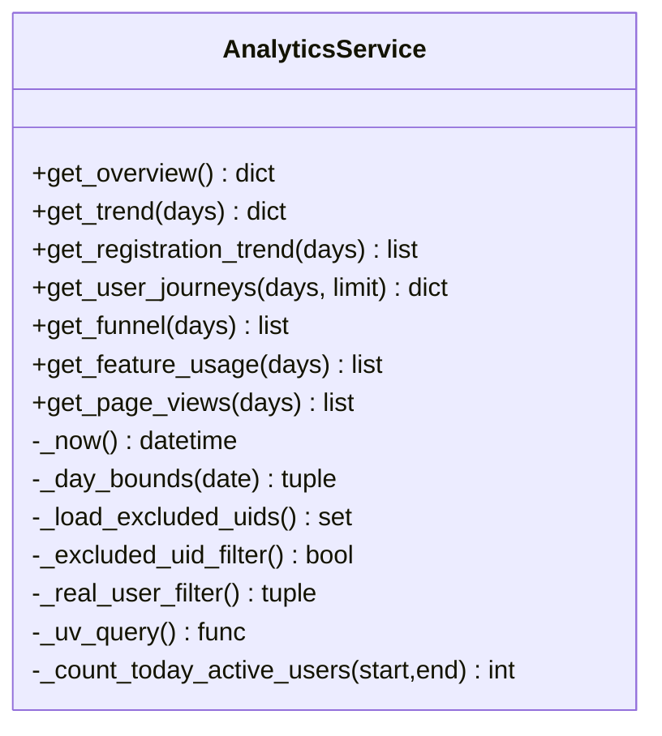
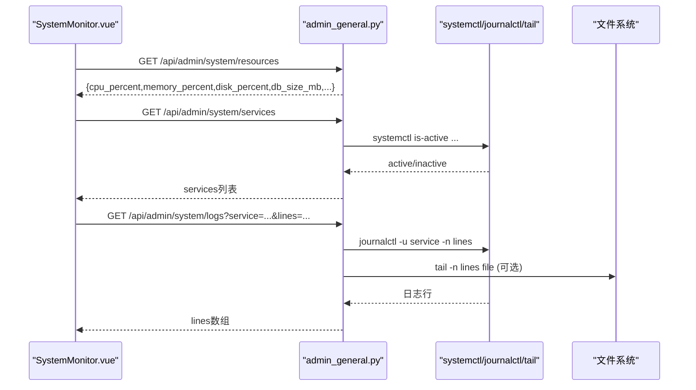
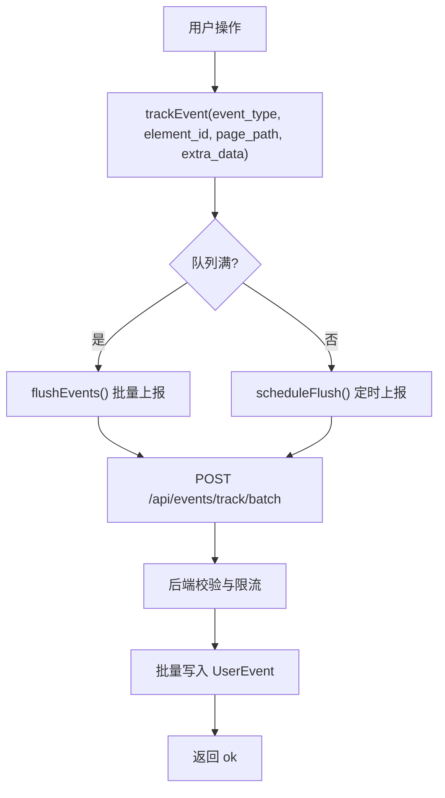
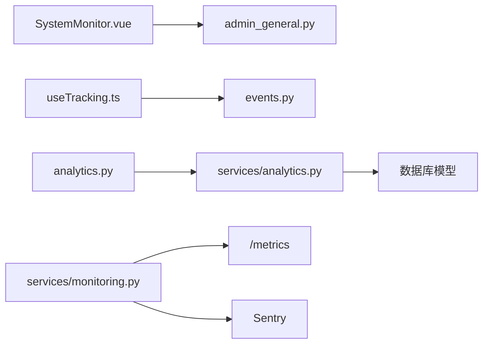

# 系统监控

<cite>
**本文引用的文件**   
- [web/backend/services/monitoring.py](file://web/backend/services/monitoring.py)
- [web/backend/api/analytics.py](file://web/backend/api/analytics.py)
- [web/backend/services/analytics.py](file://web/backend/services/analytics.py)
- [web/admin/src/views/SystemMonitor.vue](file://web/admin/src/views/SystemMonitor.vue)
- [web/backend/api/admin_general.py](file://web/backend/api/admin_general.py)
- [src/settings/logging.py](file://src/settings/logging.py)
- [web/backend/api/events.py](file://web/backend/api/events.py)
- [web/app/src/composables/useTracking.ts](file://web/app/src/composables/useTracking.ts)
- [hermes_plan/analytics-dashboard.md](file://hermes_plan/analytics-dashboard.md)
</cite>

## 目录
1. [简介](#简介)
2. [项目结构](#项目结构)
3. [核心组件](#核心组件)
4. [架构总览](#架构总览)
5. [详细组件分析](#详细组件分析)
6. [依赖关系分析](#依赖关系分析)
7. [性能考量](#性能考量)
8. [故障排查指南](#故障排查指南)
9. [结论](#结论)
10. [附录](#附录)

## 简介
本技术文档面向 Subskin 系统的监控能力，覆盖以下方面：
- 服务器资源监控（CPU、内存、磁盘、数据库大小）
- 数据库性能与可用性检查
- API 响应时间统计与指标采集
- 用户行为追踪（事件上报、页面浏览、点击等）
- 实时监控仪表盘（管理端可视化）
- 日志分析与查看
- 告警通知机制（Sentry 错误追踪、健康检查）
- 趋势分析与异常检测思路
- 监控配置管理与报告生成方法

## 项目结构
监控相关代码主要分布在后端服务、API 层、前端管理界面以及配置与日志模块中：
- 后端监控与指标：Prometheus 中间件、健康检查、Sentry 集成
- 分析服务：UV/PV、注册趋势、漏斗、功能使用、页面访问、用户旅程
- 管理端监控面板：系统资源、服务状态、日志查看、向量化触发
- 事件追踪：前端埋点与后端批量写入
- 日志配置：统一日志初始化与输出

**图表来源** 
- [web/admin/src/views/SystemMonitor.vue:1-634](file://web/admin/src/views/SystemMonitor.vue#L1-L634)
- [web/backend/api/admin_general.py:1-228](file://web/backend/api/admin_general.py#L1-L228)
- [web/backend/api/analytics.py:1-88](file://web/backend/api/analytics.py#L1-L88)
- [web/backend/services/analytics.py:1-667](file://web/backend/services/analytics.py#L1-L667)
- [web/backend/services/monitoring.py:1-260](file://web/backend/services/monitoring.py#L1-L260)
- [web/backend/api/events.py:1-111](file://web/backend/api/events.py#L1-L111)
- [web/app/src/composables/useTracking.ts:59-110](file://web/app/src/composables/useTracking.ts#L59-L110)

**章节来源**
- [web/admin/src/views/SystemMonitor.vue:1-634](file://web/admin/src/views/SystemMonitor.vue#L1-L634)
- [web/backend/api/admin_general.py:1-228](file://web/backend/api/admin_general.py#L1-L228)
- [web/backend/api/analytics.py:1-88](file://web/backend/api/analytics.py#L1-L88)
- [web/backend/services/analytics.py:1-667](file://web/backend/services/analytics.py#L1-L667)
- [web/backend/services/monitoring.py:1-260](file://web/backend/services/monitoring.py#L1-L260)
- [web/backend/api/events.py:1-111](file://web/backend/api/events.py#L1-L111)
- [web/app/src/composables/useTracking.ts:59-110](file://web/app/src/composables/useTracking.ts#L59-L110)

## 核心组件
- 监控与指标采集
  - Prometheus 中间件：收集请求总数、耗时、并发数，暴露 /metrics 端点
  - 健康检查：检查数据库连接与磁盘空间，返回健康状态
  - Sentry 集成：捕获异常并过滤敏感信息
- 分析服务
  - 概览指标：总用户、今日 UV/PV、新增用户、活跃用户
  - 趋势数据：按日统计 UV/PV/新增用户
  - 漏斗分析：访问→注册→登录→功能使用转化
  - 功能使用：AI问答、VASI评估、体检报告上传、发帖、评论、点赞、百科浏览
  - 页面访问：按路径统计 UV/PV
  - 用户旅程：会话级页面序列与桑基图数据
- 管理端监控面板
  - 系统资源：CPU、内存、磁盘、数据库大小
  - 服务状态：systemctl 查询子进程状态
  - 日志查看：journalctl 或文件 tail
  - 知识库向量化：手动触发增量 embedding
- 事件追踪
  - 前端埋点：page_view、click、input 等事件队列与批量上报
  - 后端接口：单条与批量写入 UserEvent 表，限流保护

**章节来源**
- [web/backend/services/monitoring.py:1-260](file://web/backend/services/monitoring.py#L1-L260)
- [web/backend/services/analytics.py:1-667](file://web/backend/services/analytics.py#L1-L667)
- [web/admin/src/views/SystemMonitor.vue:1-634](file://web/admin/src/views/SystemMonitor.vue#L1-L634)
- [web/backend/api/admin_general.py:1-228](file://web/backend/api/admin_general.py#L1-L228)
- [web/backend/api/events.py:1-111](file://web/backend/api/events.py#L1-L111)
- [web/app/src/composables/useTracking.ts:59-110](file://web/app/src/composables/useTracking.ts#L59-L110)

## 架构总览
系统监控由“数据采集—存储—聚合—展示”构成闭环：
- 数据采集：Prometheus 中间件、Sentry 异常捕获、UserEvent 事件上报
- 数据存储：SQLite（UserEvent、业务表）、文件系统（日志）
- 数据聚合：AnalyticsService 基于 SQL 聚合与去重策略
- 数据展示：管理端 SystemMonitor 页面与未来 Analytics Dashboard

**图表来源** 
- [web/app/src/composables/useTracking.ts:59-110](file://web/app/src/composables/useTracking.ts#L59-L110)
- [web/backend/api/events.py:1-111](file://web/backend/api/events.py#L1-L111)
- [web/backend/services/analytics.py:1-667](file://web/backend/services/analytics.py#L1-L667)
- [web/admin/src/views/SystemMonitor.vue:1-634](file://web/admin/src/views/SystemMonitor.vue#L1-L634)
- [web/backend/services/monitoring.py:1-260](file://web/backend/services/monitoring.py#L1-L260)

## 详细组件分析

### 监控与指标采集（Prometheus + Health Check + Sentry）
- Prometheus 中间件
  - 指标：http_requests_total、http_request_duration_seconds、http_requests_in_progress
  - 端点：/metrics（环境变量控制开关）
- 健康检查
  - 检查数据库连接与磁盘空间，返回 status 与 checks
- Sentry 集成
  - 初始化 FastAPI/Starlette/SQLAlchemy 集成
  - 过滤敏感字段（password、token、secret、api_key、authorization）
  - 支持 traces_sample_rate 采样

**图表来源** 
- [web/backend/services/monitoring.py:96-183](file://web/backend/services/monitoring.py#L96-L183)

**章节来源**
- [web/backend/services/monitoring.py:1-260](file://web/backend/services/monitoring.py#L1-L260)

### 分析服务（AnalyticsService）
- 概览指标
  - total_users、today_uv、today_pv、new_users_today、today_active_users
- 趋势数据
  - 按日统计 uv/pv/new_users，支持 days 参数
- 注册趋势（North Star）
  - 累计注册用户数，排除测试账号
- 用户旅程
  - 会话级 page_view 序列，构建 Sankey 节点与链接
- 漏斗分析
  - 访问UV → 注册用户 → 登录UV → 使用功能UV
- 功能使用
  - AI问答、VASI评估、体检报告上传、发帖、评论、点赞、百科浏览
- 页面访问
  - 按 page_path 分组统计 uv/pv

**图表来源** 
- [web/backend/services/analytics.py:76-667](file://web/backend/services/analytics.py#L76-L667)

**章节来源**
- [web/backend/services/analytics.py:1-667](file://web/backend/services/analytics.py#L1-L667)
- [web/backend/api/analytics.py:1-88](file://web/backend/api/analytics.py#L1-L88)
- [hermes_plan/analytics-dashboard.md:1-89](file://hermes_plan/analytics-dashboard.md#L1-L89)

### 管理端监控面板（SystemMonitor.vue）
- 系统资源卡片：CPU、内存、磁盘、SQLite DB 大小
- 主机信息：操作系统、CPU 核心数、运行时长
- 服务状态：subskin-backend、subskin-scheduler、nginx
- 日志查看：journalctl 或文件 tail，支持选择服务与行数
- 知识库向量化：手动触发增量 embedding，显示成功/失败统计

**图表来源** 
- [web/admin/src/views/SystemMonitor.vue:1-634](file://web/admin/src/views/SystemMonitor.vue#L1-L634)
- [web/backend/api/admin_general.py:1-228](file://web/backend/api/admin_general.py#L1-L228)

**章节来源**
- [web/admin/src/views/SystemMonitor.vue:1-634](file://web/admin/src/views/SystemMonitor.vue#L1-L634)
- [web/backend/api/admin_general.py:1-228](file://web/backend/api/admin_general.py#L1-L228)

### 用户行为追踪（前端埋点与后端写入）
- 前端埋点
  - trackPageView、trackClick、trackInput
  - 事件队列与批量 flush，携带 session_id、uid、client_fingerprint
- 后端接口
  - POST /api/events/track 与 /api/events/track/batch
  - 限流保护（ReadRateLimit），最大批次限制，IP 脱敏

**图表来源** 
- [web/app/src/composables/useTracking.ts:59-110](file://web/app/src/composables/useTracking.ts#L59-L110)
- [web/backend/api/events.py:1-111](file://web/backend/api/events.py#L1-L111)

**章节来源**
- [web/app/src/composables/useTracking.ts:59-110](file://web/app/src/composables/useTracking.ts#L59-L110)
- [web/backend/api/events.py:1-111](file://web/backend/api/events.py#L1-L111)

### 日志配置与管理
- 统一日志初始化：根据 settings.LOG_LEVEL 设置级别与格式化器
- 管理端日志查看：journalctl 或文件 tail，支持多服务切换

**章节来源**
- [src/settings/logging.py:1-58](file://src/settings/logging.py#L1-L58)
- [web/backend/api/admin_general.py:192-216](file://web/backend/api/admin_general.py#L192-L216)

## 依赖关系分析
- 前端依赖
  - SystemMonitor.vue 依赖 admin_general.py 的 /api/admin/system/* 接口
  - useTracking.ts 依赖 events.py 的 /api/events/track* 接口
- 后端依赖
  - analytics.py API 依赖 analytics.py 服务进行聚合
  - monitoring.py 提供 Prometheus 中间件与健康检查
  - admin_general.py 通过 subprocess 调用 systemctl/journalctl/tail
- 数据依赖
  - AnalyticsService 依赖 UserEvent、Post、PostComment、PostLike、Conversation、Message、MedicalReport、VASIAssessment 等表

**图表来源** 
- [web/admin/src/views/SystemMonitor.vue:1-634](file://web/admin/src/views/SystemMonitor.vue#L1-L634)
- [web/backend/api/admin_general.py:1-228](file://web/backend/api/admin_general.py#L1-L228)
- [web/app/src/composables/useTracking.ts:59-110](file://web/app/src/composables/useTracking.ts#L59-L110)
- [web/backend/api/events.py:1-111](file://web/backend/api/events.py#L1-L111)
- [web/backend/api/analytics.py:1-88](file://web/backend/api/analytics.py#L1-L88)
- [web/backend/services/analytics.py:1-667](file://web/backend/services/analytics.py#L1-L667)
- [web/backend/services/monitoring.py:1-260](file://web/backend/services/monitoring.py#L1-L260)

**章节来源**
- [web/backend/services/analytics.py:1-667](file://web/backend/services/analytics.py#L1-L667)
- [web/backend/services/monitoring.py:1-260](file://web/backend/services/monitoring.py#L1-L260)
- [web/backend/api/admin_general.py:1-228](file://web/backend/api/admin_general.py#L1-L228)
- [web/backend/api/events.py:1-111](file://web/backend/api/events.py#L1-L111)

## 性能考量
- 指标采集
  - Prometheus 中间件懒加载，避免无依赖时阻塞
  - 端点名称规范化，降低高基数标签
- 分析查询
  - 使用索引字段（created_at、event_type、uid、session_id）优化范围查询
  - 去重策略：按 uid/client_fingerprint 计算 UV，排除测试与管理员流量
- 事件写入
  - 批量写入减少事务开销，限制单次最大批次
  - 限流保护防止写放大
- 健康检查
  - 磁盘空间阈值判断，避免磁盘耗尽导致服务降级

[本节为通用指导，不直接分析具体文件]

## 故障排查指南
- 健康检查失败
  - 检查数据库连接与磁盘空间，关注 /api/health 返回的 checks 字段
- Prometheus 指标缺失
  - 确认环境变量 PROMETHEUS_ENABLED=true 且 prometheus-client 已安装
- Sentry 未启用
  - 检查 SENTRY_DSN 环境变量与 sentry-sdk 安装
- 事件写入失败
  - 检查 ReadRateLimit 限流与 MAX_BATCH_EVENTS 限制
- 日志无法查看
  - 确认 journalctl 权限与日志文件路径存在

**章节来源**
- [web/backend/services/monitoring.py:208-241](file://web/backend/services/monitoring.py#L208-L241)
- [web/backend/api/events.py:70-111](file://web/backend/api/events.py#L70-L111)
- [web/backend/api/admin_general.py:192-216](file://web/backend/api/admin_general.py#L192-L216)

## 结论
Subskin 的监控体系以 Prometheus 与 Sentry 为核心，结合用户行为事件与分析服务，形成从采集到可视化的完整链路。管理端监控面板提供实时资源与服务状态，配合日志查看与向量化触发，满足运维与数据分析需求。后续可引入预聚合表与定时任务提升查询效率，并扩展告警规则与自动化报告生成。

[本节为总结性内容，不直接分析具体文件]

## 附录
- 监控配置与环境变量
  - SENTRY_DSN、SENTRY_ENVIRONMENT、SENTRY_TRACES_SAMPLE_RATE
  - PROMETHEUS_ENABLED
- 关键 API 清单
  - /api/analytics/overview、/api/analytics/trend、/api/analytics/page-views、/api/analytics/funnel、/api/analytics/feature-usage
  - /api/admin/system/resources、/api/admin/system/services、/api/admin/system/logs
  - /api/events/track、/api/events/track/batch
- 趋势分析与异常检测建议
  - 基于历史 UV/PV 与响应时间分位数设定阈值
  - 对异常突增/突降进行滑动窗口检测
  - 结合 Sentry 错误率与数据库慢查询日志联动告警

[本节为补充信息，不直接分析具体文件]