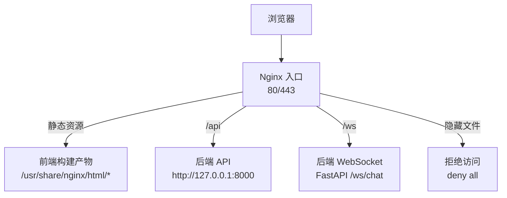
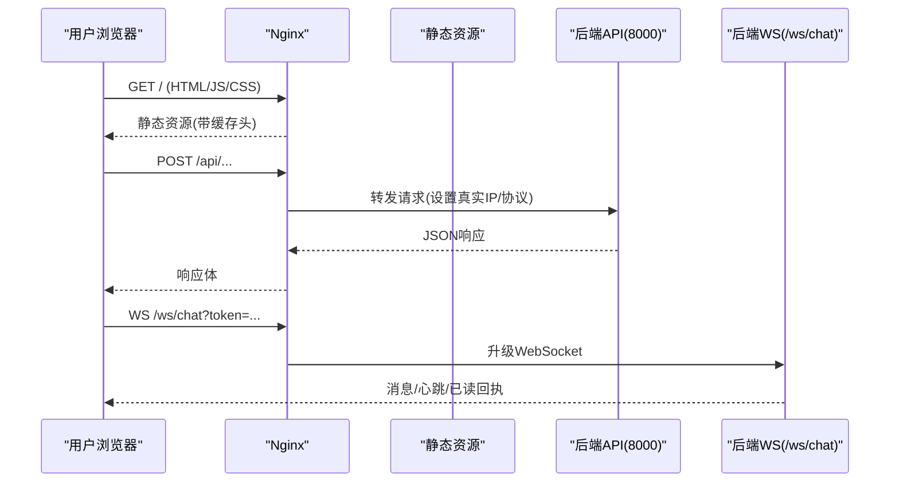
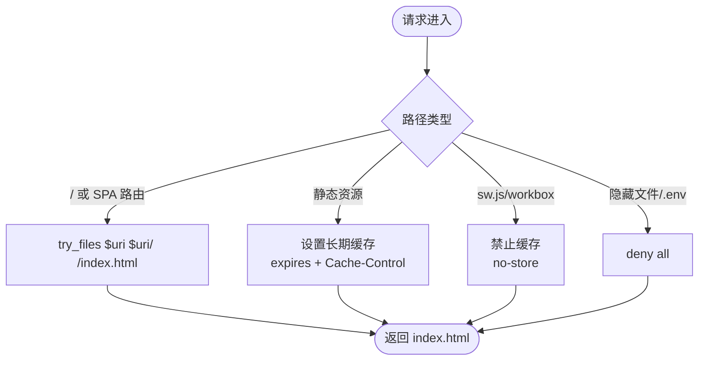
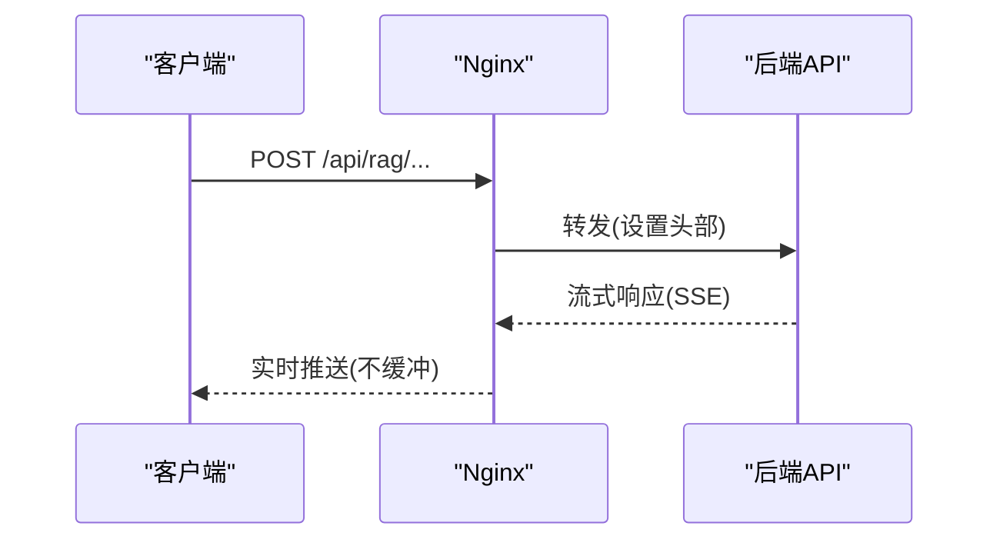
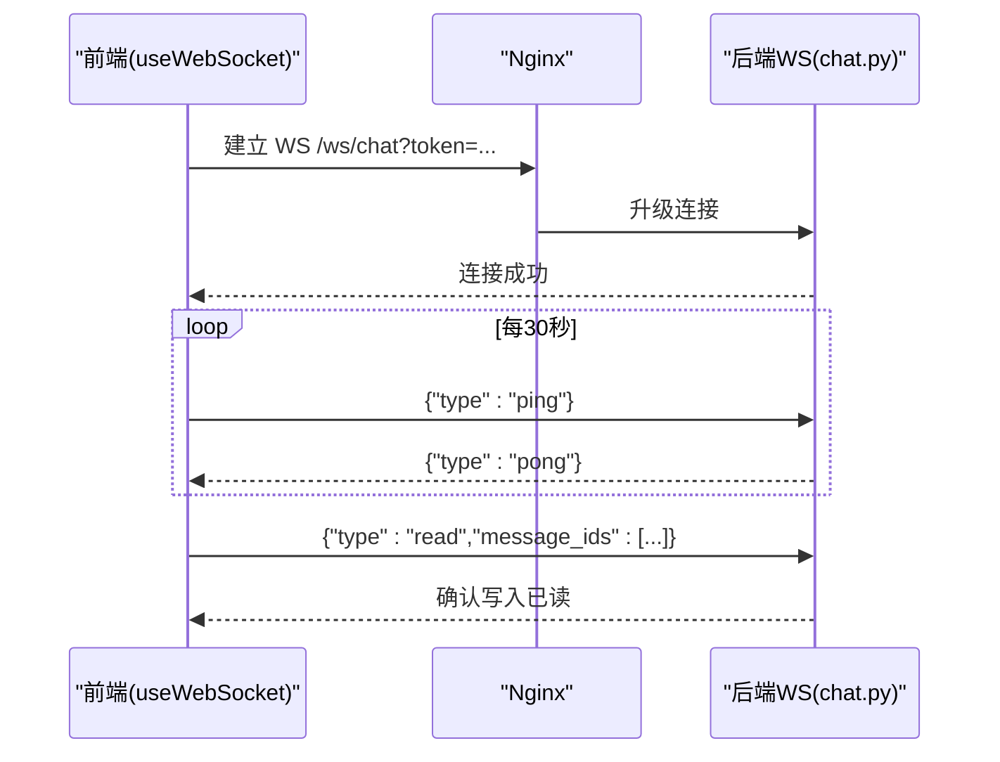
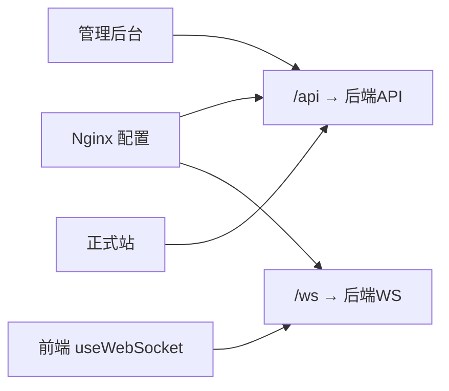

# 反向代理配置

<cite>
**本文引用的文件**
- [web/deploy/nginx.conf](file://web/deploy/nginx.conf)
- [web/deploy/nginx-subskin.cnf](file://web/deploy/nginx-subskin.cnf)
- [web/deploy/subskin-admin.conf](file://web/deploy/subskin-admin.conf)
- [web/deploy/subskin-staging.conf](file://web/deploy/subskin-staging.conf)
- [web/deploy/docker-compose.yml](file://web/deploy/docker-compose.yml)
- [web/backend/ws/chat.py](file://web/backend/ws/chat.py)
- [web/app/src/composables/useWebSocket.ts](file://web/app/src/composables/useWebSocket.ts)
- [AGENTS.md](file://AGENTS.md)
</cite>

## 目录
1. [简介](#简介)
2. [项目结构](#项目结构)
3. [核心组件](#核心组件)
4. [架构总览](#架构总览)
5. [详细组件分析](#详细组件分析)
6. [依赖关系分析](#依赖关系分析)
7. [性能与缓存优化](#性能与缓存优化)
8. [安全与访问控制](#安全与访问控制)
9. [上传大小限制与超时设置](#上传大小限制与超时设置)
10. [日志、错误页面与CDN集成](#日志错误页面与cdn集成)
11. [故障排查指南](#故障排查指南)
12. [结论](#结论)

## 简介
本文件面向生产与测试环境的 Nginx 反向代理配置，覆盖静态资源服务、API 请求转发、WebSocket 连接支持、SSL/HTTPS、缓存策略、安全头、前端路由回退、后端代理规则、上传大小限制、请求超时、性能调优、日志格式、错误页定制与 CDN 集成等主题。所有说明均基于仓库中的部署模板与后端 WebSocket 实现进行梳理，便于运维与开发快速落地与排障。

## 项目结构
- 多环境 Nginx 模板：
  - 正式环境 HTTPS 模板（含强制跳转、安全头、PWA 构建产物路径、SW 不缓存）
  - VitePress 文档站点模板（用于百科内容）
  - 管理后台独立域名模板（启用 SSL、SPA hash 路由、无 SW）
  - 测试环境模板（HTTP，可选开启 HTTPS）
- Docker Compose 示例：将 Nginx 与后端 FastAPI 容器化编排，便于本地验证。

**图示来源**
- [web/deploy/nginx.conf:6-72](file://web/deploy/nginx.conf#L6-L72)
- [web/deploy/subskin-admin.conf:9-42](file://web/deploy/subskin-admin.conf#L9-L42)
- [web/deploy/subskin-staging.conf:7-39](file://web/deploy/subskin-staging.conf#L7-L39)
- [web/backend/ws/chat.py:45-51](file://web/backend/ws/chat.py#L45-L51)

**章节来源**
- [web/deploy/nginx.conf:1-72](file://web/deploy/nginx.conf#L1-L72)
- [web/deploy/nginx-subskin.cnf:1-39](file://web/deploy/nginx-subskin.cnf#L1-L39)
- [web/deploy/subskin-admin.conf:1-43](file://web/deploy/subskin-admin.conf#L1-L43)
- [web/deploy/subskin-staging.conf:1-75](file://web/deploy/subskin-staging.conf#L1-L75)
- [web/deploy/docker-compose.yml:1-22](file://web/deploy/docker-compose.yml#L1-L22)

## 核心组件
- 静态资源服务
  - 正式环境指向 PWA 构建产物目录；VitePress 文档站点使用独立根路径；管理后台使用独立目录并禁用缓存。
  - 通过 try_files 实现 SPA 路由回退到 index.html。
- API 反向代理
  - 统一将 /api 转发至本地 8000 端口，设置 Host/X-Real-IP/X-Forwarded-For/X-Forwarded-Proto 等头部。
  - 针对流式响应（RAG SSE）关闭缓冲并延长读取超时。
- WebSocket 支持
  - 前端通过 wss/ws 协议连接 /ws/chat?token=...；后端提供 chat_websocket_endpoint 处理连接、心跳与已读回执。
- 安全与缓存
  - 强制 HTTPS、HSTS、X-Frame-Options、X-Content-Type-Options、Referrer-Policy、Permissions-Policy。
  - Service Worker/Workbox 禁止缓存；常规静态资源长期缓存；隐藏文件与 .env 拒绝访问。

**章节来源**
- [web/deploy/nginx.conf:22-59](file://web/deploy/nginx.conf#L22-L59)
- [web/deploy/subskin-admin.conf:18-41](file://web/deploy/subskin-admin.conf#L18-L41)
- [web/deploy/subskin-staging.conf:11-39](file://web/deploy/subskin-staging.conf#L11-L39)
- [web/backend/ws/chat.py:45-111](file://web/backend/ws/chat.py#L45-L111)
- [web/app/src/composables/useWebSocket.ts:11-19](file://web/app/src/composables/useWebSocket.ts#L11-L19)

## 架构总览
Nginx 作为统一入口，负责：
- HTTP→HTTPS 强制跳转（正式环境）
- 静态资源分发与缓存策略
- /api 反向代理到后端 FastAPI
- /ws 反向代理到后端 WebSocket 端点
- 安全响应头注入与敏感路径拒绝

**图示来源**
- [web/deploy/nginx.conf:6-47](file://web/deploy/nginx.conf#L6-L47)
- [web/backend/ws/chat.py:45-57](file://web/backend/ws/chat.py#L45-L57)
- [web/app/src/composables/useWebSocket.ts:11-29](file://web/app/src/composables/useWebSocket.ts#L11-L29)

## 详细组件分析

### 静态资源与前端路由
- 正式环境
  - root 指向 PWA 构建产物目录，try_files 回退到 index.html，适合 SPA 路由。
  - 静态资源（js/css/图片/字体）设置长期缓存；Service Worker/Workbox 禁止缓存以保证更新。
- 管理后台
  - 使用 hash 路由（/#/...），所有路径回退到 index.html；为防缓存导致的管理面板版本问题，index.html 与根路径禁用缓存。
- VitePress 文档站点
  - 单独 server block 指向 docs/.vitepress/dist，适用于百科内容发布。

**图示来源**
- [web/deploy/nginx.conf:29-66](file://web/deploy/nginx.conf#L29-L66)
- [web/deploy/subskin-admin.conf:20-30](file://web/deploy/subskin-admin.conf#L20-L30)
- [web/deploy/nginx-subskin.cnf:9-14](file://web/deploy/nginx-subskin.cnf#L9-L14)

**章节来源**
- [web/deploy/nginx.conf:29-66](file://web/deploy/nginx.conf#L29-L66)
- [web/deploy/subskin-admin.conf:20-30](file://web/deploy/subskin-admin.conf#L20-L30)
- [web/deploy/nginx-subskin.cnf:9-14](file://web/deploy/nginx-subskin.cnf#L9-L14)

### API 反向代理与流式响应
- 统一将 /api 转发到 http://127.0.0.1:8000，并传递 Host、X-Real-IP、X-Forwarded-For、X-Forwarded-Proto。
- 对 RAG/SSE 等长耗时接口，关闭 proxy_buffering 并设置较长的 proxy_read_timeout，避免中间层提前断开。

**图示来源**
- [web/deploy/nginx.conf:37-47](file://web/deploy/nginx.conf#L37-L47)
- [web/deploy/subskin-staging.conf:18-27](file://web/deploy/subskin-staging.conf#L18-L27)

**章节来源**
- [web/deploy/nginx.conf:37-47](file://web/deploy/nginx.conf#L37-L47)
- [web/deploy/subskin-staging.conf:18-27](file://web/deploy/subskin-staging.conf#L18-L27)

### WebSocket 连接支持
- 前端根据当前协议选择 ws/wss，连接 /ws/chat?token=...，并定时发送 ping。
- 后端接受连接、校验 token、维护连接表、处理心跳与已读回执。

**图示来源**
- [web/app/src/composables/useWebSocket.ts:11-29](file://web/app/src/composables/useWebSocket.ts#L11-L29)
- [web/backend/ws/chat.py:45-57](file://web/backend/ws/chat.py#L45-L57)

**章节来源**
- [web/app/src/composables/useWebSocket.ts:11-29](file://web/app/src/composables/useWebSocket.ts#L11-L29)
- [web/backend/ws/chat.py:45-111](file://web/backend/ws/chat.py#L45-L111)

### 负载均衡与高可用
- 当前模板未配置 upstream 与负载均衡；如需水平扩展，可在 Nginx 中定义 upstream 并轮询多个后端实例。
- 建议结合健康检查与权重分配，配合容器编排与服务发现实现弹性扩容。

[本节为概念性说明，不涉及具体代码文件]

## 依赖关系分析
- Nginx 模板与后端 WebSocket 的耦合点在于路径与协议：
  - /api → 后端 REST API
  - /ws → 后端 WebSocket
- 前端 useWebSocket 与后端 chat.py 通过 /ws/chat?token=... 契约绑定。
- 管理后台与主站共享同一后端 8000 端口，但静态资源目录与缓存策略不同。

**图示来源**
- [web/deploy/nginx.conf:37-47](file://web/deploy/nginx.conf#L37-L47)
- [web/deploy/subskin-admin.conf:32-41](file://web/deploy/subskin-admin.conf#L32-L41)
- [web/app/src/composables/useWebSocket.ts:11-19](file://web/app/src/composables/useWebSocket.ts#L11-L19)
- [web/backend/ws/chat.py:45-51](file://web/backend/ws/chat.py#L45-L51)

**章节来源**
- [web/deploy/nginx.conf:37-47](file://web/deploy/nginx.conf#L37-L47)
- [web/deploy/subskin-admin.conf:32-41](file://web/deploy/subskin-admin.conf#L32-L41)
- [web/app/src/composables/useWebSocket.ts:11-19](file://web/app/src/composables/useWebSocket.ts#L11-L19)
- [web/backend/ws/chat.py:45-51](file://web/backend/ws/chat.py#L45-L51)

## 性能与缓存优化
- 静态资源缓存
  - 常规资源（js/css/图片/字体）设置长期过期与 public 缓存。
  - Service Worker/Workbox 禁止缓存，确保浏览器始终获取最新版本。
- 流式响应
  - 对 RAG/SSE 场景关闭缓冲，延长读取超时，保障长连接稳定。
- SPA 路由
  - try_files 回退到 index.html，减少服务端路由压力。
- 管理后台
  - 禁用缓存以避免管理面板版本不一致导致的显示异常。

**章节来源**
- [web/deploy/nginx.conf:29-59](file://web/deploy/nginx.conf#L29-L59)
- [web/deploy/subskin-admin.conf:20-30](file://web/deploy/subskin-admin.conf#L20-L30)
- [web/deploy/subskin-staging.conf:29-39](file://web/deploy/subskin-staging.conf#L29-L39)

## 安全与访问控制
- HTTPS 与证书
  - 正式环境监听 443 ssl http2，可配置 Let’s Encrypt 证书路径与 TLS 协议/密码套件。
  - 80 端口强制 301 跳转到 https。
- 安全响应头
  - X-Frame-Options、X-Content-Type-Options、Referrer-Policy、Permissions-Policy、Strict-Transport-Security。
- 敏感路径保护
  - 拒绝访问隐藏文件与 .env，防止密钥泄露。
- CORS 与安全策略（后端）
  - 后端允许的生产来源包含主站与管理后台域名，需确保与 Nginx 一致。

**章节来源**
- [web/deploy/nginx.conf:6-27](file://web/deploy/nginx.conf#L6-L27)
- [web/deploy/subskin-admin.conf:9-16](file://web/deploy/subskin-admin.conf#L9-L16)
- [web/deploy/nginx.conf:61-71](file://web/deploy/nginx.conf#L61-L71)
- [AGENTS.md:196-200](file://AGENTS.md#L196-L200)

## 上传大小限制与超时设置
- 上传大小限制
  - 管理后台 server 块设置 client_max_body_size 以支持较大文件上传。
  - 后端对头像等上传有大小限制（例如 5MB），超出返回 400。
- 请求超时
  - API 代理设置 connect/read timeout，RAG 场景适当延长 read timeout。
  - 流式响应关闭缓冲，避免超时误判。

**章节来源**
- [web/deploy/subskin-admin.conf:18-18](file://web/deploy/subskin-admin.conf#L18-L18)
- [web/deploy/nginx.conf:44-47](file://web/deploy/nginx.conf#L44-L47)
- [web/deploy/subskin-staging.conf:23-26](file://web/deploy/subskin-staging.conf#L23-L26)
- [web/backend/api/user.py:339-342](file://web/backend/api/user.py#L339-L342)

## 日志、错误页面与CDN集成
- 访问日志
  - 隐藏文件与 .env 访问关闭 access_log，减少噪音。
  - 可根据需要在全局或 server 级别自定义 log_format 与 access_log。
- 错误页面
  - 可在 server/location 级别添加 error_page 指令，定制 4xx/5xx 页面。
- CDN 集成
  - 静态资源可通过 CDN 加速，注意：
    - Service Worker/Workbox 必须走源站或不缓存，避免版本冲突。
    - 若使用 CDN，需确保 /api 与 /ws 直接回源，不被缓存。
    - 在 Nginx 中保留必要的缓存头与跨域头，保证 CDN 正确缓存静态资源。

**章节来源**
- [web/deploy/nginx.conf:61-71](file://web/deploy/nginx.conf#L61-L71)
- [web/deploy/nginx.conf:49-53](file://web/deploy/nginx.conf#L49-L53)

## 故障排查指南
- WebSocket 无法连接
  - 检查前端是否使用 wss/ws 并根据当前协议构造 URL。
  - 检查 Nginx 是否放行 /ws 路径且未拦截。
  - 检查后端 chat.py 是否正确 accept 连接与校验 token。
- RAG/SSE 超时或中断
  - 确认 Nginx 已关闭缓冲并设置足够长的 read timeout。
  - 检查后端处理耗时与数据库/外部 API 调用。
- 静态资源缓存导致更新不及时
  - 确认 Service Worker/Workbox 禁止缓存。
  - 检查静态资源是否命中 CDN 缓存，必要时调整 CDN 缓存策略。
- 管理后台缓存问题
  - 确认 index.html 与根路径禁用缓存。
- 敏感文件泄露
  - 确认隐藏文件与 .env 被 deny all。

**章节来源**
- [web/app/src/composables/useWebSocket.ts:11-29](file://web/app/src/composables/useWebSocket.ts#L11-L29)
- [web/backend/ws/chat.py:45-57](file://web/backend/ws/chat.py#L45-L57)
- [web/deploy/nginx.conf:44-53](file://web/deploy/nginx.conf#L44-L53)
- [web/deploy/subskin-admin.conf:20-30](file://web/deploy/subskin-admin.conf#L20-L30)
- [web/deploy/nginx.conf:61-71](file://web/deploy/nginx.conf#L61-L71)

## 结论
本仓库提供了覆盖正式、测试与管理后台的多套 Nginx 模板，具备完整的静态资源服务、API 反向代理、WebSocket 支持、HTTPS 与安全头、缓存策略与敏感路径保护。结合后端的 WebSocket 实现与前端连接逻辑，可支撑聊天、RAG 流式响应等实时场景。建议在扩展时遵循现有模板规范，按需引入负载均衡、CDN 与更细粒度的日志与错误页定制，确保稳定性与可维护性。