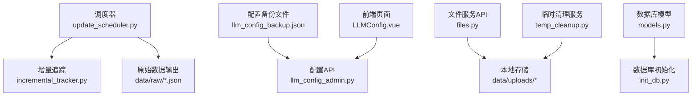
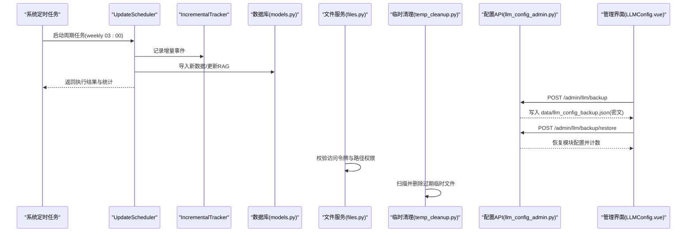
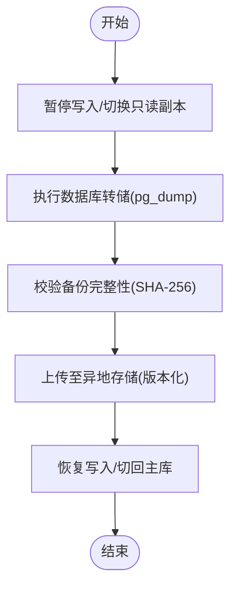
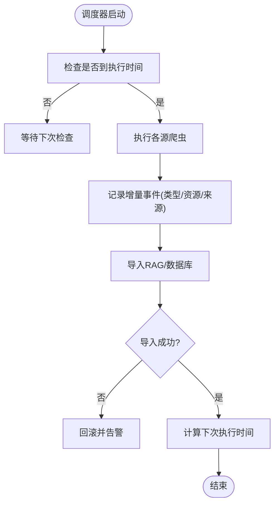
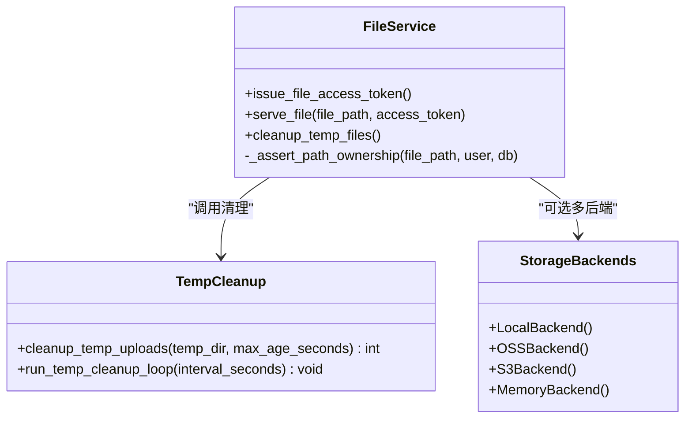
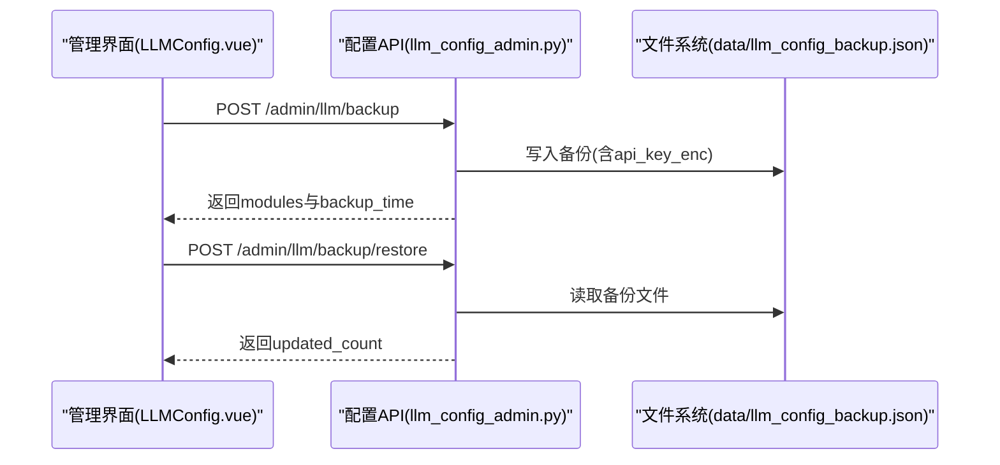
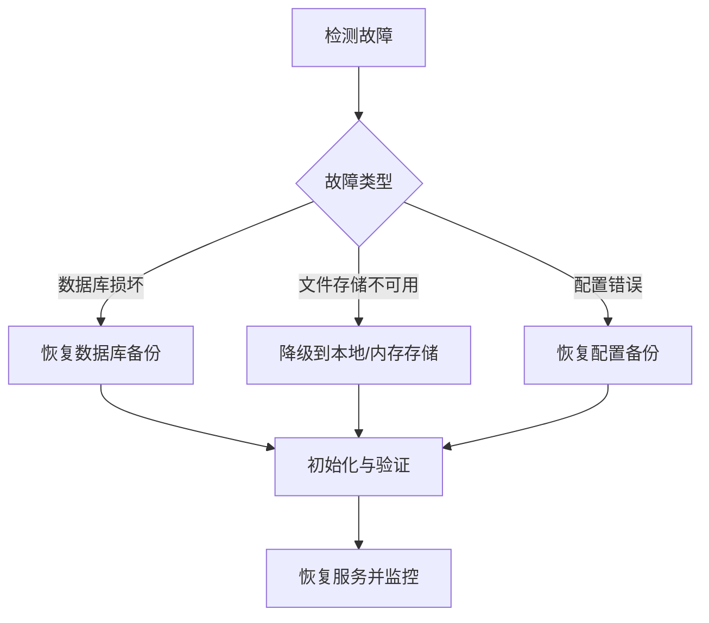
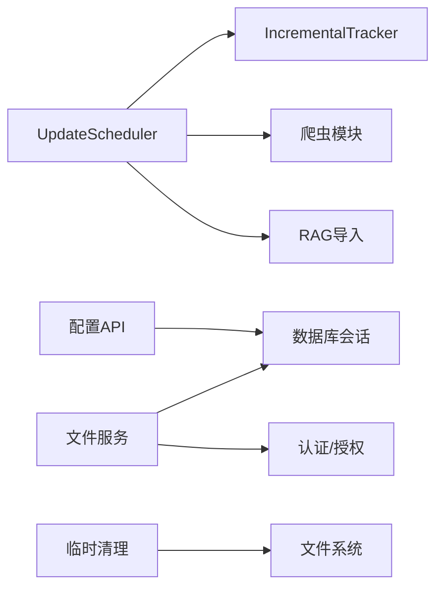

# 备份恢复策略

<cite>
**本文引用的文件**   
- [scheduler_config.json](file://scheduler_config.json)
- [update_scheduler.py](file://src/scheduler/update_scheduler.py)
- [llm_config_backup.json](file://data/llm_config_backup.json)
- [llm_config_admin.py](file://web/backend/api/llm_config_admin.py)
- [LLMConfig.vue](file://web/admin/src/views/LLMConfig.vue)
- [files.py](file://web/backend/api/files.py)
- [temp_cleanup.py](file://web/backend/services/temp_cleanup.py)
- [models.py](file://web/backend/database/models.py)
- [init_db.py](file://web/backend/database/init_db.py)
- [test_incremental_tracker.py](file://tests/test_incremental_tracker.py)
- [incremental_tracker.py](file://src/utils/incremental_tracker.py)
- [risk-mitigation-plan.md](file://docs/design/risk-mitigation-plan.md)
- [feature-upload-ai-knowledge-base.md](file://docs/design/feature-upload-ai-knowledge-base.md)
</cite>

## 目录
1. [引言](#引言)
2. [项目结构](#项目结构)
3. [核心组件](#核心组件)
4. [架构总览](#架构总览)
5. [详细组件分析](#详细组件分析)
6. [依赖关系分析](#依赖关系分析)
7. [性能与容量规划](#性能与容量规划)
8. [故障排查指南](#故障排查指南)
9. [结论](#结论)
10. [附录：操作手册与演练计划](#附录操作手册与演练计划)

## 引言
本文件为 Subskin 项目的数据备份与恢复策略的完整说明，覆盖数据库自动备份、增量备份策略、文件存储备份与配置备份方案；并给出备份任务调度、存储空间管理、备份验证机制与灾难恢复流程。同时提供定时备份脚本建议、异地容灾配置要点、数据迁移工具使用指引以及恢复演练计划，确保在业务连续性与数据安全方面达到生产级标准。

## 项目结构
与备份恢复相关的关键目录与文件：
- 调度与增量追踪
  - scheduler_config.json：定时任务频率、时间窗口、通知开关等配置
  - src/scheduler/update_scheduler.py：周期性采集与增量更新编排器
  - src/utils/incremental_tracker.py：增量变更追踪（SQLite）
  - tests/test_incremental_tracker.py：增量追踪测试
- 配置备份与恢复
  - data/llm_config_backup.json：LLM 模块配置的加密备份文件
  - web/backend/api/llm_config_admin.py：配置备份/恢复 API
  - web/admin/src/views/LLMConfig.vue：前端触发备份/恢复界面逻辑
- 文件存储与访问控制
  - web/backend/api/files.py：文件上传、鉴权、服务接口
  - web/backend/services/temp_cleanup.py：临时上传清理
- 数据库模型与初始化
  - web/backend/database/models.py：ORM 模型定义
  - web/backend/database/init_db.py：数据库初始化与种子数据
- 设计文档（参考）
  - docs/design/risk-mitigation-plan.md：存储降级与多后端策略
  - docs/design/feature-upload-ai-knowledge-base.md：对象存储与生命周期策略

**图表来源** 
- [update_scheduler.py:1-120](file://src/scheduler/update_scheduler.py#L1-L120)
- [incremental_tracker.py](file://src/utils/incremental_tracker.py)
- [llm_config_admin.py:205-311](file://web/backend/api/llm_config_admin.py#L205-L311)
- [LLMConfig.vue:473-506](file://web/admin/src/views/LLMConfig.vue#L473-L506)
- [files.py:293-332](file://web/backend/api/files.py#L293-L332)
- [temp_cleanup.py:1-65](file://web/backend/services/temp_cleanup.py#L1-L65)
- [models.py:1-120](file://web/backend/database/models.py#L1-L120)
- [init_db.py:1-146](file://web/backend/database/init_db.py#L1-L146)

**章节来源**
- [scheduler_config.json:1-11](file://scheduler_config.json#L1-L11)
- [update_scheduler.py:1-120](file://src/scheduler/update_scheduler.py#L1-L120)
- [llm_config_admin.py:205-311](file://web/backend/api/llm_config_admin.py#L205-L311)
- [LLMConfig.vue:473-506](file://web/admin/src/views/LLMConfig.vue#L473-L506)
- [files.py:293-332](file://web/backend/api/files.py#L293-L332)
- [temp_cleanup.py:1-65](file://web/backend/services/temp_cleanup.py#L1-L65)
- [models.py:1-120](file://web/backend/database/models.py#L1-L120)
- [init_db.py:1-146](file://web/backend/database/init_db.py#L1-L146)

## 核心组件
- 定时调度器
  - 通过 scheduler_config.json 指定频率（weekly）、执行时间（hour=3, minute=0）、最大运行时长、通知开关等
  - update_scheduler.py 负责按周期执行爬虫、增量导入 RAG、记录执行历史与状态
- 增量追踪
  - incremental_tracker.py 以 SQLite 记录更新事件（类型、资源ID、来源、详情），支持每日汇总
  - tests/test_incremental_tracker.py 验证初始化、记录与查询能力
- 配置备份与恢复
  - llm_config_admin.py 暴露 /admin/llm/backup 与 /admin/llm/backup/restore 接口，写入 data/llm_config_backup.json（密文 api_key_enc）
  - LLMConfig.vue 在前端触发备份与恢复，首次访问自动创建初始备份
- 文件存储与访问控制
  - files.py 实现短时效文件访问令牌、路径校验、权限判定（社区图片、报告、IM、VASI 等）
  - temp_cleanup.py 定期清理 data/uploads/temp 下过期临时文件
- 数据库模型与初始化
  - models.py 定义用户、帖子、评论、百科、审计日志等实体
  - init_db.py 建表、创建管理员账户、初始化社区分类

**章节来源**
- [scheduler_config.json:1-11](file://scheduler_config.json#L1-L11)
- [update_scheduler.py:1-120](file://src/scheduler/update_scheduler.py#L1-L120)
- [test_incremental_tracker.py:1-48](file://tests/test_incremental_tracker.py#L1-L48)
- [llm_config_admin.py:205-311](file://web/backend/api/llm_config_admin.py#L205-L311)
- [LLMConfig.vue:473-506](file://web/admin/src/views/LLMConfig.vue#L473-L506)
- [files.py:293-332](file://web/backend/api/files.py#L293-L332)
- [temp_cleanup.py:1-65](file://web/backend/services/temp_cleanup.py#L1-L65)
- [models.py:1-120](file://web/backend/database/models.py#L1-L120)
- [init_db.py:1-146](file://web/backend/database/init_db.py#L1-L146)

## 架构总览
下图展示备份恢复整体架构：调度器驱动增量采集与导入，配置备份由后台 API 生成与恢复，文件服务提供受控访问，临时文件定期清理，数据库模型与初始化保障一致性。

**图表来源** 
- [update_scheduler.py:218-381](file://src/scheduler/update_scheduler.py#L218-L381)
- [llm_config_admin.py:231-311](file://web/backend/api/llm_config_admin.py#L231-L311)
- [LLMConfig.vue:473-506](file://web/admin/src/views/LLMConfig.vue#L473-L506)
- [files.py:293-332](file://web/backend/api/files.py#L293-L332)
- [temp_cleanup.py:15-52](file://web/backend/services/temp_cleanup.py#L15-L52)

## 详细组件分析

### 数据库自动备份策略
- 现状与目标
  - 当前仓库未包含专用数据库备份脚本或 Alembic 快照导出流程
  - 目标：基于现有 ORM 模型与初始化脚本，建立可重复的数据库快照与恢复流程
- 推荐方案
  - 使用数据库原生工具（如 PostgreSQL 的 pg_dump）对生产库进行全量/增量备份
  - 将备份文件落盘至独立卷或对象存储（S3/OSS），并启用版本化与生命周期策略
  - 结合 init_db.py 的建表与种子数据，保证新环境快速拉起
- 一致性保障
  - 备份前暂停写入口或开启只读副本，确保事务一致
  - 备份完成后校验文件大小与校验和（SHA-256）
- 恢复流程
  - 停止应用 → 恢复数据库 → 执行 init_db.py 初始化必要表与种子数据 → 启动应用 → 验证关键表行数与索引

[无图表来源，因为该图为概念性流程]

**章节来源**
- [models.py:1-120](file://web/backend/database/models.py#L1-L120)
- [init_db.py:1-146](file://web/backend/database/init_db.py#L1-L146)

### 增量备份策略
- 增量追踪
  - IncrementalTracker 记录每次更新的类型、资源ID、来源与详情，支持每日汇总
  - 调度器在成功采集后调用增量记录，避免重复处理已入库 source_url
- 实施要点
  - 仅对新增内容做 embedding 与导入，已存在直接跳过
  - 每周日凌晨3点统一执行（scheduler_config.json），限制最大运行时长，失败时通知
- 验证与回滚
  - 每次导入后比对增量计数与预期范围
  - 若导入异常，依据增量日志定位问题条目并回滚对应批次

**图表来源** 
- [update_scheduler.py:218-381](file://src/scheduler/update_scheduler.py#L218-L381)
- [test_incremental_tracker.py:1-48](file://tests/test_incremental_tracker.py#L1-L48)

**章节来源**
- [scheduler_config.json:1-11](file://scheduler_config.json#L1-L11)
- [update_scheduler.py:218-381](file://src/scheduler/update_scheduler.py#L218-L381)
- [test_incremental_tracker.py:1-48](file://tests/test_incremental_tracker.py#L1-L48)

### 文件存储备份与访问控制
- 存储结构
  - data/uploads 下按 bucket 划分（community、reports、im、vasi、temp 等）
  - 文件名采用 user_id_hash.ext，便于归属识别与去重
- 访问控制
  - files.py 提供短时效文件访问令牌，优先使用文件级 token，兼容旧版 access_token
  - 路径校验防止越权访问，社区图片需满足公开且未被封禁条件
- 备份建议
  - 对 data/uploads 目录进行增量快照（rsync + 压缩），并结合对象存储生命周期管理
  - 对 PDF 预览页（pages）与临时文件分别制定保留策略
- 清理策略
  - temp_cleanup.py 每小时扫描并删除超过24小时的临时文件，释放空间

**图表来源** 
- [files.py:293-332](file://web/backend/api/files.py#L293-L332)
- [temp_cleanup.py:15-52](file://web/backend/services/temp_cleanup.py#L15-L52)
- [risk-mitigation-plan.md:282-341](file://docs/design/risk-mitigation-plan.md#L282-L341)

**章节来源**
- [files.py:293-332](file://web/backend/api/files.py#L293-L332)
- [temp_cleanup.py:15-52](file://web/backend/services/temp_cleanup.py#L15-L52)
- [risk-mitigation-plan.md:282-341](file://docs/design/risk-mitigation-plan.md#L282-L341)

### 配置备份与恢复
- 备份机制
  - 后台接口 /admin/llm/backup 读取所有模块配置，生成 data/llm_config_backup.json，其中 api_key 以密文形式保存（api_key_enc）
  - 前端首次访问时若无备份则自动创建初始备份
- 恢复机制
  - /admin/llm/backup/restore 从备份文件恢复模块配置，返回更新数量
- 安全注意
  - 备份文件含敏感信息，应限制访问权限并加密存储
  - 接口响应返回掩码，不暴露明文密钥

**图表来源** 
- [llm_config_admin.py:231-311](file://web/backend/api/llm_config_admin.py#L231-L311)
- [LLMConfig.vue:473-506](file://web/admin/src/views/LLMConfig.vue#L473-L506)

**章节来源**
- [llm_config_admin.py:231-311](file://web/backend/api/llm_config_admin.py#L231-L311)
- [llm_config_backup.json:1-149](file://data/llm_config_backup.json#L1-L149)
- [LLMConfig.vue:473-506](file://web/admin/src/views/LLMConfig.vue#L473-L506)

### 灾难恢复流程
- 场景一：数据库损坏
  - 停止应用 → 从异地备份恢复数据库 → 执行 init_db.py 初始化 → 启动应用 → 验证关键表与索引
- 场景二：文件存储不可用
  - 根据 risk-mitigation-plan.md 的多后端策略，自动降级到本地或内存存储，并在响应中标记 degraded
- 场景三：配置错误导致功能异常
  - 通过 /admin/llm/backup/restore 恢复初始配置，确认模块数量与更新时间

**图表来源** 
- [risk-mitigation-plan.md:282-341](file://docs/design/risk-mitigation-plan.md#L282-L341)
- [llm_config_admin.py:299-311](file://web/backend/api/llm_config_admin.py#L299-L311)

**章节来源**
- [risk-mitigation-plan.md:282-341](file://docs/design/risk-mitigation-plan.md#L282-L341)
- [llm_config_admin.py:299-311](file://web/backend/api/llm_config_admin.py#L299-L311)

## 依赖关系分析
- 调度器依赖
  - 增量追踪（SQLite）用于记录更新事件与每日汇总
  - 爬虫模块（PubMed、ClinicalTrials、CrossRef 等）产出 raw JSON 数据
  - RAG 导入与通知（微信）可选
- 配置备份依赖
  - 数据库会话获取模块列表，加密 API Key 后写入备份文件
- 文件服务依赖
  - 认证与授权（access_token/file_token）
  - 数据库查询（社区图片公开性、报告归属）
- 清理服务依赖
  - 文件系统扫描与删除

**图表来源** 
- [update_scheduler.py:1-120](file://src/scheduler/update_scheduler.py#L1-L120)
- [llm_config_admin.py:231-311](file://web/backend/api/llm_config_admin.py#L231-L311)
- [files.py:293-332](file://web/backend/api/files.py#L293-L332)
- [temp_cleanup.py:15-52](file://web/backend/services/temp_cleanup.py#L15-L52)

**章节来源**
- [update_scheduler.py:1-120](file://src/scheduler/update_scheduler.py#L1-L120)
- [llm_config_admin.py:231-311](file://web/backend/api/llm_config_admin.py#L231-L311)
- [files.py:293-332](file://web/backend/api/files.py#L293-L332)
- [temp_cleanup.py:15-52](file://web/backend/services/temp_cleanup.py#L15-L52)

## 性能与容量规划
- 调度器性能
  - 单爬虫超时保护（默认3600秒），避免长时间阻塞
  - 并发线程执行各爬虫，提升吞吐
- 存储容量
  - data/uploads 按 bucket 分区，命名规则便于统计与清理
  - 临时文件24小时过期，降低磁盘占用
- 对象存储生命周期
  - 热存储30天 → 冷存储1年 → 归档存储5年 → 删除
- 成本监控
  - 设置云存储告警（容量、API调用、带宽），每日成本报告

[本节为通用指导，无需特定文件引用]

## 故障排查指南
- 调度器失败
  - 查看 logs/scheduler.log，检查各爬虫状态与错误堆栈
  - 核对 scheduler_config.json 的频率与时间设置
- 增量追踪异常
  - 检查增量数据库 schema 与记录完整性
  - 使用 tests/test_incremental_tracker.py 验证基本功能
- 配置备份/恢复失败
  - 确认 data/llm_config_backup.json 存在且可读
  - 检查接口权限（管理员）与加密字段（api_key_enc）
- 文件访问被拒
  - 校验访问令牌是否有效，路径是否越权
  - 社区图片需满足公开且未被封禁条件
- 临时文件堆积
  - 确认 temp_cleanup.py 定时任务是否运行
  - 手动调用 /api/files/cleanup-temp 清理

**章节来源**
- [update_scheduler.py:218-381](file://src/scheduler/update_scheduler.py#L218-L381)
- [test_incremental_tracker.py:1-48](file://tests/test_incremental_tracker.py#L1-L48)
- [llm_config_admin.py:231-311](file://web/backend/api/llm_config_admin.py#L231-L311)
- [files.py:293-332](file://web/backend/api/files.py#L293-L332)
- [temp_cleanup.py:15-52](file://web/backend/services/temp_cleanup.py#L15-L52)

## 结论
Subskin 项目已具备增量数据采集、配置备份与文件访问控制的基础能力。通过引入数据库自动备份、对象存储生命周期管理、临时文件清理与多后端降级策略，可构建完整的备份恢复体系。建议在生产环境落地以下措施：数据库原生备份与校验、配置备份加密与权限控制、文件存储异地容灾与版本化、调度器监控与告警、恢复演练常态化。

[本节为总结性内容，无需特定文件引用]

## 附录：操作手册与演练计划

### 定时备份脚本建议
- 数据库备份
  - 使用 pg_dump 每日凌晨2点执行，输出到独立卷，并上传至对象存储
  - 校验 SHA-256，失败重试并告警
- 文件备份
  - 使用 rsync 增量同步 data/uploads 到备份服务器
  - 对 PDF 预览页与临时文件分别设置保留策略
- 配置备份
  - 每日调用 /admin/llm/backup 生成最新备份，校验文件大小与格式

[本节为操作建议，无需特定文件引用]

### 异地容灾配置要点
- 主存储：AWS S3（弗吉尼亚）
- 备份存储：阿里云 OSS（华东）
- 生命周期：热→冷→归档→删除
- 访问控制：IAM 最小权限，临时签名 URL（15分钟）
- CDN：脱敏图片启用 CDN 加速

**章节来源**
- [feature-upload-ai-knowledge-base.md:71-89](file://docs/design/feature-upload-ai-knowledge-base.md#L71-L89)

### 数据迁移工具使用
- 数据库迁移
  - 使用 Alembic 基线迁移（001_baseline.py）作为起点
  - 新环境执行 alembic upgrade head，老环境 stamp 基线
- 配置迁移
  - 通过 /admin/llm/backup/restore 恢复模块配置
- 文件迁移
  - 使用 rsync 同步 data/uploads，保持目录结构与权限

**章节来源**
- [models.py:1-120](file://web/backend/database/models.py#L1-L120)
- [llm_config_admin.py:299-311](file://web/backend/api/llm_config_admin.py#L299-L311)

### 恢复演练计划
- 月度演练
  - 选择非高峰时段，模拟数据库损坏与文件存储不可用
  - 执行恢复流程，记录 RTO/RPO 指标
- 演练步骤
  - 停止应用 → 恢复数据库 → 初始化 → 启动应用 → 验证关键功能
  - 若文件存储不可用，验证降级到本地存储并标记 degraded
- 演练评估
  - 统计恢复耗时、数据一致性检查结果、用户影响面
  - 输出改进建议并纳入下一次演练

[本节为演练建议，无需特定文件引用]