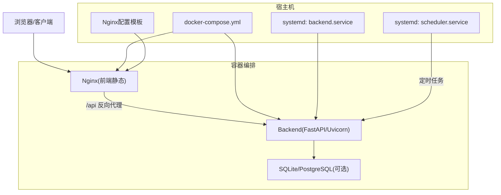
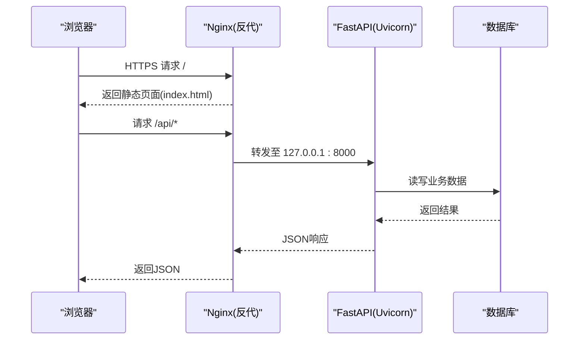
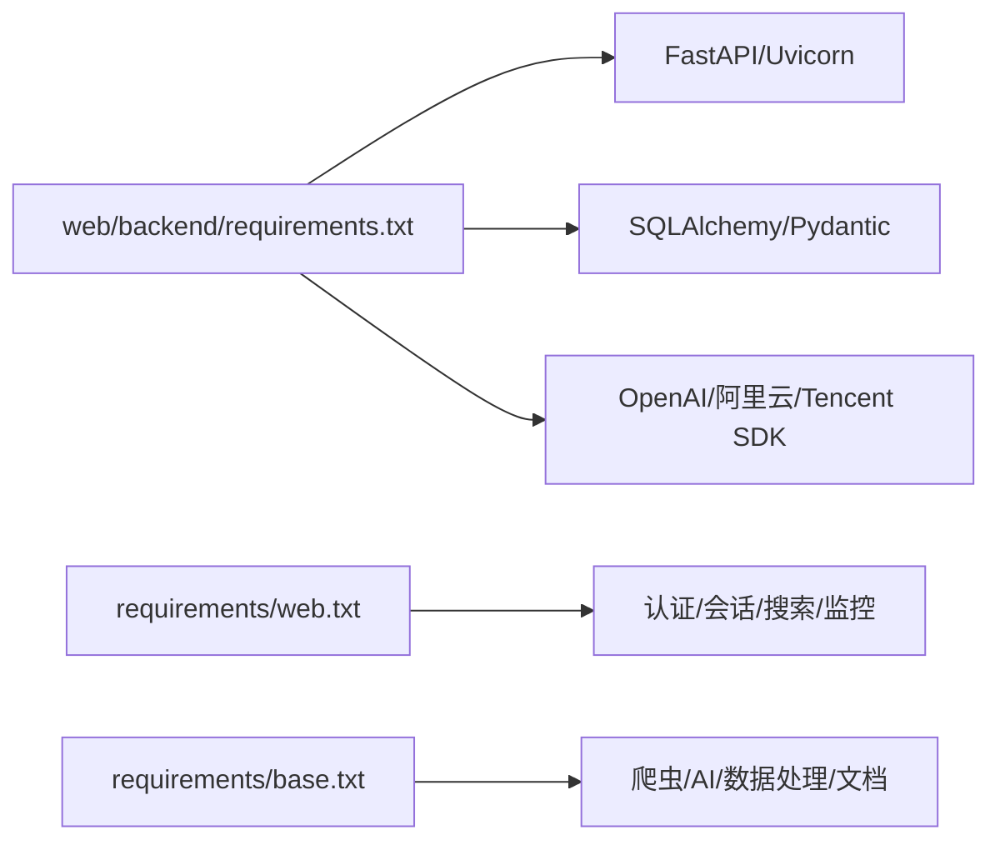
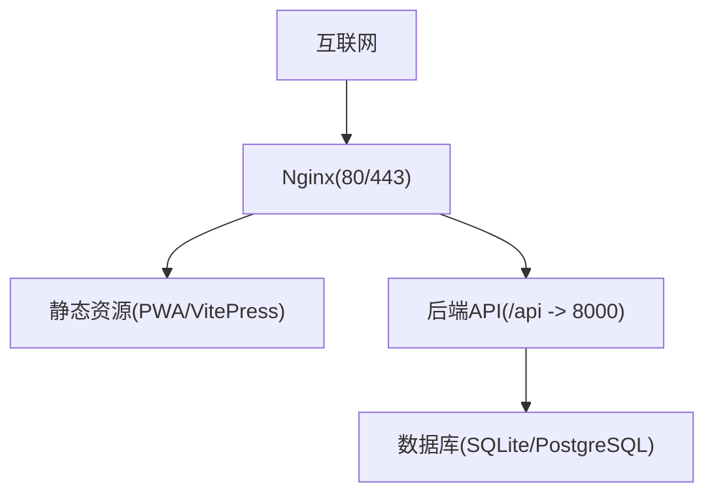

# 容器化部署

<cite>
**本文引用的文件**   
- [web/backend/Dockerfile](file://web/backend/Dockerfile)
- [web/deploy/docker-compose.yml](file://web/deploy/docker-compose.yml)
- [web/deploy/nginx.conf](file://web/deploy/nginx.conf)
- [scripts/deploy.sh](file://scripts/deploy.sh)
- [web/deploy/subskin-backend.service](file://web/deploy/subskin-backend.service)
- [subskin-scheduler.service](file://subskin-scheduler.service)
- [configs/web_config.yaml](file://configs/web_config.yaml)
- [configs/crawler_config.yaml](file://configs/crawler_config.yaml)
- [web/backend/requirements.txt](file://web/backend/requirements.txt)
- [requirements/base.txt](file://requirements/base.txt)
- [requirements/web.txt](file://requirements/web.txt)
- [web/STRUCTURE.md](file://web/STRUCTURE.md)
</cite>

## 目录
1. [简介](#简介)
2. [项目结构](#项目结构)
3. [核心组件](#核心组件)
4. [架构总览](#架构总览)
5. [详细组件分析](#详细组件分析)
6. [依赖关系分析](#依赖关系分析)
7. [性能与资源限制](#性能与资源限制)
8. [故障排查指南](#故障排查指南)
9. [结论](#结论)
10. [附录](#附录)

## 简介
本文件面向Subskin项目的容器化部署，系统阐述Docker镜像构建、多阶段构建优化思路、容器编排配置与微服务部署实践。内容覆盖Dockerfile编写规范、环境变量管理、数据卷挂载策略、服务间通信、开发/测试/生产差异化配置、容器资源限制与健康检查，并提供docker-compose配置解析、网络拓扑设计与存储方案选择建议，帮助读者在本地、测试与生产环境稳定落地。

## 项目结构
本项目采用前后端分离与静态站点结合的方式：
- 后端API（FastAPI + Uvicorn）通过Docker镜像运行，暴露HTTP接口
- 前端静态站点由Nginx托管，反向代理到后端API
- 配置文件集中于configs目录，支持环境变量注入
- 部署脚本与systemd单元用于单机或云主机快速上线

图表来源
- [web/deploy/docker-compose.yml:1-22](file://web/deploy/docker-compose.yml#L1-L22)
- [web/deploy/nginx.conf:1-73](file://web/deploy/nginx.conf#L1-L73)
- [web/backend/Dockerfile:1-13](file://web/backend/Dockerfile#L1-L13)
- [web/deploy/subskin-backend.service:1-16](file://web/deploy/subskin-backend.service#L1-L16)
- [subskin-scheduler.service:1-16](file://subskin-scheduler.service#L1-L16)

章节来源
- [web/STRUCTURE.md:132-181](file://web/STRUCTURE.md#L132-L181)

## 核心组件
- 后端镜像构建：基于python:3.11-slim，安装依赖并启动Uvicorn
- 容器编排：docker-compose定义前端Nginx与后端服务，端口映射与环境变量
- 反向代理：Nginx统一入口，HTTPS强制跳转、安全头、SSE/WebSocket透传
- 进程守护：systemd单元确保后端与调度器常驻与自动重启
- 配置管理：YAML配置+环境变量注入，敏感信息通过.env或外部密钥管理

章节来源
- [web/backend/Dockerfile:1-13](file://web/backend/Dockerfile#L1-L13)
- [web/deploy/docker-compose.yml:1-22](file://web/deploy/docker-compose.yml#L1-L22)
- [web/deploy/nginx.conf:1-73](file://web/deploy/nginx.conf#L1-L73)
- [web/deploy/subskin-backend.service:1-16](file://web/deploy/subskin-backend.service#L1-L16)
- [subskin-scheduler.service:1-16](file://subskin-scheduler.service#L1-L16)
- [configs/web_config.yaml:1-284](file://configs/web_config.yaml#L1-L284)

## 架构总览
下图展示从浏览器到后端API的完整请求链路，以及Nginx的反向代理与安全策略。

图表来源
- [web/deploy/nginx.conf:1-73](file://web/deploy/nginx.conf#L1-L73)
- [web/backend/Dockerfile:1-13](file://web/backend/Dockerfile#L1-L13)

## 详细组件分析

### Docker镜像构建与优化
- 基础镜像：使用python:3.11-slim减小体积
- 依赖安装：先复制requirements.txt再安装，利用Docker缓存层加速构建
- 应用代码：最后COPY源码，避免不必要的变更触发重建
- 运行时：EXPOSE 8000，CMD启动Uvicorn监听0.0.0.0:8000

优化建议（多阶段构建思路）：
- 构建阶段：使用包含编译工具链的基础镜像安装依赖与生成产物
- 运行阶段：仅拷贝必要文件与依赖，进一步缩小镜像体积
- 安全加固：以非root用户运行，最小权限原则

章节来源
- [web/backend/Dockerfile:1-13](file://web/backend/Dockerfile#L1-L13)
- [web/backend/requirements.txt:1-25](file://web/backend/requirements.txt#L1-L25)

### docker-compose编排与服务通信
- 前端服务：nginx:alpine，挂载VitePress构建产物与Nginx配置，端口80
- 后端服务：build ../backend，端口8000，环境变量DATABASE_URL指向SQLite
- 数据持久化：将./data:/app/data挂载为卷，保证数据不随容器销毁丢失
- 依赖顺序：frontend depends_on backend，确保后端先启动

章节来源
- [web/deploy/docker-compose.yml:1-22](file://web/deploy/docker-compose.yml#L1-L22)

### Nginx反向代理与安全策略
- 强制HTTPS：80端口重定向到443
- 静态资源：根路径指向PWA构建产物，启用合理缓存
- API代理：/api转发至后端，开启流式响应与长超时，适配SSE/WebSocket
- 安全头：X-Frame-Options、HSTS、CSP等
- 隐藏文件防护：拒绝访问/.env等敏感路径

章节来源
- [web/deploy/nginx.conf:1-73](file://web/deploy/nginx.conf#L1-L73)

### systemd进程守护与定时任务
- 后端服务：systemd单元指定工作目录、执行命令、自动重启策略与环境变量PATH
- 调度器服务：独立单元运行定时任务，设置重启间隔与缓冲输出

章节来源
- [web/deploy/subskin-backend.service:1-16](file://web/deploy/subskin-backend.service#L1-L16)
- [subskin-scheduler.service:1-16](file://subskin-scheduler.service#L1-L16)

### 环境变量与配置管理
- YAML配置集中管理：web_config.yaml与crawler_config.yaml通过${VAR}占位符引用环境变量
- 敏感信息：JWT密钥、数据库连接串、第三方API Key等通过环境变量注入
- 推荐实践：使用.dockerenv或外部密钥管理服务，避免硬编码

章节来源
- [configs/web_config.yaml:1-284](file://configs/web_config.yaml#L1-L284)
- [configs/crawler_config.yaml:1-143](file://configs/crawler_config.yaml#L1-L143)

### 一键部署脚本
- 环境检测：检查Python版本与虚拟环境
- 依赖安装：按base/dev分类安装
- 配置初始化：若.env不存在则从模板创建并提示编辑
- 数据与日志：创建必要目录
- 测试验证：运行pytest
- 定时任务：交互式添加crontab条目

章节来源
- [scripts/deploy.sh:1-144](file://scripts/deploy.sh#L1-L144)

## 依赖关系分析
- 后端依赖：FastAPI、Uvicorn、SQLAlchemy、Pydantic、OpenAI SDK、阿里云短信SDK、支付宝SDK等
- Web依赖：认证、数据库、缓存、搜索、图像处理、监控与日志等
- 基础依赖：爬虫、数据处理、AI处理、文档生成等

图表来源
- [web/backend/requirements.txt:1-25](file://web/backend/requirements.txt#L1-L25)
- [requirements/web.txt:1-40](file://requirements/web.txt#L1-L40)
- [requirements/base.txt:1-37](file://requirements/base.txt#L1-L37)

章节来源
- [web/backend/requirements.txt:1-25](file://web/backend/requirements.txt#L1-L25)
- [requirements/web.txt:1-40](file://requirements/web.txt#L1-L40)
- [requirements/base.txt:1-37](file://requirements/base.txt#L1-L37)

## 性能与资源限制
- 镜像体积：优先使用slim基础镜像，按需裁剪依赖；生产环境建议使用多阶段构建
- 并发与线程：Uvicorn默认单进程多线程，生产建议多worker或多实例配合负载均衡
- 数据库连接池：根据QPS调整pool_size与max_overflow，避免连接耗尽
- 缓存策略：Redis缓存热点数据，缩短响应时间
- 资源限制：在docker-compose中为各服务设置CPU与内存上限，防止资源争用
- 健康检查：为后端提供/health端点，编排层定期探测，异常自动重启

[本节为通用指导，不直接分析具体文件]

## 故障排查指南
- 启动失败：检查Docker镜像构建日志与依赖安装是否成功
- 端口冲突：确认80与8000未被占用，必要时修改映射端口
- 环境变量缺失：核对.env或compose environment中的关键变量是否齐全
- 数据卷权限：确保容器内用户对挂载目录有读写权限
- 反向代理问题：查看Nginx错误日志，确认/api转发与超时设置
- 数据库连接：校验DATABASE_URL格式与驱动可用性
- 定时任务：检查systemd服务状态与cron任务是否生效

章节来源
- [web/deploy/docker-compose.yml:1-22](file://web/deploy/docker-compose.yml#L1-L22)
- [web/deploy/nginx.conf:1-73](file://web/deploy/nginx.conf#L1-L73)
- [web/deploy/subskin-backend.service:1-16](file://web/deploy/subskin-backend.service#L1-L16)
- [subskin-scheduler.service:1-16](file://subskin-scheduler.service#L1-L16)

## 结论
通过Docker镜像标准化构建、docker-compose编排与Nginx统一入口，Subskin实现了前后端解耦、可移植与易维护的部署形态。结合systemd守护与定时任务，满足单机与云主机的生产需求。建议在后续迭代中引入多阶段构建、外部密钥管理与更完善的健康检查与监控体系，进一步提升稳定性与可观测性。

[本节为总结性内容，不直接分析具体文件]

## 附录

### 开发/测试/生产环境差异建议
- 开发环境：本地docker-compose快速拉起，关闭严格安全头，启用热重载
- 测试环境：隔离数据卷与数据库，注入测试密钥，运行自动化测试套件
- 生产环境：启用HTTPS与HSTS，限制资源配额，启用日志轮转与监控告警

[本节为通用指导，不直接分析具体文件]

### 网络拓扑设计
- 外网入口：Nginx统一暴露80/443，静态资源与API分流
- 内部网络：容器间通过Compose默认网络通信，后端直连数据库
- 反向代理：/api转发至后端，SSE/WebSocket需保持长连接

图表来源
- [web/deploy/nginx.conf:1-73](file://web/deploy/nginx.conf#L1-L73)
- [web/deploy/docker-compose.yml:1-22](file://web/deploy/docker-compose.yml#L1-L22)

### 存储方案选择指南
- SQLite：适合单机与轻量场景，数据卷持久化简单可靠
- PostgreSQL：适合高并发与复杂查询，需额外容器或外部服务
- 对象存储：图片与附件建议迁移至OSS/S3，降低容器磁盘压力
- 缓存与队列：Redis缓存热点数据，消息队列异步处理耗时任务

[本节为通用指导，不直接分析具体文件]