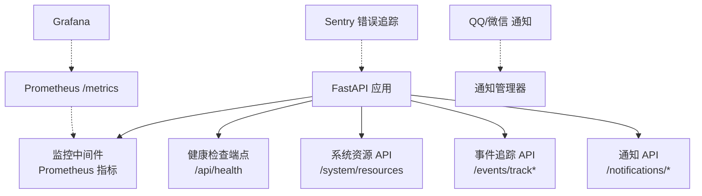
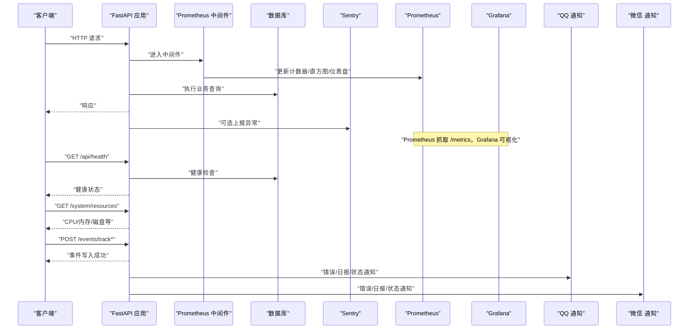
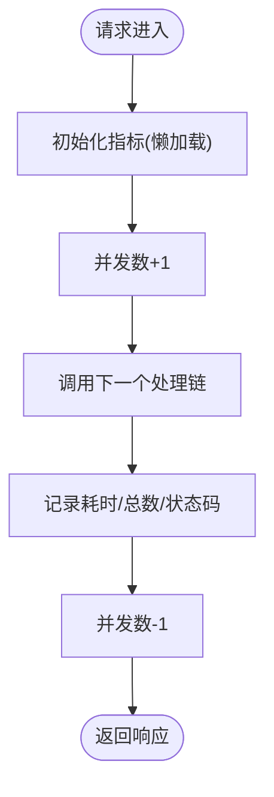
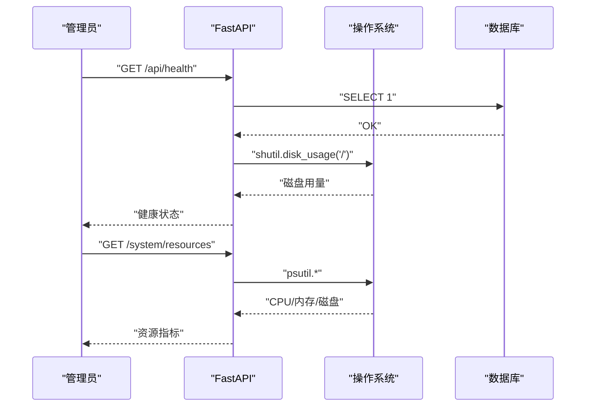
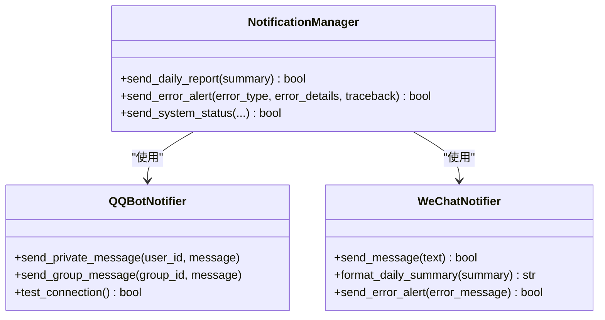
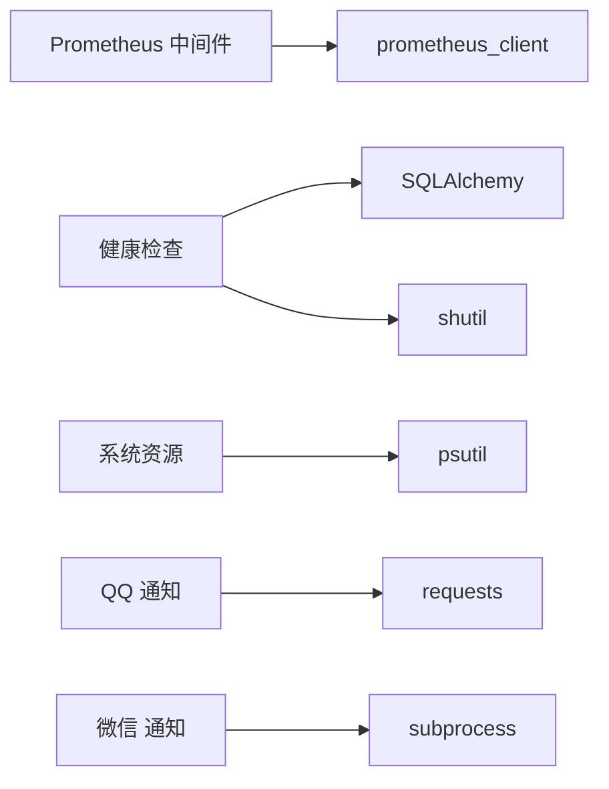

# 监控告警系统

<cite>
**本文引用的文件**
- [web/backend/services/monitoring.py](file://web/backend/services/monitoring.py)
- [web/backend/api/admin_general.py](file://web/backend/api/admin_general.py)
- [src/settings/settings.py](file://src/settings/settings.py)
- [src/settings/logging.py](file://src/settings/logging.py)
- [src/utils/logger.py](file://src/utils/logger.py)
- [src/notifications/qq_notifier.py](file://src/notifications/qq_notifier.py)
- [src/notifications/wechat_notifier.py](file://src/notifications/wechat_notifier.py)
- [web/backend/api/events.py](file://web/backend/api/events.py)
- [web/app/src/composables/useNotifications.ts](file://web/app/src/composables/useNotifications.ts)
- [web/admin/src/views/SystemMonitor.vue](file://web/admin/src/views/SystemMonitor.vue)
- [web/backend/api/notifications.py](file://web/backend/api/notifications.py)
</cite>

## 目录
1. [简介](#简介)
2. [项目结构](#项目结构)
3. [核心组件](#核心组件)
4. [架构总览](#架构总览)
5. [详细组件分析](#详细组件分析)
6. [依赖关系分析](#依赖关系分析)
7. [性能考量](#性能考量)
8. [故障排查指南](#故障排查指南)
9. [结论](#结论)
10. [附录](#附录)

## 简介
本文件面向 Subskin 项目的“监控与告警”体系，覆盖应用性能监控、数据库查询监控、API 响应时间跟踪、错误率统计、Prometheus 指标收集、Grafana 可视化面板建议、告警规则配置思路、通知渠道集成（QQ/微信）、服务器资源监控、业务指标定义、异常检测算法与自动化响应机制。文档同时提供可操作的脚本路径、阈值建议、日志聚合方案与性能分析工具使用指引，帮助运维与研发快速落地并持续优化。

## 项目结构
监控与告警相关代码主要分布在以下位置：
- 后端服务监控中间件与健康检查：web/backend/services/monitoring.py
- 系统资源监控 API：web/backend/api/admin_general.py
- 全局设置（含指标端口、保留策略、告警邮件开关等）：src/settings/settings.py
- 日志配置与工具：src/settings/logging.py、src/utils/logger.py
- 通知渠道（QQ/微信）：src/notifications/qq_notifier.py、src/notifications/wechat_notifier.py
- 用户行为事件追踪 API：web/backend/api/events.py
- 前端通知与系统监控页面：web/app/src/composables/useNotifications.ts、web/admin/src/views/SystemMonitor.vue
- 站内通知 API：web/backend/api/notifications.py

图表来源
- [web/backend/services/monitoring.py:96-203](file://web/backend/services/monitoring.py#L96-L203)
- [web/backend/api/admin_general.py:79-106](file://web/backend/api/admin_general.py#L79-L106)
- [web/backend/api/events.py:1-37](file://web/backend/api/events.py#L1-L37)
- [web/backend/api/notifications.py:1-56](file://web/backend/api/notifications.py#L1-L56)

章节来源
- [web/backend/services/monitoring.py:1-260](file://web/backend/services/monitoring.py#L1-L260)
- [web/backend/api/admin_general.py:79-106](file://web/backend/api/admin_general.py#L79-L106)
- [web/backend/api/events.py:1-37](file://web/backend/api/events.py#L1-L37)
- [web/backend/api/notifications.py:1-56](file://web/backend/api/notifications.py#L1-L56)

## 核心组件
- Prometheus 指标中间件：采集 HTTP 请求总量、耗时直方图、并发请求数，暴露 /metrics 供 Prometheus 抓取。
- Sentry 错误追踪：可选初始化，自动捕获异常并过滤敏感头信息。
- 健康检查：/api/health 返回服务状态与关键依赖（数据库、磁盘空间）检查结果。
- 系统资源监控：/system/resources 返回 CPU、内存、磁盘、数据库文件大小、运行时长等。
- 事件追踪：批量记录用户行为事件，支持限流与字段长度限制，避免写放大。
- 通知渠道：QQ Bot 与微信（OpenClaw CLI + 文件投递），用于日常简报、错误告警与系统状态报告。
- 设置项：指标端口、保留天数、告警邮件开关与 SMTP 参数等。

章节来源
- [web/backend/services/monitoring.py:28-91](file://web/backend/services/monitoring.py#L28-L91)
- [web/backend/services/monitoring.py:96-203](file://web/backend/services/monitoring.py#L96-L203)
- [web/backend/services/monitoring.py:208-240](file://web/backend/services/monitoring.py#L208-L240)
- [web/backend/api/admin_general.py:79-106](file://web/backend/api/admin_general.py#L79-L106)
- [web/backend/api/events.py:20-37](file://web/backend/api/events.py#L20-L37)
- [src/notifications/qq_notifier.py:40-126](file://src/notifications/qq_notifier.py#L40-L126)
- [src/notifications/wechat_notifier.py:26-106](file://src/notifications/wechat_notifier.py#L26-L106)
- [src/settings/settings.py:194-259](file://src/settings/settings.py#L194-L259)

## 架构总览
下图展示从请求进入 FastAPI，到指标采集、错误上报、健康检查、资源监控、事件追踪与通知发送的完整链路。

图表来源
- [web/backend/services/monitoring.py:96-203](file://web/backend/services/monitoring.py#L96-L203)
- [web/backend/services/monitoring.py:208-240](file://web/backend/services/monitoring.py#L208-L240)
- [web/backend/api/admin_general.py:79-106](file://web/backend/api/admin_general.py#L79-L106)
- [web/backend/api/events.py:20-37](file://web/backend/api/events.py#L20-L37)
- [src/notifications/qq_notifier.py:400-485](file://src/notifications/qq_notifier.py#L400-L485)
- [src/notifications/wechat_notifier.py:55-106](file://src/notifications/wechat_notifier.py#L55-L106)

## 详细组件分析

### Prometheus 指标与 /metrics 端点
- 指标类型
  - http_requests_total：按 method、endpoint、status_code 维度计数
  - http_request_duration_seconds：按 method、endpoint 维度的耗时直方图
  - http_requests_in_progress：按 method 维度的并发请求数
- 端点启用：通过环境变量控制是否启用 /metrics 暴露
- 路由规范化：使用路由模板而非真实路径，降低基数

图表来源
- [web/backend/services/monitoring.py:113-172](file://web/backend/services/monitoring.py#L113-L172)
- [web/backend/services/monitoring.py:185-203](file://web/backend/services/monitoring.py#L185-L203)

章节来源
- [web/backend/services/monitoring.py:96-203](file://web/backend/services/monitoring.py#L96-L203)

### Sentry 错误追踪
- 可选初始化：未配置 DSN 时跳过
- 集成 FastAPI/Starlette/SQLAlchemy
- 过滤敏感请求头（如密码、token 等）
- 支持手动捕获异常并附加上下文

章节来源
- [web/backend/services/monitoring.py:28-91](file://web/backend/services/monitoring.py#L28-L91)

### 健康检查与资源监控
- /api/health：检查数据库连通性与磁盘空间，返回 healthy/degraded/unhealthy
- /system/resources：返回 CPU、内存、磁盘、数据库文件大小、启动时间等

图表来源
- [web/backend/services/monitoring.py:208-240](file://web/backend/services/monitoring.py#L208-L240)
- [web/backend/api/admin_general.py:79-106](file://web/backend/api/admin_general.py#L79-L106)

章节来源
- [web/backend/services/monitoring.py:208-240](file://web/backend/services/monitoring.py#L208-L240)
- [web/backend/api/admin_general.py:79-106](file://web/backend/api/admin_general.py#L79-L106)

### 用户行为事件追踪
- 批量写入：单请求最多 50 条，配合读限流保护共享 SQLite
- 字段约束：event_type、element_id、page_path、element_text、session_id 等长度限制
- 用途：埋点分析、漏斗转化、异常定位

章节来源
- [web/backend/api/events.py:20-37](file://web/backend/api/events.py#L20-L37)

### 通知渠道（QQ/微信）
- QQ Bot：基于 go-cqhttp HTTP API，支持私聊/群消息、重试与超时控制；提供每日报告、错误告警、系统状态报告格式化
- 微信：优先将简报写入 data/briefings 目录由 Hermes 定时任务投递；回退尝试 openclaw CLI
- 通知管理：统一封装发送入口，便于在监控/调度流程中复用

图表来源
- [src/notifications/qq_notifier.py:40-126](file://src/notifications/qq_notifier.py#L40-L126)
- [src/notifications/qq_notifier.py:400-485](file://src/notifications/qq_notifier.py#L400-L485)
- [src/notifications/wechat_notifier.py:26-106](file://src/notifications/wechat_notifier.py#L26-L106)

章节来源
- [src/notifications/qq_notifier.py:40-126](file://src/notifications/qq_notifier.py#L40-L126)
- [src/notifications/qq_notifier.py:400-485](file://src/notifications/qq_notifier.py#L400-L485)
- [src/notifications/wechat_notifier.py:26-106](file://src/notifications/wechat_notifier.py#L26-L106)

### 前端通知与系统监控
- 前端通知：轮询未读数、拉取列表、标记已读，提升交互体验
- 系统监控页面：展示 CPU、内存、磁盘等实时指标，辅助运维决策

章节来源
- [web/app/src/composables/useNotifications.ts:13-50](file://web/app/src/composables/useNotifications.ts#L13-L50)
- [web/admin/src/views/SystemMonitor.vue:1-40](file://web/admin/src/views/SystemMonitor.vue#L1-L40)

## 依赖关系分析
- 中间件依赖 prometheus_client（可选），未安装则降级为禁用模式
- 健康检查依赖 SQLAlchemy engine 与 shutil
- 资源监控依赖 psutil
- 通知模块依赖 requests（QQ）与 subprocess（微信 OpenClaw CLI）
- 日志模块提供控制台与文件轮转输出

图表来源
- [web/backend/services/monitoring.py:113-139](file://web/backend/services/monitoring.py#L113-L139)
- [web/backend/services/monitoring.py:208-240](file://web/backend/services/monitoring.py#L208-L240)
- [web/backend/api/admin_general.py:79-106](file://web/backend/api/admin_general.py#L79-L106)
- [src/notifications/qq_notifier.py:40-126](file://src/notifications/qq_notifier.py#L40-L126)
- [src/notifications/wechat_notifier.py:55-106](file://src/notifications/wechat_notifier.py#L55-L106)

章节来源
- [web/backend/services/monitoring.py:113-139](file://web/backend/services/monitoring.py#L113-L139)
- [web/backend/api/admin_general.py:79-106](file://web/backend/api/admin_general.py#L79-L106)
- [src/notifications/qq_notifier.py:40-126](file://src/notifications/qq_notifier.py#L40-L126)
- [src/notifications/wechat_notifier.py:55-106](file://src/notifications/wechat_notifier.py#L55-L106)

## 性能考量
- 指标基数控制：使用路由模板作为 endpoint 标签，避免高基数导致存储膨胀
- 直方图桶设计：合理选择分桶区间以覆盖常见延迟范围
- 并发度量：in_progress 指标有助于识别拥塞与慢接口
- 事件写入限流：批量上限与 IP 级限流防止写放大
- 资源监控采样：CPU 采样间隔与磁盘检查频率需平衡精度与开销

[本节为通用指导，不直接分析具体文件]

## 故障排查指南
- 指标不可用
  - 确认环境变量是否启用 Prometheus 指标
  - 检查 /metrics 端点是否返回内容
  - 查看日志中关于 prometheus_client 导入失败的警告
- 健康检查异常
  - 检查数据库连接是否正常
  - 检查磁盘可用空间是否低于阈值
- 通知失败
  - QQ：验证 go-cqhttp 可达性与 OneBot v11 协议返回
  - 微信：确认 brief 文件写入成功或 openclaw CLI 可用
- 日志问题
  - 检查日志级别与输出目标（控制台/文件）
  - 确认文件轮转策略与保留天数

章节来源
- [web/backend/services/monitoring.py:185-203](file://web/backend/services/monitoring.py#L185-L203)
- [web/backend/services/monitoring.py:208-240](file://web/backend/services/monitoring.py#L208-L240)
- [src/notifications/qq_notifier.py:40-126](file://src/notifications/qq_notifier.py#L40-L126)
- [src/notifications/wechat_notifier.py:55-106](file://src/notifications/wechat_notifier.py#L55-L106)
- [src/settings/logging.py:14-43](file://src/settings/logging.py#L14-L43)
- [src/utils/logger.py:19-81](file://src/utils/logger.py#L19-L81)

## 结论
Subskin 的监控与告警体系以 Prometheus 指标为核心，结合 Sentry 错误追踪、健康检查与系统资源监控，形成“可观测性闭环”。通知渠道（QQ/微信）提供即时触达能力，便于快速响应异常。通过合理的指标设计、阈值管理与日志聚合，可在生产环境中实现稳定的可观测性与高效的排障效率。

[本节为总结性内容，不直接分析具体文件]

## 附录

### Prometheus 指标与 Grafana 面板建议
- 指标
  - http_requests_total（method、endpoint、status_code）
  - http_request_duration_seconds（method、endpoint）
  - http_requests_in_progress（method）
- 面板建议
  - QPS 趋势（按方法/端点分组）
  - 延迟分布（P50/P90/P99）
  - 错误率（5xx/4xx）
  - 并发请求峰值
- 抓取配置
  - 确保 /metrics 端点可访问
  - 配置 scrape_interval 与 timeout

[本节为通用实践，不直接分析具体文件]

### 告警规则配置建议（PromQL）
- 错误率
  - sum(rate(http_requests_total{status_code=~"5.."}[5m])) / sum(rate(http_requests_total[5m])) > 0.05
- 延迟
  - histogram_quantile(0.99, rate(http_request_duration_seconds_bucket[5m])) > 5
- 并发
  - sum(http_requests_in_progress) > 阈值（根据容量评估）
- 可用性
  - up{job="subskin"} == 0

[本节为通用实践，不直接分析具体文件]

### 通知渠道集成要点
- QQ
  - 配置 go-cqhttp 地址与端口
  - 设置 NOTIFY_USER_ID 进行定向通知
  - 使用 NotificationManager 发送日报/错误/状态
- 微信
  - 首选将简报写入 data/briefings，交由 Hermes 定时任务推送
  - 回退使用 openclaw CLI 发送
- 触发时机
  - 错误：异常捕获后即时发送
  - 日报：定时任务生成摘要后发送
  - 状态：周期性巡检后发送

章节来源
- [src/notifications/qq_notifier.py:400-485](file://src/notifications/qq_notifier.py#L400-L485)
- [src/notifications/wechat_notifier.py:55-106](file://src/notifications/wechat_notifier.py#L55-L106)

### 日志聚合方案
- 本地日志
  - 控制台输出 + 文件轮转（TimedRotatingFileHandler）
  - 统一格式：时间 | 级别 | 模块 | 消息
- 集中化
  - 将日志文件挂载至日志采集器（如 Filebeat/Fluent Bit）
  - 推送到 ELK/Loki 等平台，建立索引与检索
- 脱敏
  - 对敏感字段（密码、token）进行脱敏或过滤

章节来源
- [src/utils/logger.py:19-81](file://src/utils/logger.py#L19-L81)
- [src/settings/logging.py:14-43](file://src/settings/logging.py#L14-L43)

### 性能分析工具使用指南
- 应用层
  - 使用 Prometheus 直方图观察 P95/P99 延迟
  - 结合 Grafana 看板定位热点接口
- 数据库层
  - 开启慢查询日志，定期分析
  - 使用 EXPLAIN/EXPLAIN ANALYZE 优化查询计划
- 系统层
  - 使用 top/htop、vmstat、iostat 观察 CPU/IO
  - 使用 ss/netstat 观察连接数与端口占用

[本节为通用实践，不直接分析具体文件]

### 监控脚本与阈值参考
- 健康检查脚本
  - 周期调用 /api/health，若 unhealthy 则触发告警
- 资源监控脚本
  - 周期调用 /system/resources，超过阈值（如 CPU>85%、内存>90%、磁盘剩余<10%）触发告警
- 指标抓取脚本
  - 使用 curl 抓取 /metrics，解析关键指标并输出

[本节为通用实践，不直接分析具体文件]

### 业务指标定义示例
- 事件类
  - 事件提交成功率、批大小分布、失败原因分类
- 质量类
  - 照片质量评分、AI 置信度、耗时
- 业务类
  - 评估次数、改善率、VASI 评分变化

章节来源
- [web/backend/api/events.py:20-37](file://web/backend/api/events.py#L20-L37)

### 异常检测算法与自动化响应
- 异常检测
  - 基于滑动窗口的均值/方差阈值
  - 基于历史分位数的动态阈值（如 P95 超阈）
- 自动化响应
  - 触发通知（QQ/微信）
  - 自动扩容/限流（结合外部编排系统）
  - 自动回滚/降级（结合发布系统）

[本节为通用实践，不直接分析具体文件]