# 部署脚本与工具

<cite>
**本文引用的文件**   
- [Makefile](file://Makefile)
- [scripts/deploy.sh](file://scripts/deploy.sh)
- [web/backend/start.sh](file://web/backend/start.sh)
- [web/deploy/docker-compose.yml](file://web/deploy/docker-compose.yml)
- [web/deploy/nginx.conf](file://web/deploy/nginx.conf)
- [web/deploy/subskin-admin.conf](file://web/deploy/subskin-admin.conf)
- [web/backend/Dockerfile](file://web/backend/Dockerfile)
- [web/deploy/subskin-backend.service](file://web/deploy/subskin-backend.service)
- [subskin-scheduler.service](file://subskin-scheduler.service)
- [.github/workflows/ci.yml](file://.github/workflows/ci.yml)
- [.github/workflows/test.yml](file://.github/workflows/test.yml)
- [.github/workflows/weekly.yml](file://.github/workflows/weekly.yml)
- [configs/web_config.yaml](file://configs/web_config.yaml)
- [web/backend/app/main.py](file://web/backend/app/main.py)
- [web/backend/services/monitoring.py](file://web/backend/services/monitoring.py)
</cite>

## 目录
1. [简介](#简介)
2. [项目结构](#项目结构)
3. [核心组件](#核心组件)
4. [架构总览](#架构总览)
5. [详细组件分析](#详细组件分析)
6. [依赖关系分析](#依赖关系分析)
7. [性能考虑](#性能考虑)
8. [故障排查指南](#故障排查指南)
9. [结论](#结论)
10. [附录](#附录)

## 简介
本文件面向Subskin项目的运维与交付，系统性梳理自动化部署脚本、服务启动管理、进程守护与环境初始化流程；详解Makefile命令集、CI/CD流水线集成、版本发布与回滚策略；并给出系统服务配置、日志轮转建议、健康检查接口与监控指标采集方案。文档同时提供部署最佳实践、常见故障定位方法与日常运维操作指引，帮助读者快速、稳定地上线与运维Subskin。

## 项目结构
围绕部署与运维的关键目录与文件如下：
- 根级构建与任务编排：Makefile
- 服务器一键部署脚本：scripts/deploy.sh
- 后端启动脚本：web/backend/start.sh
- Docker化运行：web/backend/Dockerfile、web/deploy/docker-compose.yml
- Nginx反向代理与安全头：web/deploy/nginx.conf、web/deploy/subskin-admin.conf
- systemd服务单元：web/deploy/subskin-backend.service、subskin-scheduler.service
- CI/CD流水线：.github/workflows/ci.yml、test.yml、weekly.yml
- 运行时配置模板：configs/web_config.yaml
- 后端健康检查与监控：web/backend/app/main.py、web/backend/services/monitoring.py

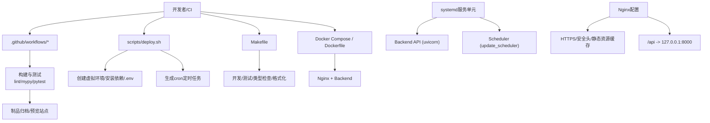

**图表来源** 
- [Makefile](file://Makefile)
- [scripts/deploy.sh](file://scripts/deploy.sh)
- [web/backend/start.sh](file://web/backend/start.sh)
- [web/deploy/docker-compose.yml](file://web/deploy/docker-compose.yml)
- [web/deploy/nginx.conf](file://web/deploy/nginx.conf)
- [web/deploy/subskin-admin.conf](file://web/deploy/subskin-admin.conf)
- [web/backend/Dockerfile](file://web/backend/Dockerfile)
- [web/deploy/subskin-backend.service](file://web/deploy/subskin-backend.service)
- [subskin-scheduler.service](file://subskin-scheduler.service)
- [.github/workflows/ci.yml](file://.github/workflows/ci.yml)
- [.github/workflows/test.yml](file://.github/workflows/test.yml)
- [.github/workflows/weekly.yml](file://.github/workflows/weekly.yml)

**章节来源**
- [Makefile](file://Makefile)
- [scripts/deploy.sh](file://scripts/deploy.sh)
- [web/backend/start.sh](file://web/backend/start.sh)
- [web/deploy/docker-compose.yml](file://web/deploy/docker-compose.yml)
- [web/deploy/nginx.conf](file://web/deploy/nginx.conf)
- [web/deploy/subskin-admin.conf](file://web/deploy/subskin-admin.conf)
- [web/backend/Dockerfile](file://web/backend/Dockerfile)
- [web/deploy/subskin-backend.service](file://web/deploy/subskin-backend.service)
- [subskin-scheduler.service](file://subskin-scheduler.service)
- [.github/workflows/ci.yml](file://.github/workflows/ci.yml)
- [.github/workflows/test.yml](file://.github/workflows/test.yml)
- [.github/workflows/weekly.yml](file://.github/workflows/weekly.yml)

## 核心组件
- Makefile命令集：覆盖环境搭建、依赖安装、测试、代码质量（ruff/mypy）、数据库迁移、开发服务器、爬虫与内容生成、文档构建等。
- 一键部署脚本：自动检测Python、创建虚拟环境、安装基础/可选开发依赖、初始化.env、创建日志与数据目录、运行测试、提示配置crontab。
- 后端启动脚本：设置PYTHONPATH、绑定127.0.0.1:8000、支持RELOAD开关，便于开发与生产差异控制。
- Docker与Compose：后端镜像构建与端口暴露；前端Nginx容器挂载VitePress产物，后端通过环境变量注入数据库连接。
- Nginx配置：强制HTTPS、安全响应头、PWA静态资源缓存策略、Service Worker不缓存、隐藏路径拒绝访问、/api反向代理至后端。
- systemd服务单元：后端API与调度器以simple模式运行，自动重启与重启间隔配置，PATH指向虚拟环境。
- CI/CD流水线：多Python版本矩阵测试、Lint与类型检查、覆盖率上报；每周定时内容生成工作流，自动生成PR与邮件通知。
- 健康检查与监控：/api/health端点返回服务状态；监控模块支持Sentry、Prometheus中间件与指标端点初始化。

**章节来源**
- [Makefile](file://Makefile)
- [scripts/deploy.sh](file://scripts/deploy.sh)
- [web/backend/start.sh](file://web/backend/start.sh)
- [web/deploy/docker-compose.yml](file://web/deploy/docker-compose.yml)
- [web/deploy/nginx.conf](file://web/deploy/nginx.conf)
- [web/deploy/subskin-admin.conf](file://web/deploy/subskin-admin.conf)
- [web/backend/Dockerfile](file://web/backend/Dockerfile)
- [web/deploy/subskin-backend.service](file://web/deploy/subskin-backend.service)
- [subskin-scheduler.service](file://subskin-scheduler.service)
- [.github/workflows/ci.yml](file://.github/workflows/ci.yml)
- [.github/workflows/test.yml](file://.github/workflows/test.yml)
- [.github/workflows/weekly.yml](file://.github/workflows/weekly.yml)
- [web/backend/app/main.py](file://web/backend/app/main.py)
- [web/backend/services/monitoring.py](file://web/backend/services/monitoring.py)

## 架构总览
下图展示从代码提交到线上运行的完整链路：CI执行质量门禁与测试，制品产出后由部署脚本或Compose拉起服务，Nginx作为入口统一处理HTTPS与安全头，后端API与调度器由systemd守护，监控与健康检查对外暴露。

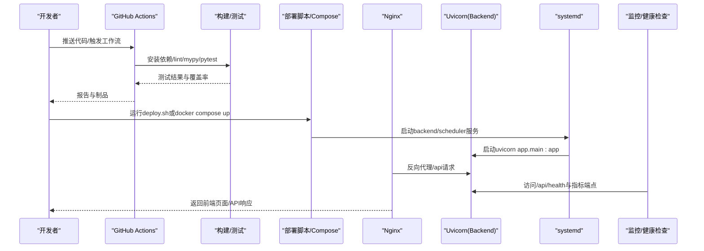

**图表来源** 
- [.github/workflows/ci.yml](file://.github/workflows/ci.yml)
- [.github/workflows/test.yml](file://.github/workflows/test.yml)
- [scripts/deploy.sh](file://scripts/deploy.sh)
- [web/deploy/docker-compose.yml](file://web/deploy/docker-compose.yml)
- [web/deploy/nginx.conf](file://web/deploy/nginx.conf)
- [web/backend/start.sh](file://web/backend/start.sh)
- [web/deploy/subskin-backend.service](file://web/deploy/subskin-backend.service)
- [web/backend/app/main.py](file://web/backend/app/main.py)
- [web/backend/services/monitoring.py](file://web/backend/services/monitoring.py)

## 详细组件分析

### Makefile命令集
- 环境与依赖：setup、install、dev-install分别用于创建虚拟环境、安装全量依赖与仅开发依赖。
- 质量与测试：test、lint、format、type-check覆盖pytest、ruff、black、mypy。
- 数据库：db-init、db-migrate调用初始化与alembic升级。
- 开发服务器：run-dev使用uvicorn热重载。
- 爬虫与内容：crawl-*系列命令与generate-weekly。
- 文档：docs-serve与docs-build。

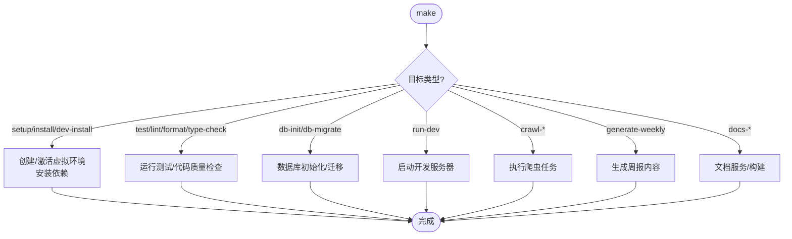

**图表来源** 
- [Makefile](file://Makefile)

**章节来源**
- [Makefile](file://Makefile)

### 一键部署脚本（scripts/deploy.sh）
- 前置检查：Python版本检测、项目目录解析。
- 环境准备：创建/复用虚拟环境、升级pip、安装基础依赖与可选开发依赖。
- 配置初始化：若不存在.env则从模板复制并提示编辑。
- 目录初始化：logs与data子目录创建。
- 验证与定时任务：运行测试，生成crontab条目并询问是否添加。
- 后续指引：确认.env、QQ机器人监听端口、手动测试命令与常用命令。

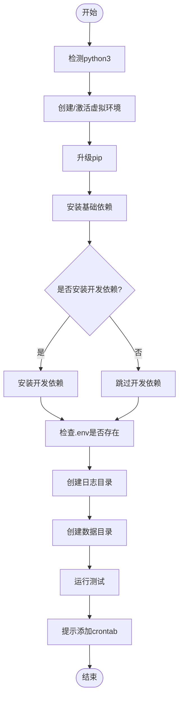

**图表来源** 
- [scripts/deploy.sh](file://scripts/deploy.sh)

**章节来源**
- [scripts/deploy.sh](file://scripts/deploy.sh)

### 后端启动脚本（web/backend/start.sh）
- PYTHONPATH设置确保模块导入正确。
- 默认绑定127.0.0.1:8000，禁止直接对外暴露。
- RELOAD环境变量控制--reload开关，区分开发与生产行为。

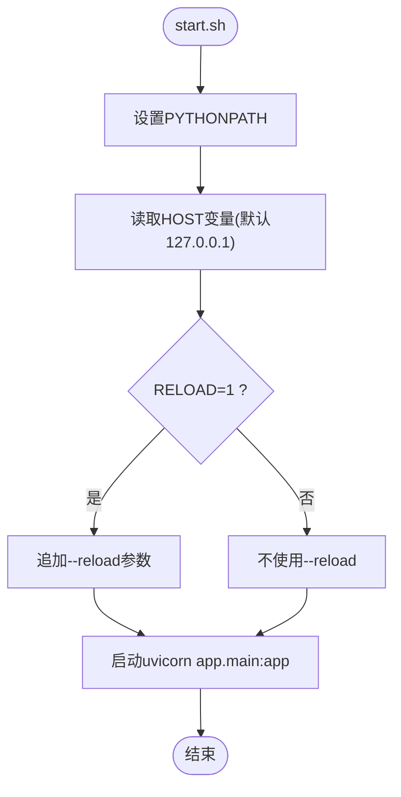

**图表来源** 
- [web/backend/start.sh](file://web/backend/start.sh)

**章节来源**
- [web/backend/start.sh](file://web/backend/start.sh)

### Docker与Compose
- Dockerfile：基于python:3.11-slim，安装requirements.txt，暴露8000端口，CMD启动uvicorn。
- docker-compose.yml：前端nginx镜像挂载VitePress构建产物与nginx配置；后端build自web/backend，映射8000端口，DATABASE_URL指向SQLite文件，数据卷持久化。

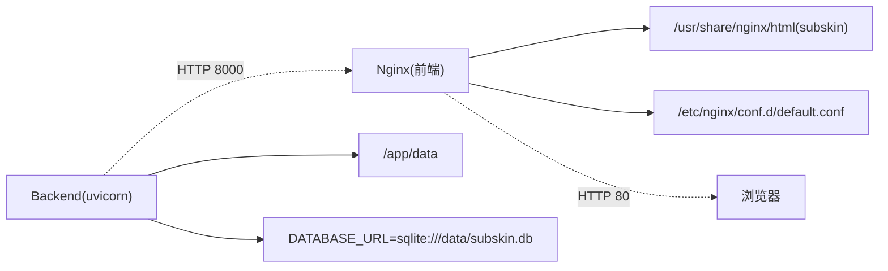

**图表来源** 
- [web/backend/Dockerfile](file://web/backend/Dockerfile)
- [web/deploy/docker-compose.yml](file://web/deploy/docker-compose.yml)

**章节来源**
- [web/backend/Dockerfile](file://web/backend/Dockerfile)
- [web/deploy/docker-compose.yml](file://web/deploy/docker-compose.yml)

### Nginx配置（主站与管理后台）
- 主站nginx.conf：强制HTTPS跳转、安全响应头、PWA静态资源缓存、Service Worker禁用缓存、/api反向代理至127.0.0.1:8000、隐藏路径拒绝访问。
- 管理后台subskin-admin.conf：独立域名、SSL证书、SPA路由fallback、/api代理至同一后端、大请求体限制。

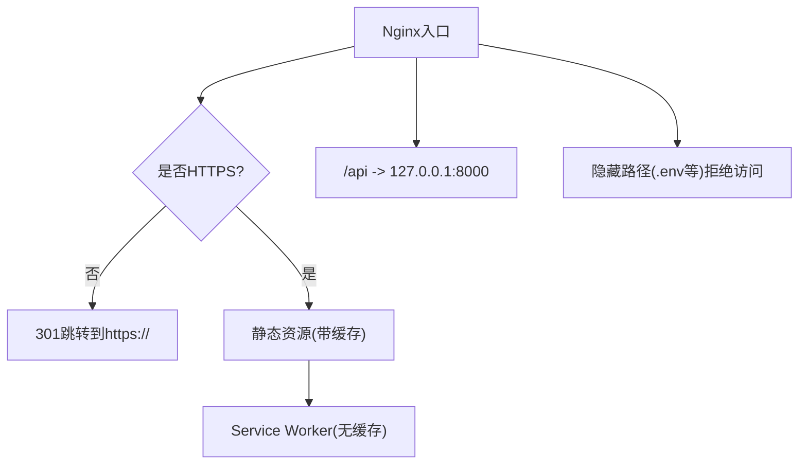

**图表来源** 
- [web/deploy/nginx.conf](file://web/deploy/nginx.conf)
- [web/deploy/subskin-admin.conf](file://web/deploy/subskin-admin.conf)

**章节来源**
- [web/deploy/nginx.conf](file://web/deploy/nginx.conf)
- [web/deploy/subskin-admin.conf](file://web/deploy/subskin-admin.conf)

### systemd服务单元（后端与调度器）
- subskin-backend.service：Type=simple，WorkingDirectory为后端目录，ExecStart指定uvicorn命令，Restart=always，RestartSec=10，PATH包含虚拟环境bin。
- subskin-scheduler.service：运行更新调度器，启用PYTHONUNBUFFERED=1，Restart=always，RestartSec=60。

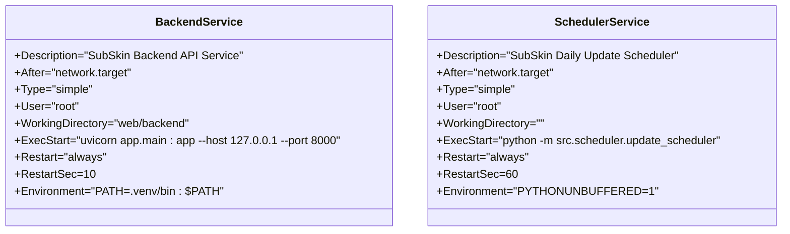

**图表来源** 
- [web/deploy/subskin-backend.service](file://web/deploy/subskin-backend.service)
- [subskin-scheduler.service](file://subskin-scheduler.service)

**章节来源**
- [web/deploy/subskin-backend.service](file://web/deploy/subskin-backend.service)
- [subskin-scheduler.service](file://subskin-scheduler.service)

### CI/CD流水线
- ci.yml：多Python版本矩阵，安装依赖，ruff检查、mypy类型检查、pytest测试与覆盖率上报。
- test.yml：固定Python版本，执行lint、类型检查、测试与覆盖率上传。
- weekly.yml：每周五定时触发，生成周报内容，构建HTML，归档制品，可选预览部署，发送邮件，创建PR，失败时创建Issue。

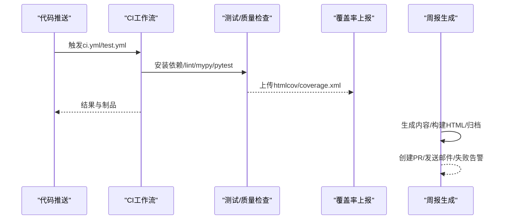

**图表来源** 
- [.github/workflows/ci.yml](file://.github/workflows/ci.yml)
- [.github/workflows/test.yml](file://.github/workflows/test.yml)
- [.github/workflows/weekly.yml](file://.github/workflows/weekly.yml)

**章节来源**
- [.github/workflows/ci.yml](file://.github/workflows/ci.yml)
- [.github/workflows/test.yml](file://.github/workflows/test.yml)
- [.github/workflows/weekly.yml](file://.github/workflows/weekly.yml)

### 健康检查与监控
- 健康检查：/api/health返回{"status":"ok","service":"subskin-backend"}。
- 监控初始化：Sentry初始化、Prometheus中间件与指标端点（环境变量控制）、健康检查端点注册。

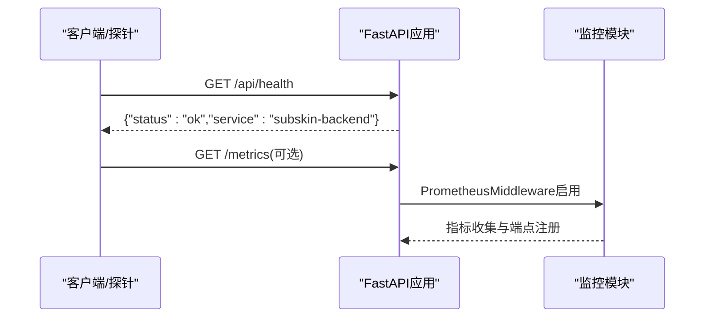

**图表来源** 
- [web/backend/app/main.py](file://web/backend/app/main.py)
- [web/backend/services/monitoring.py](file://web/backend/services/monitoring.py)

**章节来源**
- [web/backend/app/main.py](file://web/backend/app/main.py)
- [web/backend/services/monitoring.py](file://web/backend/services/monitoring.py)

### 配置与环境变量
- web_config.yaml集中定义站点信息、认证、数据库、LLM、内容管理、搜索、邮件、监控与安全等配置项，支持环境变量占位符。
- deploy.sh在首次运行时会从模板复制.env并提示填写关键密钥。

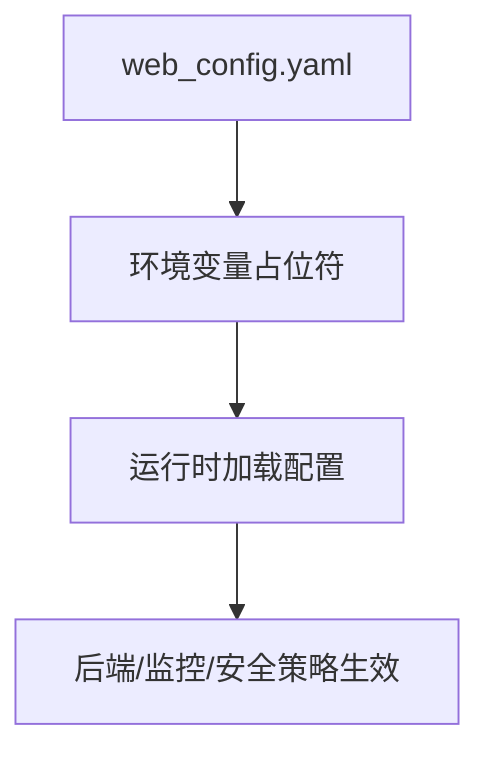

**图表来源** 
- [configs/web_config.yaml](file://configs/web_config.yaml)
- [scripts/deploy.sh](file://scripts/deploy.sh)

**章节来源**
- [configs/web_config.yaml](file://configs/web_config.yaml)
- [scripts/deploy.sh](file://scripts/deploy.sh)

## 依赖关系分析
- 构建与质量：Makefile依赖pytest、ruff、mypy；CI中同样执行这些工具保证一致性。
- 运行依赖：后端依赖uvicorn与FastAPI生态；Nginx负责反向代理与静态资源；systemd负责进程守护。
- 外部依赖：数据库（SQLite/可替换）、Redis（可选）、向量库（可选）、LLM提供商（OpenAI/Anthropic/本地）。
- 监控依赖：Sentry（可选）、Prometheus（可选）。

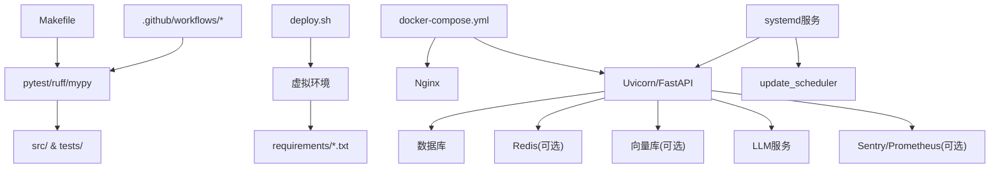

**图表来源** 
- [Makefile](file://Makefile)
- [.github/workflows/ci.yml](file://.github/workflows/ci.yml)
- [.github/workflows/test.yml](file://.github/workflows/test.yml)
- [scripts/deploy.sh](file://scripts/deploy.sh)
- [web/deploy/docker-compose.yml](file://web/deploy/docker-compose.yml)
- [web/backend/Dockerfile](file://web/backend/Dockerfile)
- [web/deploy/subskin-backend.service](file://web/deploy/subskin-backend.service)
- [subskin-scheduler.service](file://subskin-scheduler.service)

**章节来源**
- [Makefile](file://Makefile)
- [.github/workflows/ci.yml](file://.github/workflows/ci.yml)
- [.github/workflows/test.yml](file://.github/workflows/test.yml)
- [scripts/deploy.sh](file://scripts/deploy.sh)
- [web/deploy/docker-compose.yml](file://web/deploy/docker-compose.yml)
- [web/backend/Dockerfile](file://web/backend/Dockerfile)
- [web/deploy/subskin-backend.service](file://web/deploy/subskin-backend.service)
- [subskin-scheduler.service](file://subskin-scheduler.service)

## 性能考虑
- 反向代理优化：Nginx对静态资源启用合理缓存，Service Worker禁用缓存确保版本更新；/api开启流式响应缓冲关闭与较长超时，适配SSE/WebSocket场景。
- 后端进程：systemd Restart=always与RestartSec控制崩溃恢复；开发环境可通过RELOAD=1启用热重载，生产环境应关闭。
- 数据库连接池：web_config.yaml中pool_size/max_overflow/pool_recycle可调优高并发场景。
- 监控与指标：启用Prometheus中间件与指标端点，结合磁盘空间与健康检查实现早期预警。
- 资源隔离：Docker镜像最小化基础镜像，减少攻击面与体积；Compose将前后端解耦，便于水平扩展。

[本节为通用指导，无需特定文件引用]

## 故障排查指南
- 部署失败
  - 检查Python版本与虚拟环境激活；查看deploy.sh输出与日志目录。
  - 确认.env已正确配置API Key与数据库URL。
- 服务无法启动
  - 检查systemd服务状态与日志；确认ExecStart路径与权限。
  - 核对start.sh的HOST与RELOAD设置是否符合生产要求。
- Nginx问题
  - 验证HTTPS证书路径与权限；检查location规则与proxy_pass是否正确。
  - 关注隐藏路径拒绝与Service Worker缓存策略。
- 健康检查异常
  - 访问/api/health确认返回状态；检查监控模块初始化与环境变量。
- 定时任务未执行
  - 检查crontab条目与日志输出路径；确认虚拟环境路径与激活方式。
- 性能瓶颈
  - 查看Prometheus指标与磁盘空间；调整连接池与缓存策略。

**章节来源**
- [scripts/deploy.sh](file://scripts/deploy.sh)
- [web/backend/start.sh](file://web/backend/start.sh)
- [web/deploy/nginx.conf](file://web/deploy/nginx.conf)
- [web/backend/app/main.py](file://web/backend/app/main.py)
- [web/backend/services/monitoring.py](file://web/backend/services/monitoring.py)

## 结论
Subskin的部署与运维体系以Makefile与deploy.sh为核心，结合systemd守护、Nginx反向代理与Docker化能力，形成从代码提交到线上运行的闭环。CI/CD保障质量与可重复性，健康检查与监控提供可观测性。遵循本文的最佳实践与排障步骤，可实现稳定、高效、可回滚的生产部署。

[本节为总结性内容，无需特定文件引用]

## 附录
- 版本发布与回滚建议
  - 发布前：执行make lint/format/type-check与pytest，确保CI通过；构建Docker镜像并打标签。
  - 发布时：优先灰度/预览站点验证；切换Nginx静态资源目录或滚动更新Compose服务。
  - 回滚：快速切回上一版本镜像或静态资源目录；保留数据库迁移幂等性与备份。
- 日志轮转建议
  - 使用logrotate对logs目录进行按日切割与压缩，保留周期依据配置项LOG_RETENTION_DAYS。
- 日常运维操作
  - 查看服务状态：systemctl status subskin-backend subskin-scheduler
  - 查看日志：journalctl -u subskin-backend -f；tail -f logs/cron-*.log
  - 健康检查：curl https://subskin.cn/api/health
  - 指标采集：curl http://127.0.0.1:9090/metrics（如启用Prometheus）

[本节为通用指导，无需特定文件引用]