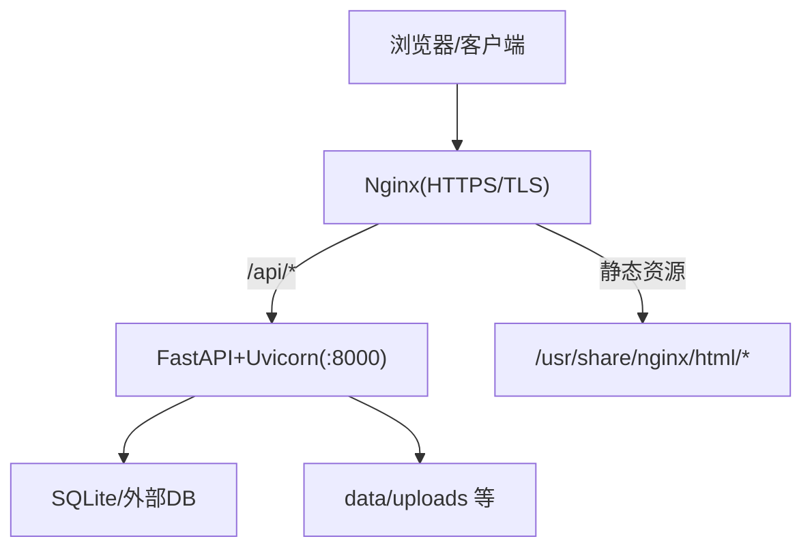
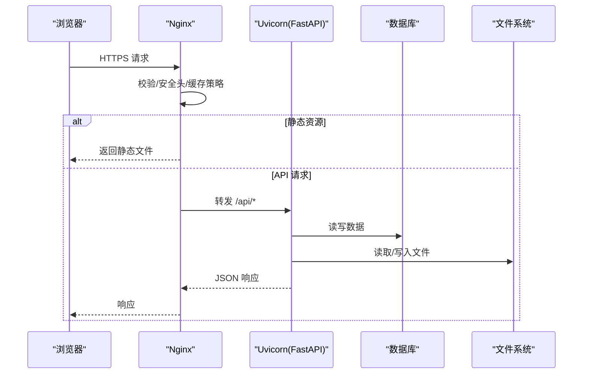
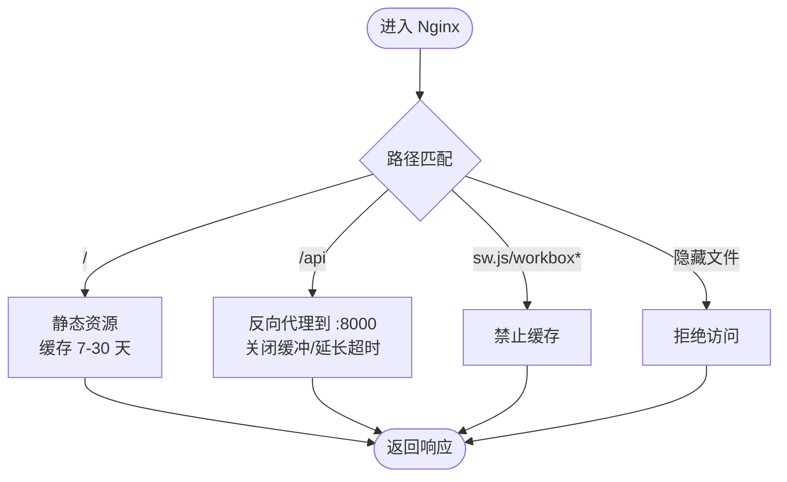
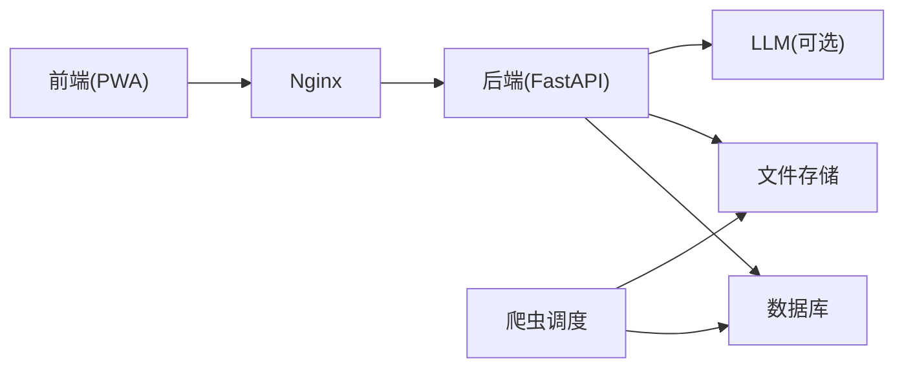

# 部署运维

<cite>
**本文引用的文件**
- [web/deploy/docker-compose.yml](file://web/deploy/docker-compose.yml)
- [web/deploy/nginx.conf](file://web/deploy/nginx.conf)
- [web/deploy/subskin-admin.conf](file://web/deploy/subskin-admin.conf)
- [web/deploy/subskin-staging.conf](file://web/deploy/subskin-staging.conf)
- [web/backend/Dockerfile](file://web/backend/Dockerfile)
- [web/backend/start.sh](file://web/backend/start.sh)
- [web/deploy/subskin-backend.service](file://web/deploy/subskin-backend.service)
- [scripts/deploy.sh](file://scripts/deploy.sh)
- [configs/web_config.yaml](file://configs/web_config.yaml)
- [configs/crawler_config.yaml](file://configs/crawler_config.yaml)
- [README.md](file://README.md)
- [INSTALLATION.md](file://INSTALLATION.md)
- [AGENTS.md](file://AGENTS.md)
</cite>

## 目录
1. [简介](#简介)
2. [项目结构](#项目结构)
3. [核心组件](#核心组件)
4. [架构总览](#架构总览)
5. [详细组件分析](#详细组件分析)
6. [依赖关系分析](#依赖关系分析)
7. [性能考虑](#性能考虑)
8. [故障排查指南](#故障排查指南)
9. [结论](#结论)
10. [附录](#附录)

## 简介
本部署运维文档面向生产环境，覆盖 Docker 容器化、Nginx 反向代理、数据库与文件存储策略、SSL 证书与域名绑定、监控告警、日志收集、备份恢复与灾难恢复计划，并提供部署脚本、环境变量、性能调优参数与故障排查指引。项目采用前后端分离：前端为 Vue 3 PWA，后端为 FastAPI + Uvicorn，静态资源由 Nginx 提供，API 经 Nginx 反代至本地 8000 端口。

## 项目结构
- 前端构建产物输出到 /usr/share/nginx/html/subskin（正式）与 subskin-staging（测试），由对应 Nginx 配置服务。
- 后端以 systemd 或 Docker 运行，默认监听 127.0.0.1:8000，仅对本地暴露，Nginx 负责 TLS 终止与安全头。
- 数据与上传目录挂载于宿主机或持久卷，确保重启不丢失。
- 配置文件集中于 configs/，YAML 中通过环境变量注入敏感信息。



图表来源
- [web/deploy/nginx.conf:6-72](file://web/deploy/nginx.conf#L6-L72)
- [web/backend/start.sh:15-22](file://web/backend/start.sh#L15-L22)
- [web/deploy/docker-compose.yml:4-22](file://web/deploy/docker-compose.yml#L4-L22)

章节来源
- [README.md:53-65](file://README.md#L53-L65)
- [INSTALLATION.md:19-48](file://INSTALLATION.md#L19-L48)

## 核心组件
- Nginx 反向代理：统一入口、强制 HTTPS、安全响应头、静态缓存、Service Worker 不缓存、隐藏文件拒绝。
- 后端服务：FastAPI + Uvicorn，默认绑定 127.0.0.1，支持热重载开关；systemd 单元管理进程生命周期。
- 数据库：默认 SQLite，可通过 DATABASE_URL 切换为外部数据库；连接池与回收在配置中定义。
- 文件存储：uploads/raw/processed/exports 等目录需持久化，避免容器重启丢失。
- 监控与指标：配置项包含健康检查与指标端口，可按需启用。
- 爬虫与调度：按 YAML 配置定时抓取与处理，支持重试、超时与日志。

章节来源
- [web/deploy/nginx.conf:6-72](file://web/deploy/nginx.conf#L6-L72)
- [web/backend/start.sh:15-22](file://web/backend/start.sh#L15-L22)
- [web/deploy/subskin-backend.service:1-16](file://web/deploy/subskin-backend.service#L1-L16)
- [configs/web_config.yaml:61-79](file://configs/web_config.yaml#L61-L79)
- [configs/crawler_config.yaml:117-143](file://configs/crawler_config.yaml#L117-L143)

## 架构总览
生产环境推荐架构：
- Nginx 作为唯一对外入口，终止 TLS，设置安全头，缓存静态资源，将 /api 请求转发至本地后端。
- 后端使用 Uvicorn 单实例运行，绑定 127.0.0.1，通过 systemd 守护。
- 数据库建议使用外部 RDBMS（如 PostgreSQL），通过 DATABASE_URL 接入；若使用 SQLite，需将数据文件置于持久卷。
- 文件存储使用独立磁盘或对象存储（可后续扩展），至少保证 data/uploads 持久化。
- 监控与日志：启用健康检查与指标端口，集中收集 Nginx 与后端日志。



图表来源
- [web/deploy/nginx.conf:29-47](file://web/deploy/nginx.conf#L29-L47)
- [web/backend/start.sh:15-22](file://web/backend/start.sh#L15-L22)

## 详细组件分析

### Nginx 反向代理与 SSL
- 强制 HTTPS：80 端口重定向到 443。
- 安全响应头：X-Frame-Options、X-Content-Type-Options、Referrer-Policy、Permissions-Policy、HSTS。
- 静态资源：PWA 构建产物根路径指向 /usr/share/nginx/html/subskin，开启合理缓存；Service Worker 与工作箱 JS 禁止缓存。
- 隐藏文件：拒绝访问 .env 等敏感文件。
- 管理后台与测试站：分别提供 admin.subskin.cn 与 staging.subskin.cn 的站点配置模板。



图表来源
- [web/deploy/nginx.conf:6-72](file://web/deploy/nginx.conf#L6-L72)
- [web/deploy/subskin-admin.conf:9-42](file://web/deploy/subskin-admin.conf#L9-L42)
- [web/deploy/subskin-staging.conf:7-40](file://web/deploy/subskin-staging.conf#L7-L40)

章节来源
- [web/deploy/nginx.conf:6-72](file://web/deploy/nginx.conf#L6-L72)
- [web/deploy/subskin-admin.conf:9-42](file://web/deploy/subskin-admin.conf#L9-L42)
- [web/deploy/subskin-staging.conf:7-40](file://web/deploy/subskin-staging.conf#L7-L40)

### 后端服务与进程管理
- 启动脚本：默认绑定 127.0.0.1，防止绕过 Nginx 的安全控制；RELOAD 环境变量控制开发热重载。
- systemd 单元：指定工作目录、执行命令、自动重启与环境变量 PATH。
- Docker 镜像：基于 python:3.11-slim，安装依赖并暴露 8000 端口，CMD 启动 uvicorn。

```mermaid
classDiagram
class SystemdUnit {
+Type=simple
+ExecStart=uvicorn ...
+Restart=always
+Environment=PATH=...
}
class StartScript {
+HOST="${HOST : -127.0.0.1}"
+RELOAD_FLAG="--reload"(可选)
+uvicorn app.main : app --host $HOST --port 8000
}
class DockerImage {
+FROM python : 3.11-slim
+EXPOSE 8000
+CMD uvicorn ...
}
SystemdUnit --> StartScript : "调用"
DockerImage --> StartScript : "等价启动方式"
```

图表来源
- [web/deploy/subskin-backend.service:1-16](file://web/deploy/subskin-backend.service#L1-L16)
- [web/backend/start.sh:15-22](file://web/backend/start.sh#L15-L22)
- [web/backend/Dockerfile:1-13](file://web/backend/Dockerfile#L1-L13)

章节来源
- [web/backend/start.sh:15-22](file://web/backend/start.sh#L15-L22)
- [web/deploy/subskin-backend.service:1-16](file://web/deploy/subskin-backend.service#L1-L16)
- [web/backend/Dockerfile:1-13](file://web/backend/Dockerfile#L1-L13)

### 数据库与连接池
- 数据库 URL 通过环境变量注入，默认示例为 SQLite；生产建议切换为外部数据库。
- 连接池大小、溢出与回收时间可在配置中调整，以适应并发与长连接场景。
- 向量数据库可选（当前默认关闭），用于 RAG 检索增强。

章节来源
- [configs/web_config.yaml:61-79](file://configs/web_config.yaml#L61-L79)
- [web/deploy/docker-compose.yml:14-22](file://web/deploy/docker-compose.yml#L14-L22)

### 文件存储策略
- 上传与原始/处理/导出数据目录需持久化，避免容器重启丢失。
- Nginx 拒绝访问隐藏文件，降低密钥泄露风险。
- 建议将 data/uploads 映射到独立磁盘或对象存储，配合定期备份。

章节来源
- [web/deploy/nginx.conf:61-71](file://web/deploy/nginx.conf#L61-L71)
- [web/deploy/docker-compose.yml:20-22](file://web/deploy/docker-compose.yml#L20-L22)

### SSL 证书与域名绑定
- 生产站点与测试站点均提供 HTTPS 模板，启用 HTTP2 与安全协议。
- 证书路径与私钥路径需在服务器实际部署时配置（示例注释位置）。
- 管理后台子域单独配置，禁用缓存以确保管理界面始终最新。

章节来源
- [web/deploy/nginx.conf:13-20](file://web/deploy/nginx.conf#L13-L20)
- [web/deploy/subskin-admin.conf:9-16](file://web/deploy/subskin-admin.conf#L9-L16)
- [web/deploy/subskin-staging.conf:42-74](file://web/deploy/subskin-staging.conf#L42-L74)

### 监控告警与日志收集
- 健康检查端点与指标端口在配置中预留，可按需启用。
- 爬虫模块支持日志级别与输出路径，便于集中采集。
- 建议结合系统日志与 Nginx access/error log 进行统一收集与分析。

章节来源
- [configs/web_config.yaml:232-251](file://configs/web_config.yaml#L232-L251)
- [configs/crawler_config.yaml:117-143](file://configs/crawler_config.yaml#L117-L143)

### 备份恢复与灾难恢复
- 数据库：SQLite 需整体拷贝；外部数据库使用原生工具或云厂商备份方案。
- 文件：对 data/uploads、raw、processed、exports 建立增量/全量备份策略。
- 回滚：前端可快速回滚到上一版本；后端变更需谨慎，必要时重启服务并验证。

章节来源
- [AGENTS.md:199-217](file://AGENTS.md#L199-L217)

## 依赖关系分析
- 前端与后端解耦：Nginx 同时服务静态资源与反向代理 API。
- 后端依赖数据库与文件系统；可选依赖向量库与外部 LLM。
- 爬虫依赖外部 API（PubMed、Semantic Scholar、ClinicalTrials.gov），具备重试与限流配置。



图表来源
- [web/deploy/nginx.conf:29-47](file://web/deploy/nginx.conf#L29-L47)
- [configs/crawler_config.yaml:6-43](file://configs/crawler_config.yaml#L6-L43)

章节来源
- [configs/crawler_config.yaml:6-43](file://configs/crawler_config.yaml#L6-L43)
- [configs/web_config.yaml:80-112](file://configs/web_config.yaml#L80-L112)

## 性能考虑
- Nginx：
  - 静态资源缓存：JS/CSS/图片等 30 天，HTML 7 天；Service Worker 不缓存。
  - 流式响应：关闭缓冲，延长读超时以支持 SSE/WebSocket。
  - 安全头与 HSTS 提升安全性与性能。
- 后端：
  - 绑定 127.0.0.1 避免公网直连；生产关闭热重载。
  - 数据库连接池与回收时间根据负载调整。
- 爬虫：
  - 合理设置重试次数、退避因子与超时；限制每日请求数。
  - 输出压缩与保留天数控制磁盘占用。

章节来源
- [web/deploy/nginx.conf:29-59](file://web/deploy/nginx.conf#L29-L59)
- [web/backend/start.sh:15-22](file://web/backend/start.sh#L15-L22)
- [configs/web_config.yaml:61-79](file://configs/web_config.yaml#L61-L79)
- [configs/crawler_config.yaml:117-143](file://configs/crawler_config.yaml#L117-L143)

## 故障排查指南
- 无法访问 HTTPS：
  - 检查 Nginx 证书路径与权限；确认 80→443 重定向生效。
- API 超时或流式响应异常：
  - 检查 Nginx proxy_read_timeout 与是否关闭缓冲；确认后端未阻塞。
- 静态资源 404：
  - 核对 root 路径与 try_files；确认构建产物已部署。
- Service Worker 更新问题：
  - 确认 sw.js 与工作箱 JS 未缓存；检查 version.json 与 PWA 更新逻辑。
- 后端崩溃或未启动：
  - 查看 systemd 状态与日志；确认 start.sh 绑定地址与环境变量。
- 数据库连接失败：
  - 校验 DATABASE_URL；检查连接池与网络连通性。
- 文件上传失败：
  - 检查 data/uploads 权限与磁盘空间；确认 Nginx client_max_body_size。

章节来源
- [web/deploy/nginx.conf:6-72](file://web/deploy/nginx.conf#L6-L72)
- [web/backend/start.sh:15-22](file://web/backend/start.sh#L15-L22)
- [web/deploy/subskin-backend.service:1-16](file://web/deploy/subskin-backend.service#L1-L16)

## 结论
SubSkin 的生产部署以 Nginx 为统一入口，后端通过 systemd 或 Docker 稳定运行，数据库与文件存储持久化，配合合理的缓存与安全策略，满足高可用与可扩展需求。建议在正式环境引入外部数据库与对象存储，完善监控与日志体系，制定完善的备份与灾难恢复流程，并严格遵循测试先行、分批发布的发布规范。

## 附录

### 部署脚本与环境变量
- 一键部署脚本：创建虚拟环境、安装依赖、初始化目录、运行测试、配置定时任务。
- 环境变量：
  - SITE_URL、GITHUB_CLIENT_ID/SECRET、JWT_SECRET_KEY、SECRET_KEY
  - DATABASE_URL、REDIS_URL
  - OPENAI_API_KEY、ANTHROPIC_API_KEY
  - MEILISEARCH_API_KEY、SMTP_*
  - NCBI_API_KEY、SEMANTIC_SCHOLAR_API_KEY
- 参考路径：
  - 脚本：[scripts/deploy.sh](file://scripts/deploy.sh)
  - Web 配置：[configs/web_config.yaml](file://configs/web_config.yaml)
  - 爬虫配置：[configs/crawler_config.yaml](file://configs/crawler_config.yaml)

章节来源
- [scripts/deploy.sh:20-144](file://scripts/deploy.sh#L20-L144)
- [configs/web_config.yaml:25-79](file://configs/web_config.yaml#L25-L79)
- [configs/crawler_config.yaml:12-43](file://configs/crawler_config.yaml#L12-L43)

### Docker Compose 快速启动
- 前端：nginx:alpine，挂载 VitePress 构建产物与 Nginx 配置。
- 后端：从 web/backend 构建镜像，暴露 8000，挂载数据目录。
- 注意：生产环境建议将数据库与文件存储外置，并使用独立的 Nginx 配置。

章节来源
- [web/deploy/docker-compose.yml:1-22](file://web/deploy/docker-compose.yml#L1-L22)

### 环境与发布规范
- 测试与正式环境代码一致，差异仅限导航颜色、PWA 名称、版本标识与更新文案。
- 所有变更先部署到测试环境，用户确认后批量同步到正式环境。
- 后端变更影响全部用户，需谨慎评估与回滚预案。

章节来源
- [AGENTS.md:15-42](file://AGENTS.md#L15-L42)
- [AGENTS.md:77-89](file://AGENTS.md#L77-L89)
- [AGENTS.md:199-217](file://AGENTS.md#L199-L217)