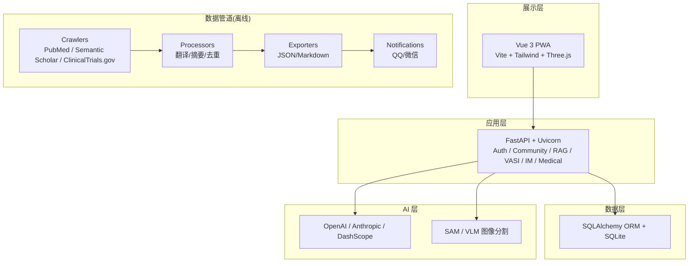
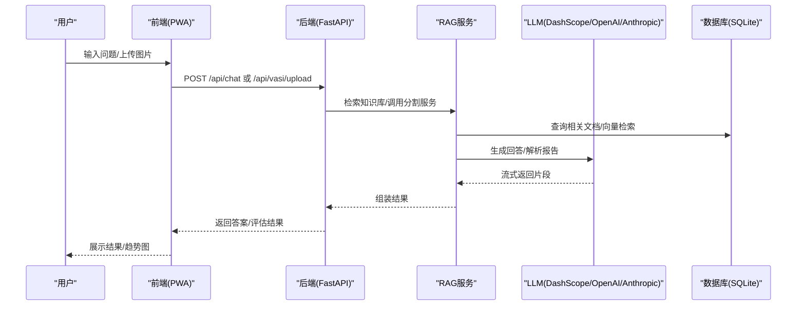
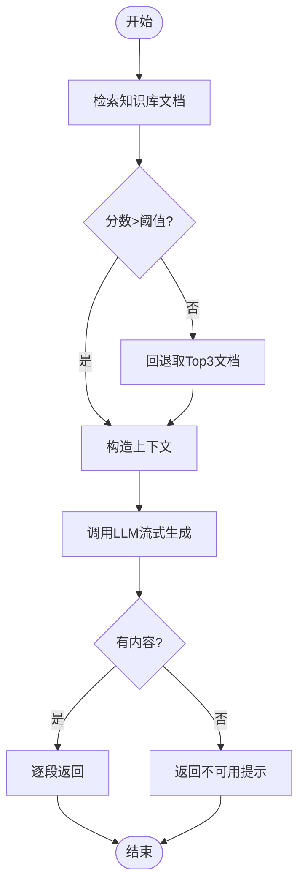
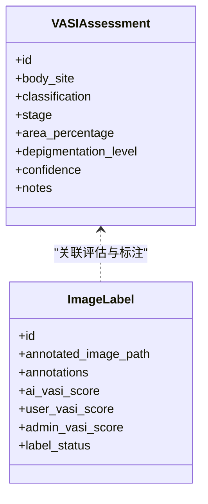
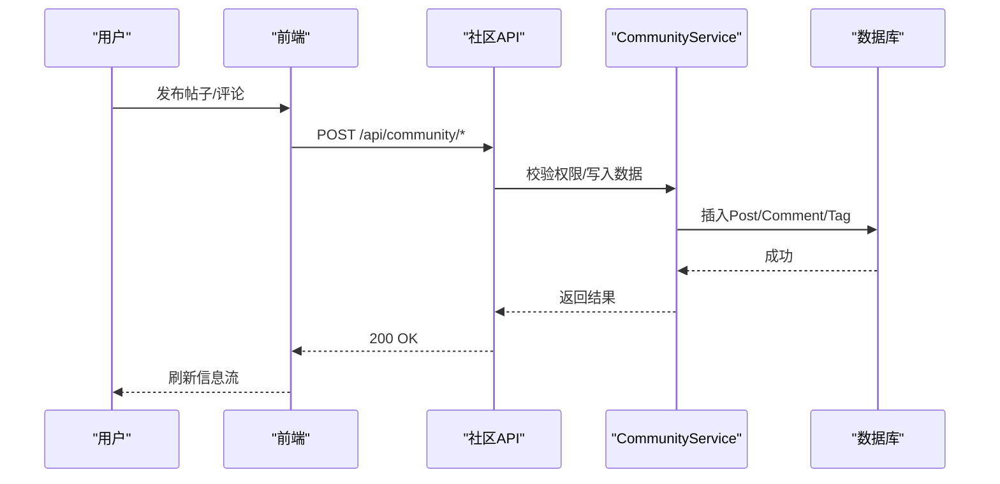
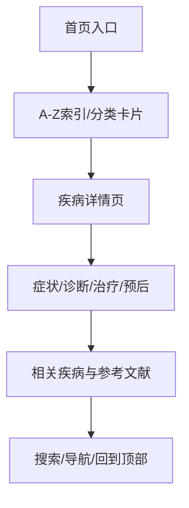
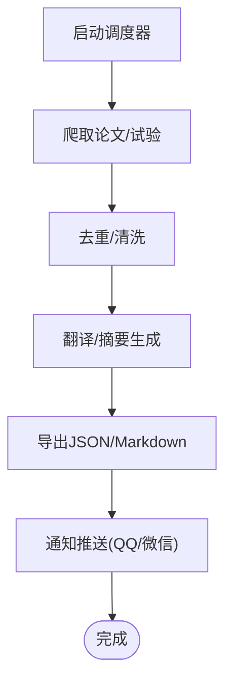
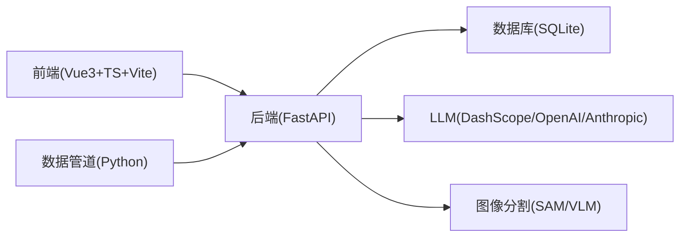

# 项目概述

<cite>
**本文引用的文件**
- [README.md](file://README.md)
- [PROJECT_FRAMEWORK.md](file://PROJECT_FRAMEWORK.md)
- [INSTALLATION.md](file://INSTALLATION.md)
- [pyproject.toml](file://pyproject.toml)
- [AGENTS.md](file://AGENTS.md)
- [MEDICAL_ENCYCLOPEDIA_DESIGN.md](file://docs/MEDICAL_ENCYCLOPEDIA_DESIGN.md)
- [crawler_config.yaml](file://configs/crawler_config.yaml)
- [llm_config_backup.json](file://data/llm_config_backup.json)
- [rag.py](file://web/backend/services/rag.py)
- [community.py](file://web/backend/api/community.py)
- [models.py](file://web/backend/database/models.py)
- [TermsOfServicePage.vue](file://web/app/src/views/TermsOfServicePage.vue)
- [PrivacyPolicyPage.vue](file://web/app/src/views/PrivacyPolicyPage.vue)
</cite>

## 目录
1. [引言](#引言)
2. [项目结构](#项目结构)
3. [核心组件](#核心组件)
4. [架构总览](#架构总览)
5. [详细组件分析](#详细组件分析)
6. [依赖关系分析](#依赖关系分析)
7. [性能与可用性考量](#性能与可用性考量)
8. [故障排查指南](#故障排查指南)
9. [结论](#结论)
10. [附录](#附录)

## 引言
SubSkin 是一个面向白癜风患者和关注者的综合知识平台，致力于用 AI 技术缩短医学前沿与普通患者之间的知识鸿沟。项目以“小白助手（AI智能问答）”“小白追踪（VASI白斑评估与报告管理）”“小白社区（患者交流）”“小白百科（结构化知识库）”“数据管道（医疗文献自动处理）”为核心功能模块，构建从数据采集、知识加工到前端交互的完整闭环。

项目的愿景是：让前沿医学知识直达每一位病友，通过 RAG 智能问答、图像分割与评分、结构化百科与社区互动，帮助患者在理解疾病、跟踪病情、获取支持方面获得更便捷、可信的体验。

本概述为初学者提供清晰的项目理解框架，涵盖愿景、功能、技术栈、设计理念、发展历程、开源协议与联系方式等关键信息。

**章节来源**
- [README.md:11-50](file://README.md#L11-L50)
- [PROJECT_FRAMEWORK.md:1-44](file://PROJECT_FRAMEWORK.md#L1-L44)

## 项目结构
SubSkin 采用前后端分离与离线数据管道并行的架构：
- 前端：Vue 3 + TypeScript + Vite + Tailwind CSS + PWA + Three.js
- 后端：FastAPI + Uvicorn + SQLAlchemy + SQLite
- 数据管道：Python 爬虫与处理器，定时调度与通知推送
- 部署：Nginx + Docker（可选），双环境（staging/production）严格同步

**图表来源**
- [PROJECT_FRAMEWORK.md:14-44](file://PROJECT_FRAMEWORK.md#L14-L44)

**章节来源**
- [PROJECT_FRAMEWORK.md:46-112](file://PROJECT_FRAMEWORK.md#L46-L112)
- [INSTALLATION.md:62-99](file://INSTALLATION.md#L62-L99)

## 核心组件
- 小白助手（RAG 智能问答）
  - 基于检索增强生成（RAG），结合站内知识库与导航能力，支持多轮对话与快捷操作卡片。
  - 流式响应与错误兜底，保障用户体验。
- 小白追踪（VASI 白斑评估与报告管理）
  - 上传照片进行 AI 分割与 VASI 评分计算；支持 3D 数字人体定位、医疗报告解析与趋势对比。
- 小白社区（患者交流）
  - 图文/长文发帖、评论互动、关注机制、瀑布流信息流、标签分类与收藏分享。
- 小白百科（白癜风百科全书）
  - 结构化内容组织，参考权威医疗站点设计模式，提升可读性与可访问性。
- 数据管道（医疗文献自动处理）
  - 自动采集 PubMed、Semantic Scholar、ClinicalTrials.gov 研究进展，AI 翻译与摘要生成，定时更新与通知推送。

**章节来源**
- [README.md:29-50](file://README.md#L29-L50)
- [PROJECT_FRAMEWORK.md:72-90](file://PROJECT_FRAMEWORK.md#L72-L90)

## 架构总览
系统分层清晰，职责明确：
- 展示层：PWA 前端提供跨设备一致体验，支持离线缓存与 3D 渲染。
- 应用层：FastAPI 暴露 REST/WebSocket 接口，承载认证、社区、RAG、VASI、IM、医疗报告等服务。
- 数据层：SQLite + SQLAlchemy ORM，轻量部署满足单机场景。
- AI 层：对接多家大模型与视觉模型，支撑问答、图像分割与报告解读。
- 数据管道：离线批处理，持续丰富知识库与新闻周报。

**图表来源**
- [rag.py:1341-1377](file://web/backend/services/rag.py#L1341-L1377)
- [PROJECT_FRAMEWORK.md:14-44](file://PROJECT_FRAMEWORK.md#L14-L44)

**章节来源**
- [PROJECT_FRAMEWORK.md:14-44](file://PROJECT_FRAMEWORK.md#L14-L44)

## 详细组件分析

### 小白助手（RAG 智能问答）
- 流程要点
  - 检索：根据问题在知识库中检索相关文档，过滤低分结果。
  - 生成：将上下文与问题交给 LLM，流式输出回答片段。
  - 容错：捕获 API 异常，返回友好提示。
- 配置与提供者
  - 支持多提供商（DashScope、OpenAI、Anthropic），通过动态配置切换模型与嵌入模型。
- 使用场景
  - 疾病知识问答、治疗方案解释、站内功能导航、报告解读辅助。

**图表来源**
- [rag.py:1365-1377](file://web/backend/services/rag.py#L1365-L1377)
- [llm_config_backup.json:1-33](file://data/llm_config_backup.json#L1-L33)

**章节来源**
- [rag.py:1-1377](file://web/backend/services/rag.py#L1-L1377)
- [llm_config_backup.json:1-33](file://data/llm_config_backup.json#L1-L33)

### 小白追踪（VASI 白斑评估）
- 功能要点
  - 图像上传与预处理，AI 分割白斑区域，计算面积占比与 VASI 评分。
  - 3D 数字人体点击定位患处，记录分布与分期。
  - 医疗报告解析，提取指标并生成通俗解读。
  - 评估历史与对比，追踪变化趋势。
- 数据模型与关联
  - 评估结果与标注数据关联，支持用户修正与管理员复核。
  - 字段包含 AI 与人工标注的多维度评分与置信度。

**图表来源**
- [image_label.py:219-249](file://web/backend/api/image_label.py#L219-L249)
- [patch_backend.py:231-255](file://patch_backend.py#L231-L255)

**章节来源**
- [README.md:34-39](file://README.md#L34-L39)
- [image_label.py:219-249](file://web/backend/api/image_label.py#L219-L249)
- [patch_backend.py:231-255](file://patch_backend.py#L231-L255)

### 小白社区（患者交流）
- 功能要点
  - 帖子 CRUD、评论、点赞、关注、标签、收藏、分享。
  - 信息流推荐（含地理位置排序）、用户统计与权限控制。
- 数据模型
  - Post、PostComment、Tag、UserFollow、Bookmark 等实体，关系清晰。
- 安全与隐私
  - 数据分级策略，敏感字段脱敏返回，用户可控公开范围。

**图表来源**
- [community.py:1054-1107](file://web/backend/api/community.py#L1054-L1107)
- [models.py:347-456](file://web/backend/database/models.py#L347-L456)

**章节来源**
- [community.py:1054-1107](file://web/backend/api/community.py#L1054-L1107)
- [models.py:347-456](file://web/backend/database/models.py#L347-L456)

### 小白百科（结构化知识库）
- 设计原则
  - 参考 Mayo Clinic、NHS、WebMD 等权威站点布局与导航模式。
  - 强调层级化内容、A-Z 索引、卡片网格、无障碍与可读性。
- 内容组织
  - 疾病介绍、诊断分类、治疗方案、生活方式、前沿研究等维度。
  - Schema.org 结构化数据，提升 AI 可发现性与搜索引擎优化。

**图表来源**
- [MEDICAL_ENCYCLOPEDIA_DESIGN.md:10-117](file://docs/MEDICAL_ENCYCLOPEDIA_DESIGN.md#L10-L117)
- [MEDICAL_ENCYCLOPEDIA_DESIGN.md:196-238](file://docs/MEDICAL_ENCYCLOPEDIA_DESIGN.md#L196-L238)

**章节来源**
- [MEDICAL_ENCYCLOPEDIA_DESIGN.md:1-800](file://docs/MEDICAL_ENCYCLOPEDIA_DESIGN.md#L1-L800)

### 数据管道（医疗文献自动处理）
- 采集源
  - PubMed、Semantic Scholar、ClinicalTrials.gov，按关键词与筛选条件抓取。
- 处理流程
  - 去重、翻译、摘要生成、分类导出（JSON/Markdown）。
- 调度与通知
  - 定时任务执行，结果通过 QQ/微信通知推送。

**图表来源**
- [crawler_config.yaml:44-115](file://configs/crawler_config.yaml#L44-L115)
- [PROJECT_FRAMEWORK.md:83-90](file://PROJECT_FRAMEWORK.md#L83-L90)

**章节来源**
- [crawler_config.yaml:44-115](file://configs/crawler_config.yaml#L44-L115)
- [PROJECT_FRAMEWORK.md:83-90](file://PROJECT_FRAMEWORK.md#L83-L90)

## 依赖关系分析
- 前端依赖 Vue 3、TypeScript、Vite、Tailwind CSS、PWA、Three.js。
- 后端依赖 FastAPI、Uvicorn、SQLAlchemy、Pydantic、JWT。
- AI 依赖 OpenAI/Anthropic/DashScope 及视觉模型（SAM/VLM）。
- 数据管道依赖 requests、BeautifulSoup、metapub、定时调度与消息队列（可选）。

**图表来源**
- [PROJECT_FRAMEWORK.md:46-112](file://PROJECT_FRAMEWORK.md#L46-L112)

**章节来源**
- [PROJECT_FRAMEWORK.md:46-112](file://PROJECT_FRAMEWORK.md#L46-L112)

## 性能与可用性考量
- 前端
  - PWA 缓存与服务 Worker 提升离线可用性与加载速度。
  - Tailwind 原子化 CSS 与按需构建减少包体积。
- 后端
  - FastAPI 异步 I/O 提高并发处理能力。
  - SQLite 适合单机轻量部署，读写性能可满足 MVP 阶段。
- AI
  - 流式响应降低首字节延迟，提升问答体验。
  - 向量检索与阈值过滤减少无关上下文，提高生成质量。
- 数据管道
  - 增量更新与去重避免重复处理，节省资源。
  - 定时调度与通知确保内容时效性。

[本节为通用指导，不直接分析具体文件]

## 故障排查指南
- 安装与环境
  - Python/Node 版本不符导致依赖失败，检查虚拟环境与 node_modules。
  - API Key 无效或额度不足，核对环境变量与账户状态。
- 后端
  - 端口占用或服务未启动，检查 uvicorn 进程与 Nginx 配置。
  - 数据库迁移失败，查看 alembic 日志与 schema 一致性。
- 前端
  - 代理配置错误导致 /api 请求失败，确认 vite.config 与 nginx 转发。
  - PWA 更新不生效，清理缓存与强制刷新。
- AI 服务
  - LLM 调用超时或限流，增加重试与降级逻辑。
  - 图像分割失败，检查输入格式与模型权重路径。

**章节来源**
- [INSTALLATION.md:107-112](file://INSTALLATION.md#L107-L112)

## 结论
SubSkin 以 AI 为核心，构建了覆盖知识获取、病情评估、社区支持与内容生产的完整生态。通过严谨的架构设计与清晰的职责划分，项目在易用性、可扩展性与安全性上取得平衡。未来可在以下方向持续演进：
- 强化 RAG 知识库质量与多模态能力
- 优化 VASI 评估精度与可视化交互
- 扩展社区推荐算法与个性化服务
- 完善数据管道的自动化与合规性

[本节为总结性内容，不直接分析具体文件]

## 附录
- 项目愿景与使命
  - 用 AI 赋能，让前沿医学知识直达每一位病友。
- 主要功能
  - 小白助手（RAG 问答）、小白追踪（VASI 评估）、小白社区（交流）、小白百科（知识库）、数据管道（文献处理）。
- 技术栈
  - 前端：Vue 3 + TS + Vite + Tailwind + PWA + Three.js
  - 后端：FastAPI + Uvicorn + SQLAlchemy + SQLite
  - AI：OpenAI / Anthropic / DashScope + SAM/VLM
- 开源协议
  - MIT 许可证
- 联系方式
  - 邮箱：lianqing_chan@126.com
  - GitHub：https://github.com/LianqingChen/subskin

**章节来源**
- [README.md:11-50](file://README.md#L11-L50)
- [pyproject.toml:1-10](file://pyproject.toml#L1-L10)
- [TermsOfServicePage.vue:353-360](file://web/app/src/views/TermsOfServicePage.vue#L353-L360)
- [PrivacyPolicyPage.vue:320-327](file://web/app/src/views/PrivacyPolicyPage.vue#L320-L327)