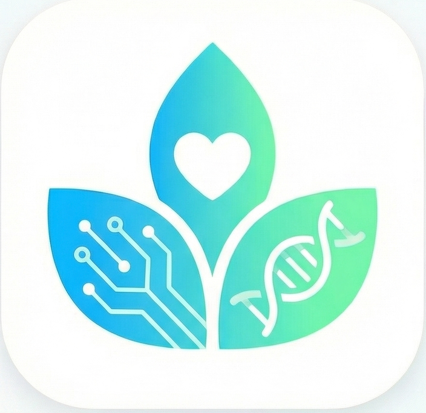

<div align="center">
  
</div>

# SubSkin 🌿

> **What’s beneath? SubSkin.**

[](https://opensource.org/licenses/MIT)
[]()

## 📌 项目简介

**SubSkin** 我是一名白癜风患者，我希望结合 AI 技术，从0到1构建一个结构化、可分析、易分享的白癜风百科全书。

我们的核心愿景是利用 AI 赋能，缩短医学前沿与普通患者之间的知识鸿沟。

### 🎨 视觉标识与寓意
我们的图标由三片交织的叶子组成：

**图标文件**：[subskin2.png](assets/subskin2.png) （可供社区网站使用）

- **左侧叶片 (芯片)**：代表以AI为核心的科技驱动力。我们利用 AI 自动收集、翻译、汇整、分析全球白癜风相关的医疗文献。
- **中间叶片 (爱心)**：代表人文关怀。一切技术与科学的终点，都是为了给病友带来温度与希望。
- **右侧叶片 (DNA)**：代表医疗的探索。通过严谨的数据分析，深度挖掘“皮层之下”的根因。

---

## 🚀 核心功能

1.  **知识收集 (Collection)**：自动化追踪 PubMed、Google Scholar 等平台的白癜风（Vitiligo）相关论文动态。
2.  **AI 智能摘要 (AI Insights)**：利用 LLM (如 GPT-4, Claude) 将晦涩的英文医学论文转化为通俗易懂的中文科普。
3.  **药政追踪 (Drug Tracker)**：实时同步全球 JAK 抑制剂等新药的临床试验及审批进展。
4.  **结构化数据库 (Dataset)**：整理白癜风成因、治疗手段、心理支持等维度的结构化数据，为未来的机器学习研究做准备。

---

## 🛠 技术栈

| 层 | 技术 | 说明 |
|---|---|---|
| **数据采集** | Python (Scrapy, BeautifulSoup) | 网页爬虫与数据提取 |
| **AI 处理** | OpenAI API / Anthropic API | 文献翻译与摘要生成 |
| **数据处理** | Pandas, Pydantic, SQLAlchemy | 数据清洗与验证 |
| **后端 API** | FastAPI, Uvicorn | RESTful API 服务 |
| **前端展示** | VitePress (Vue 3) | 静态站点生成器 |
| **数据库** | SQLite → PostgreSQL | 数据持久化 |
| **搜索** | Meilisearch | 全文搜索引擎 |
| **部署** | Docker, GitHub Actions | 容器化与 CI/CD |

---

## 🛠️ 快速开始

### 安装与配置

详细安装说明请参考 [INSTALLATION.md](INSTALLATION.md)。

```bash
# 克隆仓库
git clone https://github.com/yourusername/subskin.git
cd subskin

# 一键安装
make setup
source .venv/bin/activate  # Linux/macOS
make install

# 配置环境变量
cp configs/.env.example .env
# 编辑 .env 文件，添加您的 API 密钥

# 运行测试验证安装
make test
```

### 项目结构

```
subskin/
├── src/                          # Python 源代码
│   ├── crawlers/                 # 数据爬虫 (PubMed, Semantic Scholar, ClinicalTrials.gov)
│   ├── processors/               # AI 处理模块 (翻译、摘要)
│   ├── generators/               # 内容生成器 (每周摘要、HTML 模板)
│   ├── web/                      # 网站后端 (API、认证、LLM 集成)
│   ├── scheduler/                # 调度系统
│   ├── models/                   # 数据模型
│   ├── utils/                    # 工具库
│   └── cli.py                    # 命令行界面
├── web/                          # 前端代码
│   ├── vitepress/                # VitePress 静态站点
│   ├── templates/                # HTML 模板
│   └── public/                   # 静态资源
├── data/                         # 数据存储
│   ├── raw/                      # 原始爬取数据
│   ├── processed/                # 处理后的数据
│   ├── exports/                  # 导出文件
│   └── weekly/                   # 每周生成内容
├── configs/                      # 配置文件
├── tests/                        # 测试代码
├── scripts/                      # 自动化脚本
└── requirements/                 # Python 依赖管理
```

### 常用命令

```bash
# 开发
make run-dev          # 启动开发服务器
make test             # 运行测试
make lint             # 代码检查
make format           # 格式化代码

# 数据收集
make crawl-pubmed     # 运行 PubMed 爬虫
make crawl-scholar    # 运行 Semantic Scholar 爬虫
make crawl-trials     # 运行 ClinicalTrials.gov 爬虫
make crawl-all        # 运行所有爬虫

# 内容生成
make generate-weekly  # 生成每周内容

# 文档
make docs-serve       # 启动文档服务器
```

---

## 📊 三大核心任务

### 1. 白癜风百科全书
- **数据源**: PubMed、Semantic Scholar、ClinicalTrials.gov
- **处理流程**: 爬取 → 去重 → 翻译(英→中) → 总结(患者友好) → 存储
- **目标**: >1000篇论文，持续更新
- **交付**: 结构化JSON + Markdown百科全书

### 2. 每周AI/白癜风知识分享
- **频率**: 每周五自动生成
- **内容**: 本周研究亮点 + AI工具心得 + 实用信息
- **格式**: HTML页面 (简洁科技风格)，支持视频脚本提取
- **用途**: 抖音、小红书、Bilibili等平台分享

### 3. SubSkin社区网站
- **核心功能**: 百科全书浏览、用户账户、社区讨论、LLM智能问答
- **技术栈**: VitePress静态站点 + FastAPI后端
- **集成**: GitHub OAuth认证 + OpenAI RAG问答

详细架构设计请参考 [PROJECT_FRAMEWORK.md](PROJECT_FRAMEWORK.md)。

---

## 📅 路线图 (Roadmap)

### Phase 1: 基础数据管道 (4-6周)
- [ ] 搭建项目基础结构
- [ ] 实现PubMed爬虫
- [ ] 实现Semantic Scholar爬虫
- [ ] 实现ClinicalTrials.gov爬虫
- [ ] 开发AI翻译与摘要模块
- [ ] 创建基础数据导出

### Phase 2: 知识库构建与每周内容 (3-4周)
- [ ] 设计百科全书数据结构
- [ ] 实现Markdown导出与组织
- [ ] 开发每周摘要生成器
- [ ] 创建HTML模板系统
- [ ] 实现自动化调度

### Phase 3: 社区网站开发 (4-6周)
- [ ] 设置VitePress静态站点
- [ ] 集成知识库内容自动发布
- [ ] 实现用户认证系统
- [ ] 开发基础社区功能
- [ ] 集成LLM问答功能

### Phase 4: 优化与扩展 (持续)
- [ ] 搜索功能优化
- [ ] 移动端适配
- [ ] 性能优化
- [ ] 社区功能扩展
- [ ] 数据分析与可视化

详细实施计划请参考 `.sisyphus/plans/vitiligo-data-collection.md`。

---

## 🤝 如何贡献

我们欢迎医生、AI 开发者、翻译志愿者以及广大病友的加入！

### 贡献方式
- **提交 Issue**: 建议新的研究方向或报告问题
- **提交 Pull Request**: 优化现有代码或文档
- **参与讨论**: 在社区中分享见解和经验
- **内容贡献**: 补充白癜风相关知识或翻译内容

### 开发指南
1.  Fork 本仓库
2.  创建功能分支 (`git checkout -b feature/amazing-feature`)
3.  提交更改 (`git commit -m 'Add some amazing feature'`)
4.  推送到分支 (`git push origin feature/amazing-feature`)
5.  创建 Pull Request

请遵守 [代码贡献指南](docs/CONTRIBUTING.md)。

---

## ⚠️ 法律与免责声明

**SubSkin 仅作为科研学习与知识分享平台。本项目内容不构成任何医疗建议，不代表临床诊断标准。所有治疗方案请务必咨询执业医师，并遵医嘱执行。**

### 数据使用条款
1.  所有收集的论文数据均来自公开可访问的来源
2.  项目尊重原始数据源的版权和使用条款
3.  生成的内容明确标注为AI辅助翻译和总结
4.  用户生成的内容由用户自行负责

---

## 📚 相关文档

- [项目框架与架构设计](PROJECT_FRAMEWORK.md) - 详细系统设计
- [安装与配置指南](INSTALLATION.md) - 环境搭建步骤
- [开发者指南](AGENTS.md) - 编码规范与最佳实践
- [API 文档](docs/API.md) - 接口说明

---

## 📬 联系我们

- **项目负责人**: [Liam]
- **联系方式**: [lianqing_chan@126.com]
- **GitHub**: [github.com/yourusername/subskin]
- **社区**: 即将上线

---

## 🙏 致谢

感谢所有为白癜风研究和患者支持做出贡献的研究人员、医生和志愿者们。特别感谢开源社区提供的工具和框架，使这个项目成为可能。

**Together, we shed light on vitiligo.**