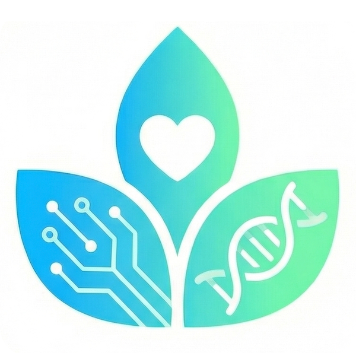

# SubSkin 🌿

<div align="left">
  
</div>

> **What’s beneath? SubSkin.**

[](https://opensource.org/licenses/MIT)
[](https://github.com/LianqingChen/subskin)

## 📌 项目简介

我是一名白癜风患者，深知病友对专业知识的渴望和对前沿信息的期待。因此我从零开始，希望和大家一起构建一部开放共享的白癜风百科全书——让最新的研究成果能够直达每一位病友；同时借助AI技术，一起探索隐藏在白斑之下更深层次的发病机理。

> ⚠️ **免责声明**：本项目仅供科研学习与知识分享，内容不构成任何医疗建议，不代表临床诊断标准。所有治疗方案请务必咨询执业医师，并遵医嘱执行。

我们的核心愿景：**用AI赋能，缩短医学前沿与普通患者之间的知识鸿沟**。

### 🎨 视觉标识与寓意

我们的Logo由三片交织的叶子组成，每一片都承载着我们的初心：

**官方 Logo**：[subskin_logo.png](assets/subskin_logo.png) （600×600 正方形，圆角版本，作为 SubSkin 对外统一标识）

- **左侧叶片 (芯片纹路)**：象征AI科技，代表**科学的广度** · *Breadth of Science*  
  用AI技术拓宽知识边界，自动收集、翻译、整理全球白癜风领域的最新研究

- **右侧叶片 (DNA双螺旋)**：象征医学探索，代表**医学的深度** · *Depth of Medicine*  
  深耕专业领域，通过严谨的数据整理，挖掘"皮层之下"疾病的根源

- **中间叶片 (爱心镂空)**：象征人文关怀，代表**人文的温度** · *Warmth of Humanity*  
  **科技和医学共同托举**——一切技术探索的终点，都是为了给病友带来希望与温暖

---

## 🚀 核心功能

我们专注于构建完整的数据 pipeline，从信息收集到内容输出：

1.  **📚 知识收集** · *Collection*  
    自动化追踪 PubMed、Semantic Scholar、ClinicalTrials.gov 等平台的白癜风相关研究动态

2.  **🤖 AI 智能摘要** · *AI Insights*  
    借助大语言模型（GPT-4、Claude），将晦涩的英文医学论文转化为患者友好的中文科普

3.  **💊 药政追踪** · *Drug Tracker*  
    实时同步全球 JAK 抑制剂等创新药物的临床试验进展与审批动态

4.  **🗄️ 结构化数据库** · *Dataset*  
    从病因、治疗到心理支持，系统性整理多维度数据，为未来研究打下基础

---

## 🛠 技术栈

| 层 | 技术 | 说明 |
|---|---|---|
| **数据采集** | Python (Scrapy, BeautifulSoup) | 网页爬虫与数据提取 |
| **AI 处理** | OpenAI API / Anthropic API | 文献翻译与摘要生成 |
| **数据处理** | Pandas, Pydantic, SQLAlchemy | 数据清洗与验证 |
| **后端 API** | FastAPI, Uvicorn | RESTful API 服务 |
| **前端展示** | VitePress (Vue 3) | 静态站点生成器 |
| **数据库** | SQLite → PostgreSQL | 数据持久化 |
| **搜索** | Meilisearch | 全文搜索引擎 |
| **部署** | Docker, GitHub Actions | 容器化与 CI/CD |

---

## 🛠️ 快速开始

### 安装与配置

详细安装说明请参考 [INSTALLATION.md](INSTALLATION.md)。

```bash
# 克隆仓库
git clone https://github.com/yourusername/subskin.git
cd subskin

# 一键安装
make setup
source .venv/bin/activate  # Linux/macOS
make install

# 配置环境变量
cp configs/.env.example .env
# 编辑 .env 文件，添加您的 API 密钥

# 运行测试验证安装
make test
```

### 项目结构

```
subskin/
├── src/                          # Python 源代码
│   ├── crawlers/                 # 数据爬虫 (PubMed, Semantic Scholar, ClinicalTrials.gov)
│   ├── processors/               # AI 处理模块 (翻译、摘要)
│   ├── generators/               # 内容生成器 (每周摘要、HTML 模板)
│   ├── web/                      # 网站后端 (API、认证、LLM 集成)
│   ├── scheduler/                # 调度系统
│   ├── models/                   # 数据模型
│   ├── utils/                    # 工具库
│   └── cli.py                    # 命令行界面
├── web/                          # 前端代码
│   ├── vitepress/                # VitePress 静态站点
│   ├── templates/                # HTML 模板
│   └── public/                   # 静态资源
├── data/                         # 数据存储
│   ├── raw/                      # 原始爬取数据
│   ├── processed/                # 处理后的数据
│   ├── exports/                  # 导出文件
│   └── weekly/                   # 每周生成内容
├── configs/                      # 配置文件
├── tests/                        # 测试代码
├── scripts/                      # 自动化脚本
└── requirements/                 # Python 依赖管理
```

### 常用命令

```bash
# 开发
make run-dev          # 启动开发服务器
make test             # 运行测试
make lint             # 代码检查
make format           # 格式化代码

# 数据收集
make crawl-pubmed     # 运行 PubMed 爬虫
make crawl-scholar    # 运行 Semantic Scholar 爬虫
make crawl-trials     # 运行 ClinicalTrials.gov 爬虫
make crawl-all        # 运行所有爬虫

# 内容生成
make generate-weekly  # 生成每周内容

# 文档
make docs-serve       # 启动文档服务器
```

---

## 📊 三大核心任务

### 1. 白癜风百科全书
- **数据源**: PubMed、Semantic Scholar、ClinicalTrials.gov
- **处理流程**: 爬取 → 去重 → 翻译(英→中) → 总结(患者友好) → 存储
- **目标**: >1000篇论文，持续更新
- **交付**: 结构化JSON + Markdown百科全书

### 2. 每周AI/白癜风知识分享
- **频率**: 每周五自动生成
- **内容**: 本周研究亮点 + AI工具心得 + 实用信息
- **格式**: HTML页面 (简洁科技风格)，支持视频脚本提取
- **用途**: 抖音、小红书、Bilibili等平台分享

### 3. SubSkin社区网站
- **核心功能**: 百科全书浏览、用户账户、社区讨论、LLM智能问答
- **技术栈**: VitePress静态站点 + FastAPI后端
- **集成**: GitHub OAuth认证 + OpenAI RAG问答

详细架构设计请参考 [PROJECT_FRAMEWORK.md](PROJECT_FRAMEWORK.md)。

---

## 🤝 开放贡献

这是一个开放的社区项目，**我们真诚欢迎每一位朋友的参与**！

无论你是医生、AI开发者、翻译志愿者，还是正在经历白癜风的病友，你的每一份贡献都能让这个项目变得更好。

### 参与方式
- 💡 **提交 Issue**：分享你的想法，建议新的研究方向，或报告问题
- 🔧 **提交 Pull Request**：改进代码，完善文档，修复问题
- 💬 **参与讨论**：在社区交流中分享你的见解和经验
- 📝 **内容贡献**：补充白癜风相关知识，参与翻译和科普创作

### 开发流程
1.  Fork 本仓库
2.  创建功能分支 (`git checkout -b feature/amazing-feature`)
3.  提交你的更改 (`git commit -m 'Add some amazing feature'`)
4.  推送到分支 (`git push origin feature/amazing-feature`)
5.  创建 Pull Request

请阅读 [代码贡献指南](docs/CONTRIBUTING.md) 了解更多细节。

---

## ⚖️ 数据使用条款

1.  所有收集的论文数据均来自公开可访问的来源
2.  项目尊重原始数据源的版权和使用条款
3.  生成的内容明确标注为 AI 辅助翻译和总结
4.  用户生成的内容由用户自行负责

---

## 📚 相关文档

- [项目框架与架构设计](PROJECT_FRAMEWORK.md) - 详细系统设计
- [安装与配置指南](INSTALLATION.md) - 环境搭建步骤
- [开发者指南](AGENTS.md) - 编码规范与最佳实践
- [API 文档](docs/API.md) - 接口说明

---

## 📬 联系我们

- **项目负责人**: [Liam]
- **联系方式**: [lianqing_chan@126.com]
- **GitHub**: [github.com/yourusername/subskin]
- **社区**: 即将上线

---

## 🙏 致谢

这个项目因开源社区而诞生，也因每一位参与者的贡献而成长。

衷心感谢所有在白癜风研究领域默默耕耘的科研人员，感谢所有愿意分享经验的医生和病友。特别感谢开源社区创造了如此多优秀的工具，让我们普通人也能尝试做一些有意义的事情。

**Together, we shed light on vitiligo.**  
**让我们一起，为白癜风领域带来一点点光亮。**