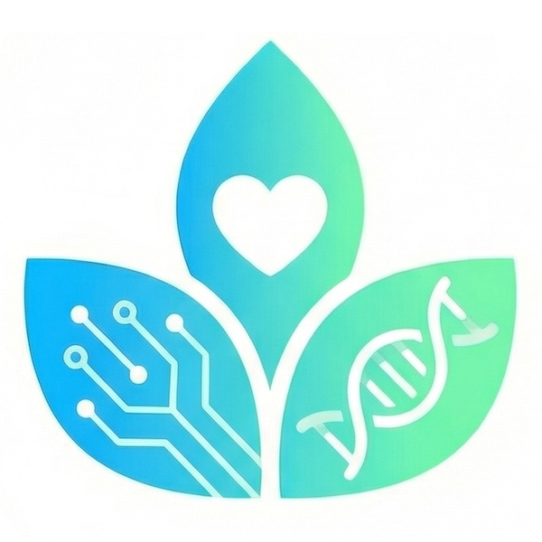

# SubSkin 🌿

<div align="left">
  
</div>

> **What's beneath? SubSkin.**

[](https://opensource.org/licenses/MIT)

## 项目简介

SubSkin 是一个面向白癜风患者和关注者的综合知识平台。我从零开始构建这个项目，希望用 AI 技术缩短医学前沿与普通患者之间的知识鸿沟。

> **免责声明**：本项目仅供科研学习与知识分享，内容不构成医疗诊断建议。所有治疗方案请咨询执业医师。

**核心愿景：用 AI 赋能，让前沿医学知识直达每一位病友。**

### 视觉标识与寓意

我们的 Logo 由三片交叠的叶子组成：

- **芯片纹路叶片**：象征 AI 科技与科学的广度
- **DNA 双螺旋叶片**：象征医学探索与专业的深度
- **爱心镂空叶片**：象征人文关怀的温度——科技和医学共同托举

---

## 主要功能

### 小白助手 — AI 智能问答
基于 RAG 的智能对话助手，结合白癜风知识库与站内功能导航，帮助用户快速找到所需信息和功能入口。支持多轮对话、快捷操作卡片。

### 小白追踪 — 白斑评估与报告管理
- **VASI 评估**：上传白斑照片，AI 自动分割白斑区域，计算 VASI 评分和面积占比
- **3D 数字人**：在身体模型上点击定位患处，直观记录白斑分布
- **医疗报告分析**：上传体检报告（PDF/图片），AI 自动提取关键指标、解析异常项、生成通俗解读
- **评估历史**：追踪 VASI 评分变化趋势，支持对比不同时期的评估结果

### 小白社区 — 患者交流社区
图文/长文发帖、评论互动、关注机制、瀑布流信息流。支持图文混排、标签分类。

### 小白百科 — 白癜风百科全书
结构化白癜风知识库，涵盖疾病介绍、诊断分类、治疗方案、生活方式、前沿研究等维度。

### 数据 Pipeline — 医疗文献自动处理
- 自动追踪 PubMed、Semantic Scholar、ClinicalTrials.gov 的白癜风研究
- AI 翻译英文论文 + 生成患者友好的中文摘要
- 定时调度更新，通知推送

---

## 技术栈

| 层 | 技术 |
|---|---|
| **数据采集** | Python (requests, BeautifulSoup, metapub) |
| **AI 处理** | OpenAI / Anthropic / DashScope API |
| **数据层** | SQLAlchemy, Pydantic, SQLite |
| **后端** | FastAPI, Uvicorn, JWT |
| **前端** | Vue 3, TypeScript, Vite, Pinia, Tailwind CSS |
| **PWA** | vite-plugin-pwa, Service Worker |
| **3D 渲染** | Three.js |
| **部署** | Docker, Nginx |

---

## 快速开始

### 环境要求

- Python 3.10+
- Node.js 18+
- npm 9+

### 后端

```bash
git clone https://github.com/LianqingChen/subskin.git
cd subskin

# Python 环境
python -m venv .venv
source .venv/bin/activate
pip install -r requirements/dev.txt

# 配置环境变量
cp configs/.env.example .env
# 编辑 .env，填入 API Key

# 启动后端
make run-dev
```

### 前端

```bash
cd web/app
npm install
npm run dev        # 开发服务器 :5174，代理 /api → :8000
```

### 数据 Pipeline

```bash
source .venv/bin/activate
python -m src.cli pubmed --query "vitiligo" --limit 10
python -m src.cli run-scheduler
```

---

## 项目结构

```
subskin/
├── src/                          # Python 数据 pipeline
│   ├── crawlers/                 # PubMed, Semantic Scholar, ClinicalTrials.gov
│   ├── processors/               # 翻译、摘要、去重
│   ├── exporters/                # JSON / Markdown 导出
│   ├── scheduler/                # 定时调度
│   ├── notifications/            # QQ / 微信通知
│   ├── models/                   # Pydantic 数据模型
│   └── settings/                 # 配置管理
├── web/
│   ├── app/                      # Vue 3 PWA 前端
│   │   └── src/
│   │       ├── components/       # 按领域组织：assistant/, tracker/, community/, chat/
│   │       ├── views/            # 页面组件
│   │       ├── composables/      # 可复用逻辑
│   │       ├── api/              # API 客户端
│   │       ├── stores/           # Pinia 状态管理
│   │       └── router/           # Vue Router
│   ├── backend/                  # FastAPI 后端
│   │   ├── api/                  # 路由处理
│   │   ├── services/             # 业务逻辑（auth, community, vasi, rag, im, medical）
│   │   ├── database/             # ORM 模型 + 数据库配置
│   │   └── models/               # 请求/响应模型
│   └── deploy/                   # Nginx 配置
├── configs/                      # .env.example, YAML 配置
├── tests/                        # pytest
├── requirements/                 # Python 依赖分组
└── docs/                         # 设计文档、研究报告
```

---

## 开发指南

### 代码质量

```bash
make lint          # ruff 检查
make format        # ruff 格式化
make type-check    # mypy 类型检查
pytest             # 运行测试（覆盖率 ≥ 67%）
```

### 前端

```bash
cd web/app
npm run lint       # ESLint
npm run type-check # vue-tsc
npm run build      # 生产构建
```

---

## 贡献

欢迎参与！无论是医生、AI 开发者还是病友，你的贡献都会让这个项目更好。

- 提交 Issue 分享想法或报告问题
- 提交 PR 改进代码或文档
- 参与社区讨论

开发流程：Fork → 创建分支 → 提交更改 → 创建 PR

---

## 相关文档

- [安装与配置指南](INSTALLATION.md)
- [开发者指南](AGENTS.md)
- [前端结构说明](web/STRUCTURE.md)

---

## 联系方式

- **邮箱**：lianqing_chan@126.com
- **GitHub**：[github.com/LianqingChen/subskin](https://github.com/LianqingChen/subskin)

---

## 致谢

感谢所有在白癜风研究领域默默耕耘的科研人员，以及愿意分享经验的医生和病友。感谢开源社区创造了优秀的工具，让我们普通人也能尝试做一些有意义的事情。

**Together, we shed light on vitiligo.**
