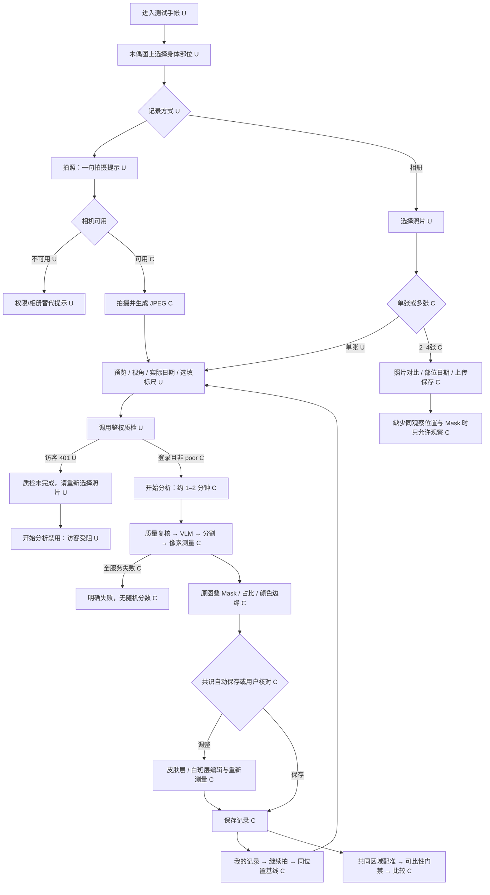
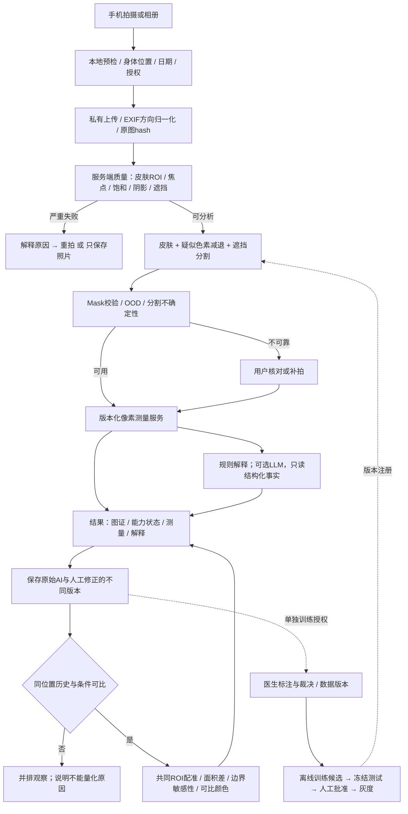
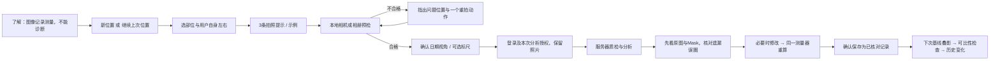

# SubSkin 手帐：产品、检测可靠性与测量审计

审计日期：2026-09-11。定位建议：**皮肤照片记录与疑似色素减退区域的图像测量辅助**。本文不构成医疗建议。

## 结论与证据边界

**当前最应投入的是可靠拒绝、测量依据、用户核对和独立验证，其次才是模型升级。** 现有实现已经具备一些正确基础：像素 Mask 测量、照片内皮肤分母、可选尺度参照、共同视野配准、人工双层 Mask 编辑、无服务时明确失败。不能把这些能力误报为全部缺失，也不能把“有这些模块”当作已经证实准确。

| 证据类型 | 本次完成 | 不能据此声称 |
|---|---|---|
| 在线 UI 实测 U | 独立 Chrome 访客会话；staging 首页 375/768/1024/1440；选部位、单图上传、日期/视角、401 质检阻断；相机不可用反馈；production 375 首页 | 没有登录账号，未走通在线 AI 分析、真实结果保存、重新检测、历史比较和编辑提交；未做真机 iOS/Android PWA |
| 源码核验 C | 当前工作区前后端、Prompt、分割/测量/对比/共识/训练器、隐私说明、Benchmark | 没有读取在线 DB Prompt、部署模型注册状态、环境开关或线上患者数据；不保证工作区等于线上后端进程 |
| 离线实验 E | 14 个无个人数据的合成输入，调用当前质量检查器和 edge-aware CV 分割；保存输入/参考 Mask/输出 Mask/指标 | 没有调用在线 VLM、SAM 权重或患者模型；不代表真人皮肤准确率；合成圆形不代表任何身体部位 |
| 外部资料 R | AAD、MedSAM 原论文、nnU-Net 官方仓库、Metrics Reloaded、CIE | 不构成产品临床认证或监管合规判断 |

用户要求的完整体验中，**已登录的完整闭环和真人图片矩阵尚未完成**，需要专用测试账号及明确授权的真人测试照片。已在工作过程中请求这些条件。本报告交付当前可验证部分及其余测试协议，绝不填造测试结果。

独立访问的版本证据：staging buildTime `1789090799175`，production `1788097546229`；staging `/api/health` 返回 `ok`。正式首页仍显示“白斑测评 / 拍照评估 / 标注确认 / 评估结果”，测试首页为“白斑记录 / 拍照记录 / 照片对比”。两环境前端目前不相同；测试环境新能力不能写成正式环境已具备。

本轮仅新增审计文档、证据和离线探针；没有修改业务代码、部署、重启服务、训练模型或读取患者照片。

## 1. 当前用户流程图

下图实线节点中的 `[U]` 为实际体验，`[C]` 为源码追踪；不是完整在线端到端通过图。



正式环境另一路径（仅首页 U）：进入“白斑测评” → 选部位 → 单次测评/多选对比 → 三步导航。首页声称“测评照片自动存入历史”。后续行为未实测，不能按测试环境的保存状态推断。

## 2. 逐步用户体验审计

| 步骤 | 用户目标与疑问 | 当前回答、困惑、成本及退出风险 | CTA / 信息层级 / 手机评估 | 优先级与建议索引 |
|---|---|---|---|---|
| 首次进入 | 这是判断疾病还是记录变化？能测面积吗？ | 木偶占主要视觉区域；“照片记录”降低诊断暗示，但缺少能力、边界、示例。U | 两个入口清楚；解释不足。375px 首屏最近记录与免责需继续滚动 | P1 I06 |
| 理解产品 | 我没有确诊也能用吗？结果能信到什么程度？ | 首页没有“疑似色素减退区域、不能确定病因”的明确区分；一般免责不等于解释能力。U/C | 把用途说明放 CTA 前，详细说明折叠 | P1 I06 / P0 I03 |
| 开始检测 | 先拍还是先选部位？需要登录吗？ | 未选部位可点击，再 Toast 提示；登录需求在投入选图后才体现。U | 选部位与主 CTA 分离；应显示先决条件并保留操作进度 | P0 I01 / P2 I15 |
| 阅读拍摄提示 | 多远、怎么照、能开闪光吗？ | 相机一句“均匀光照、边缘与正常皮肤拍全”；相册路径无前置操作指导。已有 PhotoGuideCard 不代表主路径使用。U/C | 一次只强调最影响当前质量的问题；示例比术语有效 | P1 I07 |
| 上传 | 照片会发给谁？支持 HEIC 吗？ | 主入口限定 JPG/PNG/WebP、10MB；照片质检先调用受保护接口，访客只见“重选”。U/C | 关键断点；格式提示应早于选择。iPhone 原生 HEIC 需实机检查转换行为 | P0 I01 / P1 I13 |
| 等待分析 | 还要多久？取消后是否真的停止、会扣费/保存吗？ | 固定“约1–2分钟”，没有后台阶段进度；cancelPending 仅丢弃前端响应，无 AbortSignal/服务任务取消。C | 取消有按钮，但语义不完整；网络离开恢复未核验 | P1 I08 |
| 查看结果 | 圈的区域对吗？有没有漏？ | 原图固定叠层，无就地原图/Mask/仅边界切换；status 是测量可用性，不是准确性。C | 照片与占比突出，缺少“请核对”的首要任务 | P0 I02 / P1 I09 |
| 理解数据 | 占比的分母是什么？几处、多少平方厘米？ | “仅占本图可见皮肤”正确；无标尺不输出 cm² 正确。数量/形态/质量/可信依据缺少统一展示；颜色与边缘优先模型描述。C | 术语“二维投影面积、VASI、色差、标定”需就地解释 | P1 I09/I10/I11 |
| 风险提示 | 低质量为什么还有数值？需要看医生吗？ | 只有 reasons 第一条首屏；其他说明折叠；无完整质量项和低可信处理状态。C | 关键拒绝原因不能放末尾；“范围已识别”容易被读成准确 | P0 I02/I03 |
| 保存 | 是已自动保存还是需要我确认？照片是否公开？ | 有 active/draft 和 autoFinalized；不同样本可能自动保存；存在“分享草稿”，并非直接公开。C | 同一体验应统一说“已自动保存草稿，待核对”；不要把模型一致等同人工确认 | P0 I04 / P1 I12/I13 |
| 再次检测 | 是同一位置的随访还是新位置？ | “继续拍”继承基线/部位/视角，支持半透明基线，这是好基础；新图日期需再次确认。C | 结果中“继续拍”容易误作“本次失败重拍”，两种意图需分开 | P1 I12 |
| 历史比较 | 两次面积百分比为何不一样？变化是真的吗？ | 当前共同 ROI + ORB/RANSAC 门禁正确；图片、位置、版本不齐会拒绝。新建记录各有 observation id，零散相册图不能凭部位直接量化。C | 应在选择历史时展示可比原因，避免上传等待后才告知 | P1 I14 |

视觉与工程附记：首页四种宽度未见页面横向溢出；桌面导航和手机 BottomNav 都出现。主按钮多为 44–52px。MaskEditorToolbar 普通模式仍有 `w-10 h-10`（40px）按钮，DigitalHuman 取消了 focus-visible 轮廓；这些是 C 证据，结果页真实触控仍待测。MaskEditor 1373 行超过项目业务组件标准，提升回归风险，但不应抢占可靠性修复优先级。Schema、暗色、离线、SW 更新、编辑器各断点本次没有做全量验收。

## 3. 问题清单、优先级与每项实施定义

成本为熟悉项目工程师的**净人日估算**，包含局部验证，不含招募/标注等待；各项有重叠，不可直接相加。收益是待验证的方向，不是已实现指标。P0 表示阻断可靠测量或主流程、存在高影响错误传播；不把纯视觉问题升级为 P0。

| ID / 优先级 / 证据 | 问题与为什么 | 怎么改 | 成本 | 预期收益 | 如何验证 |
|---|---|---|---|---|---|
| I01 P0 U+C | 访客质检 401 被说成照片问题；用户无法开始分析 | 主动在首次服务器上传前登录，保留本地照片；401 导向登录并自动重试质检，网络错误单独重试；本地预检可先做 | 1–2人日 FE+QA | 消除已复现的主流程死路 | 未登录、过期会话、首次登录、退出重登各跑一次；已选照片保留；无需再选图即可进入质检 |
| I02 P0 E+C | 全图亮度/锐度不能判断病灶 ROI 质量；过曝/棋盘被放行，硬阴影 good；测量 status 被当识别成功 | 分开文件/皮肤/病灶 ROI 质量；局部饱和、阴影覆盖、焦点、遮挡、尺寸门禁；严重失败不量化；服务不可用必须 unknown | 4–7人日 BE/CV+QA | 降低对无证据图生成定量结果的机会 | 14探针回归+真人质检集；报告错误放行率与误拒率；ROI 过曝不得因暗背景“平均”通过 |
| I03 P0 C（风险） | 默认 Prompt 要求单图分期和“病情好转”；与禁止诊断冲突；模型描述可能传播 | 删除分期/诊断/疗效请求；解释只读审核过的测量对象；结构化输出 allowlist，拒绝治疗推断；核对 DB Prompt 和旧报表出口 | 2–4人日 BE+医疗审阅 | 降低错误医学承诺 | 单图、低置信、无历史、光照变化的固定文本集：无确诊/排除/分期/疗效结论；当前线上发生率待测 |
| I04 P0 C（路径风险） | 共识和颜色规则可自动终审；None 被解释 both_empty；RF 首个模型无 holdout 也可自动激活；LLM 裁判正例进入训练 | None/empty/failed 分离；模型一致仅证据；用户核对状态独立；自动训练只产候选，晋级必须独立人工标签与冻结测试集 | 3–5人日 BE/CV | 阻止自证正确和错误循环放大 | 故障注入缺模型/空 Mask/单样本/反光；不得变成人工已核对或生产新模型；读取线上开关确认实际暴露 |
| I05 P1 C | U-Net 按图片随机划分训练/测试，可能同患者不同照片泄漏；测试只有最少3张 | 患者+重复图分组，训练/验证/冻结测试分开，保留站点/设备外部集；训练器与 benchmark 共用 split 清单 | 3–5人日 CV | 获得可解释泛化估计 | 跨 split 患者、近重复、同次连拍为0；固定模型重跑，含每组 n 和 CI |
| I06 P1 U | 首页不解释测量范围、不能诊断、需要拍摄条件 | CTA前两句用途说明＋可展开示例；保留木偶，提供文字部位替代入口 | 1–2人日 FE/设计 | 提升正确预期与结果理解 | 5–8位目标用户首次5秒描述用途；至少4/5能说明“照片测量≠诊断”（可用性目标） |
| I07 P1 U+C | 拍摄指南过短；实时质检 composable 未接当前相机 | 接入本地 ROI 提示，三条图示与基线叠影；相册同步预检；不要求凭感觉找固定厘米距离 | 3–5人日 FE/CV | 减少可避免的重拍、改善可比性 | 首拍合格率、平均重拍次数、同日重复测量误差；真机权限与镜头切换 |
| I08 P1 C | 取消只忽略响应，可能继续推理/写入；重试缺任务幂等 | job_id + 阶段状态 + 幂等键；明确“停止等待/取消任务”；可取消队列，运行中安全终止或丢弃，超时可恢复 | 3–5人日 FE/BE | 降低重复费用、幽灵草稿与丢失信任 | 分别在上传、排队、推理、保存阶段取消/刷新；无重复记录；实际后台状态一致 |
| I09 P1 C | 原图不可快捷切换，缺质量与可信依据，疑似块数量/形态不可核对 | 原图/蒙层/边界切换，透明度；“待核对”优先于百分比；连通区编号，数量定义；质量和范围可信度分开 | 3–5人日 FE/CV | 用户能发现误检漏检，理解数据来源 | 预置一漏一误；目标用户能定位并改正；不要用自评0.8显示成80%准确率 |
| I10 P1 E+C | 小目标、低对比、大范围、毛发区域 CV 易漏；轮廓与肤色强先验 | 先报告最小可测目标/可见性，低可信允许补画；按分组数据训练分割模型；消融颜色过滤/形态阈值，不盲目全部调低 | 门禁2–3人日；模型见路线图 | 避免漏检被解释为无病变，提升细小目标召回 | 同时报告小目标 Recall、FP/image、Boundary F1，避免用全图 Dice 遮盖 |
| I11 P1 C | 色差为未标定同图 ΔE76；周长是分辨率相关像素，描述可能与人工 Mask 不一致 | 颜色用原图固定坐标和正常皮肤参照，排除高光/毛发；可标定时才跨日颜色；修改 Mask 后重算/清空旧描述；固定尺度周长定义 | 3–5人日 CV/BE | 数字可解释且随标注一致 | 同图不同分辨率、重复标定、换灯/换手机对照；不把亮度差解释成黑色素含量 |
| I12 P1 C | 自动保存/草稿/核对完成混淆；“继续拍”混合重拍与随访 | 三种持久状态：原始分析、用户已核对、医生已审阅；明确“本次重拍”“下次同位置记录”；退出草稿可恢复 | 2–3人日 FE/BE | 减少误保存和基线误串 | 刷新重进、两次更改、取消编辑、已保存再改，结果与状态一致 |
| I13 P0 待核验风险 C | 隐私政策承诺授权关闭不外送；本次追踪 assess/vision/trainer 未见逐操作授权检查；训练同意与检测操作应独立 | 核对共享授权中间件和在线开关；建立 analyze/train/share 各自 scope 与撤回记录；无授权不得外送/入训练 | 核验1人日；补齐2–4人日 | 防止承诺与数据处理不一致 | 两账号隔离、授权关闭时代理请求计数为0、撤回后训练清单消失；本次未证实泄漏，不宣称已发生 |
| I14 P1 C | 快速相册路径没有完整 observation/Mask，经过上传后可能只能拒绝比较 | 默认“并排观察”；需要定量时补同位置确认→质量→双 Mask→配准；先检查前提再耗费模型 | 3–5人日 FE/BE | 减少无法兑现的比较，保护随访信任 | 同部位不同位置、同照片、不同日期未确认、裁剪、不同版本必须明确降级；不相加重叠多图面积 |
| I15 P2 U+C | 必须图上点选，左右方位可能混淆；小字/窄命中/无焦点提示 | 图与文字选项互通；说明按“用户自身左右”；44px命中、不重叠、清楚键盘焦点 | 1–2人日 FE | 降低选错部位和触控成本 | 375/768/1024/1440与键盘测试；左右任务错误数，触控命中率 |
| I16 P2 C | 编辑器1373行、普通工具40px、多个高级工具一次暴露 | 首屏只加遗漏/删误识别/撤销/完成；高级皮肤层与吸附折叠；分离绘制坐标、工具状态、保存逻辑 | 3–5人日 FE | 降低修正成本与回归风险 | 画笔/缩放/旋转/EXIF/撤销自动化和真机任务；不只靠行数通过 |
| I17 P1 C | 现有 Benchmark 缺像素Precision/Recall、病灶漏误检、颜色、分组样本数/CI；面积有符号均值会抵消 | 实施第9节规范；绝对与相对误差并列；负例独立报；按患者 bootstrap | 3–5人日 CV/QA | 性能声明可追溯，不被平均值掩盖 | 完美/空/全错/碎片/漏目标/边界偏移控制样本；报告不允许缺分母 |
| I18 P1 C | API还保留临床VASI兼容字段，旧UI/报表可能误用 | 单照片 measurement scope成为唯一展示依据；legacy显式禁比；逐一核对历史详情、分享、PDF/报告消费者 | 2–4人日 FE/BE | 阻断过时评分复活 | 搜索字段消费者并逐路由验证；新记录 clinical_vasi_valid=false时无临床分数 |
| I19 P1 C | 固定提示“约1–2分钟”且已不用的 VLM/预处理/旧UI代码仍留误导注释 | 记录实际阶段延迟 p50/p95、模型版本/来源；清理死路径文档；不同fallback显式状态 | 1–2人日 BE/QA | 定位慢点与差异，降低维护误判 | 每次请求能追溯同一图hash、模型、Mask revision；遥测不包含图片/PII |
| I20 P2 C | 结果保存后就诊分享邀请抢占后续记录注意力 | 放到独立低优先级入口；优先核对、保存、同位置随访 | 0.5–1人日 FE | 减少任务切换 | 完成后正确选择下一步的可用性测试；不得牺牲核心完成率换分享 |

P0 处理顺序：I01 主流程解锁；I02 严重质量失败关闭定量；I03 医学语义约束；I04 自动终审/模型晋级隔离；I13 授权契约核验。I13 是**需核实的发布风险**，与已在线复现的 I01 不同。

## 4. 实际图像测试记录与错误归因

实验方式：生成 800×640 人工肤色椭圆及已知几何目标（小分辨率例外）；把已知皮肤 ROI 提供给 CV 模块，**刻意隔离皮肤分割误差**；皮肤颜色候选仍由模块自己计算。每种一个样本，固定种子911。离线强制运行全部样本以观察失效，线上 `poor` 应在正式推理前拒绝。毛发例的参考包含被遮住几何区域，故只用来暴露遮挡敏感性，不能把其 Dice 当临床可见边界精度。

| 输入 | 质检 / 正式门槛 | CV 输出 | 明显问题与可能原因 | 应怎样处理 |
|---|---|---|---|---|
| 清晰高对比控制 | good / 放行 | Dice .984；面积误差 −.90% | 简单合成几何可测；不是临床验证 | 可分析并核对 |
| 模糊 σ=8 | poor / 拒绝 | 离线 Dice .935；+13.84% | 边缘扩散；质检拒绝正确 | 重拍，不显示正式面积 |
| 暗光20% | poor / 拒绝 | 离线 Dice .987 | 人工高对比仍可分不代表暗光真人可测；拒绝合理 | 重拍，不以偶然高Dice放宽 |
| 强光截断 | acceptable / 放行 | 空 Mask；Dice 0；−100% | 皮肤饱和，暗背景稀释均值；无皮肤仅软失败 | 拒绝定量，指出过曝位置 |
| 硬阴影 | good / 放行 | Dice .445；+29.69% | 光照边界误当病变；面积误差与轮廓误差并不一致 | 阴影覆盖目标时重拍 |
| 目标内部反光 | good / 放行 | Dice .985；−.90% | 面积碰巧接近，反光仍污染颜色与可见证据 | 颜色不可用；覆盖关键边界则拒绝面积 |
| 微小目标半径9px | good / 放行 | 空 Mask；−100% | 连通域最小面积/低分辨率先验过滤 | 提示靠近且拍全，不得据空Mask说“未发现疾病” |
| 大面积目标 | good / 放行 | Dice .795；−33.13% | 健康皮肤局部参考不足，先验可能削弱内部 | 低可信待核对；补上下文；不能强制补全 |
| 边缘不明显/低对比 | good / 放行 | Dice .886；−20.39% | 亮度阈值与模糊边界定义敏感 | 展示不确定边界带；不报高精度趋势 |
| 人工毛发线遮挡 | good / 放行 | 空 Mask；−100%相对潜在几何 | 梯度纹理惩罚、碎片过滤；不可见部分不可测 | 标为遮挡/需补拍，禁止推测填补 |
| 无目标人工皮肤 | good / 放行 | 0像素；Dice约定值1 | 此控制通过；只证明本样本 | “未分割出明确区域，不能排除皮肤问题” |
| 无皮肤棋盘 | acceptable / 放行 | 0像素；空集Dice约定1 | 纹理高，skin_ok=false未成为硬拒绝 | 非皮肤必须拦截；空集1不计入阳性准确率 |
| 变亮正常区域干扰 | good / 放行 | 错圈25,196像素；Dice0 | 颜色启发式不能知道色差来自光照而非病变 | 不确定提示/重新拍摄；训练负例并评估FP |
| 320×256低分辨率 | poor / 拒绝 | 离线 Dice .969 | 像素阈值与尺度变；质检拒绝合理 | 请求原图/重拍 |

对应证据见 `evidence/offline-probes.json` 和 `evidence/synthetic-contact-sheet.png`。其中 `online_model_tested=false` 明确标记了边界。合成质检有11/14非poor，只描述本组输入，不能报告为真实误放行率。

### 用户要求的真人矩阵：待完成协议

以下每类都没有合规真人样本和登录在线结果，**AI输出/错误/页面处理均未观察**，不能用上表替代。获得数据后每次保存 request_id、输入条件、结果原文/Mask、耗时、错误定位、拒绝判定及实际页面处理。错误归因需与专家Mask比较，不能目测拍脑袋。

| 真人类型 | 最少探索样本建议（非统计保证） | 重点记录与预期拒绝逻辑 |
|---|---:|---|
| 清晰 | 5 | 面积/边界、正常皮肤分母；应分析但可核对 |
| 模糊 | 5 | 局部对焦与背景清晰度分开；边界不可见则拒绝 |
| 暗光 | 5 | 暗部纹理/噪点、深肤色误拒；不可辨拒绝 |
| 强光 | 5 | 皮肤ROI饱和，不看全图均值 |
| 阴影 | 5 | 遮盖目标边界比例与伪阳性 |
| 反光 | 5 | 反光与正常脱色区混淆；面积/颜色分能力拒绝 |
| 小面积 | 5 | 病灶级召回、分辨率；限制最小可测尺寸 |
| 大面积 | 5 | 无正常皮肤参照、拍不全；拒绝绝对全貌推断 |
| 边缘不明显 | 5 | 医生间一致性与不确定带，不强行唯一轮廓 |
| 手部 | 5 | 指节/指甲/手掌/手背/握拳、曲面 |
| 面部 | 5 | 额头反光、眼周、胡须；最小必要裁剪与授权 |
| 四肢 | 5 | 左右/内外侧、转动、毛发 |
| 躯干 | 5 | 大曲面、衣物边缘、辅助拍摄 |
| 毛发区域 | 5 | 可见与遮挡区独立标注；不要求剃毛 |
| 易混淆皮肤区域 | 5 | 专家确认的瘢痕、炎症后减色、花斑癣、正常反光/肤色变化；疾病鉴别不交给通用LLM |

这些维度可交叉、同一照片可带多个标签，但重复图不能冒充独立样本。75次只是探索规模，不是准确率发布的充分依据。

## 5. 算法逻辑与推荐架构

### 当前判断

当前不是纯LLM测量：VLM给皮肤框、疑似病灶框/中心/边界点/颜色描述，再引导SAM；自动分割路径可能优先自训练U-Net，失败可走CV或远程nnU-Net；结果经边缘整理，`measure_layers`算面积。当前在线究竟加载了哪些权重、采用哪个fallback，未读取运行态，不能断言是某模型。

**过度使用LLM的部分**：目估面积、4–8个边界点、脱色等级、单图分期、未校准自评confidence、LLM裁判给伪标签。其中一些字段已被新版测量覆盖或禁用，仍有成本、误导和上游引导风险。VLM边缘点作为SAM正点尤其需要消融：边界模糊时正点可能落在背景，迫使分割包含错误区域。

| 能力 | 主工具 | 辅助/门禁 | 不应交给LLM的部分 |
|---|---|---|---|
| 皮肤及白斑分割 | 经过本域训练的 segmentation model；SAM可作交互标注候选 | 皮肤/背景/高光/遮挡多类分割，负点/正点，颜色边缘受限后处理 | 用自由文字坐标或框面积代替像素Mask |
| 位置 | 用户部位确认＋CV部位/侧别校验＋同位置ID | LLM可解释不一致 | 不凭单张局部照片确定身体左右 |
| 数量 | 实例分割或连通域/规则 | 定义最小区域与连接规则、融合/分裂关系 | 把连通域数量直接叫临床病灶总数 |
| 面积与占比 | 二值/概率Mask＋传统像素算法 | 正确皮肤分母、裁切/部分可见状态 | 目测百分比、照片推全身BSA/VASI |
| cm² | 同平面尺度标定＋几何变换 | 参照长度误差、视角和曲率有效性 | 用“手掌通常多大”猜尺度 |
| 周长 | 固定工作尺度轮廓/Crofton类估计 | 定义外轮廓/孔洞是否计入；仅标定后输出mm | 从语言描述估算周长 |
| 边缘清晰度/形态 | 边界法线梯度、对比度、曲率/圆度、边界不确定性 | 同分辨率和遮挡控制，医生定义标签 | 把边缘模糊等同进展/好转 |
| 颜色 | 原图色彩管理＋Lab统计、稳健正常皮肤参照 | 高光/阴影屏蔽；色卡校准；ΔE00可选 | 用瓷白/乳白推断组织黑色素或疗效 |
| 图片质量 | 传统算法＋任务相关CV质量模型 | 规则组合，按能力输出可用性 | 单靠LLM一句“清晰” |
| 历史比较 | 同位置验证＋稳健配准＋共同ROI测量 | 光照/曲面/设备/模型版本门禁 | 直接减两张不同取景占比 |
| 可信度 | 经独立测试校准的误差/可用性估计 | OOD、模型分歧、面积/边界不确定性 | LLM自报0.9当90%准确率 |
| 解释 | 规则模板优先，LLM可选润色 | 输入仅已验证的结构化事实，禁止新增数字/临床结论 | 推理出诊断、疗效和治疗建议 |

推荐“受门禁约束的分割测量系统”，而不是先更换一个更大的多模态模型。



架构路线比较：A只改Prompt（约2–4人日，能限制措辞，不能解决测量）；B加质量门禁＋复用现有Mask测量/编辑（推荐，两周完成核心安全流程）；C端到端训练新分割模型（1–3月及数据成本，必须B先完成）。这些是审计方案，不代表已实施。

## 6. 检测错误分类体系

一条错误允许多个标签，但要确定首个失效环节和最终用户影响。固定链：采集 → 质量 → 定位 → 分割 → 测量 → 比较 → 解释 → 保存。

| 原因类别 | 识别证据 | 解决方式 / 成本归属 | 收益与验证 |
|---|---|---|---|
| DATA 数据 | 某部位/肤色/负例稀缺；标注者分歧；同患者泄漏 | 双医生标注、裁决、不确定边界、多站点；I05/I17与数据预算 | 独立患者各组Recall/FP与CI；训练集好不算有效 |
| MODEL 模型 | 正常皮肤误圈、毛发/小斑漏掉、OOD | 本域分割训练；交互补点；分层消融；I10 | 与冻结基线同患者配对统计；不能只报平均Dice |
| PROMPT 提示词 | 单图好转/分期、强制输出每个字段 | 删除越权任务、允许null、输出schema与医学规则；I03 | 模糊/无斑/混淆图输出无新增临床判断 |
| QUALITY 图像质量 | 焦点在背景、病灶过曝、阴影横切 | ROI预检、重拍、按能力降级；I02/I07 | 错放率下降，同时监控误拒和完成率 |
| UX 产品交互 | 访客重选循环、日期/左右选错、无比较上下文 | 恢复会话、简单部位确认、基线叠影；I01/I12/I15 | 实际任务完成与误操作数，不只接口200 |
| METHOD 测量方法 | 分母变化、不同尺度周长、概率阈值变化 | 固定mask/ROI/版本；共同坐标；I11/I18 | 同图resize/裁剪/旋转的性质测试；单位准确 |
| SCALE 缺尺度标定 | cm²无参照；标尺与皮肤不共面 | 无标定返回null；标尺同面＋几何验证；I11 | 已知面积平面靶测量，报告参照误差传播 |
| COLOR 缺颜色标定 | 换灯/白平衡导致“更白” | 同图参照；跨日需稳定参考/色卡；保留原始图；I11 | 同一目标换光无疗效结论；ΔE00与参考测量偏差 |
| LIMIT 能力限制 | 同外观不同疾病、不可见区域、曲面单图 | 明确不诊断、不补全；多视图只辅助可见性；I03/I07 | 专家病例确认系统拒绝越权，非追求所有输入有结果 |
| SYSTEM 系统状态 | 无模型被当无斑、取消后后台保存、版本混用 | typed result + job状态 + registry +审计；I04/I08/I19 | 故障注入、断网、幂等、版本回退测试 |

最终错误标签另记：FP误检、FN漏检、UNDER/OVER分割、MERGE/SPLIT、ROI分母错误、SCALE_ERROR、COLOR_ERROR、REGISTRATION_FAIL、FALSE_CHANGE、UNSAFE_TEXT、AUTH_FAIL、PERSISTENCE_FAIL。分割变差但面积接近仍算错误；不只用面积误差定位原因。

## 7. 新拍摄流程与新用户流程

设计目标：第一次可完成，后续可比较；允许只记录照片。以下距离等为需真机验证的产品起始指导，不是医学标准。



| 拍摄因素 | 推荐设计与具体操作 | 不满足时的处理 | 成本/收益/验证 |
|---|---|---|---|
| 距离 | 后置1×为默认；局部先尝试约20–40cm，因机型对焦而调整；目标占画面约1/3–2/3且保留正常皮肤；不用固定距离当质量保证 | 太小提示靠近，拍不全提示后退；无尺度不输出cm² | I07，3–5人日共享；看最小目标像素和首次合格率 |
| 角度/姿态 | 镜头近似垂直目标局部平面；手背放松展开、身体姿态保持一致；示例显示不倾斜 | 倾斜明显不输出绝对面积；多张覆盖曲面但不直接相加 | I07/I11；平面靶不同倾角误差曲线 |
| 光线 | 均匀漫射光；避免直射太阳、明显阴影、闪光与混合灯；随访尽量同光源 | 指出局部过曝/阴影，不仅写“光线不足” | I02；ROI失真检出与误拒 |
| 背景 | 素色哑光背景，白斑周围保留正常皮肤；不要求所有肤色都用同一种背景色 | 非皮肤占比大提示重新取景；肤色模型不能排除脱色皮肤 | I07/I10；背景分组FP |
| 对焦 | 点击目标区域对焦，手机稳定，短连拍本地选最清楚一张；禁数字放大作为尺度来源 | 目标模糊则重拍，背景清晰不能抵消 | I02/I07；目标ROI人工质量标注 |
| 身体部位 | 图与文字选择；确认左/右、掌/背、内/外；同位置给“左手背近腕”短名 | 单局部照片AI只能建议部位，由用户确认 | I12/I15；同位置匹配错误率 |
| 尺度 | 可选哑光毫米标尺/专用尺寸卡，放目标旁同平面，不压白斑、不遮边界；不使用银行卡/身份证 | 无效就不输出cm²；提示“仍可记录照片占比” | I11；已知几何靶+端点重选误差 |
| 颜色参照 | 长期颜色研究用已知反射特性的灰/色卡，参考区不过曝；普通白纸只能有限帮助白平衡，不能替代色卡 | 未标定只显示同图相对差异；跨日色差不给疗效结论 | I11；色卡参考偏差与设备重复性 |
| 遮挡 | 移开衣物/饰物、拨开毛发即可；不要求剃毛或自行停药。记录可见的乳膏/化妆品影响 | 遮挡无法判断则补拍/仅记录；禁止幻觉填补 | I02/I07；遮挡比例分组与null状态 |
| 多张 | 首次可用1张定位＋1张近照；后续优先复现近照。曲面/大范围可分位置多图，均单独质量检查 | 不把2–4张随意照片当可靠时间序列，不叠加重叠面积 | I14；跨图重叠、日期乱序、不同位置测试 |

质量采用**按能力放行**：照片可保存、面积可测、颜色可测、时间变化可测分别判断。例如反光不触边时可能还能粗略圈范围，但颜色不可信；边缘被截断可以记录“可见部分占比”，不能说完整面积或参与完整病灶变化率。严重不可用仅“重拍”或“只保存照片”，没有“仍然生成完整检测结果”。

## 8. 新结果页面与 Human-in-the-loop

手机顺序：①状态和需做动作 → ②原图/Mask/边界 → ③疑似区域数量与面积口径 → ④图片质量/可信依据 → ⑤历史可比变化 → ⑥颜色边缘形态 → ⑦测量方法。桌面保持 max-w-6xl，左侧图像证据约60%、右侧结论约40%；历史导航沿用可折叠w-52，手机采用横向标签。手机底部保留一个主CTA，避开BottomNav与safe area。

```text
本次照片 · 左手背 · 实际拍摄日期                 待你核对
图像分析不确定病因
┌─────────────────────────────────────┐
│ 原图 | 疑似区域 | 仅边界      透明度  │
│ 照片：可缩放；区域1、区域2编号         │
│ 虚线/阴影纹理表示不确定边界            │
└─────────────────────────────────────┘
先确认：是否圈全？有没有把反光/正常皮肤圈进去？
[补上遗漏] [去掉误圈]（高级：修改皮肤范围）
疑似区域 2处（连通区域定义）
照片内占比 12.4%（示例） · 分母为蓝色可见皮肤
面积 — 未放标尺       | 有效标定后：约x cm²，二维投影
照片质量：可用 / 阴影 / 反光 / 模糊，逐项原因
范围可信度：待核对；数值概率未校准，不展示百分比
历史：可比较/不可比较，原因先于曲线
颜色：仅同图相对观察；边缘：部分不清楚；形态：说明
[确认范围并保存]                     [重新拍这张]
```

显示规则：

- **可靠性不足**：隐藏具体面积，写“边界暂不能可靠识别”；有照片不等于有数值。主CTA“重新拍摄”，次CTA“只保存照片”。
- **局部可测**：写“照片可见部分”，保留完整范围缺失标志，不给完整病灶cm²和趋势。
- **分割待核对**：百分比是候选Mask计算值，用“暂估”标签；不能显示“检测可信度98%”。
- **经核对**：写“你已核对范围”，不写“医学验证通过”。
- **历史变化**：共同ROI、两日期和对齐图并列，显示变化区间及“边界敏感性范围”；现有形态膨胀/腐蚀计算不是统计95%置信区间，不能换名。未超出测量噪声写“未见明确面积变化”，不写病情稳定。
- **颜色**：强光/白平衡变化时显示不可比较原因；“更白”只描述照片外观。
- **边缘/形态**：数量与面积以最终Mask为准，语义描述应重新生成或失效。当前手动修改后visualFeatures不会重算，可能遗留旧描述。
- **异常提醒**：新出现或持续变化、本人担心等由用户主动报告；不要仅凭某个算法数值触发医学恐吓。建议咨询专业人员，不给自行换药指令。

### 人工修正机制

AI原始Mask（不可覆盖） → 用户原图核对 → “补上遗漏/去掉误圈” → 实时像素重算 → 修改前后对照 → 明确提交“保存我的修正” → 新revision → 所有相关对比缓存失效。已具备的双层编辑器继续复用，不另造一套。

初级模式：双指缩放/平移、单指画笔、撤销/重做、橡皮、按住看原图；触控笔可用。高级模式才显示皮肤分母、智能选斑、边缘吸附、容差。病灶落在皮肤层外时应展示冲突并让用户决定，不能偷偷扩大皮肤分母。自动吸附只能预览，并可撤销。

保存对象至少：image_hash、normalization_version、ai_mask_id、user_mask_id、skin_mask_id、model_version、measurement_version、revision、actor_role、created_at、reason。撤销UI历史不删除后台修订审计；删除账号/照片依法按隐私政策处理，审计保留方式需最小化，不能以审计为由无限保留医学图片。

这能提高可靠性，但**不是必然提高临床准确率**：普通用户也可能把反光加为白斑，或受AI先入为主影响。训练标签分三层：AI伪标签、用户修正、医生审核；不能把点击“满意”或未修改当成专家真值。评估随机交叉任务：AI直接接受 vs 人工修正后，比较专家Mask Dice/Boundary F1、误检漏检、完成时间和用户理解；有收益且额外时间可接受再扩大。估算I09/I12/I16共约5–8人日含重叠。

## 9. Benchmark：测试集与指标体系

当前 `scripts/assessment_benchmark.py` 已实现Dice、IoU、2px Boundary F1、HD95、面积误差与肤色/部位分组、患者split检查，这是可复用基础。它还缺用户要求的完整指标；固定2px依赖分辨率、有符号面积均值抵消、重复面积CV未强制同尺度、空病例Dice=1可能美化平均值，需改造。

### 数据组织

建议首期工程基准 **900张 / 至少300名独立参与者**，目标配额为训练540张/180人、验证180张/60人、冻结测试180张/60人；这是资源规划起点，按实际每人张数调整，**患者不能跨split**。测试至少含45张专家确认负例；至少30组同日重复/随访配对，可与图像样本重合但按患者统计。另建外部验证约300张/100人（不同采集中心/设备），不参与调参。

这点样本不足以支撑全部交叉子组的医疗性能承诺。正式样本量由临床/统计人员根据主要终点、组内相关、预期效应和CI宽度制定；试点之后按最差组补数据，而非机械填满所有笛卡尔积。

两名有经验皮肤科标注者独立标注，第三人裁决；标出可见疑似色素减退区、可见皮肤、毛发/遮挡、高光、裁切、不可判定区。疾病类别需可靠临床信息，单靠照片不能给诊断金标签。核心清晰边界+不确定带双重标注；报告医生间Dice/边界差，判断模型误差是否超出人工不确定性。模型结果盲法，不把AI预标注不经核对当真值。

### 指标定义

令TP/FP/FN为目标像素，A为面积，G为专家参考，P为预测；所有结果在同一EXIF归一化坐标和固定像素尺度计算。

| 指标 | 定义/单位 | 报告规则 |
|---|---|---|
| Dice | 2TP/(2TP+FP+FN) | 阳性图像macro与患者macro，另报micro；负例不混入阳性均值 |
| IoU | TP/(TP+FP+FN) | 与Dice同时给，病例分布/P10/中位数，勿当独立信息重复加权 |
| Precision | TP/(TP+FP) | 像素级与实例级分开；没预测时分母0为N/A，不悄悄填1 |
| Recall | TP/(TP+FN) | 小目标组单列；参考为空则N/A |
| Boundary F1 | 边界容差内Precision/Recall的调和均值 | 首选标定后mm容差；无标定在规范化分辨率规定px容差；报告1/2/4px敏感性，不跨分辨率比固定2px |
| 面积绝对误差 | abs(Ap−Ag)，px²或有效标定后的cm² | 固定图像坐标；不要把数量为“像素”误写长度px |
| 面积相对误差 | abs(Ap−Ag)/Ag ×100% | 另报带符号偏差、MAE、中位数、P95；Ag近零另分小目标/绝对误差，不随便加epsilon掩盖 |
| 占比误差 | abs(P占比−G占比)，百分点pp | 分母用参考皮肤与预测皮肤两版报告，隔离皮肤分母误差 |
| 颜色差异 | 预测区域相对参考皮肤的Lab与专家ROI差异；标定后ΔE00 | 同时用GT ROI评颜色算法、预测ROI评全管线；未标定跨设备不承诺绝对色差 |
| 漏检率 | 未匹配真实病灶数/真实病灶总数 | 8连通或临床实例定义预注册；一对一匹配，主IoU阈值0.5及小目标敏感性0.1/0.25另报 |
| 误检率 | FP区域/图像；负例图出现≥1 FP的图数/负例图数 | 也报FP/(TP+FP)=1−Precision，明确分母；不要含糊“误检率2%” |
| 数量误差 | abs(Np−Ng) | 单列融合/碎裂；毛囊小岛不得算新白斑 |
| HD95 | 95分位边界距离，mm或规范px | 参考非空但预测为空是完全失败，不能排除后求平均 |
| 重复性 | 同目标同日多拍、共同坐标面积CV/绝对差，Bland–Altman偏差与一致限 | 未配准的原始pixel CV无意义；CV均值接近0则N/A |
| 趋势可靠性 | 无变化对的假变化率；有变化对方向准确率 | 专家/标准靶变化定义，不用模型自己的变化当GT |
| 质量/拒绝 | 错误放行率、误拒率、覆盖率、风险-覆盖曲线 | 拒绝的图不能从总体报告消失；高Dice但仅接受少数图不能叫整体好 |
| 可信度 | 预测质量vs实际Dice/面积误差的校准曲线；二值可接受事件的Brier/ECE | 必须先定义“可接受”事件；不把像素softmax和病例正确概率混用 |
| 体验 | 合格照片分析完成率、取消/超时、p50/p95延迟、修正时间 | 完成率分母为有分析意图且已授权的任务；拒绝重拍是合理结局之一 |

空集约定：G=P=空只记正确负例；Dice实现可以返回1但不汇入阳性分割均值；G非空/P空，Dice与Recall=0，Boundary F1=0，HD95按完全失败另列；G空/P非空记录FP/image，不能把相对面积误差设为0。宏平均不以大斑像素压倒小斑；95% CI按患者cluster bootstrap（建议2000次）且固定seed。

### 分组评测

| 维度 | 建议分组 | 注意 |
|---|---|---|
| 身体部位 | 面颈、手掌/手背/手指、上肢、下肢、躯干、足、毛发区域 | 左右和姿态作为元数据，不推断疾病分型 |
| 肤色 | 标准化光下客观色度/人工色阶，多档均衡 | Fitzpatrick衡量日晒反应，不能由照片亮度直接推断；不推断种族 |
| 白斑面积 | <1%、1–5%、5–20%、>20%参考可见皮肤；额外最小目标像素组 | 是测量评测分组，不是严重程度；绝对面积仅有效标定图 |
| 光照 | 漫射、低照、直射、混光、阴影、局部反光 | 可多标签；人工判合格性 |
| 图片质量 | 对焦合格/模糊、压缩等级、裁切、遮挡、曝光失败 | 包括应拒绝的数据 |
| 设备 | iOS/Android、前后镜头、厂商/档次、分辨率、HDR/美颜 | 真机测试；保留必要摄像元数据但去GPS/身份信息 |

每组报患者n、图像n、阳性n、负例n、接受数、拒绝数、所有主指标与CI。探索性组患者<20标“样本不足”；这是警示线而非充分统计标准。重点交叉组：浅肤色×低对比、深肤色×低照、手指×微小斑、毛发×阴影、低端设备×压缩。冻结测试集不可给提示词调参、自动进化或主动学习回流。

### 发布门槛（工程提案，非医学标准）

先满足：P0清零；无证据不报确定结果；授权正确；同一图方向/单位一致；拒绝病例也纳入评估。候选量化目标可从阳性患者macro Dice≥.85、Boundary F1≥.80（预先固定容差）、可测面积中位相对误差≤10%、重复面积CV≤5%、无变化对假变化≤5%开始讨论。这些数值**未获得临床验证，不能直接拿去宣传**。目标须由医生和产品根据使用风险设定；最差组退化不能用总体提升抵消。门槛与覆盖率一起报告。

## 10. 数据需求与推荐技术方案

### 数据需求与治理

| 数据 | 必需字段/规格 | 估算成本与用途 | 验证 |
|---|---|---|---|
| 真实采集图 | 原图、拍摄日期、部位/侧别/视角、同位置ID、设备信息、照明、质量标签、授权scope | 招募和标注为主要成本；900张双人每张5–10分钟约150–300标注工时，另加裁决/质控约30–60小时，仅预算假设 | 数据字典校验、缺失率、抽样可追溯 |
| 分割真值 | lesion/skin/occlusion/glare、边界不确定带、实例ID、标注者/裁决/版本 | 两位医生+一裁决；不要只收漂亮阳性图 | 标注者一致性、盲测、金标准复核 |
| 阴性/混淆 | 正常皮肤、反光、瘢痕、其他色素减退；诊断依据和不确定性 | 主动采集易误检，不为凑比例重复同照片 | 负例FP/image与临床依据审核 |
| 标定/重复拍摄 | 同平面标尺与色卡、同日多拍/不同设备/不同光线对、标准靶 | 约20–30人重复采集作为初始方法学试点 | 面积/颜色偏差与重复性，控制真实变化为0 |
| 用户修正 | AI与user Mask独立保存、工具操作、时间、是否医生复核 | 经单独训练授权才入候选；用户修正不是金标签 | revision一致、缓存失效、撤回生效 |
| 运行证据 | 模型hash、Prompt版本、阈值、质量原因、fallback、job状态、延迟、错误码 | 不记录原图、完整token、手机号等到应用日志 | 同request可复现，隐私抽查 |

避免“只匿名编号就匿名化”的说法：脸部、纹身、医学图像本身可能识别人。必要的部位照片只给已授权处理者；第三方模型调用、训练、公开分享的授权分开；训练/测试撤回后去除样本并追踪模型版本影响，不能保证从已训练权重瞬间消除影响。分析服务契约、保留期和删除策略需实际核验，不能由这份审计认定合规。

### 可落地技术选型

1. **前端保持Vue3/现有组件**：复用AssessmentCapture、ObservationResult、MaskEditor；本地Canvas做基础质量提示，服务端同一规则再验证。先修访客与错误恢复，不大重写页面。成本见I01/I07/I09；以任务完成和误放行验证。
2. **分割做基线对照**：保留当前CV作为可解释基线；训练轻量U-Net/nnU-Net兼容2D照片方案；SAM/MedSAM只作为候选/交互辅助，必须用本域皮肤照验证。成本约4–8工程周加标注；以冻结患者集和最差组验收。MedSAM在医学图像上的研究结果不能外推到手机白癜风照片。[MedSAM原论文](https://doi.org/10.1038/s41467-024-44824-z)、[nnU-Net官方仓库](https://github.com/MIC-DKFZ/nnUNet)。
3. **Python测量服务独立**：复用现有measure_layers/common_roi，加入稳定坐标/单位/修订校验。二维投影A = n×s²，s为mm/pixel；面积相对尺度误差约为长度标定相对误差的两倍，小误差近似。不能测曲面真实表面积。成本I11/I18；标准靶验证。
4. **边缘后处理受限**：将色差/分水岭视为可关闭模块，比较原始模型、加边缘吸附、加过滤三种消融；不因视觉更平滑就认为更准。1–2周CV实验；以BoundaryF1和小斑Recall验证。
5. **颜色用测量学**：同图相对Lab差是起点；加色卡时记录色彩空间/白平衡、校正误差，再使用ΔE00；没有校准不显示“黑色素提升%”。成本I11＋色卡采集；标准色差与重拍误差验证。[CIE色差定义](https://www.cie.co.at/publications/colorimetry-part-6-ciede2000-colour-difference-formula-1)。
6. **任务系统先小后大**：job表＋现有后台worker即可起步，若并发增长再拆队列/推理worker；保持幂等、取消状态和权限，不为队列而引入复杂集群。I08的3–5人日；断网与重复请求验收。
7. **模型注册与晋级**：记录训练集/验证集hash、指标、分组退化、审核者、灰度/回滚；候选不自动覆盖production。I04/I05；单样本首训/低指标模型不得晋级。

评价准则来自任务本身；单一Dice不足以评价检测、边界、数量和可靠拒绝。[Metrics Reloaded方法学](https://doi.org/10.1038/s41592-023-02151-z)。

## 11. 安全与医疗表达

白色或变浅区域可能有多种原因。皮肤科诊断会结合病史与检查，必要时使用Wood灯等；手机图像分割不能代替这一过程。[AAD诊断说明](https://www.aad.org/public/diseases/a-z/vitiligo-treatment)。

| 风险表述或状态 | 建议替换 | 成本与验证 |
|---|---|---|
| “AI检测白癜风/确诊/排除白癜风” | “分析照片中的疑似色素减退区域；不能确定病因” | I03统一文案；所有路由/模板/Prompt搜索与审核 |
| “进展期/稳定期/好转期”（单图） | 删除；只有可比历史才显示“共同范围内面积增大/减小/未见明确变化” | I03/I18；无历史测试集无分期输出 |
| “准确率/可信度90%”（模型自评） | “范围待核对；边缘部分不清楚”，有外部校准后再讨论概率 | I04/I09；用户不把模型分数当患病概率 |
| “检测到0处白斑”作为排除依据 | “本图未分割出明确区域；照片不能排除皮肤问题” | I02/I03；零Mask与失败状态分离 |
| “边缘吸附到真实边界” | “尝试贴合照片色差边缘，请核对” | I16，0.5人日文案；反光边缘示例测试 |
| “颜色变深=疗效好/黑色素增长” | “本次照片区域较周围皮肤的明暗差改变，拍摄条件也会影响” | I11/I03；换光/换设备不报疗效 |
| “手工确认”或“模型共识”写为已验证 | “你已核对标注”或“多个方法结果接近，仍需核对” | I04/I12；状态与操作者对应 |

建议提示：首次出现不明原因色素变化、变化持续或用户观察到近期明显增多、AI多次无法可靠圈定、本人担心或需要诊断/治疗决策时，提示预约皮肤科。若伴疼痛、明显炎症、破损等用户报告症状，建议及时寻求医疗帮助；这不是从Mask自动作出的疾病判断。低置信度本身不等于病情严重，界面不能用红色报警制造焦虑。

检查范围说明：已检查主手帐相关源码、比较/报告相关输出路径和隐私政策，未实际体验全站所有登录功能与全部动态生成文本。未发现或未复现不等于不存在。

## 12. 两周、一个月与三个月计划

资源假设：FE1、BE1、CV1、QA/产品共1人当量，医生审阅按时段参与。人日为范围，临床采集单独排期。所有业务改动遵循项目：staging先行、记录DEPLOY_LOG、类型/构建/PWA验证；共享后端没有隔离测试环境，上线后端必须先明确影响并取得已要求的授权；正式环境必须用户确认完整待发布集合，不能把本报告视为上线授权。

### 两周：先让结果可靠、流程可完成

| 时间 | 交付与对应问题 | 成本/负责人 | 预期收益 | 验收与依赖 |
|---|---|---|---|---|
| D1–2 | I01登录恢复；核验I13授权；记录实际模型/Prompt/开关 | FE2、BE1、QA1人日 | 消除已实测阻断，明确真实运行态 | 访客/会话过期上传成功恢复；不得改为绕过鉴权 |
| D2–5 | I02最小安全质检：非皮肤/局部过曝/极差焦点；I03删除临床越权输出 | CV3、BE2、QA2、医生0.5人日 | 低质照片不出完整定量；不报分期 | 合成失败例全部按预期拒绝/降级；医生review文本；真人集未准备好不宣称准确率 |
| D4–7 | I04禁止无独立验证的自动模型晋级，缺失/空/失败分离；I05分组manifest | BE2、CV2、QA1人日 | 阻断误学习、避免泄漏 | 缺模型和单样本故障注入；候选保持inactive |
| D6–9 | I09/I12结果原图切换、质量/待核对、明确保存；最小人工纠错 | FE4、BE1、QA2人日 | 用户能理解并修正 | 一漏一误修正任务；保存/刷新后图数一致，零旧描述残留 |
| D9–10 | I17基准协议/回归；staging可用性与多尺寸验收 | CV1、QA2、FE1人日 | 建立后续升级依据 | UAT清单、P0关闭证据、未完成真人项明确列出；用户确认后才能计划正式同步 |

约29.5–34.5净人日，保留其余容量处理环境问题；完整异步任务系统、多设备色卡、重训模型放到下一阶段。两周不承诺“准确率提高到95%”。

### 一个月：建立可复现测量和人机协作

| 周 | 交付与对应问题 | 增量成本 | 预期收益 | 验证 |
|---|---|---:|---|---|
| 第3周 | I07拍摄/基线指导；I08任务取消与幂等；I11修正后重算、颜色能力状态 | 10–14工程人日 | 降低重拍与重复请求，数值随证据一致 | 真机3–5种设备；取消/重试矩阵；同日重拍试点 |
| 第4周 | I14比较前置门禁；I05/I17患者分组Benchmark；首批100–200张授权/专家标注 | 10–14工程人日＋标注约20–45小时 | 得到首份可信基线和最差组清单 | 盲法冻结试点；每组n、CI、拒绝覆盖；不足组不出性能声明 |
| 全月贯穿 | I13授权/删除/训练版本追踪；I18旧数据与报表出口；I16必要编辑器拆分 | 4–7人日（与上项共享） | 数据与兼容性安全 | 两账号授权和撤回测试、legacy不能参与新量化、视觉回归 |

一个月成功不是模型排行榜名次，而是完整真人任务可跑、拒绝有理由、每个数字可追溯、同日重拍不会凭空提示病情变化。

### 三个月模型升级路线图

| 阶段 | 工作与解决问题 | 资源估算 | 预期收益 | 晋级条件 |
|---|---|---|---|---|
| 月1 | 完成上述可靠性基础；启动数据治理、标注手册、CV/SAM基线与消融 | 现有团队＋医生时段 | 明确错误主要来自数据、质检还是模型 | 不泄漏split；基础测量与拒绝通过 |
| 月2 | 扩充至约900张规划规模；轻量U-Net/nnU-Net类与SAM候选同协议对照；重点补小斑、低对比、深浅肤色、毛发、负例 | CV1、BE0.5、QA0.5当量；双医生标注150–300小时预算 | 真实提升边界/召回，识别设备域偏移 | 冻结内部患者测试；预注册指标；最差组和误拒率不被平均掩盖 |
| 月3 | 外部站点/设备验证、重复性研究、概率校准、人工修改A/B；候选shadow后经批准有限灰度 | CV1、QA1、BE0.5＋临床统计支持 | 证明泛化和实际用户净收益 | 外部集不用于调参；拒绝覆盖/安全文本/组间差异通过；失败保留旧模型；模型回滚演练 |

不要在三个月内同时追求疾病确诊、临床VASI、3D真实表面积、治疗推荐和全自动自学习。先把当前照片范围测量做成稳定可复核的辅助工具。诊断用途属于另一个需要临床证据和相应合规评估的产品范围。

## 13. 交付清单与验收边界

| 用户要求 | 交付位置 |
|---|---|
| 当前用户流程图 | 第1节，区分U/C |
| 问题清单与P0/P1/P2 | 第2–3节，20项含成本/收益/验证 |
| 新用户流程 | 第7节Mermaid与拍摄协议 |
| 新页面结构 | 第8节；配套交互示意（全部示例数字明确标注） |
| AI推荐架构 | 第5节责任表与架构图 |
| 检测错误分类 | 第4/6节与原始JSON |
| Benchmark | 第9节指标、分组、数据split、空集和CI规则 |
| 数据需求 | 第10节 |
| 推荐技术方案 | 第5/10节 |
| 两周/一个月/三个月 | 第12节 |
| 实际证据与复现 | evidence目录、run_offline_probes.py、source manifest |

尚需补齐：专用账号登录后的完整闭环；15类真人图片在线矩阵；线上模型/Prompt/开关核验；独立专家真值准确率；实际客户端暗色/iOS/Android/PWA；全站动态医疗语言覆盖。这些是明确待验项，不计入已通过。

### 代码证据与回归结果

见 [代码摘录与行号](CODE_EVIDENCE.md) 和 `evidence/source-manifest.json`。本次运行现有 `tests/assessment/test_measurement.py` 与 `tests/backend/services/test_vasi_edge_segmentation.py`：**31项通过**。隔离测试不加载项目conftest、不连接DB、不调用模型服务；关闭插件自动加载的记录有1条 `asyncio_mode` 配置警告，不影响本次同步测试。结果见 `evidence/regression.xml`。这些单元测试通过与新增压力样本失败同时存在，证明覆盖边界仍需扩展。
