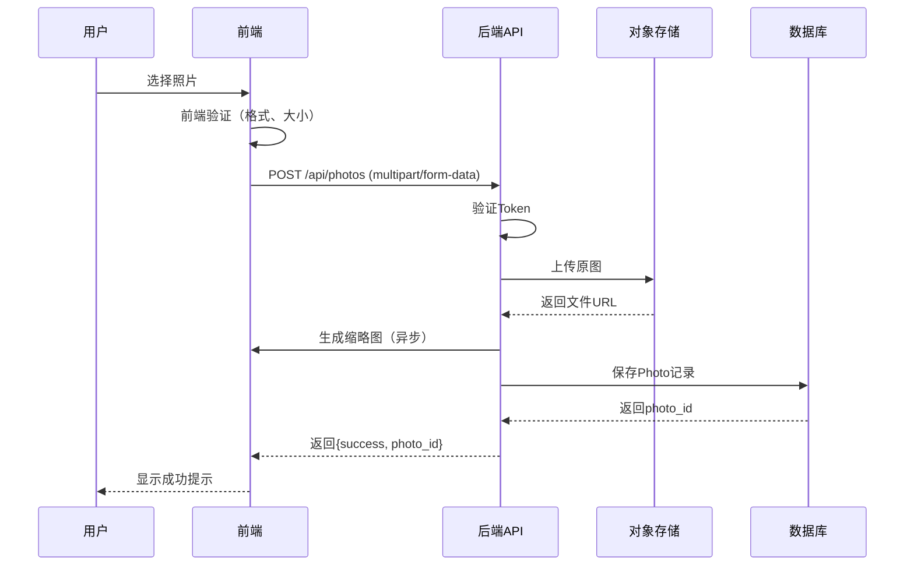
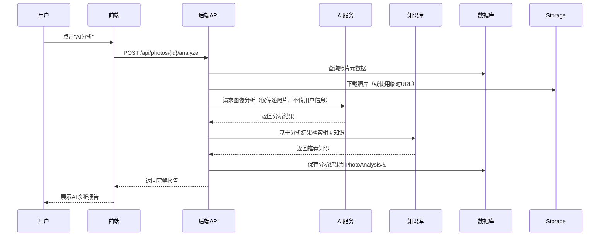

# 照片上传与AI知识库功能设计文档

> **版本**: 1.0
> **日期**: 2026-04-07
> **状态**: 设计阶段
> **目标**: 2个工作日完成完整设计

---

## 📋 文档概述

本文档为 SubSkin 项目新增的两个核心功能提供完整的设计规范：

1. **照片上传功能** - 允许用户上传白癜风患处照片，用于病情记录与追踪
2. **白斑AI知识库功能** - 基于用户照片提供AI诊断建议与个性化知识推荐

---

## 1. 需求分析

### 1.1 照片上传功能需求

#### 1.1.1 用户故事

**作为白癜风患者，我想要：**
- ✅ 上传我的患处照片，记录病情变化
- ✅ 查看我上传的照片历史，对比治疗效果
- ✅ 标记照片的拍摄时间、部位、治疗阶段
- ✅ 删除不需要的照片
- ✅ 分享照片给医生（未来功能）

**作为医生/专家，我想要：**
- ✅ 查看患者的照片历史
- ✅ 添加诊断备注
- ✅ 比较治疗前后效果

#### 1.1.2 功能需求

| 功能模块 | 功能描述 | 优先级 |
|---------|---------|--------|
| **照片上传** | 支持 JPG/JPEG/PNG/WebP 格式，单张最大 10MB | P0 |
| **批量上传** | 一次最多上传 5 张照片 | P1 |
| **照片元数据** | 拍摄时间、身体部位、治疗阶段、备注 | P0 |
| **照片列表** | 按时间倒序展示，支持分页 | P0 |
| **照片详情** | 查看大图、元数据、诊断备注 | P0 |
| **照片删除** | 删除用户自己的照片 | P0 |
| **照片对比** | 时间轴对比、治疗前/后对比 | P1 |
| **医生备注** | 医生可添加专业诊断备注 | P2 |
| **照片分享** | 生成临时分享链接（未来） | P2 |

#### 1.1.3 非功能需求

| 需求类别 | 具体要求 |
|---------|---------|
| **性能** | 照片上传延迟 < 3s，缩略图生成 < 500ms |
| **安全** | 照片仅用户本人可访问，AES-256 加密存储 |
| **隐私** | 照片不用于公共展示，未经用户许可不用于AI训练 |
| **可用性** | 支持拖拽上传、移动端选择照片 |
| **可靠性** | 上传失败自动重试，照片数据 99.9% 可用性 |

---

### 1.2 AI知识库功能需求

#### 1.2.1 用户故事

**作为白癜风患者，我想要：**
- ✅ 上传照片后，获得AI对白斑情况的初步分析
- ✅ 基于我的照片，获得个性化的治疗建议
- ✅ 了解我的病情类型（如：泛发型、节段型、局限型）
- ✅ 知道我的病情处于哪个阶段（稳定期、进展期）
- ✅ 获得相关医学知识推荐（如：治疗方案、用药指导）

#### 1.2.2 功能需求

| 功能模块 | 功能描述 | 优先级 |
|---------|---------|--------|
| **AI诊断分析** | 基于照片识别白斑类型、分布、面积 | P0 |
| **病情阶段判断** | 判断处于稳定期还是进展期 | P0 |
| **个性化建议** | 根据照片特征推荐治疗方案 | P0 |
| **知识推荐** | 推荐相关的医学文献、治疗指南 | P0 |
| **历史对比** | 对比不同时期的照片，显示病情变化 | P1 |
| **报告生成** | 生成结构化的诊断报告（PDF/HTML） | P1 |
| **医生复核** | 标记需要医生专业复核的案例 | P2 |
| **学习反馈** | 用户对AI建议的满意度反馈 | P2 |

#### 1.2.3 非功能需求

| 需求类别 | 具体要求 |
|---------|---------|
| **准确性** | 白斑识别准确率 > 85%（实验室测试） |
| **响应时间** | AI分析完成时间 < 10s |
| **可解释性** | 提供分析依据和置信度，避免"黑盒" |
| **安全性** | 照片数据仅在用户会话中使用，不长期存储于AI服务 |
| **合规性** | 显式声明AI辅助诊断，不替代专业医疗建议 |

---

## 2. 业务流程设计

### 2.1 照片上传流程

### 2.2 AI分析流程

---

## 3. 用户界面需求

### 3.1 照片上传页面

#### 必需元素
- [ ] 拖拽上传区域（虚线框）
- [ ] 文件选择按钮
- [ ] 上传进度条（多文件并行）
- [ ] 格式提示（支持：JPG、PNG、WebP，最大10MB）

#### 照片元数据表单
- [ ] 拍摄时间（默认当天，可编辑）
- [ ] 身体部位（下拉：面部、颈部、手部、躯干、四肢等）
- [ ] 治疗阶段（下拉：未治疗、治疗初期、治疗中、稳定期）
- [ ] 备注（文本框，可选）

#### 照片列表展示
- [ ] 网格布局（响应式：手机2列、平板3列、桌面4列）
- [ ] 每张卡片显示：缩略图、日期、部位标签
- [ ] 悬停显示操作按钮（查看、删除、AI分析）
- [ ] 支持时间筛选（近7天、近30天、全部）

### 3.2 AI分析报告页面

#### 报告头部
- [ ] 照片展示（大图 + 缩略图对比）
- [ ] 分析时间
- [ ] 置信度指示器（如：准确度 87%）

#### 诊断结果
- [ ] 白斑类型（如：局限性白癜风）
- [ ] 分布描述（如：面部右侧颧骨区域）
- [ ] 严重程度（轻度/中度/重度）+ 可视化进度条
- [ ] 病情阶段（稳定期/进展期）

#### 个性化建议
- [ ] 推荐治疗方案（最多3条，可展开详情）
- [ ] 用药提醒（如：避免使用刺激性化妆品）
- [ ] 生活建议（如：注意防晒、减少压力）

#### 知识推荐
- [ ] 相关研究论文（最多3篇，标题+链接）
- [ ] 治疗指南摘要
- [ ] "点击查看更多"（链接到知识库）

#### 底部说明
- [ ] ⚠️ 重要免责声明：本分析由AI辅助提供，不构成专业医疗建议，请咨询执业医师
- [ ] 反馈按钮（有用/无用）+ 反馈输入框

---

## 4. 数据约束与规则

### 4.1 照片数据约束

| 约束项 | 规则 |
|-------|------|
| **文件格式** | 仅限：image/jpeg, image/png, image/webp |
| **文件大小** | 单张 ≤ 10MB |
| **批量上传** | 一次 ≤ 5 张 |
| **缩略图尺寸** | 300×300px，WebP格式，质量85% |
| **存储时长** | 用户删除后7天从对象存储彻底清除 |
| **命名规则** | `{user_id}/{photo_id}.{ext}` |

### 4.2 AI分析约束

| 约束项 | 规则 |
|-------|------|
| **分析频率** | 同一照片仅分析一次，结果缓存 |
| **最大分析时间** | 30秒超时 |
| **置信度阈值** | < 60% 时标记"不确定，建议人工复核" |
| **知识推荐数量** | 最多返回 10 条相关知识 |
| **结果保留** | 分析结果永久保存（支持历史对比） |

---

## 5. 错误处理与边界情况

### 5.1 照片上传错误场景

| 错误场景 | 错误码 | 用户提示 | 处理方式 |
|---------|-------|---------|---------|
| 文件格式不支持 | `INVALID_FORMAT` | "仅支持 JPG、PNG、WebP 格式" | 前端拦截 |
| 文件超过大小限制 | `FILE_TOO_LARGE` | "单张照片不能超过 10MB" | 前端拦截 |
| 用户未登录 | `UNAUTHORIZED` | "请先登录" | 跳转登录页 |
| 存储空间不足 | `STORAGE_ERROR` | "上传失败，请稍后重试" | 自动重试 1 次 |
| 数据库写入失败 | `DB_ERROR` | "照片保存失败" | 回滚已上传文件 |

### 5.2 AI分析错误场景

| 错误场景 | 错误码 | 用户提示 | 处理方式 |
|---------|-------|---------|---------|
| 照片不存在 | `PHOTO_NOT_FOUND` | "照片不存在或已被删除" | 重定向到列表页 |
| AI服务不可用 | `AI_SERVICE_DOWN` | "AI分析服务暂时不可用，请稍后再试" | 记录日志，稍后重试 |
| 分析超时 | `AI_TIMEOUT` | "分析时间过长，已取消" | 返回部分结果或错误 |
| 照片质量过低 | `LOW_QUALITY` | "照片质量过低，无法准确分析" | 提示用户重新拍摄 |
| 已存在分析结果 | `ALREADY_ANALYZED` | - | 直接返回缓存结果 |

---

## 6. 成功指标（验收标准）

### 6.1 照片上传功能

| 指标 | 目标值 | 测量方法 |
|------|--------|---------|
| 上传成功率 | ≥ 99.5% | (成功上传数 / 总上传数) × 100% |
| 平均上传延迟 | < 3s | 从选择文件到完成上传的时间 |
| 缩略图生成速度 | < 500ms | 图像处理时间监控 |
| 照片存储安全性 | 100% | 通过安全审计 |

### 6.2 AI知识库功能

| 指标 | 目标值 | 测量方法 |
|------|--------|---------|
| 白斑识别准确率 | ≥ 85% | 使用测试数据集评估 |
| 分析完成率 | ≥ 98% | (成功分析数 / 总请求数) × 100% |
| 平均分析响应时间 | < 10s | 从请求到返回的时间 |
| 用户满意度 | ≥ 4.0/5.0 | 用户反馈评分 |

---

## 7. 技术债务与未来扩展

### 7.1 已知限制

- ❌ AI诊断模型目前仅支持静态图像，暂不支持实时视频分析
- ❌ AI模型训练数据可能存在偏差（不同人种、肤色）
- ❌ 暂不支持照片自动分类（需要用户手动标记身体部位）

### 7.2 未来增强功能（Phase 2）

- [ ] **3D建模** - 多角度照片生成3D模型，更精确测量白斑面积
- [ ] **医生协作** - 医生可添加诊断意见，形成AI+人工双重确认
- [ ] **治疗追踪** - 定期上传照片，自动生成治疗曲线图
- [ ] **群体对比** - 匿名化数据，了解类似患者的治疗效果
- [ ] **多模态分析** - 结合文字描述（如症状、用药史）提升准确性

---

## 8. 合规与伦理考量

### 8.1 医疗合规

- ✅ 所有AI分析结果必须明确标注"AI辅助诊断，不构成专业医疗建议"
- ✅ 提供免责声明链接，引导用户咨询执业医师
- ✅ 不向用户做出疗效承诺或诊断结论
- ✅ AI模型训练数据来源透明，标注数据集版本

### 8.2 数据隐私

- ✅ 照片数据存储遵循GDPR、中国个人信息保护法
- ✅ 用户可随时申请删除所有照片数据
- ✅ AI分析请求中不包含用户身份信息
- ✅ 照片数据不用于第三方广告或商业推广

### 8.3 AI伦理

- ✅ AI模型公平性测试，避免对特定人种的系统性偏差
- ✅ 提供AI分析的置信度，避免"过度信任"
- ✅ 低置信度时主动提示用户寻求人工帮助
- ✅ 定期审核AI建议的医学准确性（邀请专家复核）

---

## 9. 依赖方与接口

### 9.1 外部服务依赖

| 服务 | 用途 | SLA要求 | 备选方案 |
|------|------|---------|---------|
| **对象存储（OSS/S3）** | 照片原图与缩略图存储 | 99.9%可用性，< 100ms延迟 | MinIO（自托管） |
| **AI图像分析服务** | 白斑识别与病情分析 | 95%可用性，< 10s响应 | 本地部署模型 |
| **知识库搜索服务** | 相关医学知识检索 | 99%可用性，< 200ms | 全文搜索（Meilisearch） |

### 9.2 内部模块依赖

| 模块 | 依赖关系 |
|------|---------|
| **照片上传模块** | 依赖用户认证系统、对象存储服务 |
| **AI分析模块** | 依赖照片模块、知识库服务、AI图像分析服务 |
| **知识库服务** | 依赖现有Document表、向量搜索 |

---

## 10. 附录

### 10.1 术语表

| 术语 | 定义 |
|------|------|
| **白斑** | 皮肤因黑色素细胞缺失或功能障碍产生的色素脱失区域 |
| **局限性白癜风** | 白斑局限于身体某一部位 |
| **泛发型白癜风** | 白斑分布广泛，累及身体50%以上面积 |
| **进展期** | 白斑范围扩大或出现新白斑 |
| **稳定期** | 白斑范围稳定，无新白斑出现 |
| **置信度** | AI模型对分析结果的可信程度（0-100%） |

### 10.2 参考文档

- [SubSkin项目框架设计](./PROJECT_FRAMEWORK.md)
- [后端API文档](./web/backend/README.md)
- [数据库模型文档](./web/backend/database/models.py)

---

**文档状态**: 待评审

**下一步**: 创建技术架构设计文档（数据结构、API接口、安全方案）

**预计完成日期**: 2026-04-08
