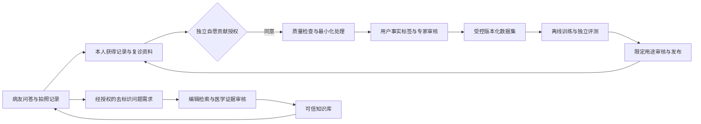

# 项目方案：从病友工具到高质量数据库与研究基础设施

日期：2026-10-06；预算约束：首年50万–100万元；建议基准80万元。本文不构成医疗建议。

## 1. 项目使命、定位与边界

使命：帮助病友更清楚地记录白斑变化、获取可靠知识、准备就医资料；在自愿授权和医学审核下，将这些过程形成可追溯的数据，支持图像测量和医学研究。

患者直接获得的价值必须先成立。用户应因为“能更好地记录、比较、理解、就医”而使用SubSkin，再自主决定是否参与贡献。上传照片、获得分析、公开分享、允许训练和允许具体研究，是不同目的，不能互相默认授权。

数据库建设分为三个相互关联的产品：

| 产品 | 主要内容 | 访问边界 | 核心价值 |
|---|---|---|---|
| 私有图片与纵向记录库 | 原始/标准化照片、部位、时间、白斑与皮肤mask、治疗事件、参考诊断 | 本人；特定授权的医生/研究人员 | 高质量测量与随访 |
| 可信百科与证据库 | 指南、研究、药物、临床试验、事实主张、审核与版本 | 审核后知识可公开；授权源全文按许可 | 可引用、可纠错、可更新的问答 |
| 受控研究数据库 | 研究方案、纳排标准、去标识队列、数据质量、结果和审计 | 协议内、伦理适用性确认后、最小范围 | 可重复分析、机构合作 |

“白癜风大模型”作为远期品牌愿景，技术上先拆成图像质量、分割、比较、辅助鉴别和知识问答等可验证任务。分割模型不必是大参数模型；更大模型和更多图片不自动提高医学可靠性。

## 2. 三条发展路线与建议

| 路线 | 优点 | 主要成本/不足 | 当前适合度 |
|---|---|---|---|
| 患者社区与内容先行 | 获客较快，问答/分享容易复用 | 数据噪声、低客单价、无参考诊断 | 作为入口，不能单独完成模型目标 |
| 医院诊断模型先行 | 临床标签相对可靠、用途清楚 | 医院资源、注册、数据协议和验证成本高 | 预算和合作尚不足，不宜首年全面展开 |
| 患者记录 + 专家审核 + 小规模机构协作 | 兼顾患者价值、纵向数据、商业验证 | 需要持续运营、授权和质量管理 | **推荐；控制场景后逐阶段扩展** |

首期服务成人白癜风病友及皮肤科医生，优先面部和手部标准化记录。未确诊白斑用户可以使用记录与知识服务；其图片保留“未确诊/参考不充分”，不直接进入确诊正例。未成年人、黏膜和隐私部位进入后续专门协议和工作流。

## 3. 将用户使用过程变成数据贡献过程

具体引导方式：

1. 首次记录：先说明照片用途、保存范围和拍摄要求；完成本人记录不要求研究贡献。
2. 记录完成页：展示“用于自己记录”“公开给病友”“参与图像模型改进”“参加指定研究”四个独立动作；研究与训练默认不选。
3. 用户标签只问其知道的事实：部位、左右、拍摄时间来源、是否医生确诊、是否出现新白斑、用过什么治疗；始终允许“不知道”。
4. 医学标签由具备资格的审核人员建立参考标准：管理员可整理资料和画mask，不能因管理员身份自动成为皮肤科医生。
5. 在真实复诊周期提醒下一次记录，保持同部位、距离、角度和光线；不为增加数据量鼓励无意义频繁拍摄。
6. 本人可见贡献进度、用途、谁有权限、撤回入口；公益徽章体现贡献，不把保留个人历史、必要安全提示或基础导出变成贡献奖励。
7. 如支付参与补偿，应按伦理和合理时间补偿设计，不按病情严重程度、照片数量或“更明显白斑”奖励，避免造假和过度上传。

首90天访谈20名病友、3–5名医生；用5名病友进行可用性观察，再用30–50名自愿参与者试运行。访问真实病例与训练数据的工作必须发生在新的授权流程成立之后。

## 4. 白癜风图库：数据规格与治理

### 4.1 三类图片库分别管理

- 私有记录原图库：支持个人服务，私有对象存储，无公共桶、无可猜测永久URL；照片可能包含身份信息，哈希和裁剪都不等于匿名化。
- 受控训练/研究图像库：仅复制或引用有适用授权的版本；来源、权限、审核和数据谱系可查；研究人员只能访问项目范围。
- 公开教育图库：额外取得明确的公开授权并审核内容；不提供患者信息检索或批量下载。优先使用另行授权的教育图、示意图和不可识别的局部图。

面部白斑既是高价值部位又易识别。简单遮脸可能移除病灶，不能作为通用脱敏方案；采用最小必要裁剪、控制访问、专家权限和用途限制。纹身、饰品、背景、文件名、EXIF同样需要处理。首年不主动征集未成年人或生殖器照片。

### 4.2 最小数据字典

| 类别 | 必需字段 | 规则 |
|---|---|---|
| 数据身份 | asset_id、subject_id、profile_id、lesion_track_id、source_type、schema_version | subject_id为随机伪匿名标识；映射在独立权限域 |
| 来源与权利 | 来源对象ID、copyright_basis、consent_grant_id、protocol_id、allowed_purposes、有效期 | 训练和研究均需逐样本解析有效授权 |
| 时间 | capture_time、time_source、uploaded_at、visit_id | 用户填写/EXIF/上传推断分开；未知不伪装为精确拍摄日期 |
| 解剖 | body_site_code、laterality、surface、位置编号 | 优先复用当前部位工具，显示名和编码分离 |
| 成像 | RGB/伍德灯/皮肤镜、设备、拍摄距离/尺度参照、光线、标准化变换 | 不同成像域分别分析；普通手机照片不混作伍德灯 |
| 标签 | label_type、label_value、label_source、annotator_role、confidence、reference_method、observed_at | AI/用户/管理员/医生四类来源分离 |
| 临床参考 | confirmed/uncertain/mimic、诊断方法、专家资格、确认日期 | 医生回顾照片意见与现场确诊分开 |
| 分型 | 非节段型/节段型/混合型/未分类，参考日期与依据 | 患者级标签，不强迫每张局部图分型 |
| 活动与变化 | 临床活动判定、观察窗口；另存扩大/缩小/复色等图像变化 | 活动期与治疗反应是两个维度 |
| 像素 | normal_skin、depigmented_skin、background、occlusion、unreadable、unknown | 复用五类RGB标准，unknown=255；skin和lesion分别标注 |
| 质量 | 清晰、曝光、反光、遮挡、视角、可比性、reject_reason | 不可判读样本保留原因，不生成强结论 |
| 数据谱系 | 原图/衍生图/mask哈希、coordinate_frame、transform_version、dataset_release_id | 所有标注绑定准确的图像版本与坐标 |

避免把“好转期”作为与进展期/稳定期互斥的医学分期：既可能整体仍活动又局部复色。将`activity_status`和`observed_response`分开。保存历史字段，新增语义明确字段，迁移不静默重写旧结果。

### 4.3 标签分层与质量控制

建立T0未核实、T1用户事实、T2受训标注员像素审核、T3专家临床参考、T4争议仲裁等级。等级按任务设置，不把所有标签统一称为“金标准”。

首批100张由两名标注者盲标，医生审核规则和争议；之后普通像素样本随机20%双标，固定测试样本100%双标，诊断分歧全部仲裁。高风险临床标签由医生审阅；记录资质、方法和资料充分性。

数据集放行规则：有效授权100%、图像/mask配对与哈希100%、受试者跨集合泄漏0、标签来源100%、未知值不自动补齐；对双标子集报告Dice/边界一致性，对类别标签报告kappa及混淆矩阵。技术流程门槛不等于模型临床有效。

### 4.4 规模目标与覆盖策略

80万元版首年目标：1000名独立贡献者、4000张去重合格授权图片、1500张有临床参考审核图片、1000张像素mask。后两者可重叠，不应相加称为6500张；250名完成3次同部位合格记录形成纵向子集。

面/手优先约60%，其余颈部/躯干/四肢用于探索，不对稀疏部位发布性能结论。获得临床参考的图片中，至少20%覆盖正常皮肤及相关白斑鉴别病例；不为凑比例由AI伪造标签。节段型等少见类别保留未知和样本数，缺少足够病例则延后该任务。

每月看覆盖矩阵：独立患者 × 部位 × 年龄段 × 肤色 × 设备 × 成像方式 × 参考诊断 × 活动观察窗口。不要求稀疏组合全覆盖，不用一位患者几十张照片夸大样本量。肤色可参考Monk；Fitzpatrick是日晒反应型，不能简单当作从照片确定的肤色真值。

### 4.5 同意、撤回与删除

授权对象包含目的、照片/文本范围、是否包含历史记录、机构、协议版本、保存期、是否允许商业训练、是否允许合作方使用。新增目的或合作方，重新请求适用同意。

撤回后立即阻止新增导出与待运行任务；撤销有效访问链接；更新派生资产、缓存、数据集成员和合作方清单，记录完成或法定保留例外。内部目标为在线权限立即失效、活跃副本7天完成、备份依约定轮转并建立恢复后删除重放；账户删除按照项目30天要求设可验收工单。

已经训练的模型、已发表的匿名汇总和审计骨架分别处理，不承诺技术上立即完全“遗忘”。预先说明边界，跟踪受影响模型版本，必要时重训或移除版本。是否保留及期限需医学伦理与法律审核；不能借“科研”概括豁免。审计事件不存原始图片/聊天/联系人，主体删除后使用合规的不可识别引用保留最小记录。

## 5. 白癜风百科：以证据组织知识

### 5.1 不同来源承担不同作用

| 来源 | 用于什么 | 不能直接用于什么 |
|---|---|---|
| 指南、系统综述、随机试验、药品监管资料 | 支撑审核后的医学事实与适用范围 | 无条件泛化到所有人群/国家 |
| PubMed/Crossref/ClinicalTrials.gov公开记录 | 文献发现、试验状态和证据追踪 | 默认取得全文/图片版权；试验招募状态永久有效 |
| 用户问答 | 经同意去标识后发现“缺什么内容” | 自动把AI回答变成医学证据 |
| 社区经验 | 患者需求、依从性、费用/就医过程、研究假设 | 证明药物疗效、因果结论 |
| 标签与反馈 | 内容导航、纠错线索、编辑优先级 | 用点赞/多数投票裁定医学真伪 |
| 购物清单/购买行为 | 经适用授权分析选购困惑和服务需求 | 推断疗效、诊断或未经验证的个人治疗推荐 |

当前没有真实交易模块，不能称已存在购买习惯数据。首年无需接入电商平台订单或采集额外消费数据。

### 5.2 内容结构与流程

主题覆盖：白斑鉴别与就医、类型/活动与评分、外用与光疗、手术条件、JAK等新药证据、复发与维护、儿童/孕期专门注意、生活质量、日常护理、误区、研究动态。首90天50个高需求主题，首年150–200个。

每个主题包含：通俗解释、适用人群、确定/不确定内容、治疗选择证据、潜在风险、何时就医、参考PMID/DOI或监管记录、审核身份、发布日期与下次复审日、利益冲突。药物审批分别记录国家/地区、适应证、年龄、剂型和日期，避免美国批准误写为中国已可用。

流程：来源发现 → 去重/许可确认 → AI辅助摘要 → 编辑核对事实 → 医学审核 → 发布知识版本 → 重建检索索引 → 回归问答 → 定期复审/纠错。AI生成社区文章与医学证据库应有不同发布门槛。

短期沿用关系数据库中的Document/EncyclopediaArticle/Revision，加结构化证据主张与引用映射；检索沿用现有向量+关键词混合方案。知识图谱先用关系表表达药物—靶点—试验—结局，不急于引入图数据库。

### 5.3 问答和百科产品改造

建议恢复轻量“知识”浏览能力，首期放在发现中的辅助入口，或问答回答后的“查看证据卡”。并非直接恢复旧百科界面；复用文章/修订基础，增加审阅、来源和可维护页面。

问答引用到具体证据版本与段落；来源不足时表达不确定和就医建议；按需询问年龄段、部位、确诊情况，不默认读取病友私有档案。用户可提交“来源打不开/结论矛盾/不适用我的情况”，反馈进入编辑任务队列。

建立200题固定测试集：基础知识、治疗风险、儿童/孕期、错误前提、无证据偏方、近期药物、隐私诱导、就医导航；普通病例使用虚构资料。至少抽查50题专家评审，记录引用支持率、适用范围错误、危险建议、拒答与更新时效。

## 6. 白癜风AI：可验证任务序列

### 6.1 产品能力分层

| 层次 | 输入与输出 | 首年决策 |
|---|---|---|
| 拍摄质量与部位 | 单张图→清晰度、光照、部位、重拍建议 | 优先开发，收益立即可见 |
| 白斑候选分割 | RGB图→皮肤与疑似脱色mask、不确定区域 | 首年核心研究任务，用户核对保留 |
| 同部位纵向测量 | 标准化图对→配准质量、共同视野、变化指标 | 与记录服务结合，无法比较时拒绝量化 |
| 辅助鉴别 | 多视图+病史+必要检查→疑似白癜风/鉴别建议/不确定 | 首年离线探索，未经验证不作自动确诊 |
| 类型/活动评估 | 全身分布、病程、历史图、临床资料→辅助判断 | 第二阶段；局部单张图证据不足 |
| 治疗结局预测 | 足够纵向临床队列→风险与结局预测 | 未来独立研究；不生成处方或替代医生 |

“边缘范围”是分割任务；“是否白癜风”是鉴别诊断任务；“节段型”需要患者整体分布和病史；“活动期”需要时间窗口、临床观察等参考。各任务分别收集数据、验证和审批。

### 6.2 精益技术选择

先评估现有RGB U-Net基线、传统CV和带预训练编码器的轻量分割模型；SAM/MedSAM可辅助标注，但需在普通手机白斑照片上实测，不能因为“医学模型”名称就默认适合。GloW-VSNet可开展许可明确后的离线复现，用于降低涂鸦标注成本。

分类/检索可比较通用图像编码器与MedSigLIP冻结特征+小头，控制算力。Derm Foundation已被官方标legacy，可作为已有基线；不作为新的长期依赖。权重条款与代码许可证分开审查。首年不从零训练通用基础模型，也不把私有照片默认发送外部云模型。

知识问答先改良RAG和评测。只有固定测试证明检索/提示优化仍不足、并已有合规高质量文本对时，才试小规模微调；用户原始私聊和模型自生成回答不直接作为真值。

### 6.3 面积、VASI与比较定义

定义`visible_lesion_fraction = 疑似脱色像素 / 当前照片可判读皮肤像素`；同时显示视野和人工核对状态。没有参照尺度时不输出cm²。局部比例不能换算为全身BSA，也不能直接称为T-VASI。

临床VASI结合各身体区域受累面积与脱色程度，通常可表示为各区域“受累手单位 × 残余脱色程度”的加总（一个手单位约为体表面积1%，按采用协议校准），不是局部照片像素百分比。须明确采用的区域、脱色级别和评分方法；F-VASI又有自身范围和人群条件，不能用局部图片值直接替代。当前`vasi_score`保留为历史字段，通过`measurement_kind`和`method_version`解释，避免改名后历史结果失去含义。

图对指标只在共同可判读皮肤视野、可靠配准和可比成像条件下计算；视觉滑块可以浏览，不代表能定量。亮度、日晒、遮盖产品、相机算法、伍德灯/普通光差异都会影响外观。拒绝量化不等于病情稳定。

### 6.4 验证与迭代

受试者级固定train/validation/test，例如70/15/15，所有同人所有部位和时间照片保持同集合；另设独立机构或时间外部测试。已知同一贡献者跨账户重复也需受控排查；近重复图人工复核，不能仅靠不同文件哈希。

分割报告正例Dice/IoU、边界F1、漏检/误检、面积占比百分点误差、失败率；阴性图另报误检面积。分组按部位、肤色、设备、质量、大小；按患者bootstrap置信区间。分类另报敏感度、特异度、校准与拒识，不能用分割Dice证明诊断准确率。

首年探索性门槛：正例Dice点估计≥0.85且患者bootstrap 95%下界≥0.80，面积占比MAE≤5个百分点且95%上界≤7个百分点；阴性误检与难例分组另列；这些是暂定研发门槛，不是注册或医学充分条件。共识医生应在看模型结果前冻结实际使用门槛，困难部位样本不足则限制适用范围。

参考标准本身有噪声：同一照片由不同人或同一人不同次勾画，面积占比也会不同；项目内已观察到同图重复手绘存在百分点级差异，但尚无系统量化。因此上述门槛是待校准的草案，须先用SS-08的盲双标和重复勾画测得评分者间/评分者内一致性，模型误差门槛不应严于人工参考本身的可重复性，再冻结。

训练完成仅生成候选。质量/授权审查 → 离线评测 → 影子运行 → 医学与产品审核 → 明确版本发布 → 监测与回退。新模型用于新增分析，历史报告不静默改写。连续学习以审核的批次迭代完成，AI共识或伪标签不能自动升级为医生真值。

## 7. 治疗与研究协作

首年贡献的是可用的研究数据与工作流：有授权的长期随访、治疗暴露整理、质量控制和患者结局。数据库与图像模型可以促进研究，不直接等于药物研发能力。

第一项建议研究：“标准化手机照片与人工参考的白斑范围一致性，以及其对复诊资料准备效率的影响”。由合作医院牵头确定伦理适用性、方案、参考标准、样本量、分析计划；SubSkin提供采集和质量工具，不指导改变治疗。

第二项可在数据成熟后研究治疗结局：记录药物名/剂型、开始结束、剂量（按医嘱事实）、光疗类型/次数/剂量、合并治疗、依从性、风险事件、病程与部位、既往疗效，设真实随访窗口。费用与满意度有价值，但不同于疗效。

观察性社区数据容易受自选、失访、合并治疗、自然波动影响。预注册主要终点、记录缺失原因、比较基线差异并做敏感性分析；倾向评分等方法仍不能消除所有混杂。不要发布简单“某药购买者复色更多”的疗效榜。

未来机构合作包括：患者登记与随访、临床试验信息更新/患者自主联系、数字结局工具验证、药企/CRO数据质量服务。招募必须来自真实机构和有效注册试验，不保证入组，不自动把用户联系人或图片转交赞助商。

进一步靶点/药物研究可关联VIRdb思路、公开组学与文献、ClinicalTrials.gov等；基因样本、生物样本、人类遗传资源、多组学和跨境协作另立项目，不纳入首年软件预算。湿实验、药理毒理、生产和临床开发需相应伙伴和资金。

## 8. 技术架构与治理

保留Vue PWA与FastAPI服务，新增边界清楚的数据治理模块。私有对象存储存图片/mask，关系数据库存结构与权限，队列处理质量/去标识/导出，模型在独立作业环境训练，问答检索只索引审核知识。

现有SQLite可支撑小规模验证；先做权限、备份恢复和任务幂等。多机构、并发标注或写锁压力达到预设阈值后规划PostgreSQL迁移，维护窗口和回退演练，不能把数据库升级当作获得临床数据能力的前置噱头。

特别先建立独立研究/训练环境及隔离测试后端：当前共享后端会让模型激活、接口和DB变更同时影响正式用户。用明确授权的研究副本/模拟数据验证，禁止把正式用户库直接复制到测试环境。模型发布权限不能由标注员单独拥有。

首年最少管理职责：产品/技术负责人、临床PI、数据保护负责人、内容医学审阅者、标注负责人；精益人员可兼任，但标注、临床仲裁、数据导出批准和模型发布需权责明确。医疗健康数据单独同意、伦理审查适用性、跨境数据与第三方模型合同、诊断软件监管定性必须在对应阶段形成书面结论。

## 9. 用什么证明项目成立

北极星指标：“在真实记录/复诊周期完成有用的连续记录的人数”，以及“有有效授权和适用参考标准的独立纵向受试者数”。

配套指标：合格图片率、标注一致性、缺失率、三次记录完成率、复诊资料实际使用、医生准备时间、单位有效标注成本、问答证据支持率、模型固定测试性能、数据访问/撤回完成率、付费复购和机构付款。

若90天未找到患者实际使用价值，先改善记录流程；若180天专家标签成本过高，缩小部位和任务范围；若模型外部验证失败，保留人工核对并分析失败；若机构无预算，不用虚构采购意向支撑财务预测。
