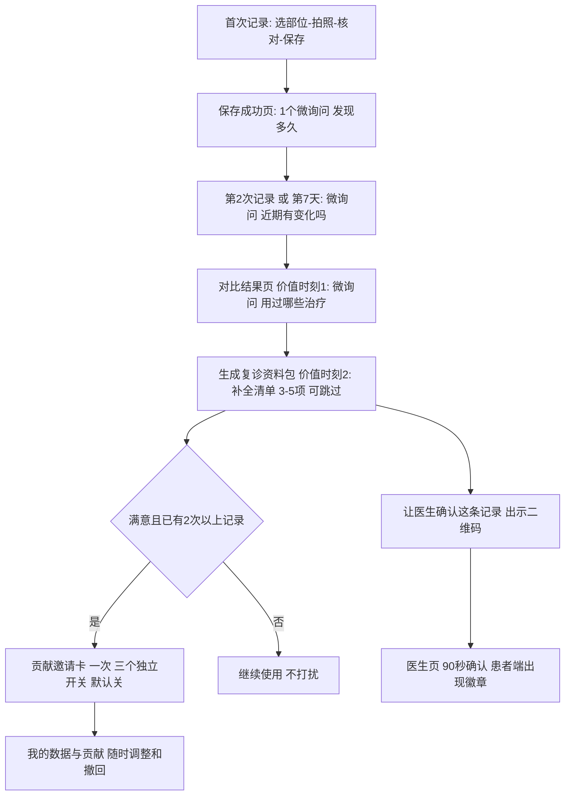

# 用户动线与医疗合作方工具设计

日期：2026-10-07。本文把[06](06-image-database-label-plan.md)中“需要用户打标”和“需要医生打标”的部分，设计成可实施的产品动线与工具。本文为设计稿，**尚未实现**；涉及后端表和接口的部分需先经你确认（见[07](07-execution-by-role.md)）。本文不构成医疗建议。

## 1. 设计原则：不吓跑用户

1. **价值先行**：用户先得到对自己有用的东西（记录、对比、复诊资料），再被问问题；每个问题都说明“填了对你有什么用”。
2. **一次一个问题，且紧跟刚做完的动作**：不做一屏长表单；拍摄主链路不增加任何必填项。
3. **每题都可以“不知道”或“稍后”**；跳过不扣分、不反复弹。
4. **频率有上限**：每次打开最多1个微询问；每周最多3个；同一问题被跳过后14天内不再出现。
5. **贡献邀请只在价值时刻出现一次**，拒绝后至少30天冷却；三个用途（改进识别/参与研究/公开分享）分开、默认全关，用大白话但不隐瞒：写明谁能看到、能不能撤回。
6. **不奖励病情更重或上传更多**；不把基础功能（本人历史、基础导出、安全提示）设为贡献奖励。
7. **医生确认是对患者的奖励，不是负担**：让“医生已确认”徽章和复诊资料成为用户愿意来的理由。

## 2. 用户动线总览

## 3. 各环节具体设计

### 3.1 拍摄主链路：只减不增

在现有“选部位 → 拍照/相册 → 核对范围 → 保存”基础上，只做以下减负式调整，**不新增必填**：

| 调整 | 现状 | 改为 | 备注 |
|---|---|---|---|
| 拍摄日期 | 必填，无“不详” | 增加“不确定”选项，保存为未知，不伪造日期 | 未知日期不进入时间趋势 |
| 部位 | 16个点选，无“其他” | 增加“其他/不确定” | 低频使用 |
| 补充信息 | 无 | 核对页底部折叠区“补充信息（可选）”：今天有遮盖/刚晒伤、拍摄类型（整体/中景/近景） | 默认收起，默认值=无 |
| 质量提示 | 不合格禁止提交 | 保持；文案改为“重拍一下，对比更准”，并给出具体原因 | 不更严，只更友好 |

### 3.2 微询问清单（渐进式画像）

题目用患者能直接回答的话；选项均为单击，均含“不知道”；存为带版本的“自报事实”（T1），不是临床标签。

| ID | 触发时机 | 题目（示例文案） | 选项 | 用户得到什么 | 对应标签（06） |
|---|---|---|---|---|---|
| Q1 | 首次记录保存成功页 | 这处白斑大概出现多久了？ | 不到3个月 / 3–12个月 / 1–3年 / 3年以上 / 不确定 | 时间线上显示“病程”，复诊时不用再回忆 | 起病/病程 |
| Q2 | 第2次记录，或首次记录后第7天 | 最近一段时间，这里有变化吗？ | 扩大 / 出现新的 / 没变化 / 缩小 / 颜色变淡了（复色）/ 不确定 | 对比页同时显示“你的感受”和“照片对比”，两者不一致时给出提示 | 近期变化（VIDA式自述，标回忆偏倚） |
| Q3 | 对比结果页（价值时刻1） | 这段时间用过哪些治疗？ | 外用药 / 光疗 / 口服药 / 手术或移植 / 没有治疗 / 不知道（可多选，点进去可补起止时间） | 复诊资料包自动生成治疗时间线 | 治疗史 |
| Q4 | 生成复诊资料包前（价值时刻2） | 医生确诊过吗？ | 是 / 否，还没看过 / 不确定 | 资料包第一页写清“自述已确诊/待确诊” | 自报确诊 |
| Q5 | 同上，仅当Q4=是 | 医生有说是哪一类吗？ | 节段型 / 非节段型 / 混合型 / 没说过或不记得 | 资料包里带上，医生复核更快 | 医生曾告知类型 |
| Q6 | 资料包补全清单 | 白斑出现前，这个位置受过外伤或摩擦吗？ | 有 / 没有 / 不知道 | 资料包“医生常问的问题”自动填好 | 同形反应史 |
| Q7 | 资料包补全清单（敏感，纯可选） | 家人或你本人有甲状腺等免疫相关的疾病吗？ | 有 / 没有 / 不知道 / 不想回答 | 同上 | 家族/自身免疫史 |

首批只上线Q1–Q5；Q6–Q7放在资料包补全清单里，以“医生常问的问题”为框架，而不是“研究问卷”。

**交互形态**：保存成功页或结果页底部的一张小卡片，一行题目 + 3–6个按钮；点按钮即保存，卡片收起并给一句反馈（“已加到你的时间线”）；右上角“稍后”。**不弹窗、不遮挡主要内容。**

### 3.3 复诊资料包补全清单（价值时刻2）

用户点“生成复诊资料包”时，显示一张进度清单（例如“已完成 3/5”），每项一行，可逐项点开或直接跳过；未填的项在资料包里显示“未提供”。清单只列：确诊状态、医生说的类型、治疗史、外伤/摩擦史、其他想问医生的问题。**不阻断生成。**

### 3.4 贡献邀请（只出现一次，且有条件）

触发条件（全部满足）：已有≥2次同部位合格记录；用户刚看过对比结果或生成过资料包；从未被邀请过，或距上次拒绝≥30天。

一屏一件事，三个**独立**开关，默认全关：

| 开关 | 大白话说明（草案，须法务审阅，见10） | 范围选择 |
|---|---|---|
| 帮助改进白斑识别 | 经过处理后的照片和你核对的范围，会由受训人员和医生复核，用于训练和评测识别功能。不会公开展示，不出售联系方式。 | 仅新记录 / 包含历史记录 |
| 参与白癜风研究 | 仅用于你主动报名的具体研究项目，每个项目会单独征求你的同意。 | 逐项目 |
| 公开给病友 | 照片会出现在社区，所有人可见。 | 逐条 |

按钮：“确定”“先不用”。选择后显示一句话：“可以随时在 我的 → 我的数据与贡献 里查看用途和撤回。”**拒绝也能继续用全部功能。**

### 3.5 我的数据与贡献（`/profile/data`）

每条授权一行：用途、范围、开始日期、状态（审核中/已入库/某研究使用中/已撤回）、“撤回”按钮；撤回后显示处理进度（工单），并说明已发表的匿名汇总结果和已训练模型的处理边界。**不做排行榜，不显示他人数据。**

### 3.6 随访提醒

用户自选提醒周期（4/8/12周），提醒文案强调“同一位置、同样距离和光线”，并自动叠加上次轮廓；不鼓励无意义的频繁拍摄。

### 3.7 用户端需要的后端能力（均为增量，需确认后实施）

| 能力 | 说明 | 关联工作项 |
|---|---|---|
| 自报事实存储 | 键值式、带题目版本和“未知”值；与档案`profile_id`绑定 | SS-32、SS-33 |
| 分用途授权 | Grant/Scope/Event，追加式；`can_use`统一校验 | SS-04 |
| 微询问调度 | 按触发条件与频率上限返回“当前该问哪一题” | SS-32 |
| 医生确认令牌 | 短时有效、范围受限、可撤销 | SS-42 |

## 4. 外部医疗合作：谁做什么

### 4.1 合作分两条路径，先轻后重

| 路径 | 内容 | 适用 | 需要的前提 |
|---|---|---|---|
| **A. 个人医生参与（先做）** | 3–5名皮肤科医生以顾问身份：审定标签协议、远程盲审用户**已授权**的照片、仲裁分歧 | 冷启动，不需要进入医院系统 | 顾问/劳务协议；患者授权“让医生查看”；医生所在单位对外兼职的规定（须医生自行确认，见10） |
| **B. 医院/科室正式合作（后做）** | 门诊采集成套标准照片 + 现场临床参考 + 随访 + mimic负例；可能涉及研究 | 要“带金标准”的规模化数据 | 合作协议、伦理意见、数据协议、患者现场知情同意 |

### 4.2 合作方任务清单

| 对象 | 要做的事 | 单次耗时目标 | 产出 |
|---|---|---|---|
| **PI/带头医生** | 审定标签协议v1；确定参考标准和纳排；担任仲裁；出具伦理材料或确认适用路径 | 协议审定约2–3小时一次；仲裁每例约1分钟 | 签字版协议、伦理意见、仲裁记录 |
| **参与医生** | 门诊**现场**临床参考（扫患者二维码，点选表单）；或远程盲审照片 | 现场≤90秒/患者；远程≤30秒/张 | 带依据的诊断/分型/稳定性/活动度标签 |
| **研究助理/护士** | 门诊标准化拍摄（常规10张）；患者知情同意现场操作 | 约5分钟/患者 | 成套标准照片 + 来源=门诊 |
| **医院信息科/科室管理** | 评估数据出院方式；如需回顾性数据则协助去标识 | — | 书面意见；去标识后的数据包（如适用） |
| **伦理委员会/医院法务** | 判断研究是否需要审查、是否可豁免知情同意（回顾性） | — | 书面意见 |

**医生时间预算（假设，待首100张实测）**：80万基准目标1500张带医生参考的图 → 双医生远程盲审约3000次判读 × 30秒 ≈ 25小时；分歧仲裁按15%估算约225例 × 1分钟 ≈ 4小时；现场确认250名纵向患者 × 90秒 ≈ 6小时；合计约35–40小时。该量级可由少数医生分担，预算压力不在医生时间，而在**招到并持续合作**。

### 4.3 为医生设计的工具（降低操作成本）

原则：**不要求医生下载App或注册完整账号**；手机、平板、电脑浏览器打开即可；全程点选，不手打字；不预填任何AI或用户结论。

**工具1：扫码现场确认（门诊一页纸）**

1. 患者在SubSkin点“让医生确认这条记录”，出示二维码（5分钟有效，只授予“查看该记录范围 + 写入医生确认”的权限，可撤销）。
2. 医生用手机扫码，打开H5页：上半屏是患者的时间线和照片（只读），下半屏是表单。
3. 表单（全点选，默认空）：诊断确认（白癜风/某种相似疾病/无法判断）+ 信心（高/中/低）+ 依据（现场查体/Wood灯/皮肤镜/活检/仅照片）；分型（节段/非节段/混合/未分类/暂不能判断）；稳定性（稳定/不稳定/暂不能判断）；活动度；Wood灯所见；备注（可选）。
4. 提交后：患者端该记录出现“医生已确认”徽章；系统存为T3标签，记录医生资质、依据和时间。

目标：≤90秒/患者。对患者的价值：复诊资料带医生确认，信任度高；对数据库的价值：现场临床参考，是“带金标准占比”的主要来源。

**工具2：远程盲审队列（照片回顾）**

- 卡片式：一张大图（可缩放）+ 4个大按钮（白癜风 / 疑似 / 其他→下拉选相似疾病 / 无法判断）+ 信心三档；PC支持键盘快捷键。
- 一批20张，进度条；“图像不可判读”和“需要更多信息”是合法选项，不强迫给结论。
- 不显示AI结果、用户自报诊断，也不显示其他医生的意见（盲审）。
- 每批结束显示本批用时和与其他医生的一致率（匿名汇总），用于校准。

**工具3：仲裁页**：只列出两位医生不一致的样本，并排显示两人意见（匿名），仲裁医生选一个或给出第三种结论并写依据。

**工具4：门诊采集模式（研究助理用）**：扫患者码 → 按“常规10张”清单逐部位拍摄（每个部位有示意图和已完成标记）→ 自动质量检查，不合格当场重拍 → 上传到患者记录，来源标记为“门诊/设备型号”。患者在自己手机上单独确认授权。

**工具5：回顾性数据导入与去标识（仅在医院有历史标准照片且伦理允许时）**：医院信息科上传文件夹，工具清理EXIF/GPS、重命名为随机ID、校验质量并生成清单；映射表留在医院，不上传。

**工具6：贡献看板（给医生）**：本人已完成的判读量、一致性、用时；可导出贡献证明。是否署名、报酬方式、成果归属写入合作协议（见10）。

### 4.4 医生账号与权限

- 复用现有`is_doctor`和`DoctorVerification`（执业证号、职称、审核人），**新增“可做临床参考”资质**，由数据负责人审核后授予；社区里的“认证医生”标识不自动具备打标权限。
- 医生令牌/账号只能看到**自己被授权的患者范围**或**已授权入库、已匿名化的盲审任务**；全部访问写审计。
- 医生页不显示患者姓名、联系方式；照片仍可能可识别，因此须协议约束和访问审计。

## 5. 管理后台需要的配套（与06第7.2节对应）

| 页面/能力 | 说明 |
|---|---|
| 任务派发 | 把授权样本分配给标注员或医生；盲标/双标；跟踪进度 |
| 医生资质管理 | 授予/撤销“可做临床参考”；记录协议版本与培训 |
| 一致性看板 | 像素Dice、类别kappa、医生间一致率；异常自动提示复核 |
| 仲裁队列 | 分歧自动入队；仲裁结果入标签版本 |
| 贡献与用途查询 | 查某用户的授权历史、撤回工单；导出审计 |
