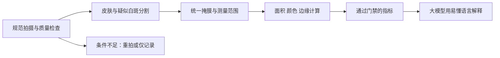

# SubSkin 测评功能与设计审查

日期：2026-09-10。状态：审查与建议方案，尚未实施。

用户已确认：初次发现白斑的用户，与已确诊、持续记录变化的用户同等重要。

**结论：优先修正测量口径和失败状态，再统一照片对比链路；页面按两类用户目标分流，共用拍照和记录。只换大模型、加提示词，无法解决目前的主要问题。**

本文不构成医疗建议。涉及初筛、分期、颜色判读和就医引导的产品文案及验收标准需皮肤科医生复核。

## 1. 审查范围与证据边界

已检查：AssessmentPage、拍照/轮廓/结果组件、测评与历史 composables、VASI API/服务/公式、图像预处理、SAM/U-Net 接口、患者画布与共识、照片对齐、双图比较及部分训练/评估入口。查阅了部署日志的最近批次与研究文献。

已执行：只加载无数据库依赖的评分函数，用合成数字核对评分与部位映射，输出见 `synthetic_checks.json`。另从源码隔离提取纯结果合并函数，以无VLM/CV证据输入验证返回状态，见 `no_evidence_check.json`。

未执行：患者照片访问、真实病历抽样、调用付费视觉模型、数据库写入、后端重启、构建或部署。浏览器已加载测评页标题，但连续两次页面读取超时，未取得可用截图，故视觉结论来自模板、样式与交互代码，不能视为真机测试。375/768/1024/1440px、暗色模式和完整登录流程仍需后续验收。远程挂载的 git status 耗时较长，最终完成；仓库有大量已有修改，本次未修改或清理它们。

## 2. 当前已有能力：应复用，不能重复建设

- 单张照片：部位选择 → 质量检查 → 灰世界白平衡/CLAHE/锐化 → VLM 给出候选 → SAM 分割 → 面积与评分 → 用户核对/自动确认。
- 分割系统有 U-Net 活跃权重加载入口、SAM 引导/自动/分块处理及远程 nnU-Net 回退；本次未确认生产实际加载了哪些模型及其独立验证性能。
- 已有皮肤与白斑两层掩膜、手动修正、患者级画布、参考正常皮肤区域的颜色校正。
- 对比已有两套相关能力：`photo_align.py` 的配准/热力图与滑块参数，以及 `spot_compare.py` 的 VLM/CV/患者画布数值比较。它们对失败情况的处理并不完全一致。
- 有模型评估/反馈相关代码，但旧 `get_feedback_collector`、`get_evaluator`、`get_param_optimizer` 工厂直接返回 None。较新的患者共识链路存在，不能据此宣称所有训练都停用，也不能因文件存在就宣称系统持续变准。

## 3. 准确性：已定位的主要问题

下列路径相对于仓库根目录，行号以本次审查版本为准。P1 表示应在下一次上线前优先处理；影响规模尚无真实样本统计。

| 优先级 | 发现与代码证据 | 用户影响及处理方向 |
|---|---|---|
| P1 | `web/backend/services/vasi.py:830`：小部位候选 bbox 超过全图 25%、其他部位超过 45%即过滤 | 大块白斑/近摄可能被直接丢弃。不能只把阈值再调大；应以皮肤范围、遮挡、边界证据判真伪，允许占据大部分取景的病灶 |
| P1 | `web/backend/services/vasi_formula.py:73`、`:102`：可见皮肤占比套入部位 BSA，并乘 10；脱色 1–3级直接除3或默认0.67 | 照片占比不是全解剖区域受累比例，这套分数也不能直接等同临床 VASI。普通近照以局部影像指标呈现，临床 VASI 需独立完整采集方案 |
| P1 | `vasi_formula.py:66`：中文“左脚/右脚”不在映射中，默认使用9% BSA；`vasi.py:1092` 又允许 VLM 部位覆盖提交部位 | 同一部位不同名称得到不同分数，选定部位还可能漂移。统一内部枚举；未知部位拒绝计算。图像与选定部位不一致时让用户确认 |
| P1 | `vasi.py:960`：少于两块时追加分块轮廓，`existing_areas`没有实际用于去重，直接累加面积；原有图层未同步重建 | 有重复计算、数值与可见轮廓不一致风险。全部轮廓映射到原图，以二值掩膜并集计算；图层、数值、编辑器和报告引用同一结果 |
| P1 | `spot_compare.py:810`：取得两个有效区后，`:814`仍分别求整张掩膜面积，未先取共同有效可见范围 | 一张少拍到的区域可能被当成白斑减少。已有画布仍需共同 ROI、病灶完整性和配准误差门禁 |
| P1 | `spot_compare.py:1007`：VLM面积变化估计与CV按45%/55%混合；光照不一致时CV权重为0，还可保留VLM百分比 | 同一结果混入语言模型估计。定量值只由通过质量验证的测量模块产生；VLM解释结果，不改写数值 |
| P1 | `vasi.py:1146`：SAM-only回退默认“稳定”；`spot_compare.py:1066`：票数平局包括无证据时变“稳定” | 纯函数复核：VLM和CV均为空时实际返回“稳定”，信心度0.26、low_confidence=true。没有证据不等于病情稳定。使用未知/无法比较状态，与稳定明确分开，且阻止后续文字报告重新给出肯定趋势 |
| P1 | `spot_compare.py:1217`：64位感知哈希距离≤4就直接判0变化、信心度0.95 | 近似照片可能包含细小真实变化。感知哈希只用于重复候选提示，不能证明无病情变化；同一原图也应提示“重复照片，不能用于随访结论” |
| P1 | `vasi.py:1188`：差照片返回0分/0面积；主创建路径仍可建draft；API与当前提交composable未将此状态转为不可评分 | 源码路径存在把质量失败显示为0分、经跳过核对后确认的风险。以独立质检失败响应结束流程，不保存为有效测量 |
| P1 | `useVasiAssess.ts:116` 自动确认时仅关闭编辑器；`AssessmentPage.vue:180`直接进入结果页，但本路径未给lastAssessment赋值 | 新用户可能看到“暂无评估结果”；已有状态可能残留。自动确认与人工确认必须汇入同一成功处理函数 |
| P1 | `AssessmentPage.vue:196`等调用`history.loadHistory(true)`未带部位；`useVasiHistory.ts:179`将当前历史页串成趋势 | 同一结果页可能画出不同身体部位的分数走势。趋势必须按同一观察位置/拍摄视角筛选，不能用全量历史分页代替 |

### 评分函数的合成复核

| 输入 | 当前结果 | 含义 |
|---|---:|---|
| left_hand、100%受累、完全脱色 | 10.0 | 该函数自己定义的1个手单位，按标准手单位×脱色比例应为1；当前额外×10 |
| left_hand、照片中占比10% → 20%，其他不变 | 1.0 → 2.0 | 展示取景分母变化怎样放大成分数变化；不是对真实患者照片的测量 |
| left_foot、100%、完全脱色 | 17.5 | 使用1.75%部位权重 |
| 左脚、同样条件 | 90.0 | 因映射缺失使用9%默认权重 |

**不能简单把历史分数全部除以10。** 除了比例尺问题，还有部位权重、取景范围、脱色估计及分割版本不同；原始记录应保留版本与来源，重算结果单独标明。

临床 VASI 源自手单位受累面积与残余脱色程度的组合，不能由任意局部近照自动推导出总身评分。原始研究见 [PMID 15210457](https://pubmed.ncbi.nlm.nih.gov/15210457/)，标准训练后的评分者可靠性研究见 [PMID 39040843](https://pubmed.ncbi.nlm.nih.gov/39040843/)。

### 颜色、范围和边缘的额外局限

- `vasi_preprocess.py:211`在主链路中自动白平衡、增强对比度并锐化，再给VLM；这些步骤会改变颜色与边缘表现。分割增强图可以保留，但颜色测量应走原图/有记录的校准图，不能把增强效果当复色。
- `api/vasi.py:75`的参考卡标志在评分完成后才落库；没有构成已知尺寸检测→像素/毫米→面积的完整测量过程。标记“有参考物”不代表具有cm²测量能力。
- 当前结果页用大号VASI、轻中重标签、病情阶段/分型作为中心；`useVasiAssessment.ts:13`还有由分数推导治疗与阶段的固定说明。未确诊用户尤其容易把影像估计读成诊断。
- 当前模型信心度及共识不是临床正确率。两模型可能共享训练误差，用户修正/LLM裁决也不能自动视为医生真值。

## 4. 推荐的准确性方案

### 4.1 分工：模型找范围，算法做测量，医生验证医疗含义



保留当前SAM作为辅助分割和点选修正工具。先以现有分割方案建立冻结基线，再比较专用U-Net/nnU-Net或其他分割模型；有优势才替换。模型权重是否公开、许可、推理成本与部署硬件另行验证。面部专项研究证明专用分割有潜力，但研究样本及标准照片的成绩不能直接外推到用户任意手机图像：[PMID 37586608](https://pubmed.ncbi.nlm.nih.gov/37586608/)。

### 4.2 每个指标都要说明测到了什么

| 用户想知道 | 建议方法 | 不足条件下的结果 |
|---|---|---|
| 大小 | 单一病灶mask像素数；同平面已知尺寸标记+透视校正可估二维投影cm² | 没标尺不报cm²；只能报告明示分母的局部占比，或通过配准的相对变化 |
| 范围 | 皮肤ROI内分割；大块病灶允许占满视野；多块保留身份与合并/分裂关系 | 病灶接触画面边缘时提示“未拍全”，只记录已见范围 |
| 颜色 | 原图留存；固定曝光/白平衡，必要时标准色卡；在稳定参考皮肤与病灶ROI中测Lab差异、复色像素/色素岛 | 光线不一致单独停用颜色指标；不把RGB亮度或主观0–100分称为黑色素含量 |
| 边缘 | 分割轮廓、边缘过渡带与清晰度；同一尺度下统计边缘位移及不确定区 | 模糊/遮挡区标不确定，不生成精细位移结论 |
| 时间变化 | 同一观察位置/视角、确认拍摄日期、固定ROI、几何对齐、共同有效区、同算法版本比较 | 不同部位/视角/拍摄覆盖差异太大时“无法可靠比较”；可保留并排照片供观察 |

参考卡需在皮肤附近、与目标近似同平面，且不能遮挡病灶。曲面/环绕肢体、明显姿态变化时二维面积不是皮肤真实表面积；一期不宣称支持全身曲面测量。大病灶优先拍完整远景，再按需增加局部近照，不将重叠照片面积直接相加。

照片标准化是关键条件，国际共识明确涉及照明、姿势、背景、尺度和拍摄系列；本方案把这些原则简化为适合家庭拍摄的引导：[PMID 31678332](https://pubmed.ncbi.nlm.nih.gov/31678332/)。

### 4.3 时间对比的实现约束

1. 建立“观察位置”：如左手手背A区、左小腿外侧。身体部位相同还不够；记录视角、基线照片和可重复定位信息。
2. 复用现有画布/关键点/ORB能力；优先依赖稳定解剖标志及未变化皮肤，不用变化中的白斑边缘强行拉齐。非刚性形变不得把真实面积变化抹掉。
3. 先判断几何、完整覆盖和曝光是否合格，各指标分别判可用。共同ROI之外只能说未观察到，不能说消失。
4. 面积变化=(近期面积−基线面积)/基线面积；两者必须处于一致坐标与测量范围。基线为0时报告新出现的可见区域，不计算百分比。
5. 将边界附近的测量误差带排除或单列，变化未超过重复拍摄误差时显示“未见明确变化”，而不是医学稳定期。
6. 默认与同位置最近一次合格记录比较，支持切换基线。新旧模型混用时用同版本重算两图或明确不可直接比较；缓存键包含图像、mask修订、ROI、配准、校准与模型版本。
7. 双图数值、滑块、热力图和报告必须读取同一个比较结果，避免用户看到互相矛盾的结论。

### 4.4 不承诺一个笼统的“识别准确率”

先建立经单独授权的评估集：覆盖大小白斑、低对比度、不同肤色/部位/设备、反光/阴影/背景、正常皮肤与其他白斑原因。医生双人标注并仲裁，疑难边缘允许不确定区。按患者划分训练/验证/测试，同患者不同时间照片不能跨集合泄漏。用户修正与伪标签单独标来源，不能进入医生真值测试集冒充金标准。

验证分开进行：

- 初次发现：与医生诊断对照的敏感度、特异度、拒判率、错误安心率；不能用分割Dice替代诊断效果。
- 分割：Dice/IoU、Boundary F1、HD95及大块病灶漏检率，按肤色/部位/设备分层。
- 测量：面积绝对误差、相对误差和重复拍摄的一致性；小病灶不只看相对误差。
- 时间比较：同次连续拍摄的假变化率、真实变化方向一致性、不可比较识别率，报告误差区间。
- 产品：两类用户分别统计独立完成率、重拍率、进入高级编辑器比例和耗时。

建议先做约100–200张经授权医生标注图、30–50组无真实变化的重复拍摄对，作为工程试验起点；**不是统计充分性或临床认证样本量**。先测现有误差，再与医生制定可接受门槛。可把清晰图Dice≥0.90、同次面积变异≤5%列为探索性目标，但本次未证明能达到，也不能据此宣传临床准确率；大白斑漏检、最差分组与不可比误报必须单独过关。

## 5. 页面设计：两个入口，一个记录体系

### 5.1 为什么现在容易看不懂

首页同时要求理解数字人选部位、单次测评、两种对比来源、两个“历史”、顶部分步流程和体检解读。步骤编号1/2与拍照三步又是不同含义，用户还未行动就要先理解系统结构。

`AssessmentStep1Capture.vue`整卡拖动、绝对定位、overflow-hidden、禁止纵向自然滚动，需要用户发现隐含手势；10–11px文字说明和部分32–36px按钮也不利于操作。结果页强调专业分数，之后首先给“分享”，与“我该怎么办/下次如何拍”的需求脱节。

### 5.2 三种方案比较

| 方案 | 优点 | 代价 | 建议 |
|---|---|---|---|
| A：保留现页面，删文案、调间距 | 改动小 | 仍保留两类用户和多个工作流混杂 | 仅适合短期止血 |
| B：同一测评入口内按用户目标分两条路径，共享采集/记录/对比 | 两类需求同等可达，历史统一，迁移较小 | 需梳理状态与数据口径 | **推荐** |
| C：初筛、记录、对比、体检各设独立顶级模块 | 功能边界清楚 | 移动导航更复杂，用户仍需选择四种工具 | 暂不采用 |

### 5.3 推荐首页线框（提案，非已实现）

```text
测评                                  我的记录

你想了解什么？

[ 我刚发现白斑 ]       [ 我想看看白斑变化 ]
  看看照片中的表现       选择之前记录的位置
  了解下一步怎么做       拍一张，和上次比较

最近观察的位置（有记录才出现）
左手手背 · 最近记录日期              [继续记录]
左小腿外侧 · 最近记录日期            [继续记录]

其他测评：体检解读 >
本文不构成医疗建议
```

两个入口同等权重；“我刚发现白斑”不是诊断承诺。“我的记录”统一承载照片、单次观察和对比结果，不再要求分辨两种历史。体检解读保持功能和旧链接兼容，在测评首页作为独立次级入口进入自己的流程。

保留主导航“测评”，名称继续以 `web/shared/site-modules.json` 为准。以上入口文案是任务按钮，不是新增全站模块名。

### 5.4 初次发现路径

拍照/相册 → 确认部位与少量必要背景（何时发现、近期变化、有无相关不适、是否确诊）→ 照片观察结果与下一步。

结果先展示：标注图、能观察到的特征、不能从照片确定的内容、就诊或补拍建议。支持“保存为首次记录”自然进入后续追踪。未发现清楚候选时应说“这张照片不足以判断”，不推导“没有白癜风”。不默认输出分型/病情阶段/治疗方案。

白斑可能有多种原因，皮肤科诊断结合病史和检查，必要时使用伍德灯；所以这里适合做就医引导与影像记录，不能声称照片确诊：[AAD诊断说明](https://www.aad.org/public/diseases/a-z/vitiligo-treatment)。上述问项、分流与文字由医生审核。

### 5.5 持续观察路径

选已有观察位置（无记录则建立）→ 按上次照片半透明轮廓引导拍摄 → 自动质量/可比性检查 → 结果与历史。

拍照页面一次只显示最重要的一条提示，例如“稍远一点，把白斑边缘拍全”。文字部位选择为默认，数字人可作为辅助选位视图，不能成为唯一入口。相册来源保留，日期需要用户确认；同一部位自动继承但允许纠正。

核对范围先给“范围看起来正确 / 调整范围”，选调整才出现点选增减；专业双层画笔置于高级功能。首次建立基线可引导核对，后续条件合格时直接展示结果并允许修正。自动处理不能宣传为医学确认。

结果首屏按顺序：

1. 一句有证据的结论：可比较时陈述照片内变化；不确定时说明具体缺失条件。
2. 同位置的前后照片，默认并排，滑块/覆盖作为可选工具。
3. 面积、颜色、边缘三行，每行显示值或“此次无法判断”；单位与范围可点开解释。
4. 主操作“完成记录”，次操作“查看历史”；分享放在更多操作中，维持主动授权与私有默认。

专业指标置于“查看测量详情”。没有完整部位范围、参考尺度及有效脱色估计时，不显示临床VASI。没有第二张可比照片时只建立基线。

### 5.6 前端实施边界

页面：AssessmentHome、首次发现流程、观察位置详情/继续记录流程、结果展示；共享Capture、QualityFeedback、MaskReview、ComparisonResult及History。

状态区分：采集 → 质检失败/待分析 → 待核对/已完成/模型失败；比较另外区分可量化/仅可观察/无法比较。异步成功只有一个落点，保存失败不能显示成功。

数据层仍按View→composable→API。以观察位置与测量记录为中心关联现有VASI记录和对比照片；旧链接保持可访问。旧照片没有足够视角/日期信息时保留“未归组”，不自动猜测后生成医学趋势。

## 6. 审查结果与上线顺序

### 通过项

- 已有多个职责拆分的前端组件/composable与API层，并具备SPA路由。
- 主流程已有最小44/48px动作按钮、暗色变体、部分safe-area处理，桌面侧栏宽度w-52。
- 部分查询按用户与active状态过滤；全模型失败会抛错，`_mock_result`已不再生成随机评分。
- 热力图路径已有共同皮肤范围与配准失败处理，应成为统一比较门禁的基础之一。

### 必须修复

第3节P1项；尤其是评分语义/映射、大块病灶过滤、失败伪装为0或稳定、比较范围、自动确认结果落点和跨部位趋势。

### 建议优化

按目标分流、默认原生滚动、数字人降为辅助、专业编辑按需展开、分享降为次操作；先修误导性文案再做视觉润色。

### Schema.org检查

`web/app/index.html:54`已有WebApplication；本次未核实各动态页面的结构化数据。私人测评结果不应为SEO暴露。仅对可公开页面检查需要的schema。

### PWA/响应式检查

源码发现：返回按钮36px、Tab34px、历史按钮32px；桌面侧栏用lg而项目默认md；测评内容max-w-4xl与项目页面标准max-w-6xl不一致。MaskEditor 1225行、AssessmentPage 518行、Capture 410行、useVasiAssess 215行超技能阈值，后续按职责拆分。不能仅按行数拆文件而不降低流程复杂度。

四宽度、文字放大、键盘操作、暗色、iOS safe-area、离线草稿、相机权限拒绝、PWA更新均未做真机验收。后续每次部署按部署/PWA技能执行。

### 后端安全与架构检查

本次是测评专项而非完整安全审计。保留当前用户授权与文件鉴权，训练另需明确授权/审计/撤回处理。`vasi.py`跨服务导入私有分割函数是已见架构问题。没有读取密钥、用户照片或数据库，不能把局部源码检查当安全验收。上文替换测量算法时需保持API旧字段兼容，并新增版本/状态，不能覆盖历史事实。

### 建议分期

| 阶段 | 交付 | 验收重点 |
|---|---|---|
| 1：纠正明显错误 | 修映射与大块过滤/轮廓并集；停止失败评分与伪稳定；修自动确认/趋势；旧评分标口径 | 合成样例、状态回归、掩膜数值一致；原数据保留 |
| 2：简化入口与采集 | 两目标入口、统一记录、文字选位、拍摄基线引导、按需核对 | 两类用户分别完成任务；375/768/1024/1440px与PWA |
| 3：统一可靠测量 | 同位置/共同ROI比较、颜色独立管线、比较分级与版本缓存 | 重拍不应产生病情变化；差照片正确拒绝；数值与热力图一致 |
| 4：数据验证与模型迭代 | 医生评估集、冻结测试、现模型基线与候选对比、校准误差 | 分层结果优于基线；盲测有效；不以自评/共识替代真值 |

前端更改先部署测试环境并记录DEPLOY_LOG。后端是共享实例，没有隔离测试后端，发布前需确认影响；建议算法先在离线评估或隔离影子链路验证，再切换。正式环境全量同步必须沿用用户明确确认流程。本次仅产出审查文档，不触发部署。
