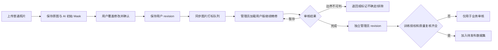
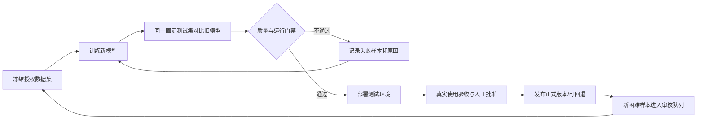

# SubSkin 白斑标注、审核和模型迭代闭环

## 1. 范围与当前事实

本设计基于现有手帐 RGB 任务、图片打标 ImageLabel / ImageLabelAnnotation / ImageLabelLog、训练管理 VasiModelVersion / VasiTrainingRun，以及 ml/rgb_segmentation 工具。

- 当前 RGB 没有经过真实审核数据训练并验证的专用权重，使用 CV 候选与人工核对；这应作为 baseline，而非虚构的“高准确率模型”。
- 当前旧训练管理的模型激活不等于启用新的 RGB 注册模型，两条链路必须在后台明确标注。
- 本轮立即落实画笔覆盖和总面积口径，并准备 RGB 数据同步、AI/用户版本关联及管理员独立修订存档。
- 本文第 5—8 节为下一阶段设计，不表示模型版本控制台、授权数据集发布和训练调度已经实现或上线。

## 2. 唯一标注口径

用户界面只存在三种像素标签：背景、正常皮肤（浅蓝）、白斑（浅粉）。最后一次画笔决定像素类别。

- 皮肤笔：改为正常皮肤，清除该处白斑。
- 白斑笔：改为白斑，计入总皮肤。允许补上 AI 漏掉的皮肤边缘。
- 橡皮：沿用最近选中的画笔层；擦正常皮肤移除该处皮肤和白斑，擦白斑恢复该处正常皮肤。
- 若背景也需要擦除，先选皮肤笔再选橡皮；后续可在橡皮图标辅助标签中体现当前目标，不增加工具按钮。

设 N 为正常皮肤，L 为白斑：N∩L=空集，S=N∪L。

白斑占比 = |L| / (|N|+|L|) × 100%。分母为零时不生成数字。

兼容既有后端：skin 掩码保存总皮肤 S，lesion 保存 L；绘制浅蓝时只显示 S−L。后台旧打标编辑器使用排他蒙层，因此同步时转为 normal_skin=S−L、lesion=L。不能把既有总皮肤 S 再与白斑 L 的像素数直接相加。

例如：正常皮肤 8,000 像素，白斑 2,000 像素，总皮肤 10,000 像素，占比 20%。皮肤笔覆盖其中 500 个白斑像素后：正常皮肤 8,500，白斑 1,500，总量仍为 10,000，占比 15%。

## 3. 每张照片保存什么

| 层次 | 保存内容 | 规则 |
|---|---|---|
| 原始输入 | 原始字节、源文件 SHA、归一化 RGB 图、EXIF 方向转换、尺寸映射 | 原文件不被绘画覆盖；训练使用去除非必要元信息的归一化图 |
| AI 初始版 | 原始 skin/lesion/uncertain/excluded 二值 Mask、模型/参数来源、图像质量、revision | 候选与已确认白斑分开保留；不能用用户修订冒充原始 AI 输出 |
| 用户修订 | 每次确认的 Mask、父 revision、用户操作时间、当前测量 | 每次新建版本；后台“当前用户版”只是最新版本的投影 |
| 管理员修订 | 正常皮肤、白斑、总皮肤 Mask、父管理员 revision、引用的 AI/用户 revision、审核状态、操作者 | 独立版本，不修改用户历史结果；暂存也留版本 |
| 数据集快照 | 样本及管理员 revision 清单、授权依据、划分、排除原因、文件哈希 | 发布后固定，不能跟随“最新标注”悄悄变化 |

同步为后台私有索引，不复制到公开社区，也不自动分享。相同照片在不同账号或不同观察记录中，不以全局图片哈希合并身份；数据集阶段再按授权范围处理重复和患者分组。

用户修改后，将后台样本重新标记为待审核，保留管理员旧版供比较。删除观察或账户后，新建的标注副本应一并清理；已发布数据集需撤销样本并生成替代版本，保留不含照片的撤销审计。已训练权重无法通过删除文件自动“忘记”，需要标记受影响模型并安排重训/下线评审。

## 4. 管理员审核流程

图片打标列表增加：来源管线、AI/用户/管理员 revision、当前状态、是否有新用户修订、训练授权状态、审核人/时间。优先排序依据包括模型失败、修订量大、小面积病灶、稀缺肤色/部位，不把模型自报置信度当准确度。

审核工作区复用现有皮肤笔/白斑笔/橡皮与精细工具。管理员可切换原图、AI 初始版、用户版、管理员版进行比较；患者侧保持单图融合和四工具，二者需求不同。

训练参考标签先由合格标注员制作；模糊边界、疑似干扰以及一部分随机样本需皮肤科专业人员复核。关键测试集采用独立标注/仲裁，并提供隐藏 AI 蒙层的审核方式，降低照着 AI 错误修补产生的偏差。管理员点击“审核通过”不自动等于医学确诊。

下一阶段保存接口增加 base_user_revision 和 base_admin_revision：发生并发修改时 409 提醒重新加载，而不是覆盖另一位管理员。当前管理员版本存档可以追溯修改，但不能替代这项并发校验。

## 5. 数据集发布与训练

1. **授权门禁**：保存/审核照片与授权训练分别记录。没有训练授权的照片仍可用于用户要求的业务处理，但不进入训练导出。新增用户授权入口独立于“确认测评”，不默认勾选；授权需记录条款版本、时间、范围、撤回。
2. **标注门禁**：管理员版本已完成复核、图像与 Mask 对齐、N/L 无重叠、源图哈希一致、无未解决的边界争议。无法辨识的像素标为 ignore；不要硬填为阴性。
3. **数据集快照**：例如 rgb-dataset-001，清单固定到具体管理员 revision，包含正样本、无白斑照片及高光/疤痕等易混淆负样本。先清除身份信息，保留确有评测用途的拍摄元数据。
4. **患者分组**：同一人的所有照片、同一病灶随访、裁剪图和增强图必须在同一 split，不能按图片随机切分。使用带组信息的划分可避免组跨训练/验证集。[GroupKFold 官方文档](https://sklearn.org/stable/modules/generated/sklearn.model_selection.GroupKFold.html)
5. **固定测试集**：锁定独立患者测试集；调参使用训练/验证集。频繁查看固定测试集会产生适配偏差，因此版本最终发布另设时间后移、未参与选型的验收集。
6. **专用视觉训练**：优先训练 RGB 皮肤/白斑分割网络，通用语言模型处理说明和调度。U-Net/nnU-Net 可作为方法基线，但需要本产品数据验证，不能套用其他数据集的成绩。[nnU-Net 原始论文](https://www.nature.com/articles/s41592-020-01008-z)
7. **训练作业**：独立 worker/GPU 队列执行，有取消、超时和资源上限；记录 seed、配置、代码版本、父权重、实际训练清单及日志。训练失败不影响在线模型。
8. **发布候选**：生成权重 SHA 与导出格式，跑离线评测。仅训练完成不应自动上线。

本轮同步的 RGB 样本暂不进入旧的自动训练/随机划分导出路径。当前工作是为独立的、可审计的 RGB 数据集发布准备资料，而不是宣布开始自动训练。

## 6. 模型版本管理页

建议在现有“训练管理”内分四个页签：数据集、训练任务、模型版本、对比评测。

| 对象 | 必需字段 |
|---|---|
| 模型版本 | model_id、pipeline_id、父模型、架构、权重 SHA、代码 commit、输入分辨率、类别定义、归一化、概率阈值、后处理参数、校准状态 |
| 训练任务 | run_id、数据集版本、训练/验证患者数、随机种子、学习率、batch、epochs、loss、优化器、增强、训练设备、开始/结束时间、失败原因 |
| 评测运行 | eval_id、模型版本、测试集版本/hash、评测代码版本、阈值配置、指标与分组结果、置信区间、失败样本、耗时、内存 |
| 发布记录 | 状态、审批人、版本目标（测试/正式）、生效时间、回退版本、理由、每条推理实际使用的版本 |

状态流转：registered → training → trained → evaluated → staging → approved → active → retired/rolled_back。另设 failed/rejected，不能混为“训练完成”。

参数变化也必须创建新的可追溯配置版本；不能只记录权重版本而允许阈值、缩放、后处理默默变化。通用大模型 provider/model/prompt 单独记 explanation_version，避免把解释文案变化误认为白斑分割升级。

## 7. 怎样判断准确度是否真的提升

后台默认比较“新旧模型在同一测试集、同一标注版本、同一测量规则下”的结果，而不是比较两个不同训练批次的训练分数。

- 皮肤和白斑分别报告 Dice、IoU、Precision、Recall；无白斑照片单独报告误检，不能让大量阴性图的满分 Dice 抬高均值。
- Boundary F1 固定归一化分辨率和边界容忍距离，同时保存该配置。
- 面积：总皮肤与白斑各自像素误差；占比报告**百分点误差**，例如人工 20%、模型 23% 为 +3 个百分点。小病灶同时报告绝对误差，避免相对误差失控。
- 漏检/误检：同时报告按图片与按病灶的指标，公开匹配规则。
- 按部位、客观肤色分组、白斑大小、光照、画质、设备分组；肤色组未知则记录未知，不根据照片亮度直接断言 Fitzpatrick 类型。
- 按患者做 bootstrap，报告样本量和置信区间。样本太少的组显示“证据不足”，不显示绿色“已提升”。
- 同时报告自动处理覆盖率、拒绝率、失败率、P50/P95 延迟。不能靠拒绝困难图片来单独提升成功样本 Dice。
- 用户修改像素比例与修改时长作为使用体验指标；它们受用户习惯影响，不能代替独立人工参考标签的准确度。

发布门禁在冻结评测前确定：整体改善、关键分组无不可接受退步、漏检和面积误差满足既定产品验收标准、失败率/耗时达标。具体数字要依据双人标注一致性、现有基线和试运行风险确定，本设计不虚构通用的“Dice 0.9 即可医疗使用”。

## 8. 可落地顺序、成本与验证

以下为工作量估算，依赖数据量和审核人员投入，不是准确率承诺。

| 阶段 | 问题与修改 | 预计成本 | 预期收益与验收 |
|---|---|---|---|
| 本轮 | 画笔不互换：改为最后画笔覆盖类别，保留总皮肤协议 | 小，约半天 | 同一区域反复覆盖，占比与人工像素计数一致；已做回归 |
| 本轮 | RGB未进后台：同事务同步现有打标索引，原图/AI/用户 revision 关联 | 中，1—2天含回归 | 完成/重复保存/重复同步不重复创建、管理员能加载最新用户层、AI版保持不变 |
| 本轮 | 管理员覆盖旧版本：保存独立不可变Mask快照与父revision | 中，1—2天含回归 | 两次保存保留两版，用户原记录不变，删除观察清理新副本 |
| 下一阶段 | 授权与数据来源不足：授权记录、审核状态、发布清单、撤回流程 | 中，3—5天 | 无授权/未复核不能入集；可从任一权重追溯样本revision |
| 下一阶段 | 版本指标不可比：完善模型/评测记录和固定测试集对比页 | 中，3—5天 | 不同测试集拒绝直接给提升结论；支持查看退步分组和失败案例 |
| 后续迭代 | 权重缺乏产品数据：收集、复核、训练专用分割基线 | 较大，2—4周起，审核数据与算力决定 | 给出真实保留测试集成绩，达门禁后再启用；不以训练集成绩上线 |

本轮后端部署需独立的共享后端确认；无新表/破坏性迁移，不激活模型、不启动训练。管理员前端先构建为测试预览，不直接替换共享管理站。

### 标签协议补充

当前训练脚手架为五类，而四工具编辑器只明确标注正常皮肤/白斑。不能从双层Mask凭空生成毛发、衣物标签，也不能把未审核区域直接当真阴性。首个正式数据集发布前，需要确定三类（背景/正常皮肤/白斑）+ ignore 的新标签协议，或由审核工具补齐五类标注；同步更新训练网络输出、模型注册表及推理解码。此项是首轮真实训练的前置条件。
