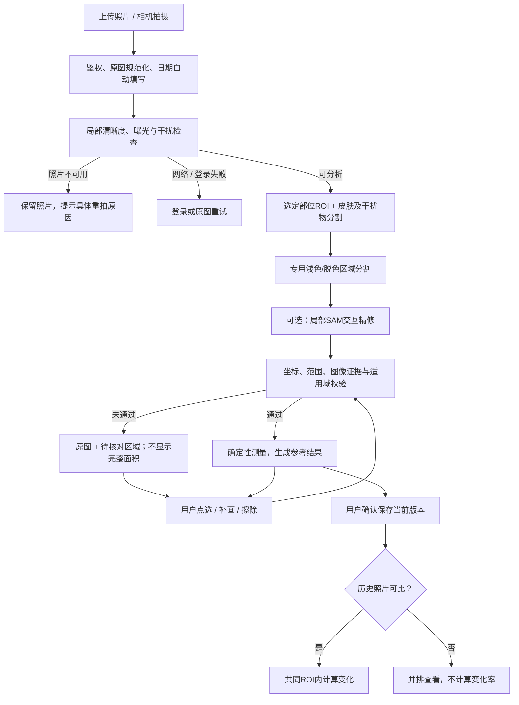
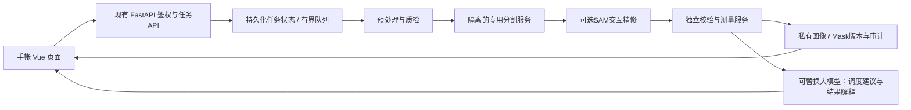

# SubSkin 普通手机RGB照片白斑识别与测量实施方案

日期：2026-09-13。状态：设计交付，未实施或上线；本轮未调用模型分析用户照片、未启动训练。
定位：皮肤图像分割与测量辅助。本文不构成医疗建议。

## 1. 决策与边界

采用“确定性任务流程 + 专用分割服务 + 独立测量校验 + 可替换大模型解释”。Agent不能决定某个结果是否有资格用于测量，也不能用文字补造像素。

输出的是**当前照片、当前选定部位中，经核对的疑似脱色/浅色区域**。不是医学确诊，不是全身白斑比例，不是临床VASI。确诊需要临床评估；皮肤科医生可结合病史与皮肤检查确认病因。[AAD](https://www.aad.org/public/diseases/a-z/vitiligo-treatment)

输入统一为普通手机拍摄的RGB皮肤照片，支持自然光和常见室内白光。默认使用普通照片与软件处理完成分析，无需额外专业光源或采集设备。

三个工程原则：
- 重点解决自然光、室内光中的白平衡变化、局部阴影、反光和不同肤色，不能将“更白”直接等同白癜风。
- 现有SAM输入是点/框，语义目标由专用模型或用户提示提供。SAM3虽支持文本/视觉概念提示，也必须独立验证手机皮肤照片上的表现。[SAM2](https://github.com/facebookresearch/sam2)、[SAM3](https://github.com/facebookresearch/sam3)
- 坐标网格只用于定位；像素面积和照片内占比必须从二值Mask计算。默认不提供缺乏尺度依据的平方厘米。

普通照片中信息确实缺失的区域，应局部核对或重拍；不通过生成图像补出不存在的证据。医学病因判定仍与图像分割分开。

## 2. 当前系统与差距

| 当前能力 | 本方案处置 | 必须解决的差距 |
|---|---|---|
| 手帐上传、EXIF日期、单行日期滚轮、重拍/换图 | 复用 | 错误状态与照片不合格分开，继续保留简洁界面 |
| `vasi_quality.py` 清晰度/亮度/皮肤比例 | 作为初始证据 | 不能只做整图平均；增加选定皮肤区域内的局部质检和手机照片适用域检查 |
| `vasi_pixel_refine.py` / `pixel-refine-v2` | 保留失败拦截与历史兼容 | 仍受VLM粗定位、HSV/CV皮肤候选限制，不能作为准确性已经验证的分割器 |
| `vasi_promptable.py` 现有SAM点/框提示 | 复用交互能力 | 返回所有候选供图像证据选择，不只用最高SAM分数；禁止缓存跨用户访问和并发图像串用 |
| `assessment_measurement.py` 像素比例、标尺、边缘、色差 | 复用数学逻辑，升级坐标/单位合同 | 现有彩色透明图层与测量数据分离；不同输入分辨率与裁剪变换必须明确 |
| `annotation_review.py`、MaskEditor、分层查看 | 复用 | 用户确认不是医生标签，也不能使不可见组织变得可测 |
| `assessment_comparison.py` 共同区域与配准 | 复用 | 当前硬性要求非空view，而前端已取消角度选择；改成图像可比性证据，不填假“正面” |

既有两例授权照片离线回放，在v2均被判为待核对。这证明错误结果被阻止，**没有证明自动识别精度提高**。本方案不把代码回归测试数当成模型准确率。

## 3. 用户流程与系统状态



任务运行状态：`queued → preprocessing → quality_check → segmenting → validating → completed`，另有`failed`、`cancelled`；与测量资格状态分开。

| 结果状态 | 条件 | 页面动作 | 数字 |
|---|---|---|---|
| retake_required | 严重失焦/过曝/遮挡导致信息缺失 | 重拍/换图 | null |
| review_required | 候选偏移、皮肤不确定、边界/干扰未核对、服务仅有粗定位 | 调整范围 | null；必要时内部保留候选像素统计 |
| measurable | 全部必需校验通过，符合该RGB模型版本开放策略 | 展示参考、保存 | 按能力分别开放占比/像素/厘米/颜色 |
| no_target_candidate | 未找到可用目标，且不是已核对的空Mask | 原图、可补画 | null，不宣称“没有白癜风” |
| failed | 登录/服务/超时/资源错误 | 登录/原图重试 | null，不要求用户因系统错误重拍 |

试运行默认要求人工核对后保存测量；未来只有在独立测试达到要求的指定RGB模型/部位组合才能开放自动参考测量。仍需要用户确认保存。不能让所有请求都进入拒绝来获得虚假的高精度。

## 4. 阶段一：质量审核、预处理与定位

### 4.1 原图与规范化

1. 服务端验证照片所有权、文件签名、解码后像素数上限；现有10MB前端限制保留，后台也独立校验。API失败不能当作照片不合格。
2. 保存原始文件，不覆盖。应用EXIF朝向；记录原始哈希与规范化图像哈希。相机镜像在此统一，标注统一对齐最终规范化照片。
3. 用ICC配置转换到sRGB；原件保留。禁止美颜、生成式补纹理、生成式超分辨率作为测量证据。对比增强只用于独立分割输入，不覆盖颜色测量原件。
4. 保存全部坐标变换。模型输入可缩放/裁切/填边；二值Mask回映射采用最近邻，概率图先插值回同一坐标网格再阈值化。禁止仅放大低分辨率Mask后声称恢复原图精度。
5. 先用全图低分辨率发现候选，再对局部进行高分辨率推理；小斑片被缩小到数个像素时转局部推理或待核对，不直接删掉。

### 4.2 普通光抗干扰策略

不增加光源类型选择。前端保持“照片、自动日期、开始分析”的简洁流程，后台分析影响可辨识度的图像证据。

1. 保留规范化RGB原件；分割分支可加入亮度归一化和Lab辅助特征，颜色测量仍使用未增强原件。
2. 用周围可见正常皮肤作为局部对照，结合纹理、解剖位置和轮廓变化；不使用全图固定白色阈值。
3. 在训练集加入自然光、室内暖/冷白光、侧光、轻度曝光变化；亮度/白平衡增强不得改变真实病灶标签语义。用独立设备/光照子组检查泛化。
4. 反光、硬阴影、白色衣物、毛发和肤色过渡必须有专门负例与干扰标签，不能靠后处理几何形状删除。
5. 普通照片边界不清时先运行局部高分辨率推理；仍不可靠则保留橙色待核对区。失焦、过曝导致原始信息丢失时提示“换个均匀光照的位置、对焦后重拍”。不推荐任何专用光源作为产品完成条件。
6. 不使用生成式去阴影、补皮肤、美颜、颜色漂白后的合成结果计算面积；无法从单张照片恢复的部分应保持未知。

### 4.3 局部质量检查

| 信号 | 实现 | 不可接受时 |
|---|---|---|
| 失焦/运动模糊 | 标准尺寸Laplacian基线 + 局部模糊分类器；在皮肤及候选边界周围测 | 重拍，不以整图背景清晰代替患处清晰 |
| 过曝/欠曝 | 选定ROI的亮度分位数、通道截断比例与局部连通高光 | 被高光覆盖的边界不能量化 |
| 反光/硬阴影 | 专门干扰类别 + 局部颜色/纹理证据 | 不能将其当白斑或生硬扣除后报告完整面积 |
| 遮挡 | 毛发、衣物、饰物等像素Mask | 少量可见区域可限定测量；边界缺失要求补拍/核对 |
| 视野不足 | 候选接触取景边界、有效皮肤/正常邻域不足 | 仅标注可见部分；完整面积与历史变化关闭 |
| 适用域外 | 强滤镜、未验证设备处理或异常图像等域外信号 | review_required，不使用大模型兜底编数字 |

现有阈值作为实验起点。最终阈值在固定尺寸、固定算法版本的验证集上选取；不要照搬任意Laplacian数值作为所有设备的通用医学标准。

### 4.4 “隐形网格”的准确含义

规范化图像采用左上角为原点、x向右、y向下。像素索引为0…W−1、0…H−1；像素中心在连续坐标(x+0.5,y+0.5)，归一化为((x+0.5)/W,(y+0.5)/H)。旧接口x/W语义通过显式适配器转换，不静默改变旧协议。

后台保存W/H、crop/pad/resize变换、image_revision。3×3或更细网格只用来生成“图像左上方”等描述；它不画进分析照片，不参与面积计算。图像左右与人体左右分开记录，自拍来源不清时只描述“图像左侧”。

## 5. 阶段二：双重分割与边缘定位

### 5.1 皮肤与干扰物分割

目标标签：可见皮肤（同时包含正常和疑似脱色皮肤）、背景/衣物、毛发/饰物、眼球/口腔等非皮肤、反光/不可判读区、未知区。标签字典由临床标注规范固定。

以用户已选部位确定测量ROI，ROI与皮肤Mask是两个概念：例如选面部不自动扩大到颈部；同一照片中的颈部白斑可记录“范围外候选”，而不是悄悄忽略或计入面部分母。

鼻部、眼睑属于可能需要测量的皮肤，不能把整个鼻子、眼周椭圆或眉毛外接框当排除区。只排除真实干扰像素；白毛发不作为皮肤白斑面积。强遮挡下不推测被遮住的面积。

技术路线：
- 首期：保留现有皮肤候选，但必须可人工修正；它不是已经合格的自动皮肤分割模型。
- 主线：以自有获授权数据训练2D U-Net/nnU-Net等语义模型，输出皮肤及干扰概率图。nnU-Net提供监督式2D/3D分割训练与数据适配框架，并不自带可直接用于本产品的白癜风权重。[nnU-Net](https://github.com/MIC-DKFZ/nnUNet)
- SAM作为基于点/框/Mask的局部修正器，不负责凭通用知识决定皮肤医学类别。

### 5.2 疑似白斑分割

主模型输入：规范化RGB、选定ROI、有效皮肤Mask、图像质量信息。输出：疑似脱色概率图、其他浅色/不确定类别、实例候选及原始模型质量分数。

使用整图与局部块结合的推理，训练时保留全局上下文与正常邻域。可用512/1024局部块、重叠融合做初始实验；尺寸和重叠比例由显存、微小病灶Recall和边界性能选择，不是医学固定值。

模型语义识别与颜色证据分开：浅色、反光、瘢痕、炎症后色素改变等外观可混淆。视觉标注无法独立确认病因；标签需说明是“疑似脱色范围”还是有临床依据的白癜风部位。

### 可直接开始的训练配置

首个可训练候选建议用2D U-Net配RGB预训练编码器，不先上复杂Agent网络。先训练五类可见像素：背景/衣物、正常皮肤、疑似脱色皮肤、毛发/遮挡/非皮肤器官、反光不可判读区；边界确实无法标定的像素用ignore标签，不强迫标为背景。

从输出导出皮肤Mask（正常皮肤∪疑似脱色皮肤）、目标Mask（疑似脱色皮肤）和干扰Mask。这样“双重分割”是两个可独立核对的语义结果，可由同一多类模型一次前向推理产生；工具层仍提供独立skin/lesion结果和版本校验，不必重复消耗两次GPU推理。

训练初始实验采用交叉熵与soft Dice组合、按小面积病灶重采样；亮度/色温/压缩/轻度模糊增强需保持标签有效。先在512局部块训练并保留整图上下文对照，验证1024推理是否改善小斑和边缘；不要凭肉眼觉得更光滑就引入边缘损失或后处理。nnU-Net的2D配置作为第二个基线，与现有SAM交互结果公平比较。

先完成“一个模型、一个普通RGB数据集、一个独立测试集”的可重现基线。模型权重、标签字典、预处理、阈值和测量公式一起版本化，只有通过测试的组合才能注册到线上。

### 5.3 SAM局部精修

触发条件：专用分割器边界不稳定，或用户给出正/负点。输入必须包括当前图像/ROI版本、位于真实候选内部的正点、经过核对的外部负点和局部框。未有可靠语义模型时，用户点选是有效的首期路径。

- 同一图像编码只计算一次；并发预测不能覆盖其他任务的可变predictor状态。
- 多候选全部经过同一校验器，不能仅按SAM自评分取最高者。
- 校验包含提示点一致性、越界、局部可见性、边界证据及RGB照片适用域。颜色检查使用浮点Lab，并结合局部正常皮肤；阈值必须通过不同光照子组校准。
- 与粗候选IoU只能作为候选一致性信号，不能作为真实准确率，也不能锁死到错误粗框。若精修显示粗候选错误，应重新定位或交互，不靠放宽阈值过关。
- 保留真实不规则边界、内部正常皮肤岛和多个斑片。禁止为“好看”做大半径闭运算、椭圆拟合、凸包填充。
- 规则形状仅可作为提示，不得一刀切拒绝真实接近矩形或圆形的目标。
- 超时/区域预算限制时登记全部未处理区域；没有“前4个以外自动忽略”。

当前SAM可先继续作为对照组。SAM2、SAM3作为可选挑战者；替换权重必须先跑同一Benchmark，不能凭模型更新日期宣称更准。[SAM2](https://github.com/facebookresearch/sam2)、[SAM3](https://github.com/facebookresearch/sam3)

## 6. 阶段三：校验、测量与解释

定义R=用户选定测量区域，S=可见皮肤Mask，E=已确认的不可用于本次测量像素，L=疑似目标Mask。

```
S_valid = R ∩ S ∩ NOT(E)
L_valid = L ∩ S_valid
照片内占比 = count(L_valid) / count(S_valid) × 100%
```

校验在裁剪前检查越界：不能把大面积错误L简单与S相交、隐藏错误后宣称成功。裁剪只容许合同明确规定的栅格边缘容差，超限必须核对。

**分母规则**：有效皮肤必须包含正常和疑似病灶皮肤；不能把正常皮肤当全部分母，也不能用白斑反向扩大分母。分母定义、像素数、ROI修订号随结果保存。任意改变取景/排除区后不能直接比较原占比。

不确定病灶区域U仍属于有效可见皮肤时，不从分母删除它。仅当分母可靠且U的范围有意义时，可在内部计算`|L_certain|/|S_valid|`到`|L_certain∪U|/|S_valid|`的参考范围；这不是统计置信区间，也不是自动确认所有橙色区域为白斑。分母本身不可靠则不给这种范围，转人工核对。

| 输出 | 计算/资格 | 页面表达 |
|---|---|---|
| 位置 | Mask质心、包围范围、部位ROI | 图像左上/面部等，区分图像与人体左右 |
| 数量 | 实例或约定8连通分量；记录面积门槛与相接斑片策略 | 可见独立区域数，不声称临床病灶数 |
| 像素面积 | 统一测量网格上计数，明确网格尺寸 | 详细信息中展示 |
| 照片占比 | 上述公式，分母必须可靠 | 主指标；标明仅当前测量范围 |
| 平方厘米 | 默认关闭；仅已有照片含合格尺度参照且条件满足时，n_px×(L_mm/d_px)²/100 | 选填扩展，不是纯视觉默认指标；无尺度依据为null |
| 边缘/周长 | 未平滑的测量Mask计算；区分外周长与内部孔洞边界 | 像素周长；有合格标尺才换毫米；不推断稳定期 |
| 大小/形态 | 最大径、次径、连通性/孔洞等，均定义尺度 | 描述形状，不推断疾病类型或治疗效果 |
| 颜色 | 规范化原件中与同图邻近可见正常皮肤比较；排除反光/未知区 | 无校准只报同图相对色差；无正常邻域不计算 |
| 可信度 | 质量状态、模型适用域、稳定性、人工核对状态分别记录 | 未校准不显示“准确率95%”或疾病概率 |

假设有效皮肤600,000像素、目标120,000像素，则占比20%。纯视觉默认结果到这里结束。只有照片中另有经过验证的20px/mm尺度依据时，才可额外估算3cm²二维投影面积。此例是数学验收数据，不是任何用户照片结果。

脸颊、手臂等曲面通常不能用单根标尺得到真实表面积；普通照片不给曲面表面积。大幅透视/弯曲不靠单应变换“修复成医学真值”。

默认只比较同图相对色差。跨日颜色变化只有在光照、设备处理和正常对照足够可比时才开放；不同光照或相机处理条件下，默认不展示绝对颜色变化率。边界周长受分辨率、模糊、采样方式影响，历史比较需一致测量网格与算法版本。

### 历史比较

取消用户必填角度，不等于放弃可比性检查。用同部位/同观察位置、可见皮肤范围、稳定非病灶纹理或解剖定位、配准残差、共同覆盖率和明显姿态差异决定是否可比。仅有view字符串相同也不能放行。

只在共同可见ROI计算变化；尽量使用刚体/相似变换，不用灵活非刚性扭曲把真实病灶变化抹掉。配准失败或光照差异使证据失真时只并排显示。基线为零时相对变化率不定义，报告新增候选或绝对像素/百分点变化。模型版本改变时需两张都用同一版本重算并保留原记录。

## 7. 工程架构、接口与Agent权限



默认由固定状态机执行必需步骤。Agent的工具调用建议经过服务端状态校验，不能跳过质量/分割/测量门禁。解释服务失效时模板照常展示结果；测量不能等待LLM自行算完。

### 工具合同（拟新增，不是已经存在的API）

| 工具 | 必需输入 | 输出 | 限制 |
|---|---|---|---|
| inspect_image | 私有image_id、revision、body_site | 局部质检证据、质量状态、原因码 | 不做疾病确诊 |
| segment_skin | image_revision、roi_revision、registered_model_id | skin/exclusion/unknown Mask引用 | 白斑也属于皮肤分母 |
| segment_lesion | image_revision、skin_revision、quality_revision | probability/lesion/uncertainty引用 | 不返回伪造医学百分比 |
| refine_region | 所有revision、正负点、局部ROI | 多个候选Mask及证据 | 点不合法/图像过期拒绝；有界尝试 |
| validate_and_measure | Mask revision、image transform、optional calibration | policy结果及测量 | 只能由服务端调用可信实现生成 |
| compare_observations | 两条owner授权记录的revision | 可比性证据/共同ROI/变化 | 不允许用字符串视角绕过配准 |
| explain_result | 已通过合同校验的结构化结果 | 简短解释和下一步 | 不得改变数字、状态或Mask |

建议任务API：`POST /api/vasi/segmentation-jobs`（202、idempotency key）→ `GET /api/vasi/segmentation-jobs/{id}`；修正采用带`base_revision`的PATCH，冲突409；确认保存为独立动作。服务端从鉴权上下文取得owner，不接受Agent自报owner扩大权限。

Mask统一为uint8 PNG的0/255（二值）；概率图单独存float数据。彩色RGBA叠图只用于显示。Mask包关联image_sha256、坐标尺寸、变换ID、Mask校验和、类别、模型权重版本。巨大Base64像素包不经过LLM上下文；LLM只读统计、原因码与有权限的artifact ID。

正式外部API适配器必须有明确的输入/输出规格、版本、隐私用途和可用性协议。推荐优先私有部署分割服务；用户照片不会因为“Agent调度”就自动获得转交第三方或训练授权。

建议服务目标（待压测，不是现有性能）：质检P95≤3s，暖机分割P95≤15s，交互P95≤2s，常规任务P95≤30s。先限制GPU每worker单任务、设置有界队列与每用户任务数；持续统计冷启动/排队/推理时延。MVP可用独立worker轮询持久化job表，无需先堆叠新的基础设施。

设置全任务截止时间，例如60s作为初始运维配置；到期取消待执行步骤、丢弃迟到结果并清理任务，不只在原生推理返回后检查时间。必须用独立worker进程实现可恢复的硬超时/故障隔离，不能承诺Python线程超时会中断CUDA计算。短期基础设施不足时如实标注软预算。

现有主后端Python3.9不能直接套SAM2当前环境要求（官方要求Python≥3.10）。新模型放独立容器/虚拟环境，通过内部API通讯；不要升级共享生产venv来试模型。[SAM2安装说明](https://github.com/facebookresearch/sam2#installation)

### 当前代码改动位置

| 位置 | 实施项 | 优先级/估计成本 | 验收 |
|---|---|---|---|
| `services/vasi.py` | 新协议分支调用job/service；现有协议保持兼容 | P0，2–3工程人日 | 旧请求/旧记录可读，新请求路由确定 |
| 新增`segmentation_client.py`/`segmentation_policy.py` | 适配专用模型、校验工件与拒绝原因 | P0，3–5工程人日 | 坏Mask、错误图像、失败工具无法进入测量 |
| `vasi_pixel_refine.py`/`vasi_promptable.py` | 保留交互，对接新分割种子，全部候选验证 | P1，2–4工程人日 | 不越ROI、不丢区域、并发不串图 |
| `assessment_measurement.py` | 二值Mask/变换/分母/厘米资格分开版本化 | P0，2–3工程人日 | 已知形状、裁剪/旋转/缩放后数值正确 |
| `assessment_comparison.py` | 用可比性证据替代必填view | P1，2–3工程人日 | 新手帐无角度字段也可正确分流，不可比不给变化 |
| `AssessmentCapture`/`useVasiUpload` | 接入阶段状态与具体错误，保持当前简洁日期流程 | P1，1–2工程人日 | 系统错误可重试，不伪装重拍问题 |
| 结果组件/编辑器/`annotation_review.py` | 校验状态、版本锁、原始与人工Mask并存 | P0，2–4工程人日 | 用户修改后只重算新版本，不自动训练 |

估计含相互重叠工作；不能直接相加当日历工期。模型训练与临床标注另算，取决于数据和人员。

## 8. 数据、Benchmark与放行

先建立标注手册和100–300张获授权的试标集，用于发现类别/边缘分歧；它不能证明所有部位适用。训练试点可从500–1,000张、约150名以上独立受试者起步，再按失败分组补充。以上为资源规划起点，不是保证精度的样本量结论。

- 标注：部位ROI、皮肤、目标、遮挡、反光、不确定边界；注明拍摄光照条件及临床依据。两名标注者独立标注，皮肤科复核分歧；困难样本允许“不确定”，不要强造真值。
- 明确加入无目标照片、正常肤色变化、反光、毛发、瘢痕和其他可能混淆的浅色皮肤例子；病因标签需临床依据。
- 按患者拆分训练/验证/锁定测试，例如60/20/20；同人多张、连续拍摄和增强图不得跨集合。额外留未见设备或时间段作外部测试。
- 按身体部位、肤色、病灶面积、小斑、光照、清晰度、设备报告。肤色采用经规范标注的外观分组，不让LLM从单图推断种族；不能将照片亮度直接当Fitzpatrick分型。
- 用户修正数据只有另行同意用于训练后才可进入待审核池；不得自动变成医生金标准，不纳入同人的独立测试集。

| 指标 | 统计定义/注意点 |
|---|---|
| Dice、IoU | 分别报皮肤与目标；同时报逐图宏平均与像素汇总，避免大斑掩盖小斑 |
| Precision、Recall | 像素级；另报病灶级匹配结果，不能混用 |
| Boundary F1 | 统一到固定尺寸，例如长边1024、容差2px；有标尺时另报mm容差；规则预注册 |
| 面积误差 | 像素相对误差、占比绝对误差（百分点）；接近零的真值另报绝对误差 |
| 漏检率 | 真值病灶未匹配比例；用预先固定的匹配阈值，连通/合并规则固定 |
| 误检率 | 无目标照片中出现有效错误候选的比例 + 每图错误区域数；不与1−Precision混称 |
| 颜色差异 | 校准条件下与参考测量差值；未校准自然光不宣称跨日绝对颜色精度 |
| 覆盖与拒绝 | 全部上传中的完成率、重拍率、核对率、服务失败率；画“误差—自动覆盖率”曲线 |
| 用户效率 | 每图修正时间、增删次数、重新检测率；不要只统计“保存成功” |

建议用于首轮非临床试点评审的**待验证目标**：在适用域内皮肤Dice≥0.95、目标Dice≥0.85、Boundary F1≥0.80、占比绝对误差中位数≤2个百分点，同时报告P90及患者级bootstrap区间。无目标图的误报图比例先设≤5%，符合拍照规范样本的自动参考覆盖率目标≥70%。这些不是医学标准或现有成绩；由临床与产品共同审定，按子组不足之处限制开放范围，不能只看全量均值过线。

每次对照：现有v2、交互SAM、专用语义模型、语义模型+SAM精修，用同一冻结数据和同一标注。SAM若降低小斑Recall或扩大正常皮肤，就不启用那条精修路径。

## 9. 时间计划与交付

| 周期 | 实操交付 | 负责组合 | 成功标准 |
|---|---|---|---|
| 第1周 | 合同/状态机/原图坐标、Mask版本、基础数据手册和旧协议适配；用合成Mask贯通 | 后端+前端+CV+临床标注负责人 | 可重放、失败不会测量、无跨用户工件 |
| 第2周 | 私有worker、现有SAM交互、独立测量器、重试与修正闭环；上线受控测试 | 后端+前端+测试 | 用户可修正并得到可追溯参考；不承诺自动精准分割 |
| 第3–4周 | 收集试点标注、训练手机RGB照片2D分割基线、冻结测试集、分组评测 | CV+临床标注+测试 | 给出真值对照报告，明确可开放部位和失败条件；未达标继续交互模式 |
| 第2–3个月 | 主动补充失败数据、专用模型升级、跨设备/机构验证、自然光/室内光稳定性验证、可信度校准 | CV+临床合作+平台 | 以误差/覆盖/人工成本共同决定扩大自动测量，不按日历强行发布 |

前两周优先实现可靠的“提示—修正—测量”闭环。当前最缺的是经过验证的语义分割模型与数据，不是更多Prompt形容词。

SubSkin只有共享后端。新分割worker可先离线、影子测试；接入现有后端即可能影响正式站，需按AGENTS规则完成具体变更验证并获共享重启确认。前端先staging，正式前端仍需单独发布确认。Feature flag属于兼容控制，不等于有了真正独立测试后端。

## 10. 交付包使用方式

- `agent-instructions.md`：给任意大模型使用的调度/解释约束模板。必须和服务端策略一起实施。
- `segmentation-result.schema.json`：拟定对外结果合同，只做结构和状态组合验证，不校验真实像素或医学正确性。
- `examples.synthetic.json`：纯虚构工件ID与数学样例；不包含用户照片、身份信息或实际API凭据。
- 本文的表格对应实现任务；工程实现前按模块逐项验收。新增名称、服务和目标性能均为方案，不表示当前已部署。
